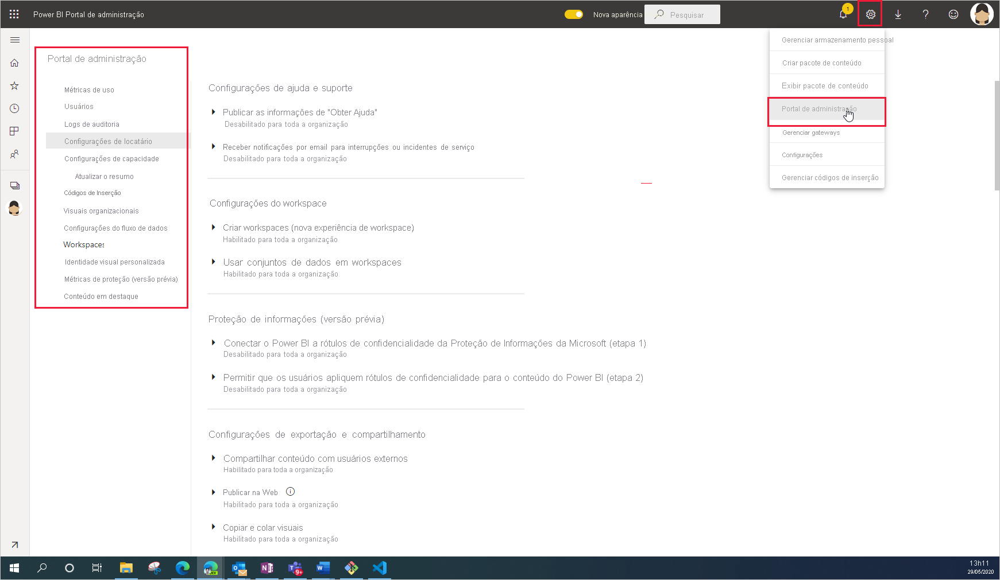

# O que é a administração do Power BI

A administração do Power BI é o gerenciamento das configurações de toda a organização que controlam como o Power BI funciona. Os usuários atribuídos às funções de administrador configuram, monitoram e provisionam recursos organizacionais. Este artigo fornece uma visão geral de funções de administração, tarefas e ferramentas para ajudar você a começar.

## Funções de administrador relacionadas ao Power BI

Há várias funções que trabalham em conjunto para administrar o Power BI para a sua organização. A maioria das funções de administrador é atribuída no centro de administração do Microsoft 365 ou usando o PowerShell. As funções de administrador de Capacidade do Power BI Premium e Capacidade do Power BI Embedded são atribuídas quando a capacidade é criada. Para saber mais sobre cada uma das funções de administrador, consulte [Sobre as funções de administrador](https://docs.microsoft.com/microsoft-365/admin/add-users/about-admin-roles?view=o365-worldwide). Para saber como atribuir funções de administrador, consulte [Atribuir funções de administrador](https://docs.microsoft.com/microsoft-365/admin/add-users/assign-admin-roles?view=o365-worldwide).

| **Tipo de administrador** | **Escopo administrativo** | **Tarefas do Power BI** |
| --- | --- | --- |
| Administrador global | Microsoft 365 | Tem acesso ilimitado a todos os recursos de gerenciamento da organização |
| | | Atribuir funções a outros usuários |
| Administrador de cobrança | Microsoft 365 | Gerenciar Assinaturas |
| | | Comprar licenças |
| Administrador de licenças | Microsoft 365 | Atribuir ou remover licenças de usuários |
| Usuário administrador | Microsoft 365 | Criar e gerenciar usuários e grupos |
| | | Redefinir senhas de usuário |
| Administrador do Power BI | Serviço do Power BI | Acesso completo às tarefas de gerenciamento do Power BI|
| | | Habilitar e desabilitar os recursos do Power BI |
| | | Criar relatórios sobre uso e desempenho |
| | | Examinar e gerenciar a auditoria |
| Administrador de Capacidade do Power BI Premium | Uma única capacidade Premium | Atribuir workspaces à capacidade|
| | | Gerenciar a permissão de usuário para a capacidade |
| | | Gerenciar cargas de trabalho para configurar o uso de memória |
| | | Reiniciar a capacidade |
| Administrador de Capacidade do Power BI Embedded | Uma única capacidade Embedded | Atribuir workspaces à capacidade|
| | | Gerenciar a permissão de usuário para a capacidade |
| | | Gerenciar cargas de trabalho para configurar o uso de memória |
| | | Reiniciar a capacidade |

## Ferramentas e tarefas administrativas

Os administradores do Power BI trabalham principalmente no portal de administração do Power BI. No entanto, você deve estar familiarizado com as ferramentas e os centros de administração relacionados. Examine a tabela acima para determinar qual função é necessária para realizar as tarefas usando as ferramentas listadas aqui.

| **Ferramenta** | **Tarefas comuns** |
| --- | --- |
| [Portal de administração do Power BI](https://app.powerbi.com/admin-portal) | Adquirir e trabalhar com a capacidade Premium |
| | Garantir a qualidade do serviço |
| | Gerenciar workspaces |
| | Publicar visuais do Power BI |
| | Verificar os códigos usados para inserir o Power BI em outros aplicativos |
| | Solucionar problemas de acesso a dados e outros problemas |
| [Centro de Administração do Microsoft 365](https://admin.microsoft.com) | Gerenciar usuários e grupos |
| | Comprar e atribuir licenças |
| | Impedir que os usuários acessem o Power BI |
| [Centro de Segurança e Conformidade do Microsoft 365](https://protection.office.com) | Examinar e gerenciar a auditoria |
| | Acompanhamento e classificação de dados |
| | Políticas de prevenção contra perda de dados |
| | Governança de informações |
| [AAD (Azure Active Directory) no portal do Azure](https://aad.portal.azure.com) | Configurar o acesso condicional a recursos do Power BI |
| | Provisionar a capacidade do Power BI Embedded |
| [Cmdlets do PowerShell](https://docs.microsoft.com/powershell/power-bi/overview) | Gerenciar workspaces e outros aspectos do Power BI por meio de scripts |
| [SKD e APIs administrativas](service-admin-reference.md) | Crie ferramentas de administração personalizadas. Por exemplo, o Power BI Desktop pode usar essas APIs para criar relatórios com base nos dados relacionados à administração. |

## Próximas etapas

Agora que você conhece as noções básicas do que está envolvido na administração do Power BI, consulte estes artigos para saber mais:

- [Usar o portal de administração do Power BI](service-admin-portal.md)
- [Diretrizes de configuração do administrador de locatários](../guidance/admin-tenant-settings.md)
- [Usar cmdlets do PowerShell](https://docs.microsoft.com/powershell/power-bi/overview)
- [Perguntas frequentes de administração do Power BI](service-admin-faq.md)
- [Como licenciar o serviço do Power BI para usuários na sua organização](service-admin-licensing-organization.md)
- Dúvidas? [Experimente perguntar à Comunidade do Power BI](https://community.powerbi.com/)
- Sugestões? [Contribuir com ideias para aprimorar o Power BI](https://ideas.powerbi.com/)
