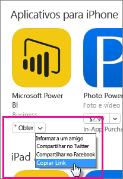
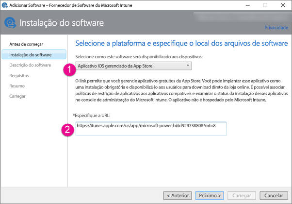
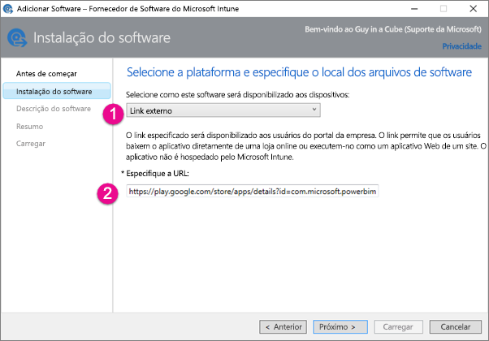
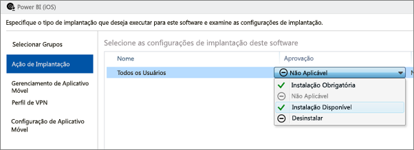
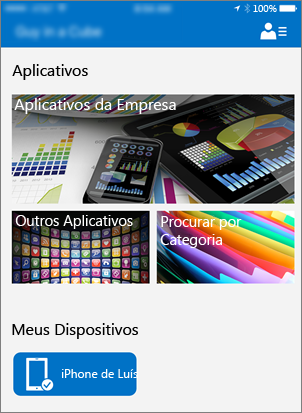
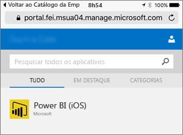
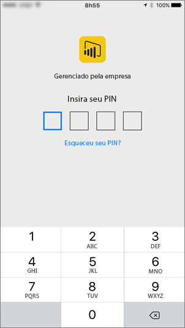

# Configurar aplicativos móveis com o Microsoft Intune

O Microsoft Intune permite que as organizações gerenciem dispositivos e aplicativos. Os aplicativos móveis do Power BI para iOS e para Android são integrados ao Intune. Essa integração permite que você gerencie o aplicativo em seus dispositivos e controle a segurança. Por meio de políticas de configuração, você pode controlar coisas como exigir um PIN de acesso, como os dados são manipulados pelo aplicativo e até mesmo criptografar dados do aplicativo quando ele não estiver em uso.

## Configuração geral de gerenciamento de dispositivo móvel

Este artigo pressupõe que o Intune está configurado corretamente e que você tem dispositivos registrados com o Intune. O artigo não serve como um guia de configuração completo para o Microsoft Intune. Para saber mais sobre o Intune, confira [O que é o Intune?](/intune/introduction-intune/).

O Microsoft Intune pode coexistir com o MDM (Gerenciamento de Dispositivo Móvel) no Microsoft 365. Se estiver usando o MDM, o dispositivo será exibido como registrado no MDM, mas estará disponível para gerenciar no Intune.

> [!NOTE]
> Após a configuração do Intune, a atualização de dados em segundo plano é desativada para o aplicativo móvel do Power BI em seu dispositivo Android ou iOS. O Power BI atualiza os dados do serviço do Power BI na Web quando você entra no aplicativo.

## Etapa 1: obter a URL do aplicativo

Antes de criar o aplicativo no Intune, precisamos obter as URLs para os aplicativos. Para iOS, elas serão obtidas pelo iTunes. Para o Android, você pode obtê-las no página móvel do Power BI.

Salve a URL, pois você precisará dela durante a criação do aplicativo.

### Obter a URL do iOS

Para obter a URL do aplicativo para iOS, precisaremos obtê-la no iTunes.

1. Abra o iTunes.

1. Pesquise o *Power BI*.

1. Você deve ver o **Microsoft Power BI** relacionado nos **Aplicativos iPhone** e **Aplicativos iPad**. Você pode usar qualquer um, pois receberá a mesma URL.

1. Selecione o menu suspenso **Obter** e depois **Copiar link**.

    

Ela deve ser semelhante à seguinte: *https://itunes.apple.com/us/app/microsoft-power-bi/id929738808?mt=8* .

### Obter URL do Android

É possível obter a URL para o Google Play na [página do Power BI Mobile](https://powerbi.microsoft.com/mobile/). Selecione **Baixar do Google Play** para acessar a página do aplicativo. Você pode copiar a URL da barra de endereços do navegador. Ela deve ser semelhante à seguinte: *https://play.google.com/store/apps/details?id=com.microsoft.powerbim* .

## Etapa 2: criar uma política de gerenciamento de aplicativos móveis

A política de gerenciamento de aplicativos móveis permite que você imponha itens, como um PIN de acesso. Você pode criar um no portal do Intune.

Você pode criar o aplicativo ou a política primeiro. Não importa a ordem que eles são adicionados. É necessário apenas que ambos existam para a etapa de implantação.

1. No portal do Intune, selecione **Política** > **Políticas de Configuração**.

    

1. Selecione **Adicionar...** .

1. Em **Software** , você pode selecionar o Gerenciamento de aplicativos móveis para Android ou iOS. Para começar rapidamente, você pode selecionar **Criar uma política com as configurações recomendadas**, ou você pode criar uma política personalizada.

1. Edite a política para configurar as restrições desejadas no aplicativo.

## Etapa 3: criar o aplicativo

O aplicativo é uma referência, ou pacote, que é salvo no Intune para implantação. Precisaremos criar um aplicativo e fazer referência à URL do aplicativo que obtivemos do Google Play ou iTunes.

Você pode criar o aplicativo ou a política primeiro. Não importa a ordem que eles são adicionados. É necessário apenas que ambos existam para a etapa de implantação.

1. Acesse o portal Intune e selecione **Aplicativos** no menu à esquerda.

1. Selecione **Adicionar aplicativo**. Isso inicializará o aplicativo **Adicionar Software** .

### Criar para iOS

1. Selecione o **aplicativo iOS gerenciado da App Store** na lista suspensa.

1. Insira a URL do aplicativo obtida na [Etapa 1](#step-1-get-the-url-for-the-application) e selecione **Avançar**.

    

1. Forneça um **Editor**, um **Nome** e uma **Descrição**. Como alternativa, você pode fornecer um **Ícone**. A **Categoria** se refere ao aplicativo do Portal da Empresa. Ao terminar, selecione **Avançar**.

1. Você pode decidir se deseja publicar o aplicativo como **Qualquer** (padrão), **iPad** ou **iPhone**. Por padrão, ele mostrará **Qualquer** e funcionará para ambos os tipos de dispositivo. O aplicativo Power BI utiliza a mesma URL para o iPhone e o iPad. Selecione **Avançar**.

1. Escolha **Carregar**.

1. Se o aplicativo não estiver na lista, atualize a página: acesse **Visão geral** e volte para **Aplicativos**.

    

### Criar para Android

1. Selecione **Link Externo** na lista suspensa.

1. Insira a URL do aplicativo obtida na [Etapa 1](#step-1-get-the-url-for-the-application) e selecione **Avançar**.

    

1. Forneça um **Editor**, um **Nome** e uma **Descrição**. Como alternativa, você pode fornecer um **Ícone**. A **Categoria** se refere ao aplicativo do Portal da Empresa. Ao terminar, selecione **Avançar**.

1. Escolha **Carregar**.

1. Se o aplicativo não estiver na lista, atualize a página: acesse **Visão geral** e volte para **Aplicativos**.

    

## Etapa 4: implantar o aplicativo

Depois de ter adicionado o aplicativo, você precisará implantá-lo para que ele esteja disponível aos usuários finais. Esta é a etapa em que você associará a política criada com o aplicativo.

### Implantar para iOS

1. Na tela de aplicativos, selecione o aplicativo que você criou. Selecione o link **Gerenciar implantação…** .

    

1. Na tela **Selecionar Grupos** , você pode escolher em quais grupos deseja implantar esse aplicativo. Selecione **Avançar**.

1. Na tela **Ação de Implantação** , você pode escolher como deseja implantar esse aplicativo. Ao selecionar **Instalação Disponível**ou **Instalação Obrigatória**, o aplicativo será disponibilizado no Portal da Empresa para que os usuários instalem sob demanda. Ao terminar de fazer sua escolha, selecione **Avançar**.

    

1. Na tela **Gerenciamento de Aplicativo Móvel**, é possível selecionar a política de Gerenciamento de Aplicativo Móvel criada na [Etapa 2](#step-2-create-a-mobile-application-management-policy). O padrão será a política que você criou, se for a única política iOS disponível. Selecione **Avançar**.

    

1. Na tela **Perfil VPN** , você pode selecionar uma política, se tiver uma para sua organização. O padrão é **Nenhum**. Selecione **Avançar**.

1. Na tela **Configuração de Aplicativo Móvel** , você pode selecionar uma **Política de Configuração do Aplicativo** , se tiver criado uma. O padrão é **Nenhum**. Isso não é necessário. Selecione **Concluir**.

Depois que você implantou o aplicativo, ele deverá mostrar **Sim** para a opção Implantado, na página de aplicativos.

### Implantar para Android

1. Na tela de aplicativos, selecione o aplicativo que você criou. Selecione o link **Gerenciar implantação…** .

    
1. Na tela **Selecionar Grupos** , você pode escolher em quais grupos deseja implantar esse aplicativo. Selecione **Avançar**.

1. Na tela **Ação de Implantação** , você pode escolher como deseja implantar esse aplicativo. Ao selecionar **Instalação Disponível**ou **Instalação Obrigatória**, o aplicativo será disponibilizado no Portal da Empresa para que os usuários instalem sob demanda. Ao terminar de fazer sua escolha, selecione **Avançar**.

    

1. Na tela **Gerenciamento de Aplicativo Móvel**, é possível selecionar a política de Gerenciamento de Aplicativo Móvel criada na [Etapa 2](#step-2-create-a-mobile-application-management-policy). O padrão será a política que você criou, se for a única política Android disponível. Selecione **Concluir**.

    

Depois que você implantou o aplicativo, ele deverá mostrar **Sim** para a opção Implantado, na página de aplicativos.

## Etapa 5: instalar o aplicativo em um dispositivo

Instale o aplicativo pelo aplicativo *Portal da Empresa*. Se você ainda não instalou o Portal da Empresa, você pode obtê-lo por meio da loja de aplicativos nas plataformas Android ou iOS. Você entrará no Portal da Empresa com o logon corporativo.

1. Abra o aplicativo Portal da Empresa.

1. Se você não vir o aplicativo Power BI relacionado como um aplicativo em destaque, selecione **Aplicativos da Empresa**.

    

1. Selecione o aplicativo Power BI que você implantou.

    

1. Selecione **Instalar**.

    

1. Se estiver no iOS, ele enviará o aplicativo por push para você. Selecione **Instalar** na caixa de diálogo de envio por push.

    

1. Após a instalação do aplicativo, você verá que ele é **Gerenciado por sua empresa**. Se você habilitar o acesso com um PIN, na política, você verá o seguinte.

    

## Próximas etapas

[Configurar e implantar políticas de gerenciamento de aplicativos móveis no console do Microsoft Intune](/intune/app-protection-policies/)  

[Aplicativos do Power BI para dispositivos móveis](../consumer/mobile/mobile-apps-for-mobile-devices.md)  

Mais perguntas? [Experimente perguntar à Comunidade do Power BI](https://community.powerbi.com/)  
