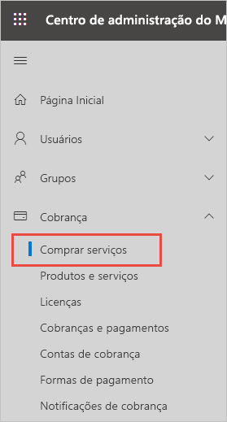
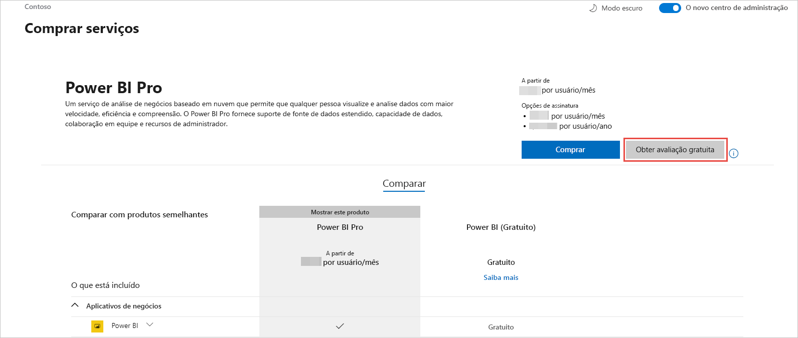
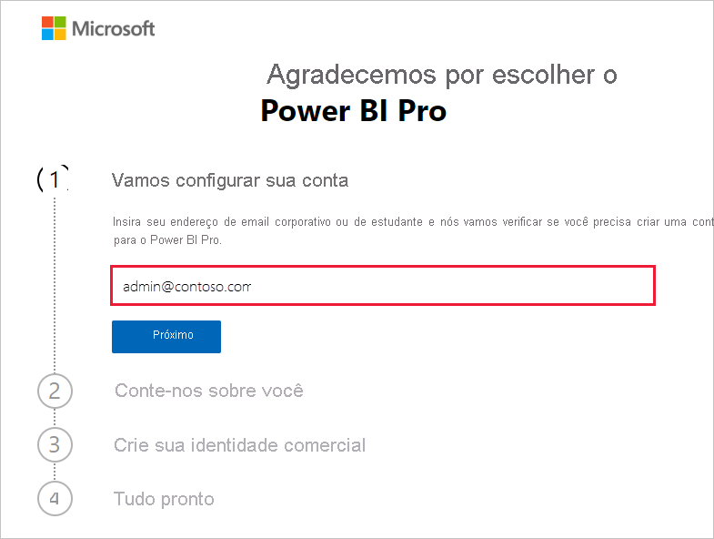
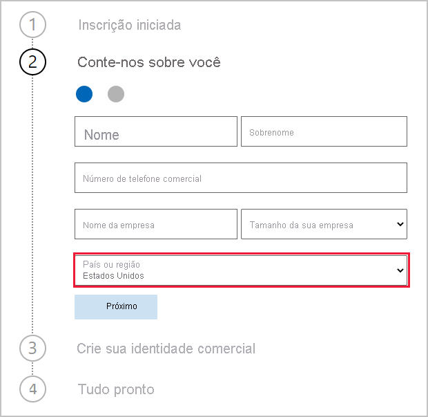
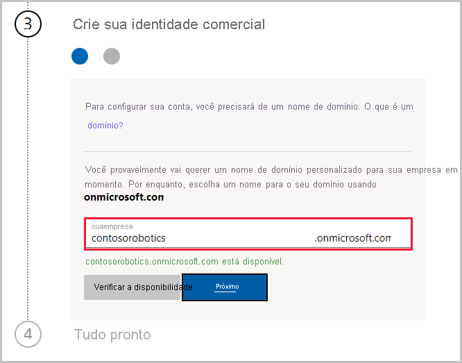

# Obter uma assinatura do Power BI para sua organização

Administradores podem se inscrever no Power BI na página **Comprar serviços** do Centro de administração do Microsoft 365. Quando um administrador se inscreve para o Power BI, ele pode atribuir licenças para usuários que devem ter acesso.

Usuários em sua organização podem se inscrever para o Power BI pelo site do Power BI. Quando usuários em sua organização se inscrevem para o Power BI, eles recebem automaticamente uma licença do Power BI. Se você quiser desligar as funcionalidades de autoatendimento, siga as etapas em [Habilitar ou desabilitar a inscrição e compra por autoatendimento](service-admin-disable-self-service.md).

## Inscrever-se por meio do Microsoft 365

Se você é um administrador global ou administrador de cobrança, pode obter uma assinatura do Power BI para sua organização. Para obter mais informações, confira [Quem pode comprar e atribuir licenças do Power BI Pro?](service-admin-licensing-organization.md#who-can-purchase-and-assign-licenses).

> [!NOTE]
>
> Uma assinatura do Microsoft 365 E5 já inclui licenças do Power BI Pro. Para saber como gerenciar licenças, confira [Exibir e gerenciar licenças do usuário](service-admin-manage-licenses.md).
>
>

Siga estas etapas para comprar licenças do Power BI Pro no centro de administração do Microsoft 365:

1. Entre no [centro de administração do Microsoft 365](https://admin.microsoft.com).

2. No menu de navegação, selecione **Cobrança** > **Serviços de compra**.
  
   

3. Pesquise ou role a tela para encontrar a assinatura que deseja comprar. Você verá **Power BI** em **Outras categorias que podem lhe interessar** próximo à parte inferior da página. Selecione o link para exibir as assinaturas do Power BI disponíveis para sua organização.

4. Selecione uma oferta, como o Power BI Pro.

5. Na página **Serviços de compra**, selecione **Comprar**. Se você ainda não tiver usado uma assinatura de avaliação gratuita do Power BI Pro, poderá iniciar uma. Ele inclui 25 licenças e expira em um mês.

   

6. Escolha **Pagar mensalmente** ou **Pagar por um ano inteiro**, de acordo com sua preferência de pagamento.

7. Em **Quantos usuários você deseja?** , insira a quantidade de licenças a comprar e selecione **Pagar agora** para concluir a transação.

8. Verifique sua compra acessando **Cobrança** > **Produtos e serviços** e procure **Power BI Pro**.

Para saber mais sobre como sua organização pode controlar e adquirir o serviço do Power BI, confira [Power BI em sua organização](https://docs.microsoft.com/microsoft-365/admin/misc/power-bi-in-your-organization?view=o365-worldwide).

## Mais maneiras de obter o Power BI para sua organização

Se você ainda não é um assinante do Microsoft 365, use as etapas abaixo para obter uma avaliação do Power BI Pro para sua organização. Alternativamente, você pode [inscrever-se para uma nova avaliação do Microsoft 365](service-admin-signing-up-for-power-bi-with-a-new-office-365-trial.md) e, em seguida, adicionar o Power BI seguindo as etapas na seção anterior.

Você precisará de uma conta corporativa ou de estudante para se inscrever para uma assinatura do Power BI. Não damos suporte a endereços de email fornecidos por provedores de telecomunicações e serviços de email para consumidores. Se você não tiver uma conta corporativa ou de estudante, poderá criar uma durante a inscrição.

Siga estas etapas para se inscrever:

1. Acesse [Inscrição no Power BI Pro](https://signup.microsoft.com/create-account/signup?OfferId=d59682f3-3e3b-4686-9c00-7c7c1c736085&ali=1&products=d59682f3-3e3b-4686-9c00-7c7c1c736085). 

2. Insira seu endereço de email corporativo ou de estudante e selecione **Avançar**. Não há problema se você inserir um endereço de email que não é considerado um endereço de email corporativo ou de estudante. Vamos configurar uma nova conta para você quando você criar sua identidade empresarial.

   

3. Executamos uma verificação rápida para ver se você precisa criar uma conta. Selecione **Configurar a conta** para continuar com o processo de inscrição.

   > [!NOTE]
   >Caso seu endereço de email já esteja em uso com outro serviço da Microsoft, você pode **Entrar** ou **Criar uma conta**. Se você optar por criar uma conta, continue a seguir estas etapas para preparar tudo.
>
>
 
4. Preencha o formulário para nos contar sobre você. Escolha o país ou a região correta. O país que você seleciona determina onde os dados são armazenados, conforme explicado em [Como determinar onde se encontra o seu locatário do Power BI](service-admin-where-is-my-tenant-located.md#how-to-determine-where-your-power-bi-tenant-is-located).

   

5. Selecione **Avançar**. Precisamos enviar um código de verificação para verificar sua identidade. Forneça um número de telefone em que seja possível enviar uma mensagem de texto ou chamá-lo. Em seguida, selecione **Enviar Código de Verificação**.

6. Insira o código de verificação e continue a **Criar sua identidade empresarial**.

   

    Insira um nome curto para sua empresa e verificaremos se ele está disponível. Usamos esse nome curto para criar o nome da sua organização no datacenter como um subdomínio de onmicrosoft.com. Você pode adicionar seu domínio empresarial posteriormente. Não se preocupe se o nome curto desejado já estiver em uso. Provavelmente, alguém com um nome empresarial semelhante escolheu o mesmo nome curto – apenas tente escolher uma variação diferente. Selecione **Avançar**.
    
7. Crie sua ID de usuário e a senha para entrar na conta. Selecione **Inscrever-se** e estará tudo pronto.

A conta que você criou agora é o administrador global de um novo locatário de avaliação do Power BI Pro. Você pode entrar no [Centro de administração do Microsoft 365](https://admin.microsoft.com) para adicionar mais usuários, configurar um domínio personalizado, comprar mais serviços e gerenciar sua assinatura do Power BI.

## Próximas etapas

- [Exibir e gerenciar licenças do usuário](service-admin-manage-licenses.md)
- [Habilitar ou desabilitar a inscrição e a compra por autoatendimento](service-admin-disable-self-service.md)
- [Documentação de assinaturas e de cobrança empresariais](https://docs.microsoft.com/microsoft-365/commerce/?view=o365-worldwide)
