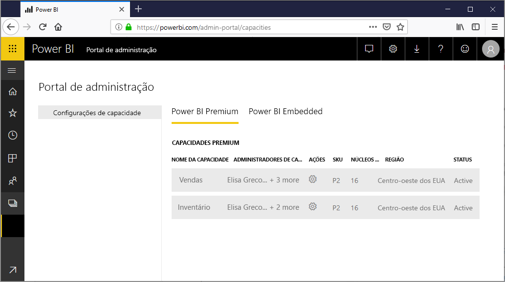
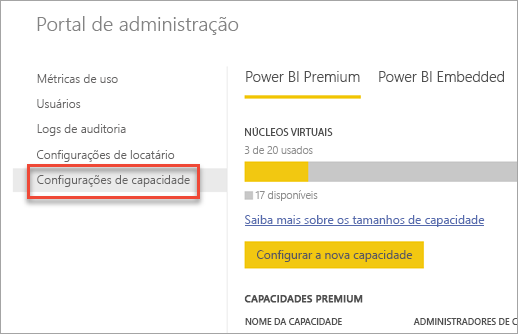
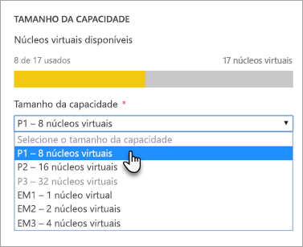
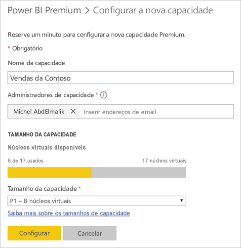
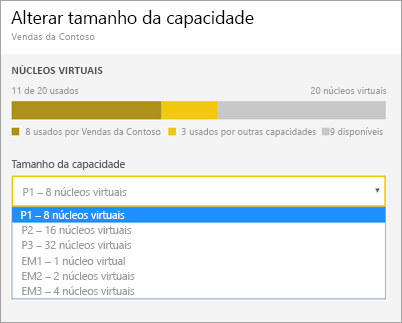
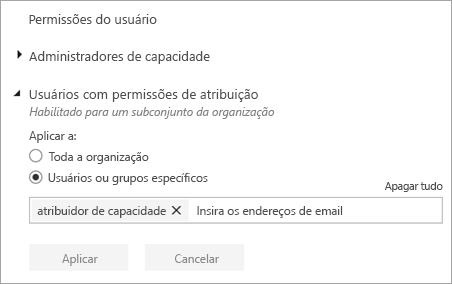
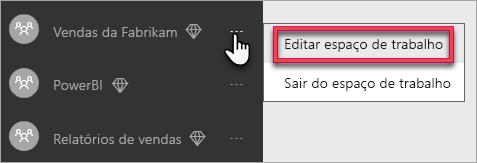
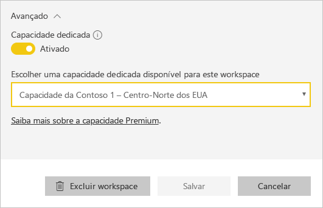
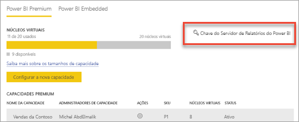

# Configurar e gerenciar capacidades no Power BI Premium

O gerenciamento do Power BI Premium envolve a criação, o gerenciamento e o monitoramento de capacidades Premium. Este artigo fornece instruções passo a passo. Para obter uma visão geral das capacidades, veja [Como gerenciar capacidades Premium](service-premium-capacity-manage.md).

Saiba como gerenciar as capacidades do Power BI Premium e do Power BI Embedded, que oferecem recursos dedicados ao seu conteúdo.

A *capacidade* é a essência das ofertas do Power BI Premium e do Power BI Embedded. É um conjunto de recursos reservados para uso exclusivo de sua organização. Ter capacidade dedicada permite publicar dashboards, relatórios e conjuntos de dados para usuários de toda a organização sem precisar comprar licenças por usuário para eles. Ela também oferece desempenho confiável e consistente para o conteúdo hospedado na capacidade. Para obter mais informações, consulte [O que é Power BI Premium?](service-premium-what-is.md).

## Gerenciar a capacidade

Após a compra de nós de capacidade no Microsoft 365, configure a capacidade no portal de administração do Power BI. Você gerencia as capacidades do Power BI Premium na seção **Configurações de capacidade** do portal.

Gerencie uma capacidade selecionando o nome dela. Isso leva você para a tela de gerenciamento de capacidade.

Se nenhum workspace tiver sido atribuído à capacidade, você verá uma mensagem sobre [como atribuir um workspace à capacidade](#assign-a-workspace-to-a-capacity).

### Configurar uma nova capacidade (Power BI Premium)

O portal de administração mostra o número de *núcleos virtuais* (v-cores) que você usou e que ainda tem disponível. O número total de núcleos baseia-se nas SKUs Premium que você comprou. Por exemplo, comprar um P3 e um P2 resulta em 48 núcleos disponíveis – 32 do P3 e 16 do P2.

Se você tiver núcleos virtuais disponíveis, configure a nova capacidade seguindo estas etapas.

1. Selecione **Configurar nova capacidade**.

1. Dê um nome à sua capacidade.

1. Defina quem é o administrador para essa capacidade.

1. Selecione o tamanho da capacidade. As opções disponíveis dependem de quantos núcleos virtuais disponíveis você tem. Não é possível selecionar uma opção maior que a que está disponível.

    

1. Selecione **Configurar**.

    

Administradores de capacidade, bem como administradores do Power BI e administradores globais, verão a capacidade listada no portal do administrador.

### Configurações de capacidade

1. Na tela de gerenciamento de capacidade Premium, em **Ações**, selecione o **ícone de engrenagem** para examinar e atualizar as configurações. 

    

1. Você pode ver quem são os administradores de serviço, a SKU/o tamanho da capacidade e em qual região a capacidade está.

    

1. Você também pode renomear ou excluir uma capacidade.

    

> [!NOTE]
> As configurações de capacidade do Power BI Embedded são gerenciadas no portal do Microsoft Azure.

### Alterar tamanho da capacidade

Administradores do Power BI e administradores globais podem alterar a capacidade do Power BI Premium. Os administradores de capacidade que não são administradores do Power BI nem administradores globais não têm essa opção.

1. Selecione **Alterar o tamanho da capacidade**.

    

1. Na tela **Alterar tamanho da capacidade**, atualize ou faça downgrade de sua capacidade conforme apropriado.

    

    Os administradores são livres para criar, redimensionar e excluir nós, desde que tenham o número necessário de núcleos virtuais.

    Não é possível fazer downgrade de SKUs P para SKUs EM. É possível focalizar as opções de desabilitadas para ver uma explicação.

> [!IMPORTANT]
> Se a capacidade do Power BI Premium estiver enfrentando um alto uso de recursos, resultando em problemas de desempenho ou confiabilidade, você poderá receber emails de notificação para identificar e resolver o problema. Confira [Notificações de capacidade e confiabilidade](service-interruption-notifications.md#capacity-and-reliability-notifications) para obter mais informações.

### Gerenciar permissões de usuário

É possível atribuir administradores de capacidade adicionais, bem como atribuir usuários que tenham permissões de *atribuição de capacidade*. Os usuários que tiverem permissões de atribuição poderão atribuir um workspace a uma capacidade se eles forem administradores desse workspace. Eles também podem atribuir o *Meu workspace* pessoal à capacidade. Os usuários com permissões de atribuição não têm acesso ao portal de administração.

> [!NOTE]
> Para o Power BI Embedded, os administradores de capacidade são definidos no portal do Microsoft Azure.

Em **Permissões do usuário**, expanda **Usuários com permissões de atribuição** e, em seguida, adicione usuários ou grupos conforme apropriado.

## Atribuir um workspace a uma capacidade

Há duas maneiras de atribuir um workspace a uma capacidade: no portal de administração e em um workspace.

### Atribuir do portal de administração

Os administradores de capacidade, juntamente com os administradores do Power BI e os administradores globais, podem atribuir workspaces em massa na seção de gerenciamento da capacidade Premium do portal de administração. Ao gerenciar uma capacidade, você verá uma seção **Workspaces** que permite atribuir workspaces.

1. Selecione **Atribuir workspaces**. Essa opção está disponível em vários locais.

1. Selecione uma opção para **Aplicar a**.

    

   | Seleção | Descrição |
   | --- | --- |
   | **Workspaces por usuários** | Quando você atribui workspaces por usuário ou grupo, todos os workspaces pertencentes a esses usuários são atribuídos à capacidade Premium, incluindo o workspace pessoal do usuário. Tais usuários obtêm permissões de atribuição de workspace automaticamente. Isso inclui workspaces já atribuídos a uma capacidade diferente. |
   | **Workspaces específicos** | Insira o nome do workspace específico para atribuir à capacidade selecionada. |
   | **Workspaces de toda a organização** | Atribuir workspaces de toda a organização à capacidade Premium atribuirá todos os workspaces e Meus Workspaces em sua organização a essa capacidade Premium. Além disso, todos os usuários atuais e futuros terão permissão para reatribuir workspaces individuais a essa capacidade. |
   | | |

1. Escolha **Aplicar**.

### Atribuir das configurações de workspace

Também é possível atribuir um workspace a uma capacidade Premium das configurações desse workspace. Para mover um workspace para uma capacidade, é necessário ter permissões de administrador para esse workspace e também permissões de atribuição de capacidade para essa capacidade. Note que os administradores de workspace podem sempre remover um workspace da capacidade Premium.

1. Edite um workspace selecionando as reticências **(. . .)** e então **Editar workspace**.

    

1. Em **Editar workspace**, expanda **Avançado**.

1. Selecione a capacidade à qual você deseja atribuir esse workspace.

    

1. Clique em **Salvar**.

Depois de salvo, o workspace e todo o seu conteúdo serão movidos para a capacidade Premium sem qualquer interrupção para os usuários finais.

## Chave do produto (Product Key) do Servidor de Relatório do Power BI

Na guia **Configurações de capacidade** do portal de administração do Power BI, você terá acesso à sua chave do produto (Product Key) do Servidor de Relatórios do Microsoft Power BI. Isso estará disponível somente para os administradores Globais ou usuários atribuídos à função de administrador do serviço do Power BI e se você tiver comprado um SKU do Power BI Premium.

Selecionar **chave do Servidor de Relatório do Power BI** exibirá uma caixa de diálogo que contém a chave do produto (Product Key). É possível copiá-la e usá-la com a instalação.

Para obter mais informações, consulte [Instalar o Servidor de Relatório do Power BI](../report-server/install-report-server.md).

## Próximas etapas

[Como gerenciar capacidades Premium](service-premium-capacity-manage.md)

Mais perguntas? [Experimente perguntar à Comunidade do Power BI](https://community.powerbi.com/)
