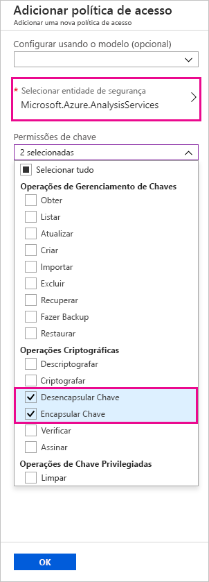
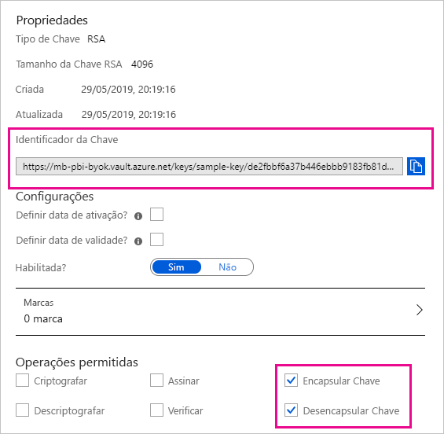

# <a name="bring-your-own-encryption-keys-for-power-bi"></a>Traga suas próprias chaves de criptografia para o Power BI

O Power BI criptografa dados _em repouso_ e _em processo_. Por padrão, o Power BI usa chaves gerenciadas pela Microsoft para criptografar seus dados. No Power BI Premium, também é possível usar suas próprias chaves para os dados em repouso que são importados em um conjunto de dados (confira [Considerações de armazenamento e fonte de dados](#data-source-and-storage-considerations) para obter mais informações). Essa abordagem geralmente é descrita como _BYOK_ (Bring Your Own Key).

## <a name="why-use-byok"></a>Por que usar a abordagem BYOK?

O BYOK torna mais fácil atender aos requisitos de conformidade que especificam as disposições de chave com o provedor de serviço de nuvem (neste caso, a Microsoft). Com o BYOK, você fornece e controla as chaves de criptografia para os dados do Power BI em repouso no nível do aplicativo. Como resultado, você pode exercer controle e revogar as chaves da sua organização se decidir sair do serviço. Quando você revogar as chaves, os dados ficarão ilegíveis para o serviço dentro de 30 minutos.

## <a name="data-source-and-storage-considerations"></a>Considerações sobre armazenamento e fonte de dados

Para usar o BYOK, você deve fazer upload dos dados no serviço do Power BI em um arquivo do Power BI Desktop (PBIX). Não é possível usar o BYOK nos seguintes cenários:

- Conexão dinâmica do Analysis Services
- Pastas de trabalho do Excel (a menos que os dados sejam primeiramente importados no Power BI Desktop)
- [Enviar conjuntos de dados por push](/rest/api/power-bi/pushdatasets)
- [Fazer streaming de conjuntos de dados](../connect-data/service-real-time-streaming.md#set-up-your-real-time-streaming-dataset-in-power-bi)
- [Modelos grandes](service-premium-large-models.md)

BYOK aplica-se somente a conjuntos de dados. Conjuntos de arquivos de envio por push, arquivos do Excel e arquivos CSV que os usuários podem carregar no serviço não são criptografados usando sua própria chave. Para identificar quais artefatos são armazenados em seus workspaces, use o seguinte comando do PowerShell:

```PS C:\> Get-PowerBIWorkspace -Scope Organization -Include All```

> [!NOTE]
> Este cmdlet requer o módulo de gerenciamento v1.0.840 do Power BI. Você pode ver qual versão você tem executando Get-InstalledModule -Name MicrosoftPowerBIMgmt. Instale a versão mais recente executando install-Module-Name MicrosoftPowerBIMgmt. Você pode obter mais informações sobre o cmdlet do Power BI e os parâmetros dele em [módulo cmdlet do PowerShell do Power BI](https://docs.microsoft.com/powershell/power-bi/overview).

## <a name="configure-azure-key-vault"></a>Configurar o Azure Key Vault

Nesta seção, você aprenderá como configurar o Azure Key Vault, uma ferramenta para armazenar e acessar segredos com segurança, como chaves de criptografia. Você pode usar um cofre de chaves existente para armazenar chaves de criptografia ou pode criar um novo especificamente para uso com o Power BI.

As instruções nesta seção pressupõem conhecimento básico do Azure Key Vault. Para obter mais informações, veja [O que é o Azure Key Vault?](/azure/key-vault/key-vault-whatis). Configure o cofre de chaves da seguinte maneira:

1. Adicione o serviço do Power BI como uma entidade de serviço para o cofre de chaves, com permissões de encapsulamento e desencapsulamento.

1. Crie uma chave RSA com um comprimento de 4096 bits (ou use uma chave existente desse tipo), com permissões de encapsulamento e desencapsulamento.

    > [!IMPORTANT]
    > O Power BI BYOK dá suporte apenas a chaves RSA com um comprimento de 4.096 bits.

1. Recomendado: Verifique se o cofre de chaves tem a opção _exclusão reversível_ habilitada.

### <a name="add-the-service-principal"></a>Adicionar a entidade de serviço

1. No portal do Azure, no cofre de chaves, em **Políticas de acesso**, selecione **Adicionar Novo**.

1. Em **Selecionar entidade**, procure e selecione Microsoft.Azure.AnalysisServices.

    > [!NOTE]
    > Se você não encontrar "Microsoft.Azure.AnalysisServices", é provável que a assinatura do Azure associada ao seu Azure Key Vault nunca tenha tido um recurso de Power BI associado. Em vez disso, tente pesquisar a seguinte cadeia de caracteres: 00000009-0000-0000-c000-000000000000.

1. Em **Permissões de chave**, selecione **Decodificar Chave** e **Codificar Chave**.

    

1. Selecione **OK** e, em seguida, **Salvar**.

> [!NOTE]
> Para revogar o acesso do Power BI aos seus dados no futuro, remova os direitos de acesso a essa entidade de serviço de seu Azure Key Vault.

### <a name="create-an-rsa-key"></a>Criar uma chave RSA

1. No cofre de chaves, em **Chaves**, selecione **Gerar/Importar**.

1. Selecione um **Tipo de Chave** de RSA e um **Tamanho da Chave RSA** de 4.096.

    

1. Selecione **Criar**.

1. Em **Chaves**, selecione a chave que você criou.

1. Selecione o GUID para a **Versão Atual** da chave.

1. Verifique se **Chave de encapsulamento** e **Chave de desencapsulamento** estão selecionadas. Copie o **Identificador de Chave** a ser usado ao habilitar o BYOK no Power BI.

    

### <a name="soft-delete-option"></a>Opção de exclusão reversível

É recomendável que você habilite a [exclusão reversível](/azure/key-vault/key-vault-ovw-soft-delete) no cofre de chaves para proteção contra perda de dados em caso de exclusão acidental da chave ou do cofre de chaves. Você precisa usar o [PowerShell para habilitar a propriedade de "exclusão reversível"](/azure/key-vault/key-vault-soft-delete-powershell) no cofre de chaves porque essa opção ainda não está disponível no portal do Azure.

Com o Azure Key Vault configurado corretamente, você está pronto para habilitar o BYOK em seu locatário.

## <a name="enable-byok-on-your-tenant"></a>Habilitar o BYOK em seu locatário

Habilite o BYOK no nível do locatário com o [PowerShell](https://www.powershellgallery.com/packages/MicrosoftPowerBIMgmt.Admin) inserindo as chaves de criptografia que você criou e armazenou no Azure Key Vault no seu locatário do Power BI. Em seguida, atribua essas chaves de criptografia por capacidade Premium para criptografar o conteúdo na capacidade.

### <a name="important-considerations"></a>Considerações importantes

Antes de habilitar o BYOK, tenha as seguintes considerações em mente:

- Neste momento, não é possível desabilitar o BYOK após habilitá-lo. Dependendo de como você especificar os parâmetros para `Add-PowerBIEncryptionKey`, será possível controlar como usar o BYOK para uma ou mais das suas capacidades. No entanto, não é possível desfazer a introdução das chaves em seu locatário. Para saber mais, veja [Habilitar BYOK](#enable-byok).

- Não é possível mover _diretamente_ um workspace que usa o BYOK de uma capacidade dedicada no Power BI Premium para capacidade compartilhada. Primeiramente, você deve mover o workspace para uma capacidade dedicada que não tenha o BYOK habilitado.

- Se você mover um workspace que usa o BYOK de uma capacidade dedicada no Power BI Premium para compartilhada, os relatórios e os conjuntos de dados ficarão inacessíveis, pois eles são criptografados com a chave. Para evitar essa situação, primeiro, é necessário mover o workspace para uma capacidade dedicada que não tenha o BYOK habilitado.

### <a name="enable-byok"></a>Habilitar o BYOK

Para habilitar o BYOK, você deve ser um administrador de locatário do serviço do Power BI, conectado usando o cmdlet `Connect-PowerBIServiceAccount`. Em seguida, use [`Add-PowerBIEncryptionKey`](/powershell/module/microsoftpowerbimgmt.admin/Add-PowerBIEncryptionKey) para habilitar o BYOK, conforme mostrado no exemplo a seguir:

```powershell
Add-PowerBIEncryptionKey -Name'Contoso Sales' -KeyVaultKeyUri'https://contoso-vault2.vault.azure.net/keys/ContosoKeyVault/b2ab4ba1c7b341eea5ecaaa2wb54c4d2'
```

Para adicionar várias chaves, execute `Add-PowerBIEncryptionKey` com valores diferentes para -`-Name` e `-KeyVaultKeyUri`. 

O cmdlet aceita dois parâmetros de opção que afetam a criptografia para as capacidades atuais e futuras. Por padrão, nenhuma das opções é definida:

- `-Activate`: Indica que essa chave será usada para todas as capacidades existentes no locatário que ainda não estão criptografadas.

- `-Default`: Indica que essa chave agora é o padrão para todo o locatário. Quando você cria uma nova capacidade, a capacidade herda essa chave.

> [!IMPORTANT]
> Se você especificar `-Default`, todas as capacidades criadas no locatário, neste ponto, serão criptografadas usando a chave que você especificar (ou uma chave padrão atualizada). Não é possível desfazer a operação padrão, portanto, você perde a capacidade de criar uma capacidade Premium em seu locatário que não usa o BYOK.

Depois de habilitar o BYOK em seu locatário, defina a chave de criptografia para uma ou mais capacidades do Power BI:

1. Use [`Get-PowerBICapacity`](/powershell/module/microsoftpowerbimgmt.capacities/get-powerbicapacity) para obter a ID de capacidade necessária para a próxima etapa.

    ```powershell
    Get-PowerBICapacity -Scope Individual
    ```

    O cmdlet retorna uma saída semelhante à seguinte:

    ```
    Id              : xxxxxxxx-xxxx-xxxx-xxxx-xxxxxxxxxxxx
    DisplayName     : Test Capacity
    Admins          : adam@sometestdomain.com
    Sku             : P1
    State           : Active
    UserAccessRight : Admin
    Region          : North Central US
    ```

1. Use [`Set-PowerBICapacityEncryptionKey`](/powershell/module/microsoftpowerbimgmt.admin/set-powerbicapacityencryptionkey) para definir a chave de criptografia:

    ```powershell
    Set-PowerBICapacityEncryptionKey -CapacityId xxxxxxxx-xxxx-xxxx-xxxx-xxxxxxxxxxxx -KeyName 'Contoso Sales'
    ```

Você tem controle sobre como usar o BYOK em seu locatário. Por exemplo, para criptografar uma capacidade única, chame `Add-PowerBIEncryptionKey` sem `-Activate` ou `-Default`. Em seguida, chame `Set-PowerBICapacityEncryptionKey` para a capacidade do local em que você deseja habilitar o BYOK.

## <a name="manage-byok"></a>Gerenciar o BYOK

O Power BI fornece cmdlets adicionais para ajudar a gerenciar o BYOK em seu locatário:

- Use [`Get-PowerBICapacity`](/powershell/module/microsoftpowerbimgmt.capacities/get-powerbicapacity) para obter a chave que uma capacidade está usando atualmente:

    ```powershell
    Get-PowerBICapacity -Scope Organization -ShowEncryptionKey
    ```

- Use [`Get-PowerBIEncryptionKey`](/powershell/module/microsoftpowerbimgmt.admin/get-powerbiencryptionkey) para obter a chave que seu locatário está usando atualmente:

    ```powershell
    Get-PowerBIEncryptionKey
    ```

- Use [`Get-PowerBIWorkspaceEncryptionStatus`](/powershell/module/microsoftpowerbimgmt.admin/get-powerbiworkspaceencryptionstatus) para ver se os conjuntos de dados em um workspace são criptografados e se o seu status de criptografia está em sincronia com o workspace:

    ```powershell
    Get-PowerBIWorkspaceEncryptionStatus -Name'Contoso Sales'
    ```

    Observe que a criptografia está habilitada no nível de capacidade, mas você obtém o status de criptografia no nível do conjunto de dados para o workspace especificado.

- Use [`Switch-PowerBIEncryptionKey`](/powershell/module/microsoftpowerbimgmt.admin/switch-powerbiencryptionkey) para alternar (ou _girar_) a versão da chave usada para criptografia. O cmdlet simplesmente atualiza o `-KeyVaultKeyUri` para uma chave `-Name`:

    ```powershell
    Switch-PowerBIEncryptionKey -Name'Contoso Sales' -KeyVaultKeyUri'https://contoso-vault2.vault.azure.net/keys/ContosoKeyVault/b2ab4ba1c7b341eea5ecaaa2wb54c4d2'
    ```


## <a name="next-steps"></a>Próximas etapas

* [Módulo cmdlet do PowerShell do Power BI](https://docs.microsoft.com/powershell/power-bi/overview) 

* [Maneiras de compartilhar seu trabalho no Power BI](../collaborate-share/service-how-to-collaborate-distribute-dashboards-reports.md)

* [Filtrar relatórios usando parâmetros da cadeia de caracteres de consulta na URL](../collaborate-share/service-url-filters.md)

* [Inserir com Web Part de Relatório no SharePoint Online](../collaborate-share/service-embed-report-spo.md)

* [Publicar na Web por meio do Power BI](../collaborate-share/service-publish-to-web.md)

