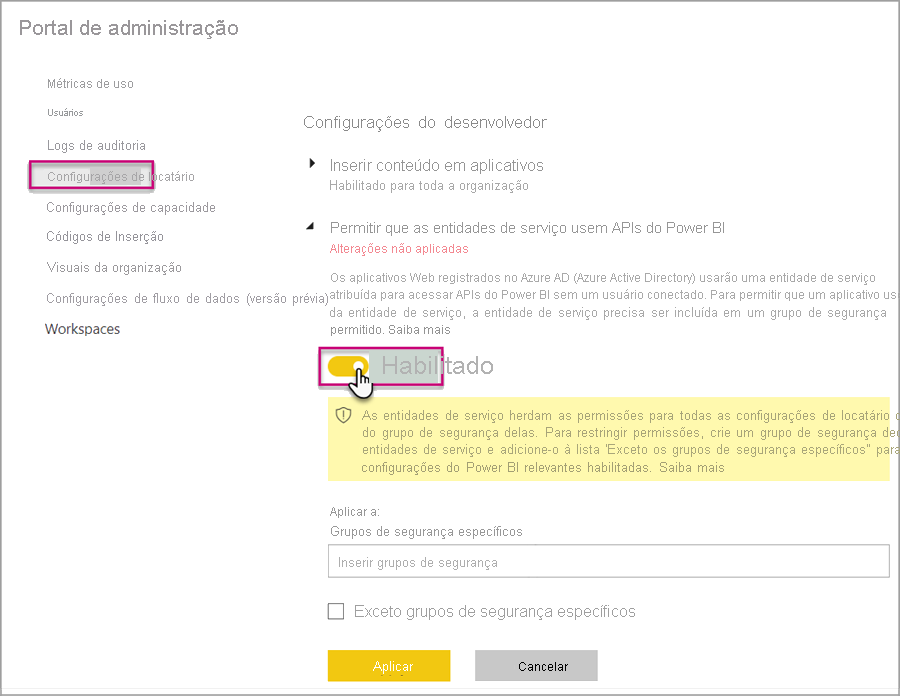
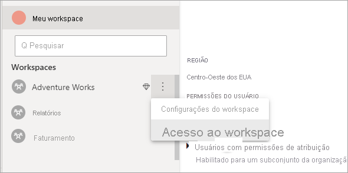

# <a name="automate-premium-workspace-and-dataset-tasks-with-service-principals"></a>Automatizar tarefas de conjunto de dados e workspace Premium com entidades de serviço

As entidades de serviço são um recurso de *registro de aplicativo* do Azure Active Directory que você cria em seu locatário para executar operações de nível de serviço e recursos autônomos. Eles são um tipo exclusivo de identidade do usuário com um nome do aplicativo, uma ID de aplicativo, uma ID do locatário e um *segredo do cliente* ou certificado como senha.

O Power BI Premium usa a mesma funcionalidade de entidade de serviço que Power BI Embedded. Para saber mais, confira [Inserção de conteúdo do Power BI com entidades de serviço](../developer/embedded/embed-service-principal.md).

No **Power BI Premium**, as entidades de serviço também podem ser usadas com o [ponto de extremidade de XMLA](service-premium-connect-tools.md) para automatizar tarefas de gerenciamento de conjuntos de dados, como provisionar workspaces, implantar modelos e atualizar conjuntos de dados, juntamente com:

- PowerShell
- Automação do Azure
- Aplicativos Lógicos do Azure
- Aplicativos cliente personalizados

Somente [novos workspaces](../collaborate-share/service-new-workspaces.md) dão suporte a conexões de ponto de extremidade XMLA usando entidades de serviço. Os workspaces clássicos não são compatíveis. Uma entidade de serviço tem apenas as permissões necessárias para executar tarefas para workspaces aos quais ela é atribuída. As permissões são atribuídas por meio do acesso ao workspace, assim como contas UPN regulares.

Para executar operações de gravação, a **Carga de trabalho de conjuntos de dados** da capacidade precisa ter o [ponto de extremidade XMLA habilitado para leitura/gravação](service-premium-connect-tools.md#enable-xmla-read-write). Os conjuntos de dados publicados do Power BI Desktop devem ter o recurso de [Formato avançado de metadados](../connect-data/desktop-enhanced-dataset-metadata.md) habilitado.

> [!NOTE]
> O recurso de ponto de extremidade XMLA no Power BI Premium está em **versão prévia**. Recursos em versão prévia não devem ser usados em um ambiente de produção. Determinadas funcionalidades, o suporte e a documentação são limitados.  Confira os detalhes nos [Termos do OST (Microsoft Online Services)](https://www.microsoft.com/licensing/product-licensing/products?rtc=1).

## <a name="create-a-service-principal"></a>Criar uma entidade de serviço

As entidades de serviço são criadas como um registro de aplicativo no portal do Azure ou usando o PowerShell. Ao criar sua entidade de serviço, você deve copiar e salvar separadamente o nome do aplicativo, a ID do aplicativo (cliente), a ID do diretório (locatário) e o segredo do cliente. Para obter as etapas de criação de uma entidade de serviço, confira:

[Criar entidade de serviço - Portal do Azure](https://docs.microsoft.com/azure/active-directory/develop/howto-create-service-principal-portal)   
[Criar entidade de serviço - PowerShell](https://docs.microsoft.com/azure/active-directory/develop/howto-authenticate-service-principal-powershell)

## <a name="create-an-azure-ad-security-group"></a>Criar um grupo de segurança do Azure AD

Por padrão, as entidades de serviço têm acesso a configurações de locatário para as quais estejam habilitadas. Dependendo das configurações de administrador, o acesso pode incluir grupos de segurança específicos ou de toda a organização.

Para restringir o acesso da entidade de serviço a configurações de locatário específicas, você pode permitir o acesso a grupos de segurança específicos. Como alternativa, você pode criar um grupo de segurança dedicado para entidades de serviço e excluí-lo das configurações de locatário desejadas. Para ver as etapas para criação de um grupo de segurança e adição de uma entidade de serviço, confira [Criar um grupo básico e adicionar membros usando o Azure Active Directory](https://docs.microsoft.com/azure/active-directory/fundamentals/active-directory-groups-create-azure-portal).

## <a name="enable-service-principals"></a>Habilitar as entidades de serviço

Antes de usar entidades de serviço no Power BI, um administrador precisa primeiro habilitar o acesso de entidade de serviço no portal de administração do Power BI.

No **Portal de administração** > **Configurações de locatário** do Power BI, expanda **Permitir que as entidades de serviço usem APIs do Power BI** e clique em **Habilitado**. Para aplicar permissões a um grupo de segurança, adicione o nome do grupo a **Grupos de segurança específicos**.



## <a name="workspace-access"></a>Acesso ao workspace

Para que a entidade de serviço tenha as permissões necessárias para executar operações em um conjunto de dados e um workspace Premium, você precisa adicionar a entidade de serviço como um membro ou administrador do workspace. O uso do acesso ao workspace no serviço do Power BI é descrito aqui, mas você também pode usar a [API REST Adicionar Usuário ao Grupo](https://docs.microsoft.com/rest/api/power-bi/groups/addgroupuser).

1. No serviço do Power BI, para um workspace, selecione **Mais** > **Acesso ao workspace**.

    

2. Pesquise pelo nome do aplicativo, adicione a entidade de serviço como **Administrador** ou **Membro** do workspace.

    

## <a name="connection-strings-for-the-xmla-endpoint"></a>Cadeias de conexão do ponto de extremidade XMLA

Depois que você tiver criado uma entidade de serviço, habilitado as entidades de serviço para seu locatário e adicionado a entidade de serviço ao acesso do workspace, você poderá usá-la como uma identidade de usuário em cadeias de conexão com o ponto de extremidade XMLA. A diferença é para os parâmetros de ID de usuário e senha em que você especifica a ID do aplicativo, a ID do locatário e o segredo do aplicativo.

`Data Source=powerbi://api.powerbi.com/v1.0/myorg/<workspace name>; Initial Catalog=<dataset name>;User ID=app:<appId>@<tenantId>;Password=<app_secret>;`

### <a name="powershell"></a>PowerShell

#### <a name="using-sqlserver-module"></a>Usando o módulo SQLServer

No seguinte exemplo, AppId, TenantId e AppSecret são usados para autenticar uma operação de atualização de conjunto de dados:

```powershell
Param (
        [Parameter(Mandatory=$true)] [String] $AppId,
        [Parameter(Mandatory=$true)] [String] $TenantId,
        [Parameter(Mandatory=$true)] [String] $AppSecret
       )
$PWord = ConvertTo-SecureString -String $AppSecret -AsPlainText -Force

$Credential = New-Object -TypeName "System.Management.Automation.PSCredential" -ArgumentList $AppId, $PWord

Invoke-ProcessTable -Server "powerbi://api.powerbi.com/v1.0/myorg/myworkspace" -TableName "mytable" -DatabaseName "mydataset" -RefreshType "Full" -ServicePrincipal -ApplicationId $AppId -TenantId $TenantId -Credential $Credential
```

### <a name="amo-and-adomd"></a>AMO e ADOMD

Ao conectar com aplicativos cliente e aplicativos Web, os pacotes instaláveis das [bibliotecas cliente AMO e ADOMD](https://docs.microsoft.com/azure/analysis-services/analysis-services-data-providers) versão 15.0.2 e superior do NuGet dão suporte para entidades de serviço nas cadeias de conexão usando a sintaxe a seguir: `app:AppID` e senha ou `cert:thumbprint`.

No exemplo a seguir, `appID` e `password` são usados para executar uma operação de atualização de modelo de banco de dados:

```csharp
string appId = "xxx";
string authKey = "yyy";
string connString = $"Provider=MSOLAP;Data source=powerbi://api.powerbi.com/v1.0/<tenant>/<workspacename>;Initial catalog=<datasetname>;User ID=app:{appId};Password={authKey};";
Server server = new Server();
server.Connect(connString);
Database db = server.Databases.FindByName("adventureworks");
Table tbl = db.Model.Tables.Find("DimDate");
tbl.RequestRefresh(RefreshType.Full);
db.Model.SaveChanges();
```

## <a name="next-steps"></a>Próximas etapas

[Conectividade do conjunto de dados com o ponto de extremidade XMLA](service-premium-connect-tools.md)  
[Automação do Azure](https://docs.microsoft.com/azure/automation)  
[Aplicativos Lógicos do Azure](https://docs.microsoft.com/azure/logic-apps/)  
[APIs REST do Power BI](https://docs.microsoft.com/rest/api/power-bi/)
