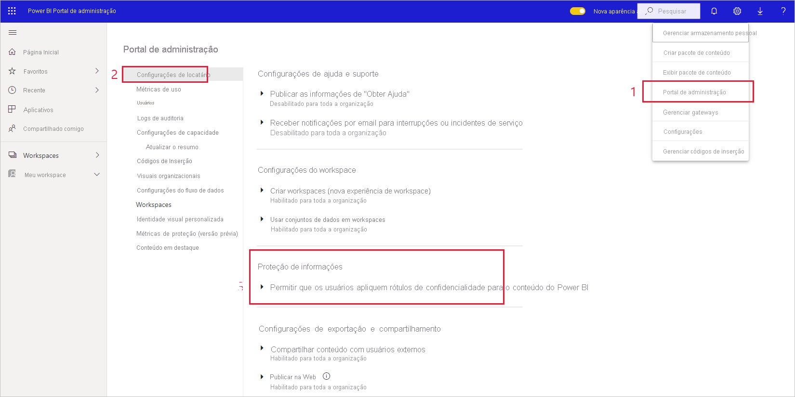
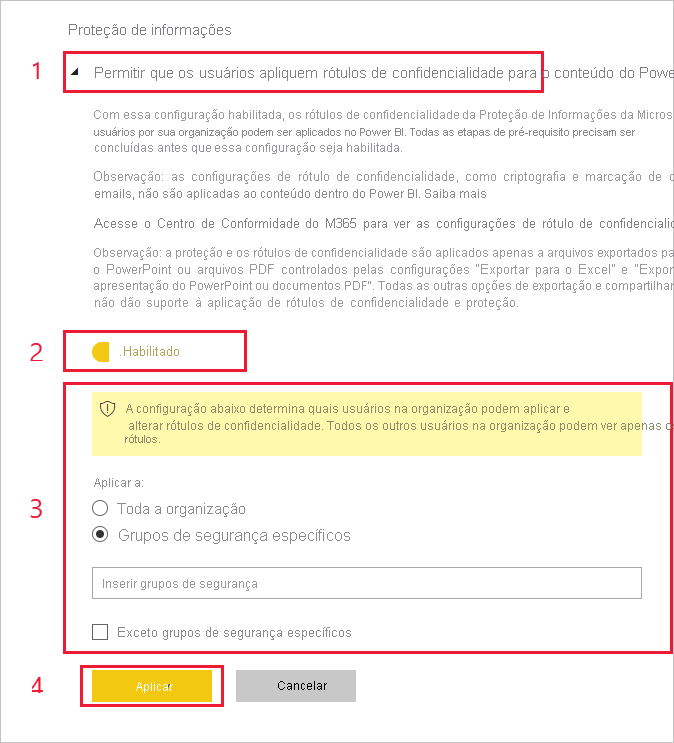

# Habilitar rótulos de confidencialidade no Power BI

Para os [rótulos de confiabilidade da Proteção de Informações da Microsoft](https://docs.microsoft.com/microsoft-365/compliance/sensitivity-labels) serem usados no Power BI, eles precisam estar habilitados no locatário. Este artigo mostra aos administradores de locatário do Power BI como fazer isso. Para uma visão geral de rótulos de confidencialidade no Power BI, confira [Rótulos de confidencialidade no Power BI](service-security-sensitivity-label-overview.md). Para obter informações sobre como aplicar rótulos de confidencialidade no Power BI, consulte [Como aplicar rótulos de confidencialidade](./service-security-apply-data-sensitivity-labels.md) 

Quando os rótulos de confidencialidade estão habilitados:

* Usuários e grupos de segurança específicos em uma organização podem classificar e [aplicar rótulos de confidencialidade](./service-security-apply-data-sensitivity-labels.md) aos seus relatórios, dashboards, conjuntos de dados e fluxos de dados do Power BI.
* Todos os membros da organização podem ver esses rótulos.

Habilitar rótulos de confidencialidade requer uma licença da Proteção de Informações do Azure. Confira [Licenciamento e requisitos](#licensing-and-requirements) para obter mais detalhes.

## Licenciamento e requisitos

* É necessário ter uma licença da Proteção de Informações do Azure Premium P1 ou P2 para aplicar ou exibir os rótulos de confidencialidade da Proteção de Informações do Microsoft Azure no Power BI. A Proteção de Informações do Azure pode ser adquirida de forma independente ou por meio de um dos pacotes de licenciamento da Microsoft. Confira [preço da Proteção de Informações do Azure](https://azure.microsoft.com/pricing/details/information-protection/) para obter detalhes.

* Para conseguir aplicar rótulos a conteúdo do Power BI, o usuário precisa ter uma licença do Power BI Pro, além de uma das licenças da Proteção de Informações do Azure mencionadas acima.

* Os aplicativos do Office têm [requisitos exclusivos de licenciamento para visualização e aplicação de rótulos de confidencialidade]( https://docs.microsoft.com/microsoft-365/compliance/get-started-with-sensitivity-labels#subscription-and-licensing-requirements-for-sensitivity-labels ).

* Antes de habilitar rótulos de confidencialidade em seu locatário, verifique se os rótulos foram definidos e publicados para os usuários e grupos relevantes. Confira [Criar e configurar rótulos de confidencialidade e suas políticas](https://docs.microsoft.com/microsoft-365/compliance/create-sensitivity-labels?view=o365-worldwide) para obter mais detalhes.

>[!NOTE]
> Se a sua organização usar rótulos de confidencialidade da Proteção de Informações do Azure, eles precisarão ser migrados para a plataforma de Rotulagem Unificada de Proteção de Informações da Microsoft para que sejam usados no Power BI. [Saiba mais sobre como migrar rótulos de confidencialidade](https://docs.microsoft.com/azure/information-protection/configure-policy-migrate-labels).

## Habilitar rótulos de confidencialidade

Acesse o **Portal de administração** do Power BI, abra o painel **Configurações de locatário** e localize a seção **Proteção de informações**.

Na seção **Proteção de Informações**, execute as seguintes etapas:
1. Abra **Permitir que os usuários apliquem rótulos de confidencialidade ao conteúdo do Power BI**.
1. Habilite a alternância.
1. Defina quem pode aplicar e alterar rótulos de confidencialidade em ativos do Power BI. Por padrão, todos em sua organização poderão aplicar rótulos de confidencialidade. No entanto, você pode optar por habilitar a configuração de rótulos de confidencialidade somente para usuários ou grupos de segurança específicos. Com toda a organização ou grupos de segurança específicos selecionados, você pode excluir subconjuntos de usuários ou grupos de segurança específicos.
   
   * Quando os rótulos de confidencialidade são habilitados para toda a organização, as exceções normalmente são grupos de segurança.
   * Quando os rótulos de confidencialidade são habilitados somente para usuários ou grupos de segurança específicos, as exceções normalmente são usuários específicos.  
    Essa abordagem possibilita impedir que determinados usuários apliquem rótulos de confidencialidade no Power BI, mesmo que eles pertençam a um grupo que tenha permissões para fazer isso.

1. Pressione **Aplicar**.

> [!IMPORTANT]
> Somente usuários do Power BI Pro que têm permissões para *criar* e *editar* no ativo e que fazem parte do grupo de segurança que foi definido nesta seção poderão definir e editar os rótulos de confidencialidade. Os usuários que não fazem parte desse grupo não poderão definir ou editar o rótulo.  

## Solução de problemas

O Power BI usa rótulos de confidencialidade da Proteção de Informações da Microsoft. Portanto, se você encontrar uma mensagem de erro ao tentar habilitar rótulos de confidencialidade, pode ser devido aos seguintes motivos:

* Você não tem uma [licença](#licensing-and-requirements) da Proteção de Informações do Azure.
* Os rótulos de confidencialidade não foram [migrados](#enable-sensitivity-labels) para a versão da Proteção de Informações da Microsoft compatível com o Power BI.
* Nenhum rótulo de confidencialidade da Proteção de Informações da Microsoft foi [definido na organização](#enable-sensitivity-labels).

## Considerações e limitações

Confira [Rótulos de confidencialidade no Power BI](service-security-sensitivity-label-overview.md#limitations) para obter a lista de limitações de rótulo de confidencialidade no Power BI.

## Próximas etapas

Este artigo descreveu como habilitar rótulos de confidencialidade no Power BI. Os artigos a seguir fornecem mais detalhes sobre a proteção de dados no Power BI. 

* [Visão geral de rótulos de confidencialidade no Power BI](service-security-sensitivity-label-overview.md)
* [Como aplicar rótulos de confidencialidade no Power BI](../collaborate-share/service-security-apply-data-sensitivity-labels.md)
* [Usando controles do Microsoft Cloud App Security no Power BI](service-security-using-microsoft-cloud-app-security-controls.md)
* [Relatório de métricas de proteção](service-security-data-protection-metrics-report.md)