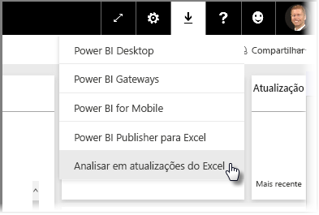
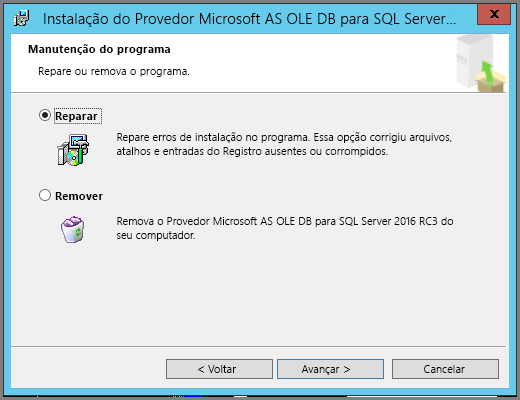
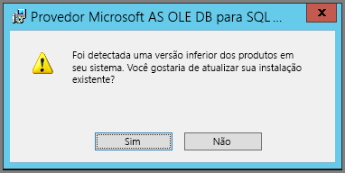

# Solução de problemas para Analisar no Excel

Pode haver ocasiões ao usar Analisar no Excel em que você obtém um resultado inesperado ou em que o recurso não funciona conforme esperado. Esta página fornece soluções para problemas comuns ao usar Analisar no Excel.

> [!NOTE]
> Há uma página separada dedicada a descrever e habilitar a opção [Analisar no Excel](service-analyze-in-excel.md).
> 
> Se você encontrar um cenário que não esteja listado abaixo e que esteja causando problemas, solicite ajuda no [site da comunidade](https://community.powerbi.com/) ou crie um [tíquete de suporte](https://powerbi.microsoft.com/support/).
> 
> 

Este artigo contém as seguintes seções de solução de problemas:

* Atualizar bibliotecas do Excel para o provedor OLE DB
* Determinando se você precisa atualizar suas bibliotecas do Excel
* Erro "Não é possível estabelecer uma conexão"
* Erro "Proibido"
* Não há modelo de dados
* Erro "Token expirado"
* Não é possível acessar o Analysis Services local
* Não é possível arrastar para a área de valores da Tabela Dinâmica (não há medidas)

## Atualizar bibliotecas do Excel para o provedor OLE DB
Para usar **Analisar no Excel**, seu computador precisa ter um provedor OLE DB atual instalado. Esta [postagem da comunidade](https://community.powerbi.com/t5/Service/Analyze-in-Excel-Initialization-of-the-data-source-failed/m-p/30837#M8081) é uma ótima fonte para verificar sua instalação do provedor OLE DB ou para baixar uma versão recente.

As bibliotecas do Excel precisam corresponder à versão do Windows em termos do nível de bits. Se tiver o Windows de 64 bits instalado, você precisará instalar o provedor OLE DB de 64 bits.

Para baixar as bibliotecas mais recentes do Excel, visite o Power BI e selecione a **seta para baixo** no canto superior direito de serviço do Power BI e, em seguida, selecione **Analisar nas atualizações do Excel**.

Na caixa de diálogo que aparece, selecione **Download (visualização)** .

## Determinando se você precisa atualizar suas bibliotecas do Excel
Você pode baixar a versão mais recente das bibliotecas do provedor OLE DB para Excel nos links na seção anterior. Depois de você baixar a biblioteca do provedor OLE DB correta e iniciar a instalação, as verificações são executadas na versão instalada atualmente.

Se suas bibliotecas cliente do provedor OLE DB para Excel estiverem atualizadas, você verá uma caixa de diálogo semelhante à seguinte:

Como alternativa, se a nova versão que você está instalando for mais recente que a versão no seu computador, a seguinte caixa de diálogo será exibida:

Se vir a caixa de diálogo solicitando uma atualização, você deve prosseguir com a instalação para obter a versão mais recente do provedor OLE DB instalado no seu computador.

## Erro "Não é possível estabelecer uma conexão"
A principal causa de um erro *Não é possível estabelecer uma conexão* é as bibliotecas cliente do provedor OLE DB do seu computador estarem desatualizadas. Para obter informações sobre como determinar a atualização correta e links de download, consulte **Atualizar bibliotecas do Excel para o provedor OLE DB** no início deste artigo.

## Erro "Proibido"
Alguns usuários têm mais de uma conta do Power BI, e quando o Excel tenta se conectar ao Power BI usando credenciais existentes, ele pode usar credenciais que não têm acesso ao conjunto de dados ou relatório que você deseja acessar.

Quando isso ocorrer, você poderá receber um erro intitulado **Proibido**, que significa que você pode ter entrado no Power BI com credenciais que não têm permissões para o conjunto de dados. Depois de receber o erro **Proibido**, quando solicitado a inserir suas credenciais, use as credenciais que têm permissão para acessar o conjunto de dados que você está tentando usar.

Se ainda encontrar erros, faça logon no Power BI com a conta que tem permissão e verifique se você pode exibir e acessar o conjunto de dados no Power BI que você está tentando acessar no Excel.

## Não há modelo de dados
Se você receber um erro informando que **Não é possível encontrar o modelo do cubo OLAP**, isso significará que o conjunto de dados que você está tentando acessar não tem nenhum modelo de dados e, portanto, não poderá ser analisado no Excel.

## Erro "Token expirado"
Se receber um erro **Token expirado**, isso significa você não usou recentemente o recurso **Analisar no Excel** no computador que está usando. Basta inserir novamente suas credenciais ou abrir novamente o arquivo e o erro deve desaparecer.

## Não é possível acessar o Analysis Services local
Se estiver tentando acessar um conjunto de dados que tem conexões com dados do Analysis Services local, você poderá receber uma mensagem de erro. **Analisar no Excel** dá suporte à conexão a conjuntos de dados e relatórios no **Analysis Services** local com uma cadeia de conexão, desde que o computador esteja no mesmo domínio que o servidor do **Analysis Services** e sua conta tenha acesso a este servidor do **Analysis Services**.

## Não é possível arrastar para a área de valores da Tabela Dinâmica (não há medidas)
Quando **Analisar no Excel** se conecta a um modelo OLAP externo (que é como o Excel se conecta ao Power BI), a *Tabela Dinâmica* requer **medidas** a serem definidas no modelo externo, uma vez que todos os cálculos são executados no servidor. Isso é diferente de quando você trabalha com uma fonte de dados local (como tabelas no Excel, ou quando você está trabalhando com conjuntos de dados no **Power BI Desktop** ou no **serviço do Power BI**), caso em que o modelo de tabela está disponível localmente, e [você pode usar medidas implícitas](https://support.microsoft.com/en-us/office/measures-in-power-pivot-86484821-a324-4da3-803b-82fd2e5033f4), que são as medidas geradas dinamicamente e não armazenadas no modelo de dados. Nesses casos, o comportamento no Excel é diferente do comportamento no **Power BI Desktop** ou no **serviço do Power BI**: pode haver colunas nos dados que podem ser tratados como medidas no Power BI, mas não podem ser usados como valores (medidas) no Excel.

Para resolver esse problema, você tem algumas opções:

1. Crie [medidas em seu modelo de dados no **Power BI Desktop**](../transform-model/desktop-tutorial-create-measures.md). Em seguida, publique o modelo de dados no **serviço do Power BI** e acesse o conjunto de dados publicados do Excel.
2. Crie [medidas em seu modelo de dados do PowerPivot para Excel](https://support.office.com/article/Create-a-Measure-in-Power-Pivot-d3cc1495-b4e5-48e7-ba98-163022a71198).
3. Se você importou os dados de uma planilha do Excel que tinha apenas tabelas (e nenhum modelo de dados), poderá [adicionar tabelas ao modelo de dados](https://support.office.com/article/Add-worksheet-data-to-a-Data-Model-using-a-linked-table-d3665fc3-99b0-479d-ba09-a37640f5be42). Depois, siga as etapas na opção 2, acima, para criar medidas no seu modelo de dados.

Depois que suas medidas são definidas no modelo de serviço do Power BI, você poderá usá-las na área **Valores** em Tabelas Dinâmicas do Excel.

## Próximas etapas
[Analisar no Excel](service-analyze-in-excel.md)

[Tutorial: criar suas próprias medidas no Power BI Desktop](../transform-model/desktop-tutorial-create-measures.md)

[Medidas no PowerPivot](https://support.microsoft.com/en-us/office/measures-in-power-pivot-86484821-a324-4da3-803b-82fd2e5033f4)

[Criar uma medida no PowerPivot](https://support.office.com/article/Create-a-Measure-in-Power-Pivot-d3cc1495-b4e5-48e7-ba98-163022a71198)

[Adicionar dados da planilha a um modelo de dados usando uma tabela vinculada](https://support.office.com/article/Add-worksheet-data-to-a-Data-Model-using-a-linked-table-d3665fc3-99b0-479d-ba09-a37640f5be42)
