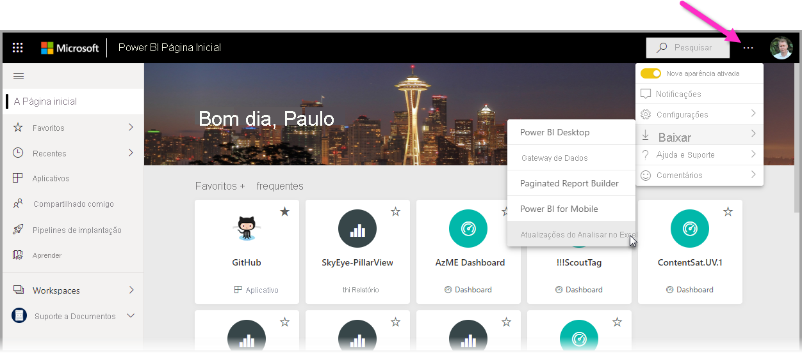
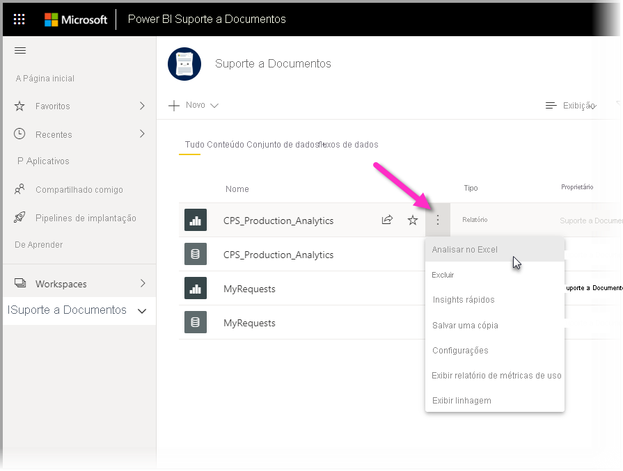
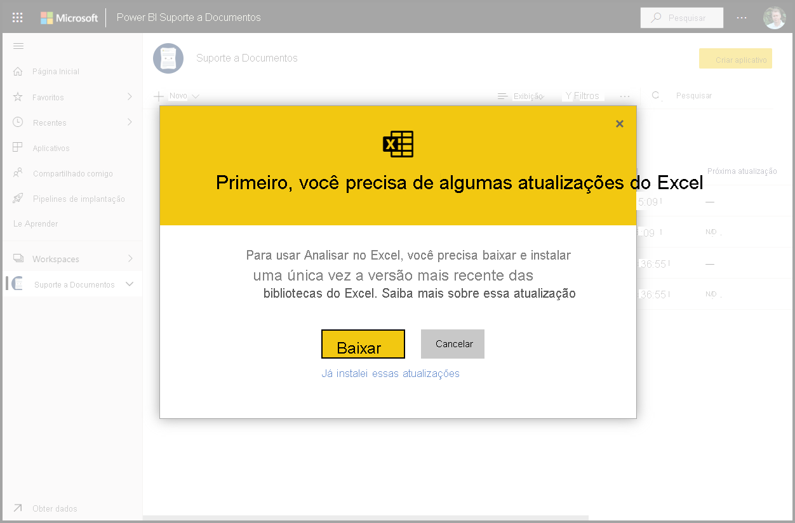
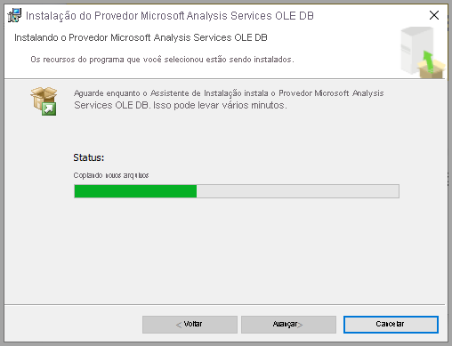
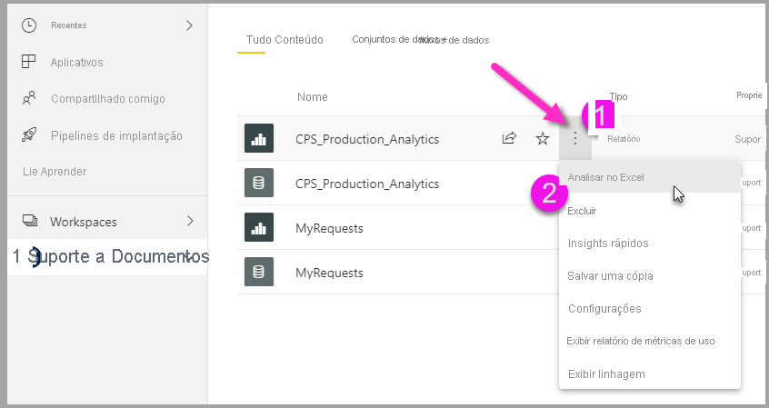
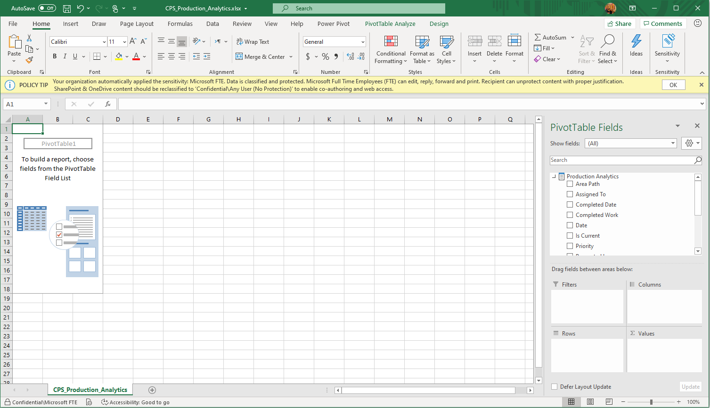
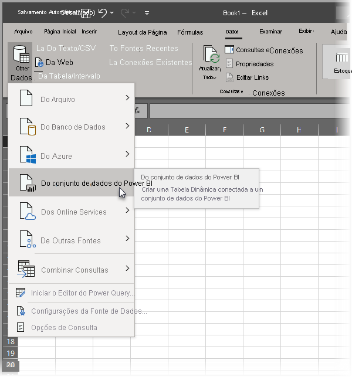

# Analisar no Excel
Com o **Analisar no Excel**, você pode levar conjuntos de dados do Power BI para o Excel e, em seguida, exibir e interagir com eles usando Tabelas Dinâmicas, gráficos, segmentações de dados e outros recursos do Excel. Para usar o **Analisar no Excel**, primeiro você deverá baixar o recurso do Power BI, instalá-lo e, em seguida, selecionar um ou mais conjuntos de valores para usar no Excel. 

Este artigo mostra como instalar e usar o Analisar no Excel, descreve suas limitações e, em seguida, fornece algumas próximas etapas. Eis o que você vai aprender:

* [Instalar o Analisar no Excel](#install-analyze-in-excel)
* [Conectar-se a dados do Power BI](#connect-to-power-bi-data)
* [Usar o Excel para analisar os dados](#use-excel-to-analyze-the-data)
* [Como salvar e compartilhar sua pasta de trabalho](#saving-and-sharing-your-new-workbook)
* [Requisitos](#requirements)

Vamos iniciar o processo de instalação.

## Instalar o Analisar no Excel

Você deve instalar **Analisar no Excel** de links fornecidos no serviço do Power BI. O Power BI detecta a versão do Excel que você tem em seu computador e baixa automaticamente a versão apropriada (32 bits ou 64 bits). O serviço do Power BI é executado em um navegador. Você pode entrar no Power BI usando o seguinte link:

* [Entrar no Power BI](https://app.powerbi.com)

Depois que você entrar e o serviço do Power BI estiver em execução no navegador, selecione o item **Mais opções** (o ...) no canto superior direito e, em seguida, selecione **Baixar > Atualizações do Analisar no Excel**. Esse item de menu se aplica a novas instalações de atualizações do Analisar no Excel.

Como alternativa, você pode navegar no serviço do Power BI até o conjunto de dados que deseja analisar e selecionar o item **Mais opções** para um conjunto de dados, relatório ou outro item do Power BI. No menu exibido, selecione a opção **Analisar no Excel**, conforme mostrado na imagem a seguir.

De qualquer forma, o Power BI detecta se você tem o Analisar no Excel instalado e, se não tiver, deverá baixá-lo. 

Quando você seleciona baixar, o Power BI detecta a versão do Excel instalada e baixa a versão apropriada do instalador do Analisar no Excel. Você vê um status de download na parte inferior do navegador ou onde o navegador exibe o progresso do download. 

Quando o download for concluído, execute o instalador (.msi) para instalar o Analisar no Excel. O nome do processo de instalação é diferente de Analisar no Excel; o nome será **Provedor Microsoft Analysis Services OLE DB**, conforme mostrado na imagem a seguir, ou algo semelhante.

Após a conclusão, você estará pronto para selecionar um relatório no serviço do Power BI (ou outro elemento de dados do Power BI, como um conjunto de dados) e, em seguida, analisá-lo no Excel.

## Conectar-se a dados do Power BI

No serviço do Power BI, procure o conjunto de dados ou o relatório que deseja analisar no Excel e:

1. Selecione o menu **Mais opções**.

1. Selecione **Analisar no Excel** desde os itens de menu que aparecem.

    A imagem a seguir mostra a seleção de um relatório.

    
    
    >[!NOTE]
    >Lembre-se de que, se você selecionar Analisar no Excel em um menu de Relatório, o conjunto de dados subjacente do relatório é o que será levado ao Excel.

    O serviço do Power BI cria um arquivo do Excel do conjunto de dados que foi projetado (e estruturado) para uso com o recurso **Analisar no Excel** e inicia um processo de download no navegador.
    
    

    O nome do arquivo corresponde ao conjunto de dados (ou relatório ou outra fonte de dado) do qual ele foi derivado. Portanto, se o nome do relatório for *Relatório Trimestral*, o arquivo baixado será **Relatório Trimestral.xlsx**.

    >[!Note]
    >Agora, Analisar no Excel baixa um arquivo do Excel em vez de um arquivo ODC. Isso habilita a proteção de dados nos dados exportados do Power BI. O arquivo do Excel baixado herda o rótulo de confidencialidade do conjunto de dados escolhido para Analisar no Excel.

3. Inicie o arquivo do Excel.

    >[!NOTE]
    >Na primeira vez que você abrir o arquivo, poderá precisar **Habilitar a Edição** e **Habilitar o Conteúdo**, dependendo das configurações de [Exibição protegida](https://support.microsoft.com/en-gb/office/what-is-protected-view-d6f09ac7-e6b9-4495-8e43-2bbcdbcb6653?ui=en-us&rs=en-gb&ad=gb) e [Documento confiável](https://support.microsoft.com/en-us/office/trusted-documents-cf872bd8-47ec-4c02-baa5-1fdba1a11b53).
    >
    >
    >
    >

## Usar o Excel para analisar os dados

Depois que você habilitar a edição e o conteúdo, o Excel apresentará uma **Tabela Dinâmica** vazia e uma lista **Campos** do conjunto de dados do Power BI, prontas para serem analisadas.

O arquivo do Excel tem uma cadeia de conexão MSOLAP que se conecta ao seu conjunto de dados no Power BI. Ao analisar ou trabalhar com os dados, o Excel consulta o conjunto de dados no Power BI e retorna os resultados para o Excel. Se esse conjunto de dados se conectar a uma fonte de dados dinâmica usando o Direct Query, o Power BI consultará a fonte de dados e retornará o resultado para o Excel.

Com essa conexão aos dados no Power BI estabelecida, você poderá criar Tabelas Dinâmicas, gráficos e analisar esse conjunto de dados da mesma forma como trabalharia com um conjunto de dados local no Excel.

**Analisar no Excel** é especialmente útil para conjuntos de dados e relatórios que se conectam às seguintes fontes de dados:

* Bancos de dados *Tabular do Analysis Services* ou *Multidimensional*.
* Arquivos do Power BI Desktop ou pastas de trabalho do Excel com modelos de dados que têm medidas de modelo criadas usando o DAX (Data Analysis Expressions).

> [!IMPORTANT]
> O uso do **Analisar no Excel** expõe todos os dados detalhados a todos os usuários com permissão para o conjunto de dados.

Há algumas coisas a serem consideradas quando você começa a usar o Analisar no Excel, que pode exigir uma ou duas etapas extras para reconciliar. Essas possibilidades são descritas nas seções a seguir. 

### Entrar no Power BI
Embora você tenha entrado no Power BI no navegador, na primeira vez que abrir um novo arquivo do Excel, você poderá precisar entrar no Power BI com sua conta do Power BI. Isso autentica a conexão do Excel no Power BI.

### Usuários com várias contas do Power BI
Alguns usuários têm várias contas do Power BI. Se for você, talvez você esteja conectado ao Power BI com uma conta, mas sua outra conta tem acesso ao conjunto de dados que está sendo usado no Analisar no Excel. Nesse caso, talvez você veja um erro **Proibido** ou uma falha de entrada ao tentar acessar um conjunto de dados que está sendo usado em uma pasta de trabalho de Analisar no Excel.

Você terá uma oportunidade para entrar novamente, quando você poderá entrar com a conta do Power BI que tem acesso ao conjunto de dados acessado pelo recurso Analisar no Excel. Você também pode selecionar seu nome na faixa de opções superior no Excel, que identifica a conta que está conectada no momento. Saia e entre novamente com a outra conta.

## Como salvar e compartilhar sua nova pasta de trabalho

Você pode **Salvar** a pasta de trabalho do Excel criada com o conjunto de dados do Power BI, assim como qualquer outra pasta de trabalho. No entanto, não é possível publicar ou importar a pasta de trabalho novamente no Power BI, pois você só pode publicar ou importar pastas de trabalho no Power BI que tenham dados em tabelas ou que tenham um modelo de dados. Como a nova pasta de trabalho tem apenas uma conexão com o conjunto de dados no Power BI, publicá-la ou importá-la para o Power BI é como andar em círculos!

Quando a pasta de trabalho for salva, você pode compartilhá-la com outros usuários do Power BI em sua organização. 

Quando um usuário com quem você compartilhou sua pasta de trabalho a abre, ele verá as Tabelas Dinâmicas e os dados da maneira que aparecem quando a pasta de trabalho foi salva pela última vez, que podem não ser a última versão dos dados. Para obter os últimos dados, os usuários devem usar o botão **Atualizar** na faixa de opções **Dados**. E como a pasta de trabalho está se conectando a um conjunto de dados no Power BI, os usuários que tentarem atualizar a pasta de trabalho devem entrar no Power BI e instalar as atualizações do Excel na primeira vez que tentarem fazer a atualização usando esse método.

Já que os usuários precisam atualizar o conjunto de dados e não há suporte para atualização para conexões externas no Excel Online, é recomendável que os usuários abram a pasta de trabalho na versão da área de trabalho do Excel no computador.

> [!NOTE]
> Os administradores de locatários do Power BI podem usar o *Portal de administração do Power BI* para desabilitar o uso da opção **Analisar no Excel** com conjuntos de dados locais armazenados em bancos de dados do AS (Analysis Services). Quando essa opção estiver desabilitada, a opção **Analisar no Excel** será desabilitada nos bancos de dados do AS, mas continuará disponível para uso com outros conjuntos de dados.

## Outras maneiras de acessar conjuntos de dados do Power BI desde o Excel
Os usuários com SKUs específicos do Office também podem se conectar a conjuntos de dados do Power BI de dentro do Excel usando o recurso **Obter Dados** no Excel. Se o SKU não oferecer suporte a esse recurso, a opção de menu **Obter Dados** não será exibida.

No menu da faixa de opções **Dados**, selecione **Obter Dados > Do conjunto de dados do Power BI** conforme mostrado na imagem a seguir.

Um painel é exibido, e nele você poderá procurar os conjuntos de dados aos quais tem acesso, ver se os conjuntos de dados são certificados ou promovidos e determinar se os rótulos de proteção de dados foram aplicados a esses conjuntos de dados. 

Para saber mais sobre como obter dados para o Excel dessa forma, confira [Criar uma Tabela Dinâmica de conjuntos de dados do Power BI](https://support.office.com/article/31444a04-9c38-4dd7-9a45-22848c666884) na documentação do Excel.

Você também pode acessar **tabelas em destaque** no Excel, na galeria **Tipos de Dados**. Para saber mais sobre tabelas em destaque e como acessá-las, confira [Acessar tabelas em destaque do Power BI no Excel (versão preliminar)](service-excel-featured-tables.md).

## Requisitos
Há alguns requisitos para o uso do recurso **Analisar no Excel**:

* Há suporte para o recurso **Analisar no Excel** no Microsoft Excel 2010 SP1 e posterior.

* As Tabelas Dinâmicas do Excel não têm suporte para agregação do tipo "arrastar e soltar" dos campos numéricos. Seu conjunto de dados no Power BI *deve ter medidas predefinidas*. Leia sobre a [criação de medidas](../transform-model/desktop-measures.md).
* Algumas empresas podem ter regras de Política de Grupo que impedem a instalação das atualizações necessárias do recurso **Analisar no Excel** no Excel. Se você não conseguir instalar as atualizações, verifique com seu administrador.
* **Analisar no Excel** requer que o conjunto de dados esteja no Power BI Premium ou que o usuário tenha uma licença do Power BI Pro. Saiba mais sobre as diferenças de funcionalidade entre os tipos de licença na seção _Comparação de recursos do Power BI_ em [Preços do Power BI](https://powerbi.microsoft.com/pricing/).
* Os usuários poderão se conectar aos conjuntos de dados por meio de Analisar no Excel se tiverem permissão no conjunto de dados subjacente.  Um usuário poderia ter essa permissão de diversas maneiras, por exemplo, tendo a função de Membro do workspace que contém o conjunto de dados, recebendo o compartilhamento de um relatório ou dashboard que usa o conjunto de dados ou tendo permissão Criar para o conjunto de dados, seja em um workspace ou em um aplicativo que o contém. Leia mais sobre a [Permissão Criar](../connect-data/service-datasets-build-permissions.md) para conjuntos de dados.
* Os usuários convidados não podem usar **Analisar no Excel** para conjuntos de dados enviados (originados) de outro locatário. 
* **Analisar no Excel** é um recurso do serviço do Power BI que não está disponível no Servidor de Relatórios do Power BI ou no Power BI Embedded. 
* Só há suporte para **Analisar no Excel** em computadores que executam o Microsoft Windows.

Para os usuários que precisarem desinstalar o recurso **Analisar no Excel**, você poderá fazer isso usando a configuração do sistema **Adicionar ou remover programas** no computador Windows.

## Solução de problemas
Pode haver ocasiões ao usar Analisar no Excel em que você obtém um resultado inesperado ou em que o recurso não funciona conforme esperado. [Esta página fornece soluções para problemas comuns ao usar Analisar no Excel](desktop-troubleshooting-analyze-in-excel.md).

## Próximas etapas

Você também pode estar interessado nos seguintes artigos:

* [Usar o detalhamento no Power BI Desktop](../create-reports/desktop-cross-report-drill-through.md)
* [Usando segmentações no Power BI Desktop](../visuals/power-bi-visualization-slicers.md)
* [Solução de problemas para análise no Excel](desktop-troubleshooting-analyze-in-excel.md)
* [Acessar tabelas em destaque do Power BI no Excel (versão prévia)](service-excel-featured-tables.md).

