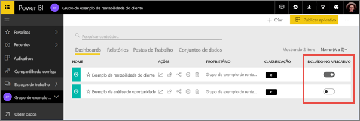
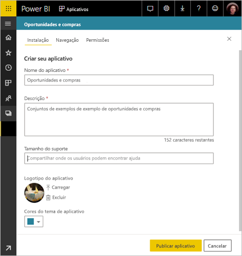
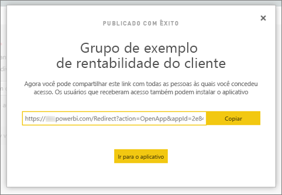
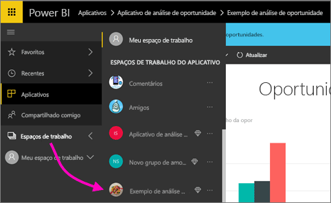
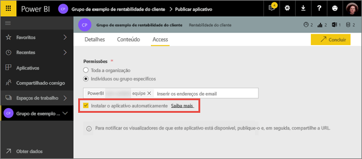
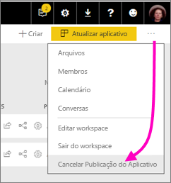

# Publicar um aplicativo no Power BI

No Power BI, você pode criar um conteúdo empacotado oficial e, em seguida, distribuí-lo para um público-alvo amplo como um *aplicativo*. Você cria os aplicativos nos *workspaces*, em que é possível colaborar no conteúdo do Power BI com seus colegas. Em seguida, é possível publicar os aplicativos concluídos em grandes grupos de pessoas em sua organização. 

Os usuários empresariais geralmente precisam de vários dashboards e relatórios do Power BI para administrar os negócios. Com os aplicativos do Power BI, crie coleções de dashboards e relatórios e publique essas coleções como aplicativos para toda a organização ou para pessoas ou grupos específicos. Para você, como administrador ou criador de relatórios, os aplicativos facilitam o gerenciamento de permissões nessas coleções.

Os usuários empresariais obtêm seus aplicativos de algumas maneiras diferentes:

- Eles podem encontrar e instalar seus aplicativos no Microsoft AppSource.
- Você pode enviar um link direto para eles.
- Você poderá instalá-lo automaticamente nas contas do Power BI de seus colegas, se o administrador do Power BI lhe der permissão.
- O Power BI não envia nenhum email para os usuários internos quando você distribui ou atualiza um aplicativo. Caso distribua um aplicativo para os usuários externos, eles receberão um email com um link direto. 

Você pode criar o aplicativo com sua própria navegação interna, de modo que os usuários possam encontrar o conteúdo com facilidade. Eles não podem modificar o conteúdo do aplicativo. Eles podem interagir com ele no serviço do Power BI ou em um dos aplicativos móveis – filtrando, realçando e classificando os dados por conta própria. Eles recebem atualizações automaticamente e você pode controlar a frequência com que os dados são atualizados. Você também pode conceder a eles permissões de build para que se conectem aos conjuntos de dados subjacentes e criem cópias dos relatórios no aplicativo. Leia mais sobre a [Permissão Criar](../connect-data/service-datasets-build-permissions.md).

## Licenças para aplicativos
Para criar ou atualizar um aplicativo, você precisa de uma licença do Power BI Pro. Para os *consumidores* do aplicativo, há duas opções.

* **Opção 1** O workspace para este aplicativo *não* está em uma capacidade Premium do Power BI: Todos os usuários empresariais precisam de licenças do Power BI Pro para exibir seu aplicativo. 
* **Opção 2** O workspace para este aplicativo *está* em uma capacidade Premium do Power BI: Usuários empresariais sem licenças do Power BI Pro em sua organização podem exibir conteúdo do aplicativo. No entanto, eles não podem copiar os relatórios nem criar relatórios com base nos conjuntos de valores subjacentes. Leia [O que é o Power BI Premium?](../admin/service-premium-what-is.md) para obter detalhes.

## Publicar seu aplicativo
Quando os dashboards e relatórios em seu workspace estiverem prontos, escolha quais dashboards e relatórios você deseja publicar e publique-os como um aplicativo. 

1. Na exibição da lista do workspace, decida quais dashboards e relatórios você deseja **incluir no aplicativo**.

    

    Se optar por não incluir um relatório que tenha um dashboard relacionado, você verá um aviso ao lado do relatório. Você ainda poderá publicar o aplicativo, mas o dashboard relacionado não terá os blocos desse relatório.

    

2. Selecione o botão **Publicar aplicativo** no canto superior direito para iniciar o processo de criação e publicação de um aplicativo por meio do workspace.
   
    

3. Em **Instalação**, preencha o nome e a descrição para ajudar as pessoas a encontrar o aplicativo. Defina uma cor de tema para personalizá-lo. Adicione também um link para um site de suporte.
   
    

4. Em **Navegação**, selecione o conteúdo a ser publicado como parte do aplicativo. Em seguida, você adicionará a navegação do aplicativo para organizar o conteúdo em seções. Confira [Projetar a experiência de navegação para seu aplicativo](#design-the-navigation-experience) neste artigo para obter detalhes.
   
    

5. Em **Permissões**, decida quem tem acesso ao aplicativo e o que pode ser feito nele. 

    - Em [workspaces clássicos](service-create-workspaces.md): todos em sua organização, pessoas específicas ou grupos de segurança do Azure AD (Azure Active Directory).
    - Em [workspaces da nova experiência](service-create-the-new-workspaces.md): pessoas específicas, listas de distribuição e grupos de segurança do Azure AD e grupos do Microsoft 365. Todos os usuários do workspace recebem automaticamente acesso ao aplicativo para o workspace.
    - Você pode permitir que os usuários do aplicativo se conectem aos conjuntos de dados subjacentes do aplicativo dando a eles a permissão de build. Eles verão esses conjuntos de dados quando estiverem pesquisando conjuntos de dados compartilhados. Leia mais sobre [como permitir que os usuários se conectem aos conjuntos de dados do aplicativo](#allow-users-to-connect-to-datasets), neste artigo.
    - Os usuários com permissão de build também podem ser permissão para copiar relatórios deste aplicativo para outro workspace. Leia mais sobre [como permitir que os usuários copiem relatórios no aplicativo](#allow-users-to-copy-reports), neste artigo.
    
    >[!IMPORTANT]
    >Se o aplicativo depende de conjuntos de dados de outros workspaces, é sua responsabilidade assegurar que todos os usuários do aplicativo tenham acesso aos conjuntos de dados subjacentes.
    >

6. Você poderá instalar o aplicativo automaticamente para os destinatários se o administrador do Power BI tiver habilitado essa configuração para você no Portal de Administração do Power BI. Leia mais sobre como [instalar um aplicativo automaticamente](#automatically-install-apps-for-end-users) neste artigo.

    

7. Ao selecionar **Publicar aplicativo**, você verá uma mensagem confirmando que ele está pronto para ser publicado. Na caixa de diálogo **Compartilhar este aplicativo**, copie a URL que é um link direto para esse aplicativo.
   
    

Envie esse link direto para as pessoas com quem você o compartilhou ou elas poderão encontrar seu aplicativo na guia Aplicativos acessando **Baixar e explorar mais aplicativos no AppSource**. Leia mais sobre a [experiência de aplicativo para usuários corporativos](../consumer/end-user-apps.md).

## Alterar o aplicativo publicado
Depois de publicar seu aplicativo, você talvez queira alterá-lo ou atualizá-lo. Será fácil atualizá-lo se você for um administrador ou um membro do novo workspace. 

1. Abra o workspace que corresponde ao aplicativo. 
   
    

2. Faça as alterações desejadas nos dashboards ou nos relatórios.
 
    O workspace é sua área de preparo, portanto, suas alterações não entrarão em vigor no aplicativo até que você publique novamente. Isso permite que você faça alterações sem afetar os aplicativos publicados.  
 
    > [!IMPORTANT]
    > Caso você remova um relatório e atualize o aplicativo, mesmo que você adicionar o relatório novamente ao aplicativo, os consumidores do aplicativo perderão todas as personalizações, como indicadores, comentários etc.  
 
3. Volte para a lista de conteúdo do workspace e selecione **Atualizar aplicativo** no canto superior direito.
   
1. Atualize **Instalação**, **Navegação** e **Permissões**, se necessário e, em seguida, selecione **Atualizar aplicativo**.
   
As pessoas para as quais você publicou o aplicativo verão automaticamente a versão atualizada do aplicativo. 

## Projetar a experiência de navegação
A opção **Novo construtor de navegação** permite que você crie uma navegação personalizada para seu aplicativo. A navegação personalizada facilita para os usuários encontrar e usar o conteúdo no aplicativo. Os aplicativos existentes têm essa opção desativada e os novos aplicativos usam como padrão a opção ativada.

Quando a opção está desativada, você pode selecionar a **Página de aterrissagem do aplicativo** como **Conteúdo específico**, por exemplo, um dashboard ou um relatório, ou selecionar **Nenhum** para mostrar uma lista básica de conteúdo para o usuário.

Ao ativar o **Novo construtor de navegação**, você poderá projetar uma navegação personalizada. Por padrão, todos os relatórios, todos os dashboards e todas as pastas de trabalho do Excel incluídos em seu aplicativo são listados como uma lista plana. 

Personalize ainda mais a navegação do aplicativo:

* Reordenando os itens usando as setas para cima/para baixo. 
* Renomeando itens em **Detalhes do relatório**, **Detalhes do dashboard** e **Detalhes da pasta de trabalho**.
* Ocultando determinados itens do painel de navegação.
* Usando a opção **Novo** para adicionar **seções** ao conteúdo relacionado ao grupo.
* Usando a opção **Novo** para adicionar um **link** para um recurso externo ao painel de navegação. 

Ao adicionar um **link**, em **Detalhes do link**, você poderá escolher em qual página o link será aberto. Por padrão, os links são abertos na **Guia atual**, mas você pode selecionar **Nova guia** ou **Área de conteúdo**. 

### Considerações sobre o uso da opção novo construtor de navegação
Estes são os itens gerais para ter em mente ao usar o novo construtor de navegação:

* As páginas do relatório são mostradas na área de navegação do aplicativo como uma seção expansível. Quando um relatório tem uma página visível, somente o nome do relatório é mostrado. Se você clicar no nome do relatório na navegação, a primeira página do relatório será aberta. 

    > [!NOTE]
    > Seu relatório poderá ter apenas uma página visível, porque você configurou a navegação para o restante das páginas com botões ou ações de detalhamento.

* Se você desativar o novo construtor de navegação e publicar ou atualizar seu aplicativo, perderá as personalizações feitas. Por exemplo, as seções, a ordenação, os links e os nomes personalizados para itens de navegação são todos perdidos.
* A opção de não usar o construtor de aplicativos está disponível.

Ao adicionar links à navegação do aplicativo e selecionar a opção Área de conteúdo:
* Verifique se o link pode ser inserido. Alguns serviços bloqueiam a inserção de seu conteúdo em sites de terceiros, como o Power BI.
* A inserção de conteúdo do serviço do Power BI, como relatórios ou dashboards em outros workspaces, não é compatível. 
* Insira o conteúdo do Servidor de Relatórios do Power BI por meio de seu conteúdo de URL inserido nativo por meio de uma implantação local. Use as etapas descritas em [Como criar a URL do Servidor de Relatórios do Power BI](https://docs.microsoft.com/power-bi/report-server/quickstart-embed#create-the-power-bi-report-url) para obter a URL. Lembre-se de que as regras de autenticação normais se aplicam; portanto, a exibição do conteúdo exige uma conexão VPN com o servidor local. 
* Um aviso de segurança é mostrado na parte superior do conteúdo inserido para indicar que o conteúdo não está no Power BI.

## Instalar aplicativos automaticamente para usuários finais
Se um administrador conceder permissões a você, você poderá instalar aplicativos automaticamente, *enviando-os por push* aos usuários finais. Essa funcionalidade de push facilita a distribuição dos aplicativos certos para as pessoas ou os grupos certos. Seu aplicativo é exibido automaticamente na lista de conteúdo Aplicativos dos usuários finais. Eles não precisarão encontrá-lo no Microsoft AppSource nem seguir um link de instalação. Veja como os administradores habilitam o [push de aplicativos aos usuários finais](../admin/service-admin-portal.md#push-apps-to-end-users) no artigo do portal de administração do Power BI.

### Como enviar por push um aplicativo automaticamente aos usuários finais
Depois que o administrador tiver atribuído permissões a você, você terá uma nova opção para **instalar o aplicativo automaticamente**. Quando você marca a caixa e seleciona **Publicar aplicativo** (ou **Atualizar aplicativo**), o aplicativo é enviado por push a todos os usuários ou grupos definidos na seção **Permissões** do aplicativo na guia **Acesso**.

### Como os usuários obtêm os aplicativos que você envia por push a eles
Depois que você envia um aplicativo por push, ele é exibido na lista Aplicativos automaticamente. Dessa forma, você pode coletar os aplicativos que funções de trabalho ou usuários específicos em sua organização precisam ter ao seu alcance.

### Considerações para instalar aplicativos automaticamente
Aqui estão algumas coisas para se ter em mente ao enviar aplicativos por push para usuários finais:

* Instalar um aplicativo automaticamente para usuários pode levar tempo. A maioria dos aplicativos é instalada imediatamente para os usuários, mas o push de aplicativos pode levar algum tempo.  Isso depende do número de itens no aplicativo e do número de pessoas que receberam acesso. É recomendável enviar aplicativos por push durante horas vagas em que haja muito tempo antes de os usuários precisarem deles. Verifique com vários usuários antes de enviar comunicação abrangentes sobre a disponibilidade de aplicativos.

* Atualize o navegador. Antes de ver o aplicativo enviado por push na Lista de aplicativos, talvez o usuário precise atualizar ou fechar e reabrir seu navegador.

* Se os usuários não virem imediatamente o aplicativo na lista Aplicativos, eles deverão atualizar a página ou fechar e reabrir o navegador.

* Tente não sobrecarregar os usuários. Tenha cuidado para não enviar muitos aplicativos por push para que seus usuários entendam que os aplicativos pré-instalados são úteis para eles. É melhor controlar quem pode enviar aplicativos por push para os usuários finais a fim de coordenar o tempo. Estabeleça um ponto de contato para enviar aplicativos por push em sua organização aos usuários finais.

* Os aplicativos não são instalados automaticamente para os usuários convidados que não aceitaram um convite.  

## Permitir que os usuários se conectem a conjuntos de dados

Ao marcar a opção para **Permitir que os usuários se conectem aos conjuntos de dados subjacentes do aplicativo**, você dá aos usuários do aplicativo a *permissão de build* nesses conjuntos de dados. Com essa permissão, eles podem executar várias ações importantes:

- [Usar os conjuntos de dados de aplicativo](../connect-data/service-datasets-across-workspaces.md) como base para os relatórios deles.
- Pesquisar esses conjuntos de dados no Power BI Desktop e na experiência de obtenção de dados no serviço do Power BI.
- Criar relatórios e dashboards com base nesses conjuntos de dados.

Ao desmarcar essa opção, novos usuários que você adicionar ao aplicativo não receberão a permissão Criar. No entanto, para usuários existentes do aplicativo, as permissões nos conjuntos de dados subjacentes não serão alteradas. Você pode remover a permissão Criar manualmente de usuários do aplicativo que não deveriam mais ter essa permissão. Leia mais sobre a [Permissão Criar](../connect-data/service-datasets-build-permissions.md).

## Permitir que os usuários copiem relatórios

Ao marcar a opção **Permitir que os usuários façam uma cópia dos relatórios neste aplicativo**, você permite que os usuários salvem relatórios do aplicativo no Meu Workspace deles ou em outro workspace. Para fazer uma cópia, os usuários precisam de uma licença Pro, mesmo que o relatório original esteja em um workspace em uma capacidade Premium. Em seguida, eles podem personalizar os relatórios de acordo com suas necessidades exclusivas. Você precisa selecionar a opção **Permitir que todos os usuários se conectem aos conjuntos de dados subjacentes do aplicativo usando a permissão Criar** primeiro. Ao selecionar essas opções, você está habilitando a nova funcionalidade [copiar relatórios de outros workspaces](../connect-data/service-datasets-copy-reports.md).

## Cancelar a publicação de um aplicativo
Qualquer membro de um workspace pode cancelar a publicação do aplicativo.

>[!IMPORTANT]
>Quando você cancela a publicação de um aplicativo, os usuários do aplicativo perdem as personalizações. Eles perdem todos os indicadores, as assinaturas ou os comentários pessoais associados ao conteúdo do aplicativo. Só cancele a publicação de um aplicativo se você precisar removê-la.
> 

* Em um workspace, selecione as reticências ( **...** ) no canto superior direito > **Cancelar a publicação do aplicativo**.
  
    

Essa ação desinstala o aplicativo em todos para os quais você o distribuiu e eles não terão mais acesso ao aplicativo. Ela não exclui o workspace nem o conteúdo dele.

## Exibir o aplicativo publicado

Quando os consumidores do aplicativo abrem seu aplicativo, eles veem a navegação que você criou, em vez do painel de navegação padrão do Power BI. A navegação do aplicativo lista os relatórios e os dashboards nas seções definidas. Ela também lista as páginas individuais em cada relatório, em vez de apenas o nome do relatório. Expanda e recolha a navegação à esquerda usando as setas na barra de menus.

No modo de tela inteira, você pode mostrar ou ocultar a navegação selecionando a opção no canto.

## Considerações e limitações
Coisas para se lembrar a respeito da publicação de aplicativos:

* A página de permissões não altera a permissão nos conjuntos de dados em outros workspaces. Você verá um aviso que lembrará você de permitir acesso a esses conjuntos de dados de maneira independente. Uma melhor prática é entrar em contato com o proprietário do conjunto de dados antes de começar a criar seu aplicativo para verificar se não há nenhum problema em permitir acesso a todos os usuários do aplicativo a esses conjuntos de dados. 
* Você pode ter no máximo 100 usuários ou grupos na lista de acesso do aplicativo. No entanto, você pode conceder acesso a mais de 100 usuários ao aplicativo. Para fazer isso, use um ou mais grupos de usuários que contenham todos os usuários desejados.
* Para a nova experiência de workspace, se o usuário adicionado à lista de acesso do aplicativo já tiver acesso ao aplicativo por meio do workspace, ele não será mostrado na lista de acesso do aplicativo.  
* Ao usar a nova aparência do serviço do Power BI, a URL do site de suporte é mostrada no cartão de informações do item. Leia mais sobre a ['nova aparência' do Power BI](../consumer/service-new-look.md).
* Os aplicativos têm uma opção para permitir que os usuários compartilhem o aplicativo e os conjuntos de dados subjacentes do aplicativo usando a permissão de compartilhamento. Para novos aplicativos, essa opção está desativada por padrão. Recomendamos desativar essa opção para os aplicativos existentes e atualizar a permissão nos conjuntos de dados subjacentes. A opção foi habilitada para os aplicativos existentes porque os aplicativos foram inicialmente projetados para substituir pacotes de conteúdo, que tinham esse comportamento.
* Os aplicativos podem ter no máximo 200 dashboards. 

## Próximas etapas
* [Criar um workspace](service-create-workspaces.md)
* [Instalar e usar aplicativos no Power BI](../consumer/end-user-apps.md)
* [Aplicativos do Power BI para serviços externos](../connect-data/service-connect-to-services.md)
* [Portal de administração do Power BI](https://docs.microsoft.com/power-bi/service-admin-portal)
* Dúvidas? [Experimente perguntar à Comunidade do Power BI](https://community.powerbi.com/)
