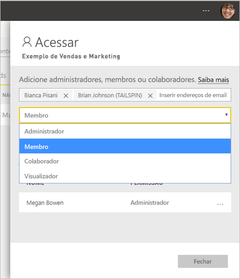
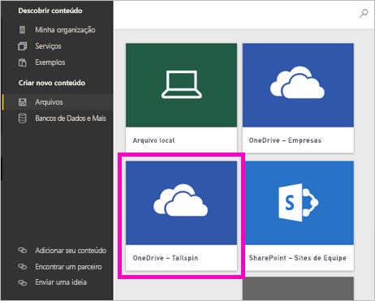
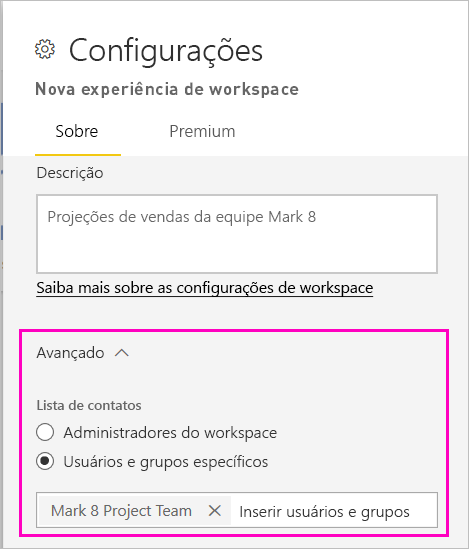

# Criar novos workspaces no Power BI

Este artigo explica como criar um dos *novos workspaces* em vez de um workspace *clássico*. Ambos os tipos de workspaces são locais para colaborar com colegas. Neles, você cria coleções de dashboards, relatórios e relatórios paginados. Se você quiser, também poderá agrupar essa coleção em um *aplicativo* e distribuir para um público mais amplo. Para saber mais, confira o artigo [Novos espaços de trabalho](service-new-workspaces.md).

Pronto para migrar seu workspace clássico? Confira [Atualizar workspaces clássicos para os novos workspaces no Power BI](service-upgrade-workspaces.md) para obter detalhes.

> [!NOTE]
> Para impor a RLS (Segurança em Nível de Linha) para usuários do Power BI Pro que estão navegando pelo conteúdo de um workspace, atribua os usuários à função espectador. Consulte [Funções nos novos workspaces](service-new-workspaces.md#roles-in-the-new-workspaces) para obter uma explicação das diferentes funções.

## Criar um dos novos workspaces

1. Comece criando o workspace. Selecione **Espaços de trabalho** > **Criar espaço de trabalho**.
   
     

2. Você está criando automaticamente um espaço de trabalho atualizado, a menos que opte por **Reverter para clássico**.
   
     
     
     Se você selecionar **Reverter para clássico**, [criará um workspace clássico](service-create-workspaces.md) baseado em um grupo do Microsoft 365.

2. Dê um nome exclusivo ao workspace. Se o nome não estiver disponível, edite-o para criar um exclusivo.
   
     O aplicativo criado no workspace terá o mesmo nome e ícone que o workspace.
   
1. Estes são alguns itens opcionais que você pode definir para seu workspace:

    - Carregue uma **Imagem do espaço de trabalho**. Os arquivos podem estar no formato .png ou .jpg. O tamanho do arquivo deve ser inferior a 45 KB. 
    - [Especifique um OneDrive do Workspace](#set-a-workspace-onedrive) para usar um local de armazenamento de arquivos de grupo do Microsoft 365.    
    - [Adicione uma Lista de contatos](#create-a-contact-list). Por padrão, os administradores do workspace são os contatos. 
    - [Permitir que os colaboradores atualizem o aplicativo](#allow-contributors-to-update-the-app) do workspace
    - Para associar o espaço de trabalho a uma **Capacidade dedicada**, na guia **Premium**, selecione **Capacidade dedicada**.

        

1. Selecione **Salvar**.

    O Power BI cria o workspace e o abre. Ele é exibido na lista de workspaces dos quais você é membro. 

## Conceder acesso ao seu workspace

Qualquer um que tenha função de administrador em um workspace pode fornecer a outras pessoas acesso ao workspace, adicionando-as às diferentes funções. Os criadores de workspaces são administradores automaticamente. Confira [Funções nos novos workspaces](service-new-workspaces.md#roles-in-the-new-workspaces) para obter uma explicação sobre as funções.

1. Como você é um administrador, na página da lista de conteúdo do workspace, verá **Acesso**.

    

1. Adicione grupos de segurança, listas de distribuição, grupos do Microsoft 365 ou indivíduos a esses workspaces como administradores, membros, colaboradores ou visualizadores. 

    

9. Selecione **Adicionar** > **Fechar**.

## Definir um OneDrive do workspace

O recurso OneDrive do workspace permite que você configure um grupo do Microsoft 365 cujo armazenamento de arquivos da Biblioteca de Documentos do SharePoint esteja disponível para usuários do workspace. Cria o grupo fora do Power BI primeiro. 

O Power BI não sincroniza as permissões de usuários ou grupos que estão configurados para ter acesso ao workspace com a associação ao grupo do Microsoft 365. A prática recomendada é dar [acesso ao workspace](#give-access-to-your-workspace) ao mesmo grupo do Microsoft 365 cujo armazenamento de arquivos você define nessa configuração do grupo do Microsoft 365. Em seguida, gerencie o acesso ao workspace gerenciando a associação do grupo do Microsoft 365. 

1. Acesse a nova configuração do **OneDrive do espaço de trabalho** usando uma destas duas maneiras:

    No painel **Criar um espaço de trabalho** ao criá-lo pela primeira vez.

    No painel de navegação, selecione a seta ao lado de **workspaces**, selecione **Mais opções** (...) ao lado do nome do workspace > **Configurações do workspace**. O painel **Configurações** é aberto.

    

2. Em **Avançado** > **OneDrive do Workspace**, digite o nome do grupo do Microsoft 365 que você criou anteriormente. Digite apenas o nome, não a URL. O Power BI seleciona automaticamente o OneDrive para o grupo.

    

3. Selecione **Salvar**.

### Acessar o local do OneDrive do workspace

Depois de configurar a localização do OneDrive, você pode acessá-lo da mesma forma que acessa outras fontes de dados no serviço do Power BI.

1. No painel de navegação, selecione **Obter Dados** e, na caixa **Arquivos**, selecione **Obter**.

    

1.  A entrada **OneDrive – Business** é o seu próprio OneDrive for Business. O segundo OneDrive é aquele que você adicionou.

    

## Criar uma lista de contatos

Você pode especificar quais usuários recebem a notificação sobre problemas que ocorrem no workspace. Por padrão, qualquer usuário ou grupo especificado como um administrador do workspace é notificado, mas você pode adicionar outros à *lista de contatos*. Os usuários ou grupos na lista de contatos serão exibidos na interface do usuário (IU) para ajudar os usuários a obter ajuda relacionada ao workspace.

1. Acesse a nova configuração de **Lista de contatos** usando uma destas duas maneiras:

    No painel **Criar um espaço de trabalho** ao criá-lo pela primeira vez.

    No painel de navegação, selecione a seta ao lado de **workspaces**, selecione **Mais opções** (...) ao lado do nome do workspace > **Configurações do workspace**. O painel **Configurações** é aberto.

    

2. Em **Avançado**, **Lista de contatos**, aceite o padrão, que é **Administradores de workspace**, ou adicione sua própria lista de **Usuários ou grupos específicos**. 

    

3. Clique em **Salvar**.

## Permitir que colaboradores atualizem o aplicativo

A configuração **Permitir que os colaboradores atualizem o aplicativo para este workspace** permite que os Administradores do workspace deleguem aos usuários na função Colaborador a capacidade de atualizar o aplicativo para o workspace. Por padrão, somente Administradores e Membros do workspace podem publicar e atualizar o aplicativo para o workspace. 

1. Para acessar essa configuração, no painel de navegação, selecione a seta ao lado de **Workspaces**, selecione **Mais opções** (...) ao lado do nome do workspace > **Configurações do workspace**. O painel **Configurações** é aberto.

    

2. Em **Avançado**, expanda **Configurações de segurança**. Selecione **Permitir que os colaboradores atualizem o aplicativo deste workspace**. 

Quando essa opção é habilitada, os colaboradores podem:
* Atualizar os metadados do aplicativo, como nome, ícone, descrição, site de suporte e cor
* Adicionar ou remover itens incluídos no aplicativo, como adicionar relatórios ou conjuntos de dados
* Alterar o item padrão ou de navegação do aplicativo no qual o aplicativo é aberto

No entanto, os colaboradores não podem:
* Publicar o aplicativo pela primeira vez
* Alterar quem tem permissão para o aplicativo

## Aplicativos nos novos workspaces

Você pode criar e consumir *aplicativos* nas novas experiências de workspaces, em vez de pacotes de conteúdo. Os aplicativos são coleções de dashboards, relatórios e conjuntos de dados que se conectam a serviços de terceiros e dados organizacionais. Os aplicativos facilitam a obtenção de dados dos serviços, como Microsoft Dynamics CRM, Salesforce e Google Analytics.

Na nova experiência de workspaces, não é possível criar ou consumir pacotes de conteúdo organizacional. Peça para que suas equipes internas forneçam aplicativos para os pacotes de conteúdo que você está usando no momento. 

### Distribuir um aplicativo

Se quiser distribuir conteúdo oficial para um grande público em sua organização, você poderá publicar um *aplicativo* do seu workspace.  Quando o conteúdo estiver pronto, escolha quais dashboards e relatórios você deseja publicar e publique-os como um aplicativo. Você pode criar um aplicativo de cada workspace.

Leia sobre como [publicar um aplicativo nos novos workspaces](service-create-distribute-apps.md).

## Próximas etapas
* Leia sobre [Organizar o trabalho na nova experiência de espaços de trabalho no Power BI](service-new-workspaces.md)
* [Criar espaços de trabalho clássicos](service-create-workspaces.md)
* [Publicar um aplicativo nos novos espaços de trabalho no Power BI](service-create-distribute-apps.md)
* Dúvidas? [Experimente perguntar à Comunidade do Power BI](https://community.powerbi.com/)
