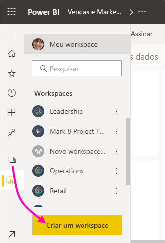
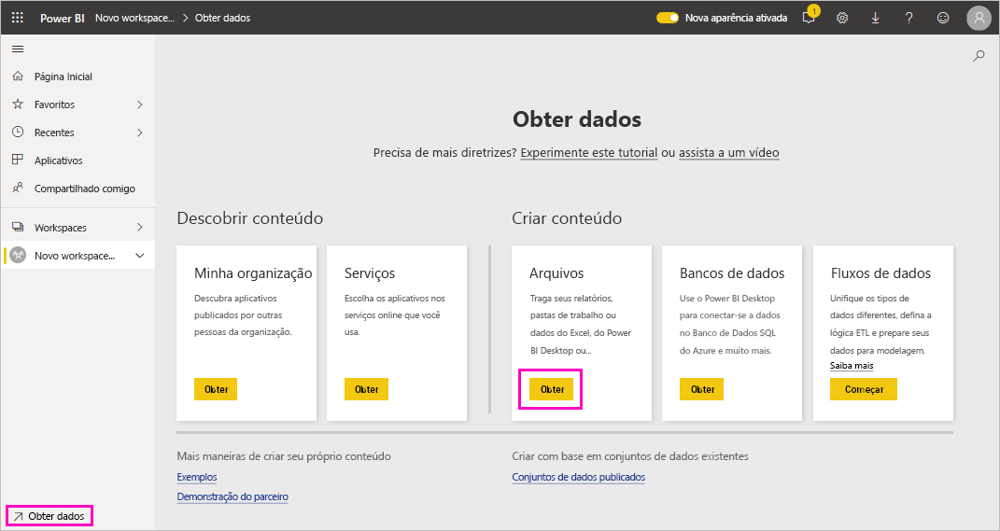

# Criar novos workspaces no Power BI

O Power BI está apresentando uma nova experiência de workspace. Espaços de trabalho ainda são locais para colaborar com colegas para criar coleções de painéis, relatórios (paginados ou não). Depois, você pode agrupar essas coleções em *aplicativos* e distribuí-los para toda a organização ou para pessoas ou grupos específicos.

Confira as mudanças. Nos novos workspaces, é possível:

- Atribuir funções de workspace a grupos de usuários: grupos de segurança, listas de distribuição, grupos do Microsoft 365 e indivíduos.
- Criar um workspace no Power BI sem criar um grupo do Microsoft 365.
- Usar funções de workspaces mais granulares para obter um gerenciamento de permissões mais flexível em um workspace.

Pronto para migrar seu workspace clássico? Confira [Atualizar workspaces clássicos para os novos workspaces no Power BI](service-upgrade-workspaces.md) para obter detalhes.

> [!NOTE]
> Para impor a RLS (Segurança em Nível de Linha) para usuários do Power BI Pro que estão navegando pelo conteúdo de um workspace, atribua os usuários à função espectador.

Para saber mais, confira o artigo [Novos espaços de trabalho](service-new-workspaces.md).

## Criar um dos novos workspaces

1. Comece criando o workspace. Selecione **Espaços de trabalho** > **Criar espaço de trabalho**.
   
     

2. Você está criando automaticamente um espaço de trabalho atualizado, a menos que opte por **Reverter para clássico**.
   
     
     
     Se você selecionar **Reverter para clássico**, criará um [workspace baseado em um Grupo do Microsoft 365](service-create-workspaces.md). 

2. Nomeie o workspace. Se o nome não estiver disponível, edite-o para criar um exclusivo.
   
     O aplicativo do workspace terá o mesmo nome e ícone que o workspace.
   
1. Estes são alguns itens opcionais que você pode definir para seu workspace:

    Carregue uma **Imagem do espaço de trabalho**. Os arquivos podem estar no formato .png ou .jpg. O tamanho do arquivo deve ser inferior a 45 KB.
    
    [Adicione uma **Lista de contatos**](#workspace-contact-list). Por padrão, os administradores do workspace são os contatos. 
    
    [Especifique um **OneDrive para o Workspace**](#workspace-onedrive) digitando apenas o nome de um Grupo do Microsoft 365 existente, não a URL. Agora este workspace pode usar o local de armazenamento de arquivos desse Grupo do Microsoft 365.

    

    Para associar o espaço de trabalho a uma **Capacidade dedicada**, na guia **Premium**, selecione **Capacidade dedicada**.
     
    

1. Selecione **Salvar**.

    O Power BI cria o workspace e o abre. Ele é exibido na lista de workspaces dos quais você é membro. 

## Lista de contatos do workspace

Você pode especificar quais usuários recebem a notificação sobre problemas que ocorrem no workspace. Por padrão, qualquer usuário ou grupo especificado como um administrador do workspace é notificado, mas você pode personalizar a lista adicionando-os à *lista de contatos*. Os usuários ou grupos na lista de contatos serão exibidos na interface do usuário (IU) para ajudar os usuários a obter ajuda relacionada ao workspace.

1. Acesse a nova configuração de **Lista de contatos** usando uma destas duas maneiras:

    No painel **Criar um espaço de trabalho** ao criá-lo pela primeira vez.

    No painel de navegação, selecione a seta ao lado de **workspaces**, selecione **Mais opções** (...) ao lado do nome do workspace > **Configurações do workspace**. O painel **Configurações** é aberto.

    

2. Em **Avançado** > **Lista de contatos**, aceite o padrão, **Administradores de espaço de trabalho** ou adicione sua própria lista de **Usuários ou grupos específicos**. 

    

3. Selecione **Salvar**.

## OneDrive do Workspace

O recurso OneDrive do Workspace permite que você configure um grupo do Microsoft 365 cujo armazenamento de arquivos da Biblioteca de Documentos do SharePoint esteja disponível para usuários do workspace. Cria o grupo fora do Power BI primeiro.

O Power BI não sincroniza as permissões de usuários ou grupos que estão configurados para ter acesso ao workspace com a associação ao grupo do Microsoft 365. A prática recomendada é dar ao mesmo grupo do Microsoft 365, cujo armazenamento de arquivos você define nessa configuração do grupo do Microsoft 365, [acesso ao mesmo workspace](#give-access-to-your-workspace). Em seguida, gerencie o acesso ao workspace gerenciando a associação do grupo do Microsoft 365.

1. Acesse a nova configuração do **OneDrive do espaço de trabalho** usando uma destas duas maneiras:

    No painel **Criar um espaço de trabalho** ao criá-lo pela primeira vez.

    No painel de navegação, selecione a seta ao lado de **workspaces**, selecione **Mais opções** (...) ao lado do nome do workspace > **Configurações do workspace**. O painel **Configurações** é aberto.

    

2. Em **Avançado** > **OneDrive do Workspace**, digite o nome do grupo do Microsoft 365 que você criou anteriormente. O Power BI seleciona automaticamente o OneDrive para o grupo.

    

3. Selecione **Salvar**.

### Acessar o local do OneDrive do workspace

Depois de configurar a localização do OneDrive, você pode acessá-lo da mesma forma que acessa outras fontes de dados no serviço do Power BI.

1. No painel de navegação, selecione **Obter Dados** e, na caixa **Arquivos**, selecione **Obter**.

    

1.  A entrada **OneDrive – Business** é seu próprio OneDrive for Business. O segundo OneDrive é aquele que você adicionou.

    

### Conectar-se aos serviços de terceiros em novos workspaces

Na nova experiência de workspaces, estamos mudando o foco para *aplicativos*. Os aplicativos de serviços de terceiros facilitam para que os usuários obtenham dados dos serviços que usam, como o Microsoft Dynamics CRM, o Salesforce ou o Google Analytics.

Na nova experiência de workspaces, não é possível criar ou consumir pacotes de conteúdo organizacional. Em vez disso, é possível usar os aplicativos fornecidos para conectar-se aos serviços de terceiros ou pedir para suas equipes internas fornecerem aplicativos para quaisquer pacotes de conteúdo que você está usando no momento. 

## Conceder acesso ao seu workspace

1. Na lista de conteúdo do espaço de trabalho, como você é administrador, verá uma nova ação, **Acesso**.

    

1. Adicione grupos de segurança, listas de distribuição, grupos do Microsoft 365 ou indivíduos nesses workspaces como membros, espectadores, colaboradores ou administradores. Consulte [Funções nos novos workspaces](service-new-workspaces.md#roles-in-the-new-workspaces) para obter uma explicação das diferentes funções.

    

9. Selecione **Adicionar** > **Fechar**.

## Distribuir um aplicativo

Se quiser distribuir conteúdo oficial para um grande público em sua organização, você poderá publicar um aplicativo do seu workspace.  Quando o conteúdo estiver pronto, escolha quais dashboards e relatórios você deseja publicar e, em seguida, publique-o como um *aplicativo*. Você pode criar um aplicativo de cada workspace.

Leia sobre [como publicar um aplicativo nos novos espaços de trabalho](service-create-distribute-apps.md)

## Próximas etapas
* Leia sobre [Organizar o trabalho na nova experiência de espaços de trabalho no Power BI](service-new-workspaces.md)
* [Criar espaços de trabalho clássicos](service-create-workspaces.md)
* [Publicar um aplicativo nos novos espaços de trabalho no Power BI](service-create-distribute-apps.md)
* Dúvidas? [Experimente perguntar à Comunidade do Power BI](https://community.powerbi.com/)
