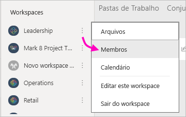
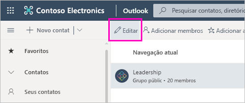
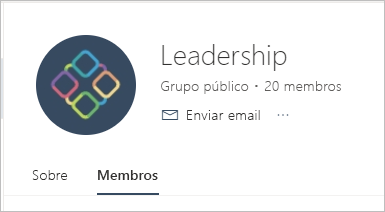

# Criar workspaces clássicos no Power BI

No Power BI, é possível criar *workspaces*, lugares para colaborar com colegas para criar e refinar coleções de dashboards, de relatórios e de relatórios paginados. Em seguida, você pode agrupar a coleção em *aplicativos* que podem ser distribuídos para toda a organização ou para pessoas ou grupos específicos. 

**Você sabia?** O Power BI oferece uma nova experiência de workspace, que agora é a padrão. Leia [Organizar o trabalho em novos workspaces](service-new-workspaces.md) para obter detalhes sobre os novos workspaces. Pronto para migrar seu workspace clássico? Confira [Atualizar workspaces clássicos para os novos workspaces no Power BI](service-upgrade-workspaces.md) para obter detalhes.

Quando você cria um workspace clássico, está criando um grupo associado e subjacente do Microsoft 365. Toda a administração do workspace é feita no Microsoft 365. Você pode adicionar colegas a esses workspaces como membros ou administradores. No workspace, todos podem colaborar em dashboards, relatórios e outros artigos que você planeja distribuir para um público-alvo maior. Todas as pessoas que você adiciona a um workspace precisam de uma licença do Power BI Pro.

## Vídeo: Aplicativos e workspaces
<iframe width="640" height="360" src="https://www.youtube.com/embed/Ey5pyrr7Lk8?showinfo=0" frameborder="0" allowfullscreen></iframe>

## Criar um workspace clássico com base em um grupo do Microsoft 365

Quando você cria um workspace, ele é criado em um grupo do Microsoft 365.

[!INCLUDE [powerbi-service-create-app-workspace](../includes/powerbi-service-create-app-workspace.md)]

Ao criá-lo pela primeira vez, talvez seja necessário aguardar uma hora ou mais para que o workspace seja propagado para o Microsoft 365.

### Adicionar uma imagem ao seu workspace do Microsoft 365 (opcional)
Por padrão, o Power BI cria um pequeno círculo colorido com as iniciais do seu aplicativo. Mas talvez você queira personalizá-lo com uma imagem. Para adicionar uma imagem, você precisa de uma licença do Exchange Online.

1. Selecione **Workspaces**, selecione **Mais opções** (...) ao lado do nome do workspace e, em seguida, **Membros**. 
   
     
   
    A conta do Microsoft 365 Outlook do workspace é aberta em uma nova janela do navegador.
2. Selecione o lápis **Editar**.
   
     
3. Selecione a imagem da câmera e encontre a imagem que quer usar.
   
     

     As imagens podem ser arquivos .png, .jpg ou .bmp. O tamanho do arquivo pode ser grande, de até 3 MB. 

4. Selecione **OK** e, em seguida, **Salvar**.
   
    A imagem substitui o círculo colorido na janela do Microsoft 365 Outlook.
   
     
   
    Em alguns minutos, ela também será exibida no aplicativo do Power BI.

## Adicionar conteúdo ao seu workspace

Após a criação de um workspace, é hora de adicionar conteúdo a ele. É tão simples quanto adicionar conteúdo ao Meu workspace, exceto que outras pessoas também podem ver e trabalhar no workspace. Uma grande diferença é que, quando terminar, você poderá publicar o conteúdo como um aplicativo. Quando você exibe conteúdo na lista de conteúdo de um workspace, o nome do workspace é listado como o proprietário.

### Conectar-se a serviços de terceiros em workspaces

Os aplicativos são fornecidos para todos os serviços de terceiros com os quais o Power BI é compatível, tornando fácil para você obter dados dos serviços usados, como o Microsoft Dynamics CRM, Salesforce ou Google Analytics. É possível publicar aplicativos organizacionais para dar aos seus usuários os dados de que precisam.

Nos workspaces atuais, também é possível conectar usando pacotes de conteúdo organizacional e pacotes de conteúdo de terceiros, como o Microsoft Dynamics CRM, o Salesforce ou o Google Analytics. Considere migrar seus pacotes de conteúdo organizacional para aplicativos.

## Distribuir um aplicativo

Se quiser distribuir conteúdo oficial para um grande público em sua organização, você poderá publicar um aplicativo do seu workspace.  Quando o conteúdo estiver pronto, escolha quais dashboards e relatórios você deseja publicar e, em seguida, publique-o como um *aplicativo*. Você pode criar um aplicativo de cada workspace.

A lista Aplicativos no painel de navegação mostra todos os aplicativos que você instalou. Seus colegas podem obter seu aplicativo de algumas maneiras diferentes. 
- Eles podem encontrar e instalar seus aplicativos no Microsoft AppSource
- Você pode enviar um link direto para eles. 
- Você poderá instalá-lo automaticamente nas contas do Power BI de seus colegas, se o administrador do Power BI lhe der permissão. 

Depois de você publicar uma atualização do seu workspace, Os usuários veem automaticamente o conteúdo atualizado do aplicativo. Você pode controlar com que frequência os dados são atualizados configurando o agendamento de atualização nos conjuntos de dados usados pelo conteúdo do aplicativo no workspace. Consulte [Publicar um aplicativo nos novos workspaces no Power BI](service-create-distribute-apps.md) para obter detalhes.

## Perguntas frequentes de aplicativos clássicos do Power BI

### Qual a diferença entre os aplicativos e os pacotes de conteúdo organizacional?
Os aplicativos são a evolução dos pacotes de conteúdo organizacional. Se você já tem pacotes de conteúdo organizacional, eles continuarão a funcionar lado a lado com os aplicativos. Aplicativos e pacotes de conteúdo têm poucas diferenças importantes. 

* Depois que os usuários corporativos instalam um pacote de conteúdo, ele perde sua identidade agrupada: transforma-se apenas em uma lista de dashboards e relatórios intercalados com outros dashboards e relatórios. Os aplicativos, por outro lado, mantêm o agrupamento e a identidade, mesmo após a instalação. Esse agrupamento facilita o acesso a eles ao longo do tempo para os usuários empresariais.
* Você pode criar vários pacotes de conteúdo de qualquer workspace, mas um aplicativo tem uma relação de 1:1 com seu workspace. 
* Ao longo do tempo, pretendemos descontinuar os pacotes de conteúdo organizacional, portanto, é recomendável que você crie aplicativos de agora em diante.  
* Com a nova experiência de workspace, estamos dando os primeiros passos para preterir os pacotes de conteúdo organizacional. Não é possível consumi-los ou criá-los nos novos workspaces.

Confira [Diferenças entre workspaces novos e clássicos](service-new-workspaces.md#new-and-classic-workspace-differences) para comparar os dois. 

## Próximas etapas
* [Instalar e usar aplicativos no Power BI](service-create-distribute-apps.md)
- [Criar os novos workspaces](service-create-the-new-workspaces.md)
* Dúvidas? [Experimente perguntar à Comunidade do Power BI](https://community.powerbi.com/)
