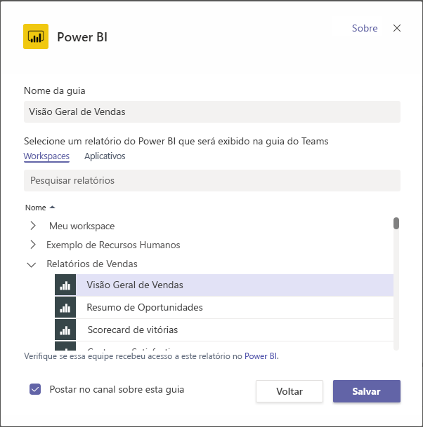
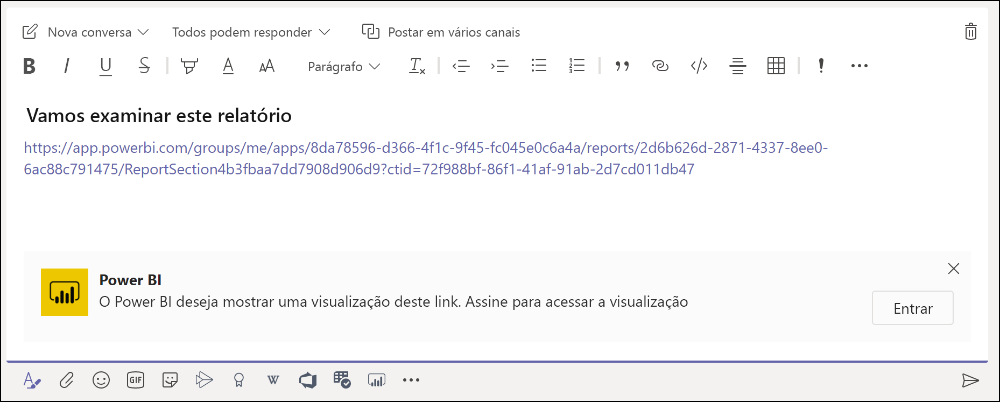
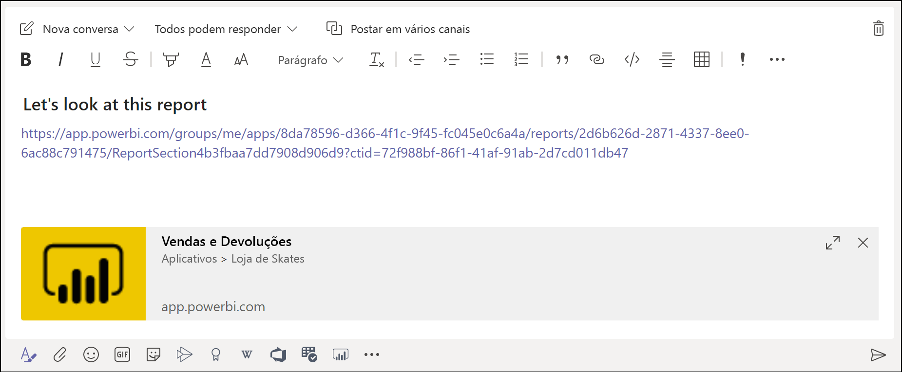
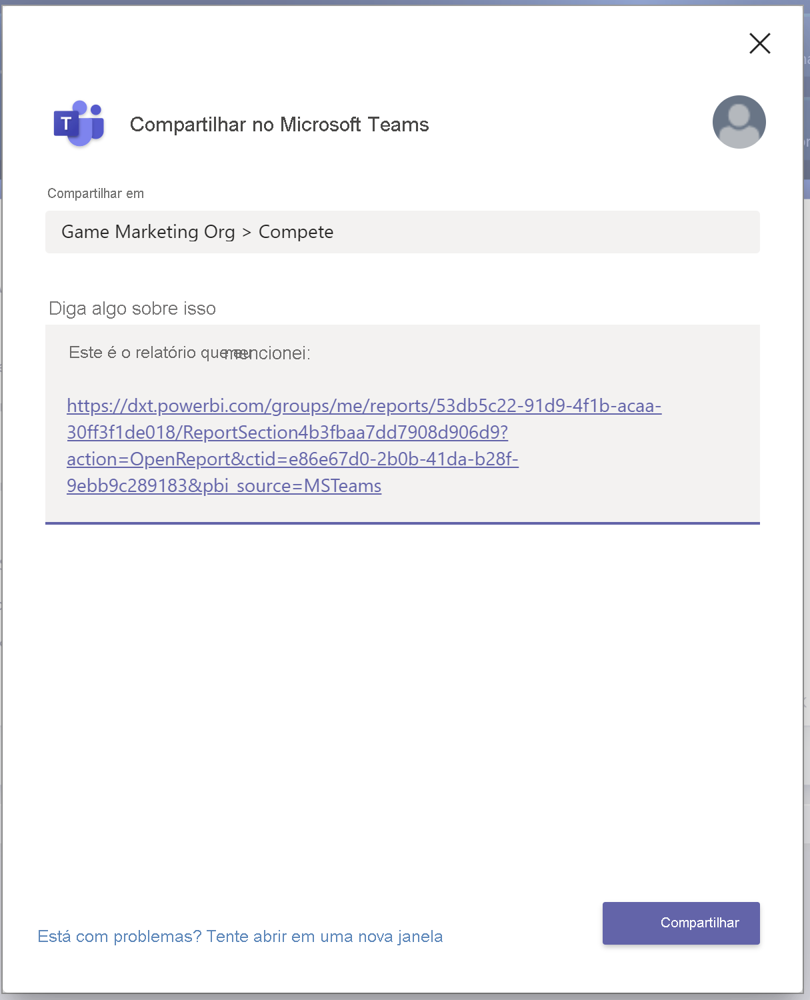
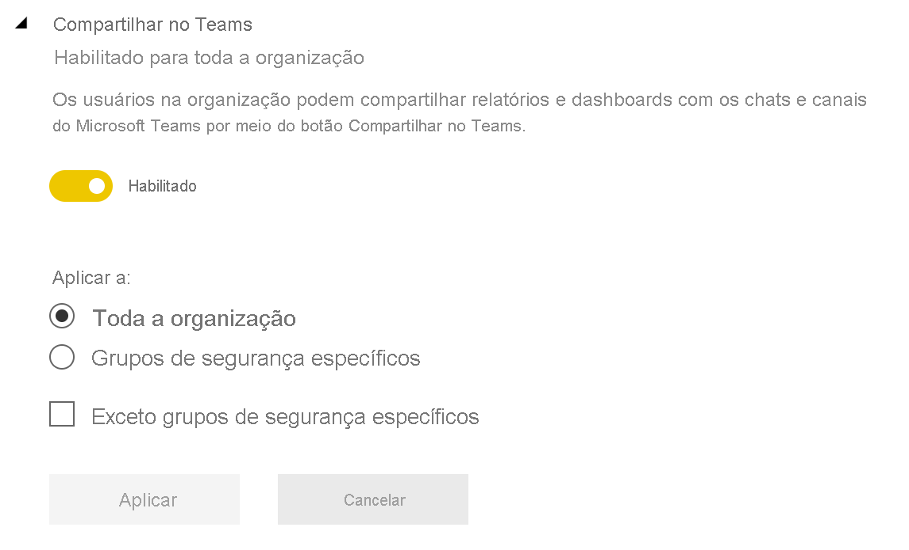

# Colaborar no Microsoft Teams com o Power BI

Com a guia **Power BI** no Microsoft Teams, você pode inserir facilmente relatórios interativos em canais e chats do Microsoft Teams. Use a guia **Power BI** no Microsoft Teams para ajudar seus colegas a encontrar os dados que sua equipe usa e para discutir os dados nos canais da equipe. Quando você cola um link em seus relatórios, dashboards e aplicativos na caixa de mensagem do Microsoft Teams, a visualização do link mostra informações sobre ele. Use os botões **Compartilhar no Teams** para iniciar conversas rapidamente ao exibir relatórios e dashboards no Power BI.

## Requisitos

Para que a guia do **Power BI** no Microsoft Teams funcione, verifique se:

- Os usuários têm uma licença do Power BI Pro ou se o relatório está contido em uma [capacidade do Power BI Premium (SKU P ou EM)](../admin/service-premium-what-is.md) com uma licença do Power BI.
- O Microsoft Teams tem a guia do **Power BI**.
- O usuário entrou no serviço do Power BI para ativar a licença do Power BI a fim de consumir o relatório.
- Para adicionar um relatório ao Microsoft Teams com a guia do **Power BI**, você deve ter pelo menos uma função Espectador no workspace que hospeda o relatório. Para obter informações sobre as diferentes funções, confira [Funções nos novos workspaces](service-new-workspaces.md#roles-in-the-new-workspaces).
- Para ver o relatório na guia do **Power BI** no Microsoft Teams, os usuários devem ter permissão para exibir o relatório.
- Eles devem ser usuários do Microsoft Teams com acesso a canais e chats.

Para que as visualizações de link funcionem, verifique se:

- Os usuários atendem aos requisitos para usar a guia do **Power BI** no Microsoft Teams.
- Os usuários entraram no Power BI.

Para que os botões **Compartilhar no Teams** funcionem, verifique se:

- Os usuários atendem aos requisitos para usar a guia do **Power BI** no Microsoft Teams.
- Os usuários entraram no Power BI.
- Os administradores do Power BI não desabilitaram a configuração de locatário **Compartilhar no Teams**.

## Insira seu relatório

Siga estas etapas para inserir seu relatório em um canal ou um chat do Microsoft Teams.

1. Abra um canal ou chat no Microsoft Teams e selecione o ícone **+** .

    

1. Selecione a guia do **Power BI**.

    

1. Use as opções fornecidas para selecionar um relatório de um workspace ou de um aplicativo do Power BI.

    

1. O nome da guia é atualizado automaticamente para corresponder ao nome do nome do relatório, mas você pode alterá-lo.

1. Selecione **Salvar**.

## Relatórios compatíveis para inserção da guia do Power BI

Você pode inserir os seguintes tipos de relatórios na guia do **Power BI**:

- Relatórios interativos e paginados.
- Relatórios em **Meu workspace**, novas experiências de workspace e workspaces clássicos.
- Relatórios em aplicativos do Power BI.

## Obter uma visualização de link

Siga estas etapas para obter uma visualização de link para o conteúdo no serviço do Power BI.

1. Copie um link para um relatório, um dashboard ou um aplicativo no serviço do Power BI. Por exemplo, copie o link da barra de endereços do navegador.

1. Cole o link na caixa de mensagem do Microsoft Teams. Entre no serviço de visualização de link, se solicitado. Talvez seja necessário aguardar alguns segundos para que a visualização do link seja carregada.

    

1. A visualização de link básica é exibida após a entrada bem-sucedida.

    

1. Selecione o ícone de **Expandir** para mostrar o cartão de visualização avançada.

    

1. O cartão de visualização de link avançada mostra o link e os botões de ação relevantes.

    

1. Envie a mensagem.

## Botões Compartilhar no Teams no serviço do Power BI

Siga estas etapas para compartilhar links nos canais e chats do Microsoft Teams ao exibir relatórios ou dashboards no serviço do Power BI.

1. Use os botões **Compartilhar no Teams** na barra de ações ou no menu contextual em um visual específico.

   * Botão **Compartilhar no Teams** na barra de ações:

       
    
   * Botão **Compartilhar no Teams** no menu de contexto visual:
    
      

1. Na caixa de diálogo **Compartilhar no Microsoft Teams**, selecione o canal ou as pessoas para os quais você quer enviar o link. Insira uma mensagem, se desejar. Você pode ser solicitado a entrar no Microsoft Teams primeiro.

    

1. Selecione **Compartilhar** para enviar o link.
    
1. O link é adicionado a conversas existentes ou inicia um novo chat.

    

1. Selecione o link para abrir o item no serviço do Power BI.

1. Se você tiver usado o menu contextual para um visual específico, o visual será realçado quando o relatório for aberto.

    
    

## Conceder acesso aos relatórios

A inserção de um relatório no Microsoft Teams ou o envio de um link a um item não concede automaticamente aos usuários permissão para ver o relatório. Você precisa [permitir que os usuários exibam o relatório no Power BI](service-share-dashboards.md). Para facilitar, você pode usar um Grupo do Microsoft 365 para sua equipe.

> [!IMPORTANT]
> Certifique-se de examinar quem pode ver o relatório dentro do serviço do Power BI e de conceder acesso aos que não aparecem na lista.

Uma forma de garantir que todos em uma equipe tenham acesso aos relatórios é colocá-los em um único workspace e dar à equipe acesso ao Grupo do Microsoft 365.

## Visualizações de link

As visualizações de link são fornecidas para os seguintes itens no Power BI:
- Relatórios
- Dashboards
- Aplicativos

O serviço de visualização de link exige a entrada dos usuários. Para sair, selecione o ícone do **Power BI** na parte inferior da caixa de mensagem. Em seguida, selecione **Sair**.

## Iniciar uma conversa

Quando você adiciona uma guia de relatório do Power BI ao Microsoft Teams, o Teams cria automaticamente uma conversa de guia para o relatório.

- Selecione o ícone **Mostrar conversa de guia** no canto superior direito.

    

    O primeiro comentário é um link para o relatório. Todos no canal do Microsoft Teams podem ver e discutir o relatório na conversa.

    
    
## Configuração de locatário Compartilhar no Teams

A configuração de locatário **Compartilhar no Teams** no portal de administração do Power BI permite que as organizações ocultem os botões **Compartilhar no Teams**. Quando definidos como desabilitados, os botões **Compartilhar no Teams** não são vistos pelos usuários na barra de ações ou nos menus de contexto quando eles exibem relatórios e dashboards no serviço do Power BI.

## Limitações e problemas conhecidos

- O Power BI não dá suporte aos mesmos idiomas localizados que o Microsoft Teams. Como resultado, talvez você não veja uma localização adequada dentro do relatório inserido.
- Os dashboards do Power BI não podem ser inseridos na guia do **Power BI** do Microsoft Teams.
- Os usuários sem uma licença ou permissão do Power BI para acessar o relatório veem a mensagem "O conteúdo não está disponível".
- Você poderá ter problemas se usar o Internet Explorer 10. <!--You can look at the [browsers support for Power BI](../consumer/end-user-browsers.md) and for [Microsoft 365](https://products.office.com/office-system-requirements#Browsers-section). -->
- Não há suporte para os [filtros de URL](service-url-filters.md) na guia **Power BI** para o Microsoft Teams.
- Em nuvens nacionais, a nova guia do **Power BI** não está disponível. Pode estar disponível uma versão mais antiga que não dá suporte à nova experiência de workspace nem a relatórios em aplicativos do Power BI.
- Depois de salvar a guia, você não poderá alterar o nome da guia por meio das configurações dela. Use a opção **Renomear** para alterá-lo.
- Não há suporte para logon único no serviço de visualização de link.
- As visualizações de link não funcionam em chat de reuniões ou canais privados.
- Os botões **Compartilhar no Teams** poderão não funcionar se o seu navegador usar configurações de privacidade estritas. Use a opção **Está com problemas? Tente abrir em uma nova janela** se a caixa de diálogo não abrir corretamente.
- O **Compartilhar no Teams** não inclui uma visualização de link.
- As visualizações de link e o **Compartilhar no Teams** não dão aos usuários permissões para exibir o item. As permissões devem ser gerenciadas separadamente.
- O botão **Compartilhar no Teams** não está disponível em menus de contexto visual quando um autor de relatório define a opção **Mais** para *Desativada* no visual.

## Próximas etapas

- [Compartilhar um painel com seus colegas e com outras pessoas](service-share-dashboards.md)
- [Criar e distribuir um aplicativo no Power BI](service-create-distribute-apps.md)
- [O que é o Power BI Premium?](../admin/service-premium-what-is.md)

Mais perguntas? [Experimente perguntar à Comunidade do Power BI](https://community.powerbi.com/).
