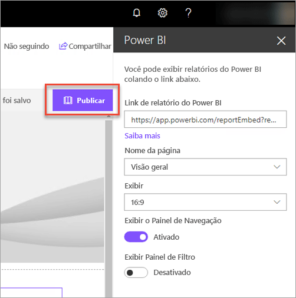
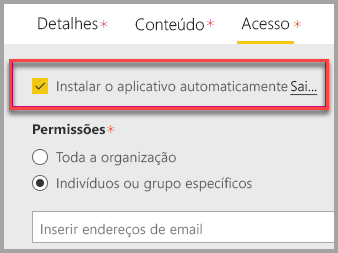
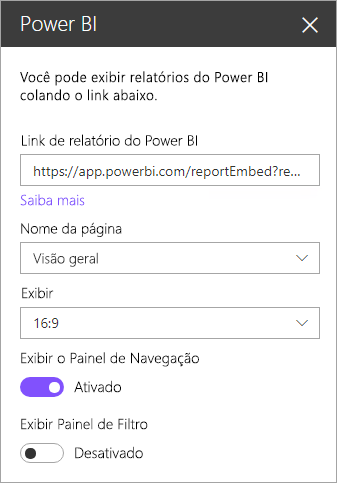

# Inserir uma web part de relatório no SharePoint Online

Com a nova Web Part de Relatório do Power BI para o SharePoint Online, você pode facilmente inserir relatórios interativos do Power BI às páginas do SharePoint Online.

Ao usar a nova opção **Inserir no SharePoint Online**, os relatórios inseridos respeitam todas as permissões de item e a segurança de dados por meio da [segurança em nível de linha (RLS)](../admin/service-admin-rls.md), para que você possa criar facilmente portais internos seguros.

## Requisitos

Para que os relatórios da opção **Inserir no SharePoint Online** funcionem, é necessário ter o seguinte:

* Uma licença do Power BI Pro ou uma [capacidade do Power BI Premium (EM ou SKU P)](../admin/service-premium-what-is.md) com uma licença do Power BI.
* A web part do Power BI para o SharePoint Online requer [Páginas Modernas](https://support.office.com/article/Allow-or-prevent-creation-of-modern-site-pages-by-end-users-c41d9cc8-c5c0-46b4-8b87-ea66abc6e63b).
* Para consumir um relatório inserido, os usuários precisam entrar no serviço do Power BI para ativar sua licença do Power BI.

> [!Note]
> Para organizações nas nuvens nacionais do Power BI, não há licença gratuita. Nesse ambiente, todos os usuários que desejam acessar o relatório inserido no SharePoint precisam ter uma licença do Power BI Pro.

## Insira seu relatório
Para inserir seu relatório no SharePoint Online, é necessário obter a URL de relatório e usá-la com a web part do Power BI no SharePoint Online.

### Obter uma URL de relatório

1. No Power BI, veja o relatório.

2. No menu suspenso **Mais opções (...)** , selecione **Inserir** > **SharePoint Online**.

    

3. Copie a URL de relatório da caixa de diálogo.

    

### Adicionar o relatório do Power BI a uma página do SharePoint Online

1. Abra a página de destino no SharePoint Online e selecione **Editar**.

    

    Ou, no Sharepoint Online, selecione **+ Novo** para criar uma página do site moderna.

    

2. Selecione a lista suspensa **+** e a web part do **Power BI**.

    

3. Selecione **Adicionar relatório**.

      

4. Cole a URL de relatório copiada anteriormente no painel do **link de relatório do Power BI**. O relatório é carregado automaticamente.

    

5. Selecione **Publicar** para tornar a alteração visível para os usuários do SharePoint Online.

    

## Conceder acesso aos relatórios

Inserir um relatório no SharePoint Online não concede automaticamente aos usuários permissão para exibir o relatório – é necessário definir as permissões de exibição no Power BI.

> [!IMPORTANT]
> Certifique-se de examinar quem pode ver o relatório dentro do serviço do Power BI e de conceder acesso aos que não aparecem na lista.

Há duas maneiras de conceder acesso ao relatório no Power BI. A primeira maneira, se você estiver usando um grupo do Microsoft 365 para criar seu site de equipe do SharePoint Online, será listar o usuário como membro do **workspace no serviço do Power BI** e da **página do SharePoint**. Para obter mais informações, consulte como [gerenciar um workspace](service-manage-app-workspace-in-power-bi-and-office-365.md).

A segunda maneira é inserir um relatório dentro de um aplicativo e compartilhá-lo diretamente com os usuários:  

1. O autor, que deve ser um usuário Pro, cria um relatório em um workspace. Para compartilhar com *usuários gratuitos do Power BI*, o workspace precisa ser definido como um *workspace Premium*.

2. O autor publica o aplicativo e instala-o. O autor precisa instalar o aplicativo para que ele tenha acesso à URL do relatório usada para inserção no SharePoint Online.

3. Agora todos os usuários finais também precisam instalar o aplicativo. Também é possível usar o recurso **Instalar aplicativo automaticamente**, que pode ser habilitado no [portal de administração do Power BI](../admin/service-admin-portal.md), para ter o aplicativo pré-instalado para usuários finais.

   

4. O autor abre o aplicativo e vai para o relatório.

5. O autor copia a URL do relatório de inserção do relatório instalado pelo aplicativo. Não use a URL do relatório original do workspace.

6. Crie um novo site de equipe no SharePoint Online.

7. Adicione a URL do relatório copiada anteriormente à web part do Power BI.

8. Adicione todos os usuários finais e/ou grupos que consumirão os dados na página do SharePoint Online e no aplicativo do Power BI que você criou.

    > [!NOTE]
    > **Os usuários ou grupos precisam acessar a página do SharePoint Online e o relatório no aplicativo do Power BI para ver o relatório na página do SharePoint.**

Agora o usuário final pode ir para o site de equipe no SharePoint Online e exibir os relatórios na página.

## Autenticação multifator

Se o ambiente do Power BI exigir que você entre usando a autenticação multifator, talvez será necessário entrar com um dispositivo de segurança para verificar sua identidade. Isso ocorrerá se você não tiver entrado no SharePoint Online usando a autenticação multifator, mas o ambiente do Power BI requerer um dispositivo de segurança para validar uma conta.

> [!NOTE]
> O Power BI ainda não dá suporte à autenticação multifator com o Azure Active Directory 2.0 – os usuários verão uma mensagem de erro. Se o usuário entrar novamente no SharePoint Online usando o dispositivo de segurança, o relatório poderá ser exibido.

## Configurações de Web Part

Veja abaixo as configurações que podem ser ajustadas para a web part do Power BI para o SharePoint Online.

| Property | Descrição |
| --- | --- |
| Nome da página |Define a página padrão da web part. Selecione um valor na lista suspensa. Se nenhuma página for exibida, o relatório terá uma página ou a URL que você colou conterá um nome de página. Remover a seção de relatório da URL para selecionar uma página específica. |
| Exibir |Ajusta a maneira como o relatório se ajusta à página do SharePoint Online. |
| Mostrar Painel de Navegação |Exibe ou oculta o painel de navegação da página. |
| Exibir Painel de Filtro |Exibe ou oculta o painel de filtro. |

## Relatórios que não são carregados

Se seu relatório não for carregado dentro da web part do Power BI, você poderá ver a mensagem a seguir:

Há duas razões comuns para essa mensagem.

1. Você não tem acesso ao relatório.
2. O relatório foi excluído.

Contate o proprietário da página do SharePoint Online para ajudar a resolver o problema.

## Licenças

Os usuários que exibem um relatório no SharePoint precisam de uma **licença do Power BI Pro** ou o conteúdo precisa estar em um workspace que esteja em uma capacidade do **[Power BI Premium (SKU EM ou P)](../admin/service-admin-premium-purchase.md)** .

## Limitações e problemas conhecidos

* Erro: "Ocorreu um erro, tente sair, entrar outra vez e visitar esta página novamente. ID da correlação: indefinido, status de resposta http: 400, código de erro do servidor 10001, mensagem: Atualização de token ausente"
  
  Se você receber esse erro, tente uma das etapas de solução de problemas abaixo.
  
  1. Saia do SharePoint e entre novamente. Certifique-se de fechar todas as janelas do navegador antes de entrar novamente.

  2. Se sua conta de usuário exigir a MFA (autenticação multifator), entre no SharePoint usando seu dispositivo MFA (aplicativo de celular, cartão inteligente etc.).
  
  3. Contas de Usuários convidados B2B do Azure não são compatíveis. Os usuários veem o logotipo do Power BI que mostra a parte que está sendo carregada, mas o relatório não é mostrado.

* O Power BI não dá suporte aos mesmos idiomas localizados que o SharePoint Online. Como resultado, você não verá a localização correta no relatório inserido.

* Você pode encontrar problemas se usar o Internet Explorer 10. <!--You can look at the [browsers support for Power BI](../consumer/end-user-browsers.md) and for [Microsoft 365](https://products.office.com/office-system-requirements#Browsers-section). -->

* A Web part do Power BI não está disponível para [nuvens nacionais](https://powerbi.microsoft.com/clouds/).

* O servidor clássico do SharePoint não é compatível com essa web part.

* [Filtros de URL](service-url-filters.md) não são compatíveis com a Web part do SPO.

## Próximas etapas

* [Permitir ou impedir a criação de páginas de sites modernas pelos usuários finais](https://support.office.com/article/Allow-or-prevent-creation-of-modern-site-pages-by-end-users-c41d9cc8-c5c0-46b4-8b87-ea66abc6e63b)  
* [Criar e distribuir um aplicativo no Power BI](service-create-distribute-apps.md)  
* [Compartilhar um painel com seus colegas e com outras pessoas](service-share-dashboards.md)  
* [O que é o Power BI Premium?](../admin/service-premium-what-is.md)
* [Inserir o relatório em um site ou portal seguro](service-embed-secure.md)

Mais perguntas? [Experimente perguntar à Comunidade do Power BI](https://community.powerbi.com/)
