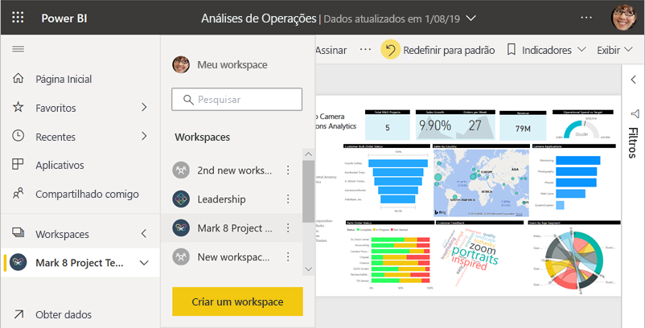
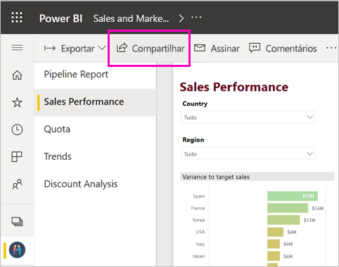
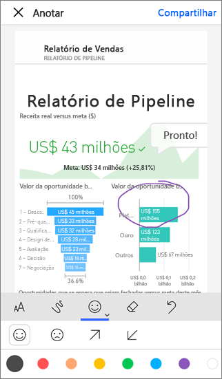
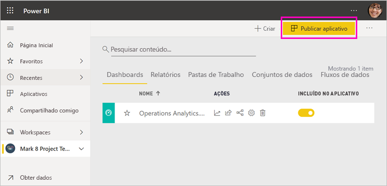
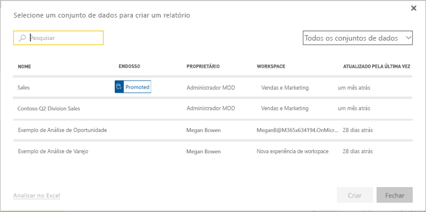

# Maneiras de colaborar e compartilhar no Power BI

Você criou painéis e relatórios. Talvez você queira colaborar neles com seus colegas. Ou talvez você esteja pronto para distribuí-los mais amplamente. Qual é a melhor maneira de colaborar e compartilhá-los? Neste artigo, comparamos suas opções.

*Aplicativos de serviço do Power BI*

**Colaborar**

- Colabore com colegas de trabalho nos *workspaces* para criar relatórios e dashboards significativos.
- Colabore no *Microsoft Teams*.

**Distribuir ou compartilhar dashboards e relatórios**

- *Compartilhe dashboards ou relatórios* de Meu Workspace ou de outro workspace.
- Anote e compartilhe dos *aplicativos móveis* do Power BI.
- Agrupe os dashboards e relatórios nos workspaces em *aplicativos* e distribua-os para um grupo maior ou para toda a organização.
- Insira relatórios em *portais seguros* ou *sites públicos*.
- Imprima relatórios.
- Criar um *aplicativo de modelo* que você possa distribuir a usuários externos do Power BI por meio do Microsoft AppSource.
 
**Compartilhar dados**

- Crie *conjuntos de dados compartilhados* que os colegas de trabalho possam usar como base para seus próprios relatórios, em seus próprios workspaces.
- Crie *fluxos de dados* como uma maneira de compartilhar uma fonte de dados comum.

Não importa qual opção você escolher, para compartilhar seu conteúdo você precisa de uma [licença do Power BI Pro](../fundamentals/service-features-license-type.md) ou então o conteúdo precisa estar em uma [capacidade Premium](../admin/service-premium-what-is.md). Os requisitos de licença variam para os colegas que exibem o conteúdo que você compartilha, dependendo da opção escolhida. As seções a seguir apresentam mais detalhes. 

## Colaborar em um workspace

Quando as equipes trabalham juntas, elas precisam de acesso aos mesmos documentos para que possam colaborar rapidamente. Nos workspaces do Power BI, as equipes compartilham a propriedade e o gerenciamento de dashboards, relatórios, conjuntos de dados e pastas de trabalho. Às vezes, os usuários do Power BI organizam seus workspaces com base em estruturas organizacionais; ou eles os criam para projetos específicos. Ainda assim, outras organizações usam vários workspaces para armazenar versões diferentes de relatórios ou de dashboards que elas usam. 

Os workspaces fornecem funções que determinam quais permissões seus colegas de trabalho têm. Use essas funções para determinar quem pode gerenciar o workspace, editar ou distribuir conteúdo ou apenas exibir conteúdo. Leia mais sobre as [funções nos novos workspaces](service-new-workspaces.md#roles-in-the-new-workspaces).

Workspaces são melhores para colaboração do que o Meu Workspace, porque eles permitem a propriedade conjunta do conteúdo. Você e toda a sua equipe podem fazer atualizações facilmente ou conceder acesso aos outros. O Meu workspace é mais bem usado por indivíduos para conteúdo pessoal ou pontual.

Agora imagine que você tem um dashboard concluído que precisa compartilhar com seus colegas. Qual é a melhor maneira de conceder acesso ao dashboard a eles? A resposta depende de vários fatores. 

- Se os colegas precisarem manter o dashboard atualizado ou precisarem de acesso a todo o conteúdo do workspace, adicione-os ao workspace como Membros ou Colaboradores. 
- Se os colegas precisarem apenas exibir o conteúdo no workspace, adicione-os como Espectadores.
- Se os colegas precisarem apenas ver esse dashboard, e não todo o conteúdo do workspace, você poderá compartilhar o dashboard diretamente com eles.
- Se o dashboard fizer parte de um conjunto de dashboards e relatórios que você precisa distribuir para muitos colegas, a publicação de um *aplicativo* provavelmente será a melhor opção.

Leia sobre como [criar os workspaces](service-create-the-new-workspaces.md). 

## Colaborar no Microsoft Teams

Aumente a colaboração controlada por dados em sua organização inserindo seus relatórios do Power BI e relatórios paginados do Power BI no Microsoft Teams. O serviço do Power BI tem um botão **Compartilhar no Teams** para relatórios. Você pode adicionar guias separadas do Power BI para cada relatório individual e dar a cada guia o nome do relatório ou qualquer outro nome. 

Quando você adiciona uma guia de relatório do Power BI ao Microsoft Teams, o Teams cria automaticamente uma conversa de guia para o relatório. Todos nesse canal do Microsoft Teams podem ver e discutir o relatório na conversa. 

:::image type="content" source="media/service-how-to-collaborate-distribute-dashboards-reports/power-bi-teams-conversation-tab.png" alt-text="Guia de conversa do Microsoft Teams":::

Leia mais sobre como [colaborar no Microsoft Teams com o Power BI](service-collaborate-microsoft-teams.md).

## Compartilhar dashboards e relatórios

Digamos que você finalizou um relatório no Power BI Desktop e deseja que outras pessoas tenham acesso a ele. Uma maneira de fazer isso é *compartilhá-lo* no serviço do Power BI. Você pode publicá-lo no Meu Workspace ou em um outro workspace. Talvez você crie um dashboard para ir com ele, e pronto.

Você precisa de uma licença do Power BI Pro para compartilhar seu conteúdo. As pessoas com quem você o compartilha também precisam, ou o conteúdo tem que estar em um workspace em uma [capacidade Premium](../admin/service-premium-what-is.md). Quando você compartilha um dashboard ou relatório, os destinatários podem exibi-lo e interagir com ele. Se você conceder permissão, eles poderão editá-lo, fazer uma cópia e compartilhá-lo com colegas de trabalho. Eles veem os mesmos dados que você no dashboard ou relatório. Eles têm acesso a todos os dados do conjunto subjacente, a menos que a [RLS (Segurança em Nível de Linha)](../admin/service-admin-rls.md) esteja aplicada.

Você também pode compartilhar com pessoas de fora da sua organização. Elas também podem exibir o dashboard ou relatório ou interagir com ele também, mas não podem compartilhá-lo. 

Leia mais sobre como [compartilhar dashboards e relatórios](service-share-dashboards.md) no serviço do Power BI. Ou leia sobre como adicionar um filtro em um link e [compartilhar uma exibição filtrada do relatório](service-share-reports.md).

## Anotar e compartilhar dos aplicativos móveis do Power BI

Nos aplicativos móveis do Power BI para dispositivos iOS e Android, você pode fazer anotações em um bloco, relatório ou visual e, em seguida, compartilhar isso com qualquer pessoa por email.

Você está compartilhando um instantâneo do bloco, do relatório ou do visual. Os destinatários veem exatamente como ele era quando você enviou o email. O email também contém um link para o dashboard ou relatório. Se eles tiverem uma licença do Power BI Pro ou se o conteúdo estiver em uma [capacidade Premium](../admin/service-premium-what-is.md) e você já tiver compartilhado o conteúdo com eles, eles poderão abri-lo. Você pode enviar instantâneos de blocos para qualquer pessoa, não apenas para seus colegas, no mesmo domínio de email.

Leia mais sobre [anotação e compartilhamento de blocos, relatórios e visuais](../consumer/mobile/mobile-annotate-and-share-a-tile-from-the-mobile-apps.md) nos aplicativos móveis do iOS e Android.

Também é possível [compartilhar o instantâneo de um bloco](../consumer/mobile/mobile-windows-10-phone-app-get-started.md) no aplicativo do Power BI para dispositivos Windows 10, mas não anotá-lo.

## Distribuir insights em um aplicativo

Digamos que você deseja distribuir o dashboard para um público-alvo amplo da sua organização. Você e seus colegas criaram um *workspace* e, em seguida, criaram e refinaram dashboards, relatórios e conjuntos de dados no workspace. Agora, você seleciona os dashboards e relatórios e os publica como um *aplicativo*, em um grupo ou em toda a sua organização.

Os aplicativos são fáceis de descobrir e instalar no serviço do Power BI ([https://app.powerbi.com](https://app.powerbi.com)). Você pode enviar aos usuários corporativos um link direto para o aplicativo ou eles podem pesquisar por ele no AppSource. Se o administrador do Power BI der permissão, você poderá instalar um aplicativo automaticamente em contas do Power BI de seus colegas de trabalho. Leia sobre como [publicar um aplicativo](service-create-distribute-apps.md).

Após instalarem o aplicativo, eles poderão vê-lo no navegador ou dispositivo móvel.

Para que seus usuários exibam seu aplicativo, eles precisam da licença do Power BI Pro ou o aplicativo precisa ser armazenado em uma capacidade do Power BI Premium. Leia [O que é o Power BI Premium?](../admin/service-premium-what-is.md) para obter detalhes.

É possível publicar aplicativos para as pessoas que estão fora de sua organização também. Eles podem ver e interagir com o conteúdo do aplicativo, mas não podem compartilhá-lo com outras pessoas. Agora, você pode criar *aplicativos de modelo* e implantá-los para qualquer cliente do Power BI.

## Inserir relatórios em portais seguros ou sites públicos

### Inserir em portais seguros

Você pode inserir relatórios do Power BI em portais ou sites em que os usuários esperam vê-los.  
Com as opções **Inserir no SharePoint Online** e **Inserção** no serviço do Power BI, você pode inserir relatórios com segurança para seus usuários internos. Qualquer que seja a opção escolhida, o Power BI aplicará todas as permissões e a segurança de dados antes que os usuários vejam o conteúdo. A pessoa que está exibindo o relatório precisa da licença apropriada.  

- A opção **Inserir no SharePoint Online** funciona com a web part do Power BI para o SharePoint Online. Ela fornece uma experiência de logon único com controle de como o relatório é inserido. Leia mais sobre a [Inserção no SharePoint Online](service-embed-report-spo.md).
- A opção **Inserção** funciona com qualquer portal ou site compatível com a inserção de conteúdo usando uma URL ou um iFrame. Leia mais sobre a opção [Inserção](service-embed-secure.md).

### Publicar em sites públicos

Com a opção **Publicar na Web**, você pode publicar relatórios do Power BI em toda a Internet inserindo visualizações em postagens em blog, sites, mídia social e outras comunicações online. Qualquer pessoa na Internet pode ver seus relatórios, e você não tem controle sobre quem pode ver o que você publicou. Eles não precisam de uma licença do Power BI. A publicação na Web só está disponível para relatórios que você pode editar. Você não pode publicar relatórios na Web se eles são compartilhados com você ou se estiverem em um aplicativo. Leia sobre como [publicar na web](service-publish-to-web.md).

>[!Warning]
>Use [Publicar na Web](service-publish-to-web.md) apenas para compartilhar o conteúdo publicamente, não internamente.

## Imprimir ou salvar como PDF ou outro arquivo estático

No serviço do Power BI, você pode imprimir, salvar como PDF ou salvar como outro formato de arquivo estático qualquer um destes itens:

- Um dashboard inteiro
- Um bloco do dashboard
- Uma página de relatório
- Um relatório paginado
- Uma visualização do serviço do Power BI. 

Você só pode imprimir uma página dos relatórios do Power BI por vez. Não é possível imprimir o relatório inteiro de uma vez. Leia sobre como [imprimir ou salvar um relatório ou dashboard como um arquivo estático](../consumer/end-user-print.md).

Os relatórios paginados, por outro lado, são criados para serem impressos. Leia uma [comparação dos relatórios do Power BI e paginados](../paginated-reports/paginated-reports-report-builder-power-bi.md#compare-power-bi-reports-and-paginated-reports) para obter mais detalhes. 

## Criar e implantar aplicativos de modelo

Os *aplicativos de modelo* são projetados para serem distribuídos publicamente, geralmente no Microsoft AppSource. Você cria um aplicativo e com pouco ou quase nenhum código, você pode implantá-lo para qualquer cliente do Power BI. Os clientes se conectam em seus próprios dados e criam instâncias de suas próprias contas. Leia mais sobre [aplicativos de modelo do Power BI](../connect-data/service-template-apps-overview.md).

## Compartilhar um conjunto de dados

Sejamos francos, algumas pessoas têm maior habilidade na criação de modelos de dados bem projetado de alta qualidade em seus relatórios. Talvez você seja essa pessoa. Toda a organização pode se beneficiar do uso dos mesmos modelos de dados bem projetados. Os *conjuntos de dados compartilhados* preenchem essa função. Quando você cria um relatório com um modelo de dados que todos devem usar, você pode salvar o relatório no serviço do Power BI e dar às pessoas certas a permissão para usá-lo. Em seguida, eles podem criar relatórios com base no seu conjunto de dados. Dessa forma, todas as pessoas baseiam os relatórios nos mesmos dados, observando a mesma "versão da verdade".

Leia mais sobre [criação e uso de conjuntos de dados compartilhados](../connect-data/service-datasets-across-workspaces.md).

## Criar fluxos de dados

Os *fluxos de dados* são uma maneira de autoatendimento para unificar dados de fontes diferentes e prepará-los para serem modelados. Os analistas criam fluxos de entrada para ingerir, transformar, integrar e enriquecer Big Data. Eles criam e gerenciam fluxos de trabalho em workspaces no serviço do Power BI. Leia sobre [preparação de dados de autoatendimento com fluxos de dados](../transform-model/service-dataflows-overview.md).

## Considerações e limitações

- Não é possível compartilhar relatórios do Servidor de Relatórios do Power BI. Em vez disso, você pode criar [assinaturas para si mesmo ou para outras pessoas](/sql/reporting-services/working-with-subscriptions-web-portal).

## Próximas etapas

- [Compartilhar dashboards com colegas e outras pessoas](service-share-dashboards.md)
- [Criar e publicar um aplicativo no Power BI](service-create-distribute-apps.md)
- [Inserir o relatório em um site ou portal seguro](service-embed-secure.md)

Tem comentários? Vá para o [site da comunidade do Power BI](https://community.powerbi.com/) para fazer sugestões.

Mais perguntas? [Experimente a Comunidade do Power BI](https://community.powerbi.com/)
