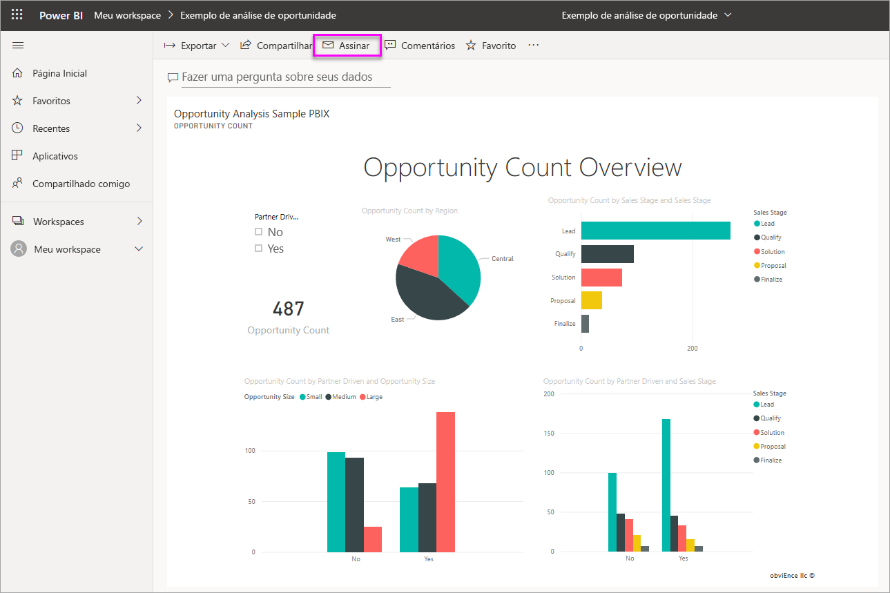
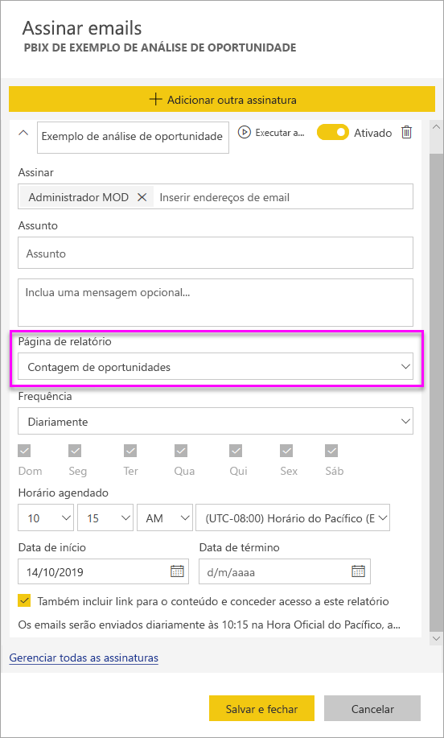
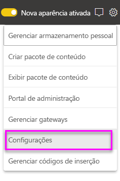
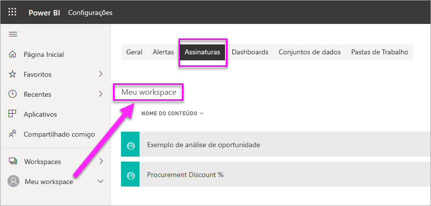

# Obtenha uma assinatura para você e outras pessoas de relatórios e dashboards no serviço do Power BI

É possível obter uma assinatura para si mesmo e para seus colegas das páginas de relatório, de dashboards e de relatórios paginados que são mais importantes para você. As assinaturas de email do Power BI permitem que você:

- Decida a frequência com que deseja receber os emails: diária, semanal, por hora, mensal ou uma vez ao dia após a atualização inicial dos dados.
- Escolha a hora em que deseja receber o email se você escolher uma frequência diária, semanal, por hora ou mensal.
- Configure 24 assinaturas diferentes por relatório ou dashboard do Power BI.  Não há nenhum limite no número de assinaturas que podem ser configuradas para os relatórios paginados.
- Envie um email com uma imagem do relatório e vincule-o ao relatório no serviço.  Em dispositivos móveis com aplicativos do Power BI instalados, a seleção desse link iniciará o aplicativo do Power BI em vez de abrir o relatório ou o dashboard no site do Power BI.
- Inclua um anexo do relatório completo se estiver assinando um relatório paginado.
- Envie um email aos usuários fora do seu locatário se o conteúdo do Power BI estiver hospedado em uma capacidade Premium.  Os administradores podem controlar o acesso de quem pode enviar assinaturas de email aos usuários externos aproveitando as configurações existentes de controle de compartilhamento externo no Centro de Administração do Power BI.

 

## Requisitos

A **criação** de uma assinatura pode ser feita por:

- Usuários com uma licença do Power BI Pro 
- Os usuários que exibem conteúdo em um workspace ou aplicativo Premium também podem assinar conteúdo localizado lá, mesmo sem uma licença do Power BI Pro. 

Você não precisa editar permissões para o conteúdo (dashboard ou relatório) para criar uma assinatura para si próprio, mas precisa ter permissões de edição para criar uma para outra pessoa.

## Assine um dashboard, uma página de relatório ou um relatório paginado

Se você está assinando um dashboard, um relatório ou um relatório paginado, o processo é semelhante. O mesmo botão permite que você assine os dashboards e relatórios do serviço do Power BI.

Assinar relatórios paginados é um pouco diferente. Confira [Obter uma assinatura para você e para outras pessoas de um relatório paginado no serviço do Power BI](../consumer/paginated-reports-subscriptions.md) para obter detalhes.
 
.

1. Abra o dashboard ou o relatório.
2. Na barra de menus superior, selecione **Assinar** ou selecione o ícone de envelope .
   
    

1. Use o controle deslizante amarelo para ativar e desativar a assinatura. A configuração do controle deslizante como **Desativado** não exclui a assinatura. Para excluir a assinatura, selecione o ícone de cesto de lixo.

2. Seu email já está na caixa **Assinar**. Você também pode adicionar outros endereços de email do mesmo domínio à assinatura. Se o relatório ou o dashboard estiver hospedado em uma [capacidade Premium](https://docs.microsoft.com/power-bi/service-premium-what-is), você poderá criar uma assinatura para outros endereços de email individuais e aliases de grupo, independentemente de estarem no seu domínio ou não. Se o relatório ou o dashboard não estiver hospedado em uma capacidade Premium, você poderá criar uma assinatura para outras pessoas, mas elas também precisarão ter licenças do Power BI Pro. Para obter detalhes, veja [Considerações e solução de problemas](#considerations-and-troubleshooting) abaixo.

3. Preencha os detalhes de **Assunto** e **Mensagem** do email.

4. Escolha uma **Frequência** para a assinatura:  **Diária**, **Por Hora**, **Semanal**, **Mensal** ou **Após a Atualização de Dados (Diária)** . Para receber o email da assinatura somente em determinados dias, selecione **Por Hora** ou **Semanal** e escolha em quais dias deseja recebê-lo. Por exemplo, se você quiser receber o email da assinatura somente nos dias úteis, selecione **Semanal** e desmarque as caixas **Sáb** e **Dom**. Se você escolher **Mensal**, insira os dias do mês em que deseja receber o email da assinatura.

5. Se você escolher **Diária**, **Por Hora**, **Mensal** ou **Semanal**, também poderá escolher um **Horário Agendado** para a assinatura. Você faz com que ela seja executada na hora exata ou após 15, 30 ou 45 minutos. Selecione manhã (A.M.) ou tarde/noite (P.M.). Você também pode especificar o fuso horário. Se você escolher **Por Hora**, selecione o **Horário Agendado** em que deseja iniciar a assinatura e ela será executada de hora em hora a partir de então.

6. Por padrão, a data de início para a sua assinatura é a data em que você a cria. Você tem a opção de selecionar uma data de término. Se você não definir uma data de término, a data de término será definida automaticamente para um ano após a data de início. É possível alterar para qualquer data no futuro (até o ano 9999) a qualquer momento antes do término da assinatura. Quando uma assinatura atinge uma data de término, ela é interrompida até que você a habilite novamente. Você receberá notificações antes da data de término agendada, perguntando se deseja estendê-la.

    Na captura de tela abaixo, observe que quando você assina um relatório, na verdade, você está assinando uma _página_ de relatório. Para assinar mais de uma página em um relatório, selecione **Adicionar outra assinatura** e escolha outra página.
     
      

1. (Opcional) Escolha se deseja incluir um link de volta para o conteúdo no Power BI e se deseja permitir aos usuários o acesso ao conteúdo do qual você está fazendo uma assinatura para eles.  Se você optar por incluir um link, para obter a melhor experiência, verifique se todos os usuários têm acesso ao relatório.
2. Selecione **Salvar e fechar**. Os inscritos receberão um email e o instantâneo da página de relatório ou dashboard para a frequência e a hora que você selecionou. No total, você pode criar até 24 assinaturas por relatório ou dashboard e pode fornecer frequências, horas e destinatários exclusivos para cada assinatura. Todas as assinaturas definidas como **Após a Atualização de Dados** do dashboard ou do relatório continuarão somente enviando um email após a primeira atualização agendada.

    > [!NOTE]
    > Se você editar a assinatura após salvar e fechar, a seleção para permitir acesso aos usuários ao conteúdo que você está assinando será habilitada, independentemente das seleções anteriores.
    >

    > [!TIP]
    > Deseja enviar o email de uma assinatura imediatamente ou sob demanda a qualquer momento? Selecione **Executar Agora** nas assinaturas do dashboard ou do relatório que deseja enviar. Você verá uma notificação indicando que um email está sendo enviado a todos para essa assinatura específica. A execução dessa ação não é calculada no limite de 24 execuções de assinatura agendadas por dia e por relatório ou dashboard. Isso NÃO dispara uma atualização de dados do conjunto de dados subjacente.
    >

## Gerenciar suas assinaturas

Somente a pessoa que criou a assinatura possa gerenciá-la. Há dois caminhos que levam à tela para gerenciar suas assinaturas. O primeiro é selecionar **Gerenciar todas as assinaturas** na caixa de diálogo **Assinar emails** (veja a etapa 4 acima). O segundo é selecionar o ícone de engrenagem  do Power BI na barra de menus superior e escolher **Configurações**.

As assinaturas exibidas dependem do workspace ativo no momento. Para ver todas as suas assinaturas de todos os workspaces ao mesmo tempo, verifique se **Meu Workspace** está ativo. Para obter ajuda e entender melhor os workspaces, confira [Workspaces no Power BI](service-create-workspaces.md).

Uma assinatura é encerrada em um destes casos:

- A licença Pro expira.
- O proprietário exclui o dashboard ou o relatório.
- A conta de usuário usada para criar a assinatura é excluída.

Os administradores do Power BI podem usar os logs de auditoria do Power BI para ver detalhes de assinaturas. Os detalhes incluem:

- Criado por
- Data de Criação
- Conteúdo assinado para
- Destinatários
- Frequência
- Modificado por/
- Data de Modificação

## Considerações e solução de problemas

### Geral

- Assim como ocorre com outros produtos de BI, a hora para a qual você define sua assinatura é quando o processamento da assinatura começa.  Quando o processamento do relatório for concluído, a assinatura será enfileirada e enviada aos destinatários do email.  Nos esforçamos para processar e entregar todas as assinaturas o mais rápido possível. No entanto, às vezes, na demanda de pico, um atraso maior poderá ocorrer devido ao número de assinaturas que o Power BI pode enviar de uma vez. A maioria dos clientes não deve enfrentar um atraso de mais de 15 minutos para processar e enviar relatórios. Pode levar até 30 minutos para determinados tempos e locatários que têm uso significativo.  Nunca esperamos que nenhum atraso na entrega seja superior a 60 minutos a contar do momento em que a assinatura é agendada.  Se você tiver um atraso longo, primeiro verifique se o endereço `no-reply-powerbi@microsoft.com` está na lista de remetentes seguros e se não está bloqueado pelo seu provedor de email.  Se o email não estiver sendo bloqueado, entre em contato com o suporte do Power BI para obter assistência.
- Atualmente, não há suporte para assinaturas de email de relatórios e dashboards que usam conjuntos de dados de conexão dinâmica ao fazer uma assinatura para outros usuários que não sejam a própria pessoa, exceto para relatórios paginados. Você pode assinar um relatório paginado para outras pessoas usando o contexto de segurança. Leia mais sobre [como assinar relatórios paginados](../consumer/paginated-reports-subscriptions.md).
- O Power BI pausa a atualização automaticamente em conjuntos de dados associados a dashboards e relatórios que não foram visitados há mais de dois meses. No entanto, se você adicionar uma assinatura a um dashboard ou um relatório, ele não ficará em pausa mesmo que não seja visitado.
- Se você não estiver recebendo emails de assinatura, verifique se o nome UPN pode receber emails.
- Se o painel ou o relatório estiver na capacidade Premium, você poderá usar o alias de email de grupo para assinaturas, em vez de inserir um endereço de email de colega de cada vez na assinatura. Os aliases são baseados no Active Directory atual.
- Se o conteúdo não estiver em uma capacidade Premium, somente usuários do Power BI Pro poderão receber assinaturas de email. 
- Atualmente, as assinaturas não dão suporte a indicadores.
- A opção de fornecer acesso ao relatório/dashboard sempre é exibida como habilitada quando você edita uma assinatura existente.  Se você desmarcar essa opção e salvar a assinatura, ela salvará esse estado. No entanto, quando você for editar o relatório novamente, ela estará marcada por padrão.

### Dashboards

- Os dashboards com mais de 25 blocos fixos ou 4 páginas de relatório dinâmico fixas podem não ser renderizados totalmente nos emails de assinatura enviados aos usuários. As assinaturas de dashboards que ultrapassam esse número de blocos não são bloqueadas. No entanto, elas serão consideradas sem suporte se você encontrar erros. Considere modificá-las de acordo com isso para se enquadrarem em um intervalo compatível.
- Em raras ocasiões, as assinaturas de email podem levar mais de quinze minutos para serem entregues aos destinatários. Caso isso aconteça, recomendamos a execução da atualização de dados e da assinatura de email em momentos diferentes para garantir a entrega em tempo hábil. Se o problema persistir, contate o suporte do Power BI.
- Para assinaturas de email do dashboard, se os blocos tiverem a RLS (segurança em nível de linha) aplicada, esses blocos não serão exibidos.
- Para assinaturas de dashboards, ainda não há suporte para alguns tipos de blocos. Eles incluem: blocos de streaming, blocos de vídeo e blocos de conteúdo da Web personalizados.
- Se você compartilhar um dashboard com um colega fora de seu locatário, não será possível criar uma assinatura para esse colega, *a menos* que o dashboard esteja em um workspace ou aplicativo Premium. Portanto, se você for `aaron@contoso.com`, poderá compartilhar com `anyone@fabrikam.com`, mas ainda não poderá incluir `anyone@fabrikam.com`, e ele não poderá assinar o conteúdo compartilhado.

### Relatórios

- Para assinaturas de email do relatório, se o conjunto de dados usar a RLS, será possível criar uma assinatura para você mesmo. Não é possível criar uma assinatura de um relatório para outras pessoas com a RLS (Segurança em Nível de Linha) aplicada, exceto para relatórios paginados. Você pode assinar um relatório paginado para outras pessoas usando o contexto de segurança. Leia mais sobre [como assinar relatórios paginados](../consumer/paginated-reports-subscriptions.md).
- As assinaturas da página de relatório são vinculadas ao nome da página de relatório. Se você assinar uma página de relatório e renomeá-la, precisará recriar sua assinatura.
- Sua organização pode definir certas configurações no Azure Active Directory que limitam a capacidade de usar assinaturas de email no Power BI. Essas limitações incluem, sem limitação, ter autenticação multifator ou restrições de intervalo de IP ao acessar recursos.
- Assinaturas de email não dão suporte à maioria dos [visuais personalizados](../developer/power-bi-custom-visuals.md). A única exceção é para os elementos visuais personalizados que foram [certificados](../developer/power-bi-custom-visuals-certified.md).
- No momento, as assinaturas de email não dão suporte a visuais personalizados da plataforma R.
- Assinaturas de email são enviadas com estados de segmentação e filtro padrão do relatório. As alterações feitas nos padrões após a assinatura não serão exibidas no email. Os relatórios paginados dão suporte a essa funcionalidade e permitem que você defina os valores de parâmetro específicos por assinatura.
- Digamos que você tenha um relatório com uma conexão dinâmica com o Analysis Services e a assinatura configurada para ser executada após a atualização de dados. Ele será executado na primeira vez que o serviço do Power BI detectar uma alteração em seu modelo local quando pesquisar a instância do Analysis Services.  O Power BI verifica a cada hora se há uma alteração no modelo de dados do Analysis Services, para determinar quando enviar a assinatura.

## Próximas etapas

- [Obter uma assinatura para você e para outras pessoas de um relatório paginado no serviço do Power BI](../consumer/paginated-reports-subscriptions.md)
- Mais perguntas? [Experimente perguntar à Comunidade do Power BI](https://community.powerbi.com/)    
- [Ler a postagem no blog](https://powerbi.microsoft.com/blog/introducing-dashboard-email-subscriptions-a-360-degree-view-of-your-business-in-your-inbox-every-day/)
