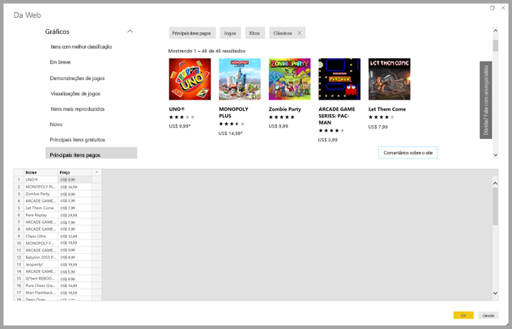
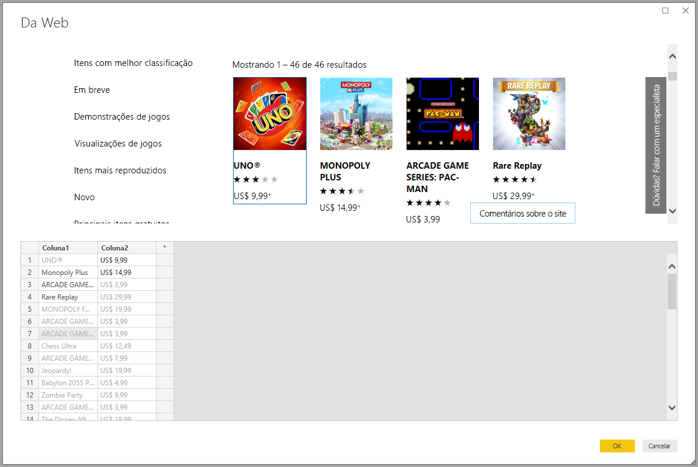

# Obter dados de páginas da Web fornecendo exemplos

Obter dados de uma página da Web permite que os usuários extraiam facilmente dados de páginas da Web e importem esses dados para o *Power BI Desktop*. No entanto, geralmente, os dados em páginas da Web não estão em tabelas organizadas que são fáceis de serem extraídas. A obtenção de dados dessas páginas pode ser um verdadeiro desafio, mesmo que os dados estejam estruturados e consistentes.

Mas há uma solução. Com o recurso *Obter Dados da Web por exemplo*, você pode, essencialmente, mostrar ao Power BI Desktop quais dados deseja extrair fornecendo um ou mais exemplos na caixa de diálogo do conector. O Power BI Desktop reúne outros dados na página que correspondem aos exemplos. Com essa solução, você pode extrair todos os tipos de dados de páginas da Web, incluindo dados encontrados em tabelas *e* outros dados fora delas.

Os preços nos gráficos servem apenas para fins de exemplo.

## Usando Obter dados da Web por exemplo

Selecione **Obter Dados** na faixa de opções **Página Inicial**. Na caixa de diálogo exibida, selecione **Outros** nas categorias no painel esquerdo e, em seguida, selecione **Web**. Selecione **Conectar** para continuar.

Em **Da Web**, insira a URL da página da Web da qual você deseja extrair dados. Neste artigo, usaremos a página da Web da Microsoft Store e mostraremos como esse conector funciona.

Se quiser acompanhar, você poderá usar a [URL da Microsoft Store](https://www.microsoft.com/store/top-paid/games/xbox?category=classics) que usamos neste artigo:

    https://www.microsoft.com/store/top-paid/games/xbox?category=classics

Quando você selecionar **OK**, será levado à caixa de diálogo **Navegador**, em que qualquer tabela detectada automaticamente da página da Web será apresentada. No caso mostrado na imagem abaixo, nenhuma tabela foi encontrada. Selecione **Adicionar tabela usando exemplos** para fornecer exemplos.

**Adicionar tabela usando exemplos** apresenta uma janela interativa em que você pode visualizar o conteúdo da página da Web. Insira valores de exemplo dos dados que deseja extrair.

Neste exemplo, extrairemos o *Nome* e o *Preço* de cada um dos jogos na página. Podemos fazer isso especificando dois exemplos da página para cada coluna. Conforme você insere exemplos, o *Power Query* extrai os dados que se adaptam ao padrão das entradas de exemplo usando algoritmos de extração de dados inteligentes.

> [!NOTE]
> as sugestões de valor incluem apenas valores menores ou iguais a 128 caracteres de comprimento.

Quando estiver satisfeito com os dados extraídos da página da Web, selecione **OK** para acessar o Editor do Power Query. Você pode aplicar mais transformações ou formatar os dados, por exemplo, combinar esses dados com outros dados em nossas fontes.

Nele, você pode criar visuais ou, de outro modo, usar os dados da página da Web ao criar seus relatórios do Power BI Desktop.

## Próximas etapas

Há todos os tipos de dados aos quais você pode se conectar usando o Power BI Desktop. Para obter mais informações sobre fontes de dados, confira os seguintes recursos:

* [Adicionar uma coluna de um exemplo no Power BI Desktop](../create-reports/desktop-add-column-from-example.md)
* [Conectar-se a páginas da Web no Power BI Desktop](desktop-connect-to-web.md)
* [Fontes de dados no Power BI Desktop](desktop-data-sources.md)
* [Formatar e combinar dados no Power BI Desktop](desktop-shape-and-combine-data.md)
* [Conectar-se a pastas de trabalho do Excel no Power BI Desktop](desktop-connect-excel.md)
* [Conectar-se a arquivos CSV no Power BI Desktop](desktop-connect-csv.md)
* [Inserir dados diretamente no Power BI Desktop](desktop-enter-data-directly-into-desktop.md)
