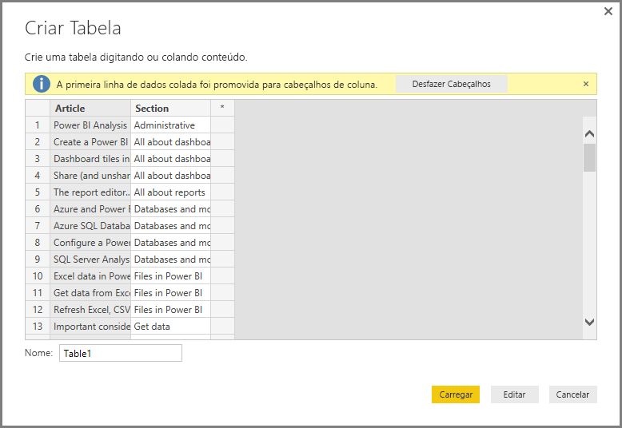

# Inserir dados diretamente no Power BI Desktop

Com o Power BI Desktop, você pode inserir dados diretamente e usá-los em seus relatórios e suas visualizações. Por exemplo, é possível copiar partes de uma pasta de trabalho ou página da Web e colá-las no Power BI Desktop.

Para inserir dados diretamente no Power BI Desktop na forma de uma nova tabela, selecione **Inserir Dados**, na Faixa de Opções da **Página Inicial**.

O Power BI Desktop pode tentar fazer pequenas transformações nos dados, caso apropriado, assim como ele faz quando você carrega dados de qualquer fonte. Por exemplo, no caso abaixo, ele promoveu a primeira linha de dados aos cabeçalhos.

Se você quiser formatar os dados inseridos ou colados, selecione **Editar** para abrir o **Editor do Power Query**. Você pode formatar e transformar os dados antes de colocá-los no Power BI Desktop. Selecione **Carregar** para importar os dados conforme eles aparecem.

Quando você seleciona **Carregar**, o Power BI Desktop cria uma nova tabela de dados, disponibilizando-a no painel **Campos**. Na imagem a seguir, o Power BI Desktop mostra minha nova tabela, chamada *Table1*, e os dois campos nessa tabela que foram criados.

E isso é tudo. É muito fácil inserir dados no Power BI Desktop.

Agora você está pronto para usar os dados no Power BI Desktop. Você pode criar elementos visuais, relatórios ou interagir com quaisquer outros dados aos quais você queira se conectar e importar, por exemplo, pastas de trabalho do Excel, bancos de dados ou qualquer outra fonte de dados.

## Próximas etapas

Há todos os tipos de dados aos quais você pode se conectar usando o Power BI Desktop. Para obter mais informações sobre fontes de dados, confira os seguintes recursos:

* [O que é o Power BI Desktop?](../fundamentals/desktop-what-is-desktop.md)
* [Fontes de dados no Power BI Desktop](desktop-data-sources.md)
* [Formatar e combinar dados com o Power BI Desktop](desktop-shape-and-combine-data.md)
* [Conectar-se a pastas de trabalho do Excel no Power BI Desktop](desktop-connect-excel.md)
* [Conectar-se a arquivos CSV no Power BI Desktop](desktop-connect-csv.md)
