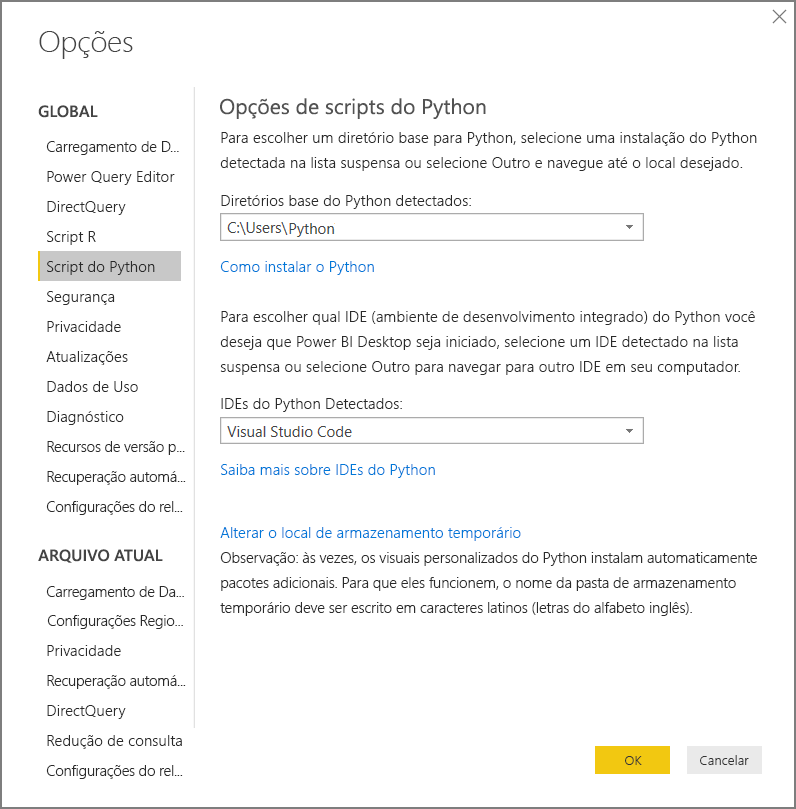
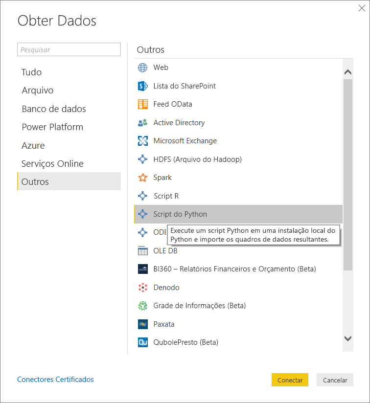
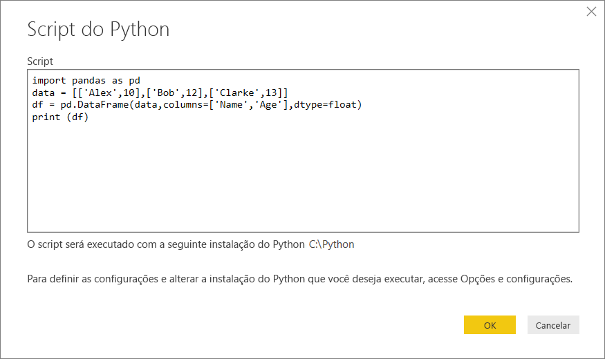
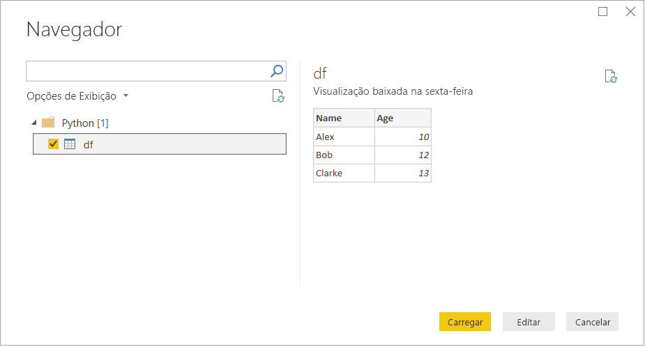
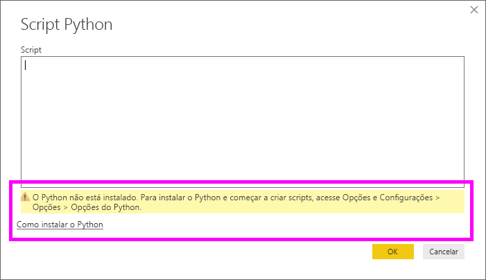

# <a name="run-python-scripts-in-power-bi-desktop"></a>Executar scripts do Python no Power BI Desktop

É possível executar scripts do Python diretamente no Power BI Desktop e importar os conjuntos de dados resultantes para um modelo de dados do Power BI Desktop.

## <a name="install-python"></a>Instalar o Python

Para executar scripts do Python no Power BI Desktop, você precisa instalar o Python em seu computador local. Você pode baixar o Python [em seu site](https://www.python.org/). A versão de script do Python atual dá suporte a caracteres Unicode e espaços no caminho de instalação.

### <a name="install-required-python-packages"></a>Instalar os pacotes necessários do Python

A integração do Power BI Python requer a instalação de dois pacotes do Python:

* [Pandas](https://pandas.pydata.org/). Uma biblioteca de software para manipulação e análise de dados. Oferece estruturas de dados e operações para manipular tabelas numéricas e séries temporais. Os dados importados devem estar em uma [estrutura de dados do Pandas](https://www.tutorialspoint.com/python_pandas/python_pandas_dataframe.htm). Uma estrutura de dados é uma estrutura de dados bidimensional. Por exemplo, os dados são alinhados de maneira tabular em linhas e colunas.
* [Matplotlib](https://matplotlib.org/). Uma biblioteca de plotagem para Python e sua extensão matemática numérica [NumPy](https://www.numpy.org/). Fornece uma API orientada a objeto para incorporar gráficos a aplicativos usando os kits de ferramenta da GUI de uso geral, como Tkinter, wxPython, Qt ou GTK+.

Em um console ou shell, use a ferramenta de linha de comando [pip](https://pip.pypa.io/en/stable/) para instalar os dois pacotes. A ferramenta pip é empacotada com as versões mais recentes do Python.

```CMD
pip install pandas
pip install matplotlib
```

## <a name="enable-python-scripting"></a>Habilitar script Python

Para habilitar script Python:

1. No Power BI Desktop, selecione **Arquivo** > **Opções e Configurações** > **Opções** > **Script do Python**. A página **Opções de scripts do Python** é exibida.

   

1. Se necessário, especifique o caminho de instalação local do Python em **Diretórios base do Python detectados**.

   Na imagem acima, o caminho local de instalação do Python é *C:\Python*. Verifique se o caminho é para a instalação local do Python que você deseja que o Power BI Desktop use.

1. Selecione **OK**.

Depois de especificar a instalação do Python, estará pronto para começar a executar scripts do Python no Power BI Desktop.

## <a name="run-python-scripts"></a>Executar scripts Python

Em apenas algumas etapas, você pode executar scripts Python e criar um modelo de dados. Com base nesse modelo, você pode criar relatórios e compartilhá-los no serviço do Power BI.

### <a name="prepare-a-python-script"></a>Preparar um script do Python

Primeiro, crie um script em seu ambiente de desenvolvimento local do Python e verifique se ele é executado com êxito. Por exemplo, aqui está um script do Python simples que importa Pandas e usa um quadro de dados:

```python
import pandas as pd
data = [['Alex',10],['Bob',12],['Clarke',13]]
df = pd.DataFrame(data,columns=['Name','Age'],dtype=float)
print (df)
```

Quando executado, este script retorna:

```python
     Name   Age
0    Alex  10.0
1     Bob  12.0
2  Clarke  13.0
```

Ao preparar e executar um script Python no Power BI Desktop, existem algumas limitações:

* Somente as estruturas de dados do Pandas são importados, portanto, verifique se os dados que você deseja importar para o Power BI são representados em um quadro de dados
* Qualquer script Python que é executado por mais de 30 minutos expira
* Chamadas interativas no script Python, como aguardar a entrada do usuário, interrompem a execução do script
* Ao definir o diretório de trabalho dentro do script Python, é *necessário* definir um caminho completo para o diretório de trabalho, em vez de um caminho relativo
* No momento, não há suporte para tabelas aninhadas

### <a name="run-your-python-script-and-import-data"></a>Executar o script Python e importar dados

Para executar o Script do Python no Power BI Desktop:

1. Na faixa de opções Página Inicial, selecione **Obter Dados** > **Outro**.

1. Selecione **Outro** > **Script Python**, conforme mostra a imagem a seguir:

   

1. Selecione **Conectar**. A versão mais recente instalada do Python no local é selecionada como seu mecanismo Python. Copie o script para a caixa de diálogo de **Scripts do Python** que é exibida. Aqui, inserimos o script do Python simples mostrado anteriormente.

   

1. Selecione **OK**. Se o script for executado com êxito, o **Navegador** será exibido, e você poderá carregar os dados e usá-los. Para o exemplo, selecione **df**, conforme mostra a imagem, e depois **Carregue**.

    

### <a name="troubleshooting"></a>Solução de problemas

Se o Python não estiver instalado nem identificado, um aviso será exibido. Você também poderá ver um aviso se tiver várias instalações de computador local. Reveja e examine as seções anteriores Instalar Python e Habilitar script do Python.



#### <a name="using-custom-python-distributions"></a>Como usar as distribuições personalizadas do Python

O Power BI executa scripts diretamente usando um python.exe executável de um diretório fornecido pelo usuário por meio da página de configurações. As distribuições que exigem uma etapa extra para preparar o ambiente, como o Conda, podem encontrar um problema de falha na execução.

Recomendamos usar a distribuição oficial do Python de https://www.python.org/ para evitar problemas relacionados.

Como solução é possível iniciar o Power BI Desktop de seu prompt personalizado de ambiente do Python.

### <a name="refresh"></a>Atualizar

É possível atualizar um script Python no Power BI Desktop. Para atualizar, vá para a faixa de opções **Página Inicial** e selecione **Atualizar**. Quando você atualiza um script do Python, o Power BI Desktop executa o script do Python novamente.

## <a name="known-limitations"></a>Limitações Conhecidas

No momento, não é possível usar scripts Python em relatórios criados com o recurso **Metadados Aprimorados (Versão Prévia)** habilitado. Os relatórios existentes continuarão funcionando. Para obter mais informações, confira [Usando metadados de conjunto de dados aprimorados (versão prévia)](desktop-enhanced-dataset-metadata.md). 

## <a name="next-steps"></a>Próximas etapas

Dê uma olhada nas informações adicionais a seguir sobre o Python no Power BI.

* [Criar Visuais do Python no Power BI Desktop](desktop-python-visuals.md)
* [Usar um IDE do Python externo com o Power BI](desktop-python-ide.md)
