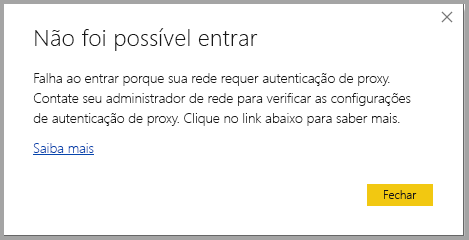
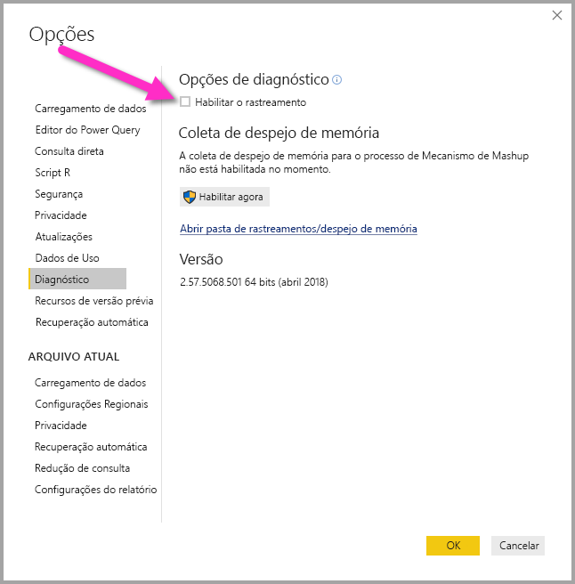

# Solucionar problemas de entrada no Power BI Desktop
Em alguns momentos, talvez você tente entrar no **Power BI Desktop**, mas receba erros. Há dois motivos principais para problemas de conexão: **erros de autenticação de proxy** e **erros de redirecionamento de URL sem HTTPS**. 

Para determinar qual problema está causando o problema de entrada, a primeira etapa é entrar em contato com seu administrador e fornecer informações de diagnóstico para que eles possam determinar a causa do problema. Ao rastrear problemas associados ao seu problema de entrada, os administradores podem determinar qual dos erros a seguir se aplica a você. 

Vamos analisar cada um desses problemas. Ao final deste artigo há uma discussão sobre como capturar um *rastreamento* no Power BI Desktop, o que pode ajudar a rastrear a solução de problemas.

## Erro de Autenticação de Rede Necessária

A tela a seguir mostra um exemplo do erro *Autenticação de Proxy Necessária*.

As exceções a seguir em arquivos de rastreamento do *Power BI Desktop* são associadas este erro:

* *Microsoft.PowerBI.Client.Windows.Services.PowerBIWebException*
* *HttpStatusCode: ProxyAuthenticationRequired*

Quando esse erro ocorre, o motivo mais provável é que um servidor de autenticação de proxy em sua rede está bloqueando as solicitações Web emitidas pelo **Power BI Desktop**. 

Se a sua rede usar um servidor de autenticação de proxy, o administrador poderá corrigir esse problema incluindo os seguintes domínios à lista de permissões no servidor de autenticação de proxy:

* app.powerbi.com
* api.powerbi.com
* domínios no namespace *.analysis.windows.net

Para clientes que fazem parte de uma nuvem governamental, a correção desse problema pode ser feita incluindo os seguintes domínios à lista de permissões do servidor de autenticação de proxy:

* app.powerbigov.us
* api.powerbigov.us
* domínios no namespace *.analysis.usgovcloudapi.net

## Erro de falta de suporte de redirecionamento de URL sem HTTPS

As versões atuais do **Power BI Desktop** usam a versão atual da autenticação ADAL (Biblioteca de Autenticação do Active Directory), que não permite um redirecionamento para URLs sem proteção (sem HTTPS). 

As exceções a seguir em arquivos de rastreamento do *Power BI Desktop* são associadas este erro:

* *Microsoft.IdentityModel.Clients.ActiveDirectory.AdalServiceException: redirecionamento de URL sem HTTPS não tem suporte no modo de exibição da Web*
* *ErrorCode: non_https_redirect_failed*

Se *ErrorCode: non_https_redirect_failed* ocorrer, significa que uma ou mais páginas de redirecionamento ou provedores da cadeia de redirecionamento não é um ponto de extremidade HTTPS protegido, ou que um emissor de certificado de um ou mais redirecionamentos não está entre as raízes confiáveis do dispositivo. Todos os provedores em qualquer cadeia de redirecionamento de entrada deve usar uma URL com HTTPS. Para resolver esse problema, contate o administrador e solicite o uso de URLs protegidas em seus sites de autenticação. 

## Como coletar um rastreamento no Power BI Desktop

Para coletar um rastreamento no **Power BI Desktop**, execute estas etapas:

1. Habilite o rastreamento em **Power BI Desktop** acessando **Arquivo > Opções e configurações > Opções** e, depois, selecione **Diagnóstico** nas opções do painel esquerdo. No painel exibido, marque a caixa ao lado de **Habilitar o rastreamento**, conforme mostra a imagem a seguir. Talvez seja necessário reiniciar o **Power BI Desktop**.
   
   

2. Em seguida, execute as etapas que reproduzem o erro. Quando isso ocorre, o **Power BI Desktop** adiciona eventos ao log de rastreamento, que é armazenado no computador local.

3. Navegue até a pasta Traces em seu computador local. Encontre essa pasta selecionando o link em **Diagnóstico**, onde você habilitou o rastreamento, mostrado como *Abrir pasta de rastreamento/despejo de memória* na imagem anterior. Geralmente, isso é encontrado neste caminho no computador local:

    `C:\Users/<user name>/AppData/Local/Microsoft/Power BI Desktop/Traces`

A pasta pode conter muitos arquivos de rastreamento. Envie apenas os arquivos recentes ao seu administrador, para facilitar a identificação rápida do erro. 

## Usar as credenciais padrão do sistema para o proxy Web

As solicitações da Web emitidas pelo Power BI Desktop não usam credenciais de proxy da Web. Em redes que usam um servidor proxy, o Power BI Desktop pode não conseguir fazer solicitações da Web com êxito. 

Da versão de março de 2020 em diante do Power BI Desktop, os administradores do sistema ou da rede podem permitir o uso de credenciais padrão do sistema para autenticação de proxy Web. Os administradores podem criar uma entrada de Registro chamada **UseDefaultCredentialsForProxy** e definir o valor como 1 (um) para habilitar o uso de credenciais padrão do sistema para autenticação de proxy Web.

A entrada do Registro pode ser colocada em qualquer um dos seguintes locais:

`[HKEY_LOCAL_MACHINE\SOFTWARE\WOW6432Node\Microsoft\Microsoft Power BI Desktop]`
`[HKEY_LOCAL_MACHINE\SOFTWARE\Microsoft\Microsoft Power BI Desktop]`

Não é necessário ter a entrada de Registro em ambos os locais.

Depois que a entrada do Registro é criada (pode ser necessário reinicializar), as configurações de proxy definidas no Internet Explorer são usadas quando o Power BI Desktop faz solicitações da Web. 

Assim como ocorre com qualquer alteração nas configurações de proxy ou credencial, há implicações de segurança para criar essa entrada do Registro, de modo que os administradores devem verificar se configuraram os proxies do Internet Explorer corretamente antes de habilitar esse recurso.         

### Limitações e considerações para o uso de credenciais padrão do sistema

Há uma coleção de implicações de segurança que os administradores devem considerar antes de habilitar essa funcionalidade. 

As seguintes recomendações devem ser seguidas sempre que você habilitar esse recurso para clientes:

* Use apenas a **Negociação** como o esquema de autenticação no para o servidor proxy, para verificar se somente os servidores proxy que ingressaram na rede do Active Directory são usados pelo cliente. 
* Não use o **fallback de NTLM** em clientes que usam esse recurso.
* Se os usuários não estiverem em uma rede com um proxy quando esse recurso estiver habilitado e configurado conforme recomendado nesta seção, o processo de tentar entrar em contato com o servidor proxy e usar as credenciais de sistema padrão não será usado.

[Usar as credenciais padrão do sistema para o proxy Web](#using-default-system-credentials-for-web-proxy)

