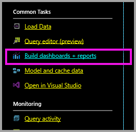
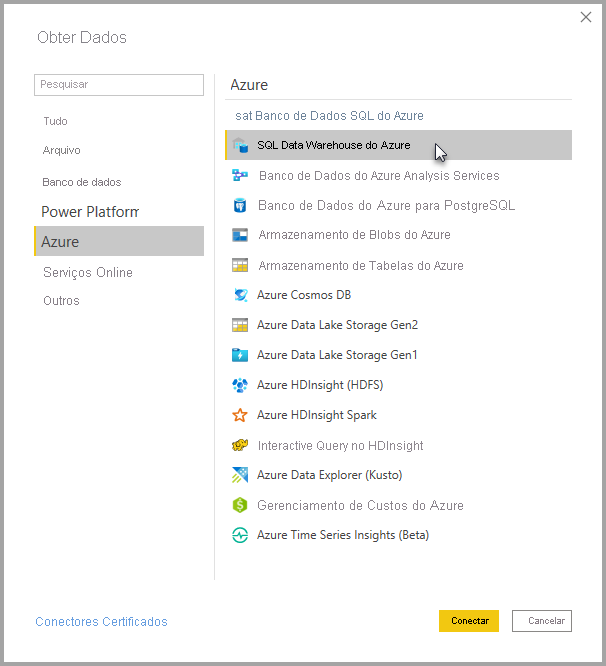
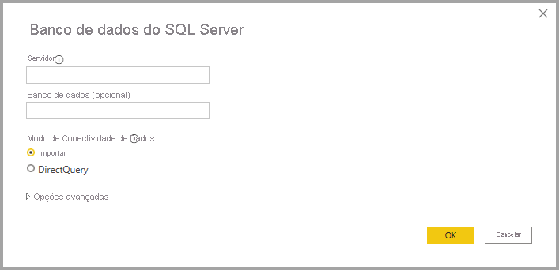
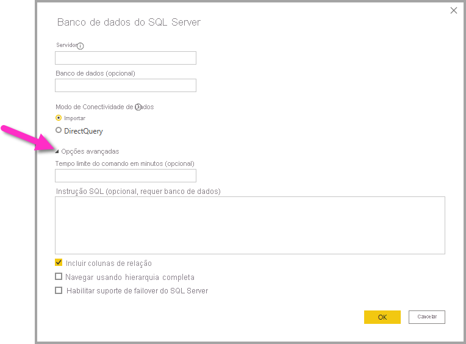

# SQL Data Warehouse do Azure com DirectQuery

O SQL Data Warehouse do Azure com o DirectQuery permite criar relatórios dinâmicos com base nos dados e nas métricas que você já tem no SQL Data Warehouse do Azure. Com o DirectQuery, as consultas são enviadas de volta para o SQL Data Warehouse do Azure em tempo real conforme você explora os dados. As consultas em tempo real, aliadas à escala do SQL Data Warehouse, permitem aos usuários criar, em minutos, relatórios dinâmicos referentes a terabytes de dados. Além disso, o link **Criar dashboards + relatórios** permite que os usuários criem relatórios do Power BI usando o SQL Data Warehouse.

Ao usar o conector do SQL Data Warehouse:

* Especifique o nome do servidor totalmente qualificado ao estabelecer a conexão (veja abaixo para obter mais detalhes)
* Assegure que as regras de firewall para o servidor estão configuradas para “Permitir acesso aos serviços do Azure”
* Toda ação, como selecionar uma coluna ou adicionar um filtro, consultará diretamente o data warehouse
* Os blocos são configurados para atualizar aproximadamente a cada 15 minutos e a atualização não precisa ser agendada.  A atualização poderá ser ajustada nas Configurações avançadas quando você se conectar.
* As P e R não estão disponíveis para conjuntos de dados do DirectQuery
* As alterações de esquema não são separadas automaticamente

Essas restrições e observações podem mudar conforme continuamos a aprimorar a experiência. As etapas para conectar são detalhadas abaixo.

## Crie dashboards e relatórios no Power BI

> [!Important]
> Estamos aperfeiçoando nossa conectividade com o SQL Data Warehouse do Azure. Para obter a melhor experiência para se conectar à fonte de dados do SQL Data Warehouse do Azure, use o Power BI Desktop. Depois de criar seu modelo e relatório, você poderá publicá-los no serviço do Power BI. O conector direto disponível anteriormente para o SQL Data Warehouse do Azure no serviço do Power BI não está mais disponível.

A maneira mais fácil de se deslocar entre o SQL Data Warehouse e o Power BI é criar relatórios no Power BI Desktop. Você pode usar o botão **Criar dashboards + relatórios** dentro do portal do Azure.

1. Para começar, baixe e instale o Power BI Desktop. Consulte o artigo [obter o Power BI Desktop](../fundamentals/desktop-get-the-desktop.md) para obter informações sobre como baixar e instalar, ou vá diretamente para a próxima etapa.

2. Você também pode clicar no link **Criar dashboards + relatórios** para baixar o Power BI Desktop.

    

## Conectando-se por meio do Power BI Desktop

Você pode se conectar a um SQL Data Warehouse usando o botão **Obter Dados** no Power BI Desktop. 

1. Selecione o botão **Obter Dados** no menu **Página Inicial**.  

    

2. Selecione **Mais...** para ver todas as fontes de dados disponíveis. Na janela exibida, selecione **Azure** no painel à esquerda e, em seguida, selecione **SQL Data Warehouse do Azure** na lista de conectores disponíveis no painel à direita.

    

3. Na janela exibida, insira o Servidor e, opcionalmente, declare o Banco de Dados ao qual você deseja se conectar. Você também pode selecionar o modo de conectividade de dados: Importação ou DirectQuery. Para obter acesso em tempo real às informações no seu SQL Data Warehouse do Azure, use o DirectQuery.

    

4. Para obter opções avançadas para a conexão do SQL Data Warehouse do Azure, selecione a seta para baixo ao lado de **Opções avançadas** para exibir opções adicionais para a sua conexão.

    

A próxima seção descreve como localizar valores de parâmetro para a sua conexão. 

## Localizando Valores de Parâmetro

Seu nome do servidor totalmente qualificado e o nome do banco de dados podem ser encontrados no Portal do Azure. Observe que o SQL Data Warehouse tem apenas uma presença no portal do Azure atualmente.

> [!NOTE]
> Se o seu locatário do Power BI estiver na mesma região que o SQL Data Warehouse do Azure, não haverá nenhum encargo pela saída. Você pode descobrir onde seu locatário do Power BI está localizado usando [estas instruções](../admin/service-admin-where-is-my-tenant-located.md).

[!INCLUDE [direct-query-sso](../includes/direct-query-sso.md)]

## Próximas etapas

* [Sobre o uso do DirectQuery no Power BI](desktop-directquery-about.md)
* [O que é o Power BI?](../fundamentals/power-bi-overview.md)  
* [Obter dados para o Power BI](service-get-data.md)  
* [SQL Data Warehouse do Azure](/azure/sql-data-warehouse/sql-data-warehouse-overview-what-is/)

Mais perguntas? [Experimente a Comunidade do Power BI](https://community.powerbi.com/)