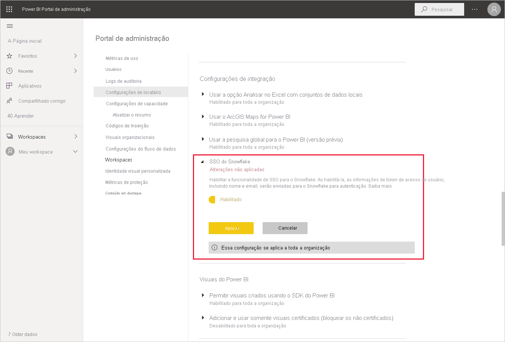
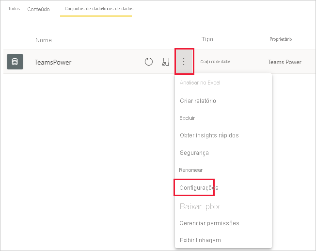
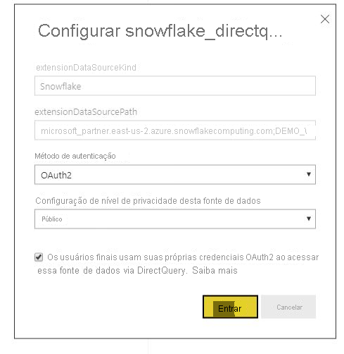

# Conectar-se ao Snowflake no serviço do Power BI

## Introdução

A conexão ao Snowflake no serviço do Power BI difere de outros conectores em apenas um aspecto. O Snowflake tem um recurso adicional para o AAD (Azure Active Directory), com uma opção de SSO. Partes da integração exigem diferentes funções administrativas no Snowflake, no Power BI e no Azure. Você também pode optar por habilitar a autenticação do AAD sem usar o SSO. A autenticação Básica funciona de modo semelhante a outros conectores no serviço.

Para configurar a integração do AAD e, opcionalmente, habilitar o SSO, siga as etapas neste artigo:

* Se você for o administrador do Snowflake, leia o artigo [SSO do Power BI para o Snowflake – Introdução](https://docs.snowflake.com/en/user-guide/oauth-powerbi.html) na documentação do Snowflake.
* Se você for um administrador do Power BI, confira [Configuração do serviço do Power BI – Portal do Administrador](service-connect-snowflake.md#admin-portal) para saber como habilitar o SSO.
* Se você for um criador de conjunto de dados do Power BI, confira [Configuração do serviço do Power BI – Configurar um conjunto de dados com o AAD](service-connect-snowflake.md#configuring-a-dataset-with-aad) para saber como habilitar o SSO.

## Configuração do Serviço do Power BI

### Portal de administração

Para habilitar o SSO, um administrador global precisa ativar a configuração no portal de administração do Power BI. Essa configuração aprova o envio de credenciais do AAD ao Snowflake para a autenticação de toda a organização. Siga estas etapas para habilitar o SSO:

1. [Entre no Power BI](https://app.powerbi.com) usando credenciais de administrador global.
1. Selecione **Configurações** no menu de cabeçalho da página e selecione **Portal de administração**.
1. Selecione **Configurações de locatário** e role para localizar as **Configurações de integração**.

   

4. Expanda **SSO do Snowflake**, alterne a configuração para **Habilitado** e selecione **Aplicar**.

Essa etapa é necessária para dar consentimento ao envio do token do AAD aos servidores do Snowflake. Depois que você habilitar a configuração, poderá levar até uma hora para que ela entre em vigor.

Após a habilitação do SSO, você poderá usar relatórios com SSO.

### Configurando um conjunto de dados com o AAD

Depois que um relatório baseado no conector do Snowflake é publicado no serviço do Power BI, o criador do conjunto de dados precisa atualizar as configurações do workspace apropriado para que ele use o SSO.

Devido à maneira como o Power BI funciona, o SSO só funciona quando nenhuma fonte de dados é executada por meio do gateway de dados local. As limitações estão listadas abaixo:

* Se estiver usando somente uma fonte do Snowflake em seu modelo de dados, você poderá usar o SSO se optar por não usar o gateway de dados local.
* Se estiver usando uma fonte do Snowflake em conjunto com outra fonte, você poderá usar o SSO se nenhuma das fontes usar o gateway de dados local.
* Se você estiver usando uma fonte do Snowflake por meio do gateway de dados local, as credenciais do AAD não terão suporte. Essa consideração poderá ser relevante caso você esteja tentando acessar uma VNet usando apenas um IP com o gateway instalado, em vez de todo o intervalo de IP do Power BI.
* Se você estiver usando uma fonte do Snowflake em conjunto com outra fonte que exija um gateway, você também precisará usar o Snowflake por meio do gateway de dados local. Você não poderá usar SSO nesse caso.

Saiba mais sobre como usar o gateway de dados local em [O que é um gateway de dados local?](service-gateway-onprem.md)

Se não estiver usando o gateway, você estará pronto. Quando você tiver as credenciais do Snowflake configuradas no seu gateway de dados local, mas estiver apenas usando essa fonte de dados em seu modelo, poderá clicar no botão de alternância na página Configurações do conjunto de dados a fim de desativar o gateway para esse modelo.

Para ativar o SSO em um conjunto de dados, siga estas etapas:

1. [Entre no Power BI](https://app.powerbi.com) usando as credenciais do criador de conjunto de dados.
1. Selecione o workspace apropriado e escolha **Configurações** no menu mais opções localizado ao lado do nome do conjunto de dados.
  
1. Selecione **Credenciais da fonte de dados** e entre. O conjunto de dados pode ser conectado ao Snowflake com credenciais Básicas ou OAuth2 (AAD). Se você usar o AAD, poderá habilitar o SSO na próxima etapa.
1. Selecione a opção **Usuários finais usam suas próprias credenciais do OAuth2 ao acessar esta fonte de dados por meio do DirectQuery**. Essa configuração habilitará o SSO do AAD. Independentemente de o usuário inicial entrar com a autenticação Básica ou o OAuth2 (AAD), as credenciais do AAD serão enviadas para o SSO.

    

Depois que essas etapas forem concluídas, os usuários deverão usar automaticamente a autenticação do AAD para se conectar aos dados desse conjunto de dados do Snowflake.

Se você optar por não habilitar o SSO, os usuários que atualizarem o relatório usarão as credenciais do usuário que entrou, como acontece com a maioria dos outros relatórios do Power BI.

### Solução de problemas

Se você tiver problemas com a integração, confira o [Guia de solução de problemas](https://docs.snowflake.com/en/user-guide/oauth-powerbi.html#troubleshooting) do Snowflake.

## Próximas etapas

* [Fontes de dados para o serviço do Power BI](service-get-data.md)
* [Conectar-se a conjuntos de dados no serviço do Power BI no Power BI Desktop](desktop-report-lifecycle-datasets.md)
* [Conectar-se a um depósito de computação do Snowflake](desktop-connect-snowflake.md)