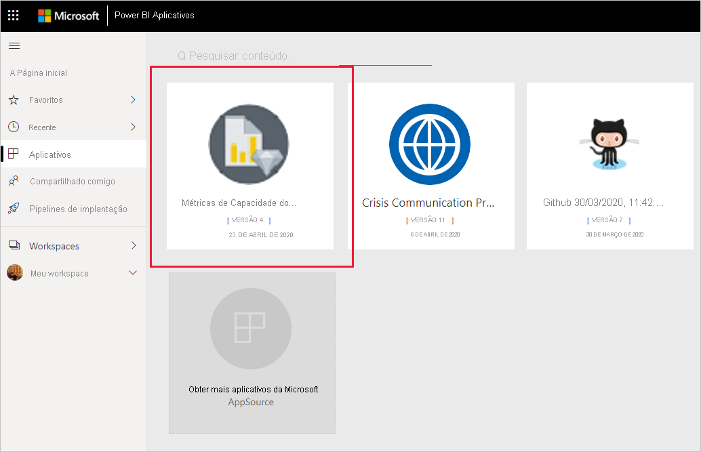
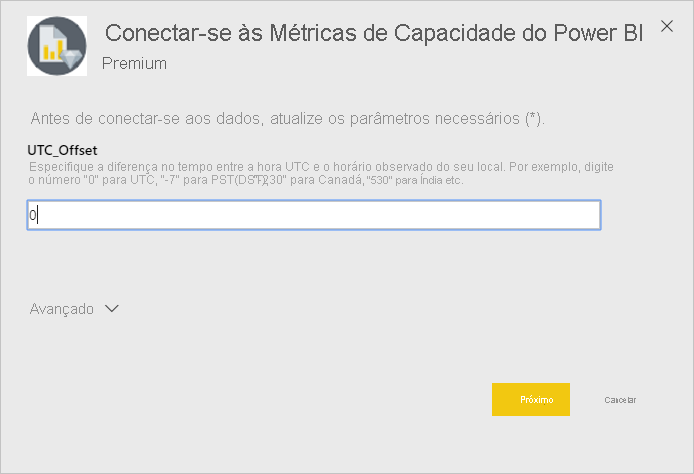
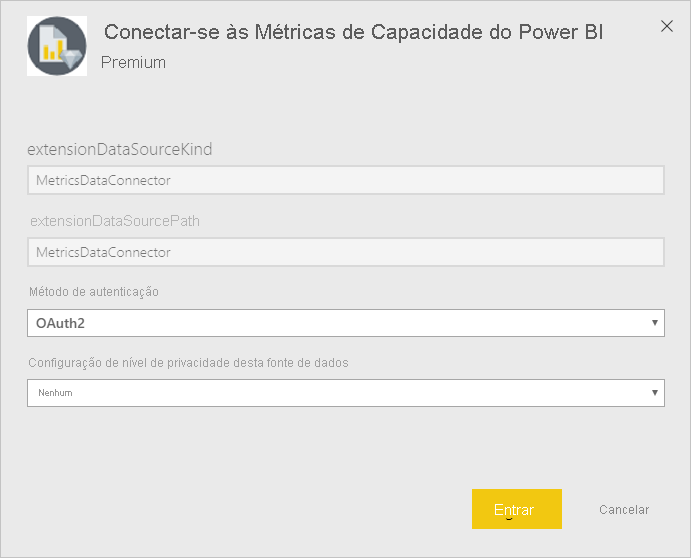
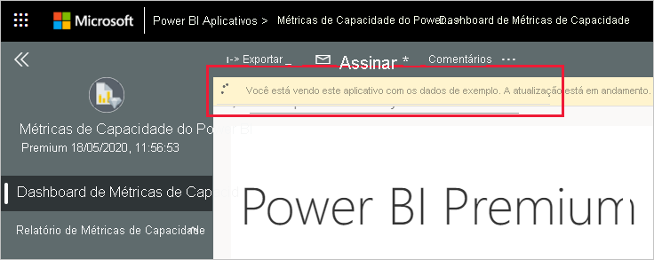
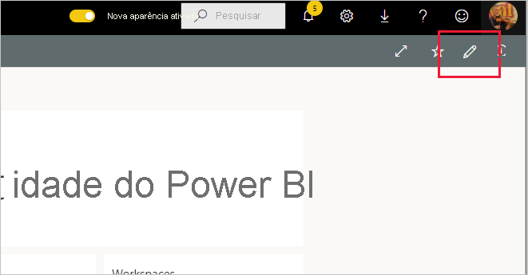

# Conectar-se às Métricas de Capacidade do Power BI Premium
Monitorar suas capacidades é essencial para tomar decisões bem informadas sobre a melhor maneira de utilizar os recursos de capacidade Premium. O aplicativo Métricas de Capacidade do Power BI Premium oferece as informações mais detalhadas sobre o desempenho de suas capacidades.

Este artigo descreve como instalar o aplicativo e se conectar às fontes de dados. Para obter informações sobre o conteúdo do relatório e como usá-lo, confira [Monitorar capacidades Premium com o aplicativo](../service-admin-premium-monitor-capacity.md) e a [postagem no blog do aplicativo de Métricas de Capacidade Premium](https://powerbi.microsoft.com/blog/premium-capacity-metrics-app-new-health-center-with-kpis-to-explore-relevant-metrics-and-steps-to-mitigate-issues/).

Depois de instalar o aplicativo e se conectar às fontes de dados, você poderá personalizar o relatório de acordo com as suas necessidades. Em seguida, poderá distribuí-lo para os colegas da sua organização.

> [!NOTE]
> A instalação de aplicativos de modelo requer [permissões](./service-template-apps-install-distribute.md#prerequisites). Entre em contato com o administrador de locatários se você achar que não tem permissões suficientes.

## Instalar o aplicativo

1. Clique no seguinte link para acessar o aplicativo: [Aplicativo de modelo de Métricas de Capacidade do Power BI Premium](https://app.powerbi.com/groups/me/getapps/services/pbi_pcmm.capacity-metrics-dxt)

1. Na página do aplicativo no AppSource, selecione [**OBTER AGORA**](https://app.powerbi.com/groups/me/getapps/services/pbi_pcmm.capacity-metrics-dxt).

    

1. Selecione **Instalar**. 

    

    > [!NOTE]
    > Se você já instalou o aplicativo anteriormente, será perguntado se deseja [substituir essa instalação](./service-template-apps-install-distribute.md#update-a-template-app) ou instalar em um novo workspace.

    Depois que o aplicativo for instalado, você o verá na página Aplicativos.

   

## Conectar-se a fontes de dados

1. Selecione o ícone da página Aplicativos para abrir o aplicativo.

1. Na tela inicial, selecione **Explorar**.

   

   O aplicativo é aberto, mostrando os dados de exemplo.

1. Selecione o link **Conectar seus dados** na barra de notificação na parte superior da página.

   

1. Na caixa de diálogo que aparece, defina o deslocamento UTC, ou seja, a diferença em horas entre o Tempo Universal Coordenado e a hora em sua localização. Em seguida, clique em **Avançar**.
  
   

1. Na próxima caixa de diálogo exibida, você não precisa fazer nada. Apenas selecione **Entrar**.

   

1. Na tela de entrada da Microsoft, entre no Power BI.

   

   Depois que você se conectar, o relatório se conectará às fontes de dados e será preenchido com os dados atualizados. Durante esse período, o monitor de atividade é ativado.

   

   Os dados de relatório serão atualizados automaticamente uma vez por dia, a menos que você tenha desabilitado isso durante o processo de entrada. Você também poderá [configurar sua agenda de atualização](./refresh-scheduled-refresh.md) para manter os dados do relatório atualizados, se assim desejar.

## Personalizar e compartilhar

Para iniciar a personalização do aplicativo, clique no ícone de lápis no canto superior direito.

 

Confira [Personalizar e compartilhar o aplicativo](./service-template-apps-install-distribute.md#customize-and-share-the-app) para obter detalhes.

## Próximas etapas
* [Monitorar as capacidades Premium com o aplicativo](../admin/service-admin-premium-monitor-capacity.md)
* [Postagem no blog do aplicativo Métricas de Capacidade Premium](https://powerbi.microsoft.com/blog/premium-capacity-metrics-app-new-health-center-with-kpis-to-explore-relevant-metrics-and-steps-to-mitigate-issues/)
* [O que são os aplicativos de modelo do Power BI?](./service-template-apps-overview.md)
* [Instalar e distribuir aplicativos de modelo na sua organização](./service-template-apps-install-distribute.md)
* Dúvidas? [Experimente perguntar à Comunidade do Power BI](https://community.powerbi.com/)