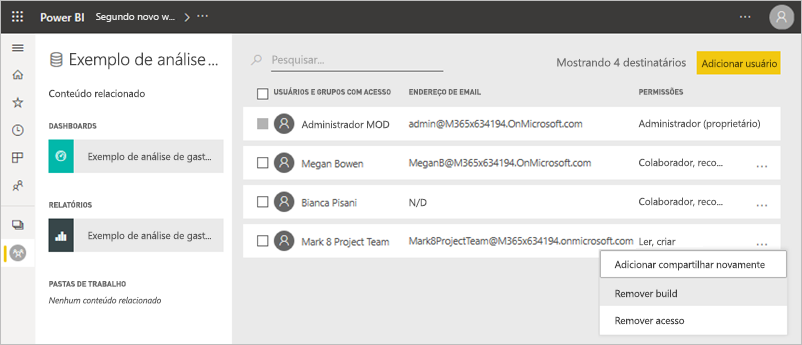
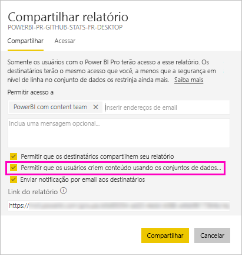
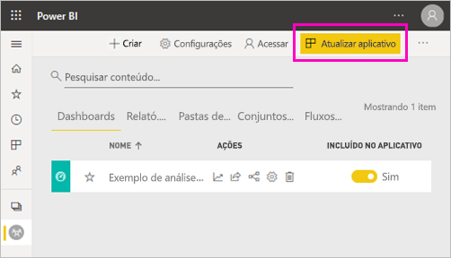
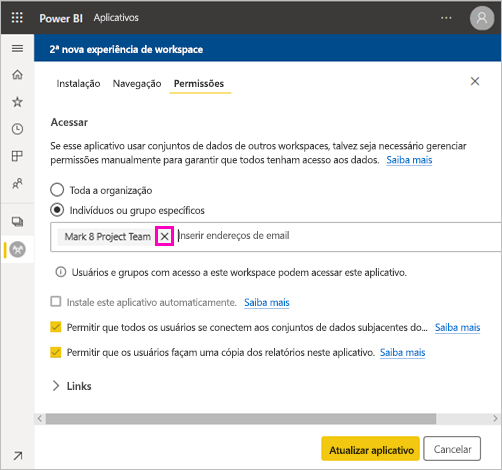
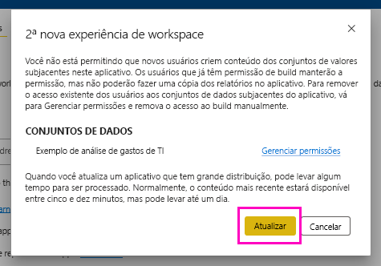

# Compilar permissão para conjuntos de dados compartilhados

Quando você cria um relatório no Power BI Desktop, os dados nesse relatório são armazenados em um *modelo de dados*. Ao publicar seus relatórios no serviço do Power BI, você também está publicando os dados como um *conjunto de dados*. Você pode conceder a outras pessoas a *permissão Criar* para esse relatório, para que elas possam descobrir e reutilizar o conjunto de dados que você compartilhou. Este artigo explica como controlar o acesso aos dados usando a permissão Criar.

A permissão Criar se aplica aos conjuntos de dados. Quando você concede aos usuários a permissão Criar, eles podem criar conteúdo em seu conjunto de dados, como relatórios, dashboards, blocos fixados de P e R e Descoberta de Insights. 

Os usuários também precisam de permissões Criar para trabalhar com os dados *fora* Power BI:

- Para exportar os dados subjacentes.
- Para criar conteúdo no conjunto de dados, por exemplo, com [Analisar no Excel](../collaborate-share/service-analyze-in-excel.md).
- Para acessar os dados por meio do ponto de extremidade XMLA.

## Maneiras de conceder a permissão Criar

Você pode conceder a permissão Criar para um conjunto de dados de diferentes formas:

- Membros de um workspace com, pelo menos, uma função de Colaborador têm automaticamente a permissão Criar para um conjunto de dados nesse workspace e permissão para copiar um relatório.
 
- Os membros do workspace no qual reside o conjunto de dados podem atribuir a permissão a usuários ou grupos de segurança específicos na Central de permissões. Se você for membro do workspace, selecione **Mais opções** (...) ao lado de um conjunto de dados > **Gerenciar Permissões**.

    

    Isso abrirá a Central de permissões desse conjunto de dados, na qual você pode definir e alterar permissões.

    

- Um administrador ou um membro do workspace no qual reside o conjunto de dados pode decidir, durante a publicação do aplicativo, que os usuários com a permissão no aplicativo também devem obter a permissão Criar nos conjuntos de dados subjacentes. Confira [Compartilhar um conjunto de dados](service-datasets-share.md) para obter mais detalhes.

- Digamos que você tenha as permissões Compartilhar novamente e Criar em um conjunto de dados. Ao compartilhar um relatório ou um dashboard nesse conjunto de dados, você pode especificar que os destinatários também obtenham a permissão Criar no conjunto de dados subjacente.

    

Você pode remover a permissão Criar de uma pessoa em um conjunto de dados. Se você fizer isso, elas ainda poderão ver o relatório criado no conjunto de dados compartilhado, mas não poderão mais editá-lo. Confira a próxima seção para saber mais detalhes.

## Remover permissão Criar em um conjunto de dados

Em algum momento, talvez seja necessário remover a permissão Criar de alguns usuários de um conjunto de dados compartilhado. 

1. Em um workspace, acesse a página da lista **Conjuntos de dados**. 
1. Selecione **Mais opções** (...) ao lado do conjunto de dados > **Gerenciar permissão**.

    

1. Selecione **Mais opções** (...) ao lado de um nome > **Remover build**.

    

    As pessoas ainda poderão ver o relatório criado no conjunto de dados compartilhado, mas não poderão mais editá-lo.

### Remover permissão Criar para um conjunto de dados em um aplicativo

Digamos que você tenha distribuído um aplicativo de um workspace para um grupo de pessoas. Posteriormente, você decide remover o acesso ao aplicativo de algumas pessoas. Remover o acesso ao aplicativo não remove automaticamente as permissões Criar e Compartilhar novamente. Essa é um etapa adicional. 

1. Em uma página de lista do workspace, selecione **Atualizar o aplicativo**. 

    

1. Na guia **Permissões**, selecione o **X** para excluir a pessoa ou o grupo. 

    
1. Selecione **Atualizar aplicativo**.

    Você verá uma mensagem explicando que precisa acessar **Gerenciar permissões** para remover a permissão Criar para usuários com acesso existente. 

    

1. Selecione **Atualizar**.

1. No workspace, acesse a página da lista **Conjuntos de dados**. 
1. Selecione **Mais opções** (...) ao lado do conjunto de dados > **Gerenciar permissão**.

    

1. Selecione **Mais opções** (...) ao lado de um nome > **Remover build**.

    

    As pessoas ainda poderão ver o relatório criado no conjunto de dados compartilhado, mas não poderão mais editá-lo.

## Permissões mais granulares

O Power BI introduziu a permissão Criar em junho de 2019 como um complemento às permissões existentes, Ler e Compartilhar novamente. Todos os usuários que já tinham a permissão Ler em conjuntos de dados por meio de permissões do aplicativo, compartilhamento ou acesso ao workspace naquela época também tinha a permissão Criar nesses mesmos conjuntos de dados. Eles obtinham a permissão Criar automaticamente, porque a permissão Ler já concedia a eles o direito de criar um conteúdo com base no conjunto de dados, por meio do recurso Analisar no Excel ou Exportar.

Com essa permissão Criar mais granular, você pode escolher quem pode apenas exibir o conteúdo no relatório ou no dashboard existente e quem pode criar um conteúdo conectado aos conjuntos de dados subjacentes.

Se o conjunto de dados estiver sendo usado por um relatório fora do workspace do conjunto de dados, você não poderá excluir esse conjunto de dados. Em vez disso, você verá uma mensagem de erro.

Você pode remover a permissão Criar. Se você fizer isso, as pessoas cujas permissões foram revogadas por você ainda poderão ver o relatório, mas não poderão mais editá-lo nem exportar dados subjacentes. Os usuários apenas com permissão de leitura ainda podem exportar dados resumidos. 

## Próximas etapas

- [Usar conjuntos de dados em workspaces](service-datasets-across-workspaces.md)
- Dúvidas? [Experimente perguntar à Comunidade do Power BI](https://community.powerbi.com/)
