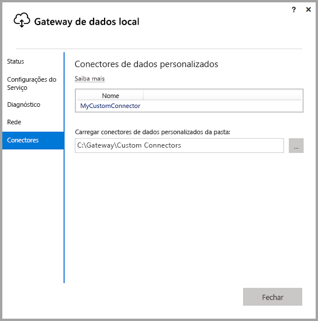
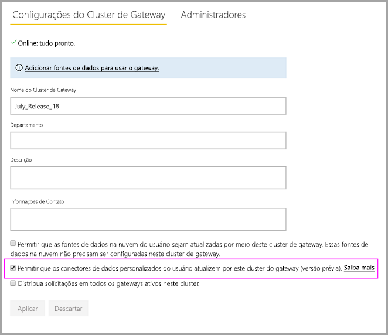

# Usar conectores de dados personalizados com o gateway de dados local

[!INCLUDE [gateway-rewrite](../includes/gateway-rewrite.md)]

Com os conectores de dados para o Power BI, você pode se conectar a dados e acessá-los em um aplicativo, um serviço ou uma fonte de dados. É possível desenvolver conectores de dados personalizados e usá-los no Power BI Desktop.

Para saber mais sobre como desenvolver conectores de dados personalizados para o Power BI, confira a [página do GitHub do SDK do Conector de Dados](https://aka.ms/dataconnectors). Esse site inclui informações sobre como começar e exemplos para o Power BI e o Power Query.

Quando você cria relatórios no Power BI Desktop que usam conectores de dados personalizados, é possível usar o gateway de dados local para atualizar esses relatórios no serviço do Power BI.

## Habilitar e usar essa funcionalidade

Quando você instala a versão de julho de 2018 do gateway de dados local ou uma versão mais recente, é possível ver uma guia **Conectores** no aplicativo de gateway de dados local. Na caixa **Carregar conectores de dados personalizados da pasta**, selecione uma pasta que possa ser acessada pelo usuário que está executando o serviço de gateway. O usuário padrão é *NT SERVICE\PBIEgwService.* O gateway carrega automaticamente os arquivos do conector personalizado localizados nessa pasta. Eles aparecem na lista de conectores de dados.

Se estiver usando a versão pessoal do gateway de dados local (modo pessoal), você poderá carregar seu relatório do Power BI para o serviço do Power BI e usar o gateway para atualizá-lo.

Para o gateway de dados local, é necessário criar uma fonte de dados para seu conector personalizado. Na página de configurações do gateway no serviço do Power BI, você deve ver uma opção quando seleciona o cluster de gateway para permitir o uso de conectores personalizados com esse cluster. Certifique-se de que todos os gateways no cluster têm a versão da atualização de julho de 2018 ou posterior para que essa opção esteja disponível. Selecione essa opção para habilitar o uso de conectores personalizados com este cluster.

Quando essa opção estiver habilitada, você verá seus conectores personalizados como fontes de dados disponíveis que podem ser criadas neste cluster de gateway. Depois de criar uma fonte de dados que usa seu novo conector personalizado, será possível atualizar os relatórios do Power BI usando esse conector personalizado no serviço do Power BI.

## Considerações e limitações

* Certifique-se de que a pasta criada está acessível para o serviço de gateway de tela de fundo. Normalmente, as pastas na pasta Windows ou em pastas do sistema do seu usuário não estarão acessíveis. O aplicativo de gateway de dados local mostrará uma mensagem se a pasta não estiver acessível. Essa instrução não se aplica ao gateway de dados local (modo pessoal).
* Para os conectores personalizados funcionarem com o gateway de dados local, eles precisam implementar uma seção "TestConnection" no código do conector personalizado. Essa seção não é obrigatória quando você usa conectores personalizados com o Power BI Desktop. Por esse motivo, você pode ter um conector que funciona com o Power BI Desktop, mas não com o gateway. Para obter mais informações sobre como implementar uma seção de TestConnection, consulte [esta documentação](https://github.com/Microsoft/DataConnectors/blob/master/docs/m-extensions.md#implementing-testconnection-for-gateway-support).
* Atualmente, o OAuth para conectores personalizados por gateways tem suporte apenas para administradores de gateway, mas não para outros usuários da fonte de dados.
* Se o seu conector personalizado estiver em uma unidade de rede, inclua o caminho totalmente qualificado no aplicativo de gateway de dados local.

## Próximas etapas

* [Gerenciar sua fonte de dados – Analysis Services](service-gateway-enterprise-manage-ssas.md)  
* [Gerenciar sua fonte de dados – SAP HANA](service-gateway-enterprise-manage-sap.md)  
* [Gerenciar sua fonte de dados – SQL Server](service-gateway-enterprise-manage-sql.md)  
* [Gerenciar sua fonte de dados – Oracle](service-gateway-onprem-manage-oracle.md)  
* [Gerenciar sua fonte de dados – Importar/atualização agendada](service-gateway-enterprise-manage-scheduled-refresh.md)
* [Definir configurações de proxy para o gateway de dados local](/data-integration/gateway/service-gateway-proxy)
* [Use o Kerberos para logon único (SSO) do Power BI para fontes de dados locais](service-gateway-sso-kerberos.md)  

Mais perguntas? Experimente perguntar à [Comunidade do Power BI](https://community.powerbi.com/).
