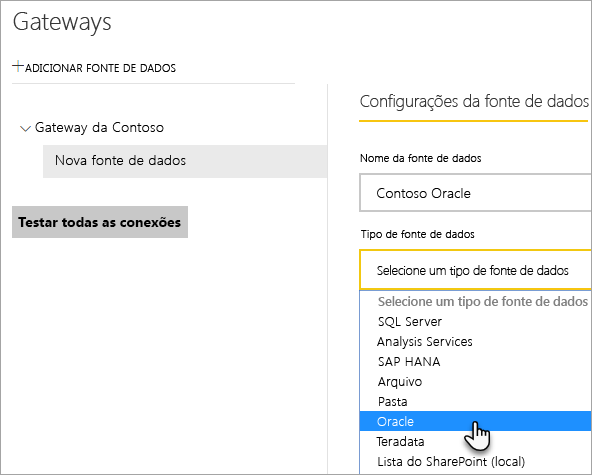
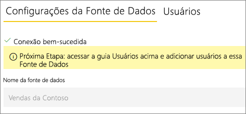
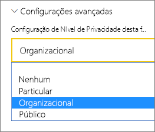
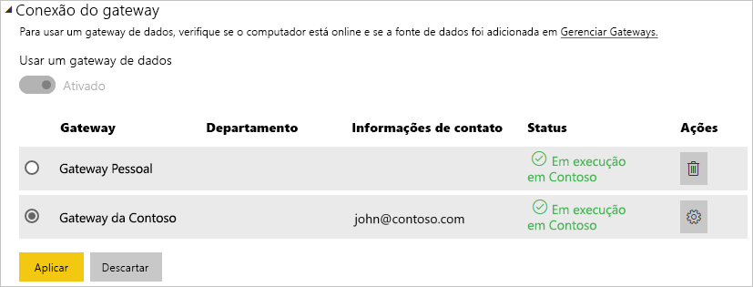

# <a name="manage-your-data-source---oracle"></a>Gerenciar sua fonte de dados – Oracle

[!INCLUDE [gateway-rewrite](../includes/gateway-rewrite.md)]

Depois de [instalar o gateway de dados local](/data-integration/gateway/service-gateway-install), será necessário [adicionar fontes de dados](service-gateway-data-sources.md#add-a-data-source) que possam ser usadas com o gateway. Este artigo aborda como trabalhar com gateways e fontes de dados Oracle para a atualização agendada ou para o DirectQuery.

## <a name="install-the-oracle-client"></a>Instalar o cliente Oracle

Para conectar o gateway ao servidor Oracle, o Provedor de dados Oracle para .NET (ODP.NET) precisa ser instalado e configurado. O ODP.NET faz parte do ODAC (Oracle Data Access Components).

Para versões de 32 bits do Power BI Desktop, use o seguinte link para baixar e instalar o cliente Oracle de 32 bits:

* [ODAC (Oracle Data Access Components) de 32 bits com Ferramentas de desenvolvimento da Oracle para Visual Studio (12.1.0.2.4)](https://www.oracle.com/technetwork/topics/dotnet/utilsoft-086879.html)

Para versões de 64 bits do Power BI Desktop ou para o gateway de dados local, use o seguinte link para baixar e instalar o cliente Oracle de 64 bits:

* [ODAC de 64 bits, 12.2c versão 1 (12.2.0.1.0) para Windows x64](https://www.oracle.com/technetwork/database/windows/downloads/index-090165.html)

Após o cliente ser instalado, configure o arquivo tnsnames.ora com as informações apropriadas para seu banco de dados. O Power BI Desktop e o gateway saem do net_service_name definido no arquivo tnsnames.ora. Se net_service_name não estiver configurado, você não poderá se conectar. O caminho padrão de tnsnames.ora é `[Oracle Home Directory]\Network\Admin\tnsnames.ora`. Para saber mais sobre como configurar arquivos tnsnames.ora, consulte [Oracle: Parâmetros de nomenclatura local (tnsnames.ora)](https://docs.oracle.com/cd/B28359_01/network.111/b28317/tnsnames.htm).

### <a name="example-tnsnamesora-file-entry"></a>Exemplo de entrada de arquivo tnsnames.ora

Este é o formato básico de uma entrada em tnsname.ora:

```
net_service_name=
 (DESCRIPTION=
   (ADDRESS=(protocol_address_information))
   (CONNECT_DATA=
     (SERVICE_NAME=service_name)))
```

Aqui está um exemplo de informações de servidor e porta preenchidas:

```
CONTOSO =
  (DESCRIPTION =
    (ADDRESS = (PROTOCOL = TCP)(HOST = oracleserver.contoso.com)(PORT = 1521))
    (CONNECT_DATA =
      (SERVER = DEDICATED)
      (SERVICE_NAME = CONTOSO)
    )
  )
```

## <a name="add-a-data-source"></a>Adicionar uma fonte de dados

Para obter mais informações sobre como adicionar uma fonte de dados, consulte [Adicionar uma fonte de dados](service-gateway-data-sources.md#add-a-data-source). Em **Tipo de Fonte de Dados**, selecione **Oracle**.



Depois de selecionar o tipo de fonte de dados Oracle, preencha as informações da fonte de dados, que incluem o **Servidor** e o **Banco de dados**. 

Em **Método de Autenticação**, você pode escolher **Windows** ou **Básico**. Escolha **Básico** se você planeja usar uma conta criada com a autenticação do Oracle em vez da autenticação do Windows. Em seguida, insira as credenciais que serão usadas para esta fonte de dados.

> [!NOTE]
> Todas as consultas à fonte de dados serão executadas com essas credenciais. Para saber mais sobre como as credenciais são armazenadas, confira [Armazenar credenciais criptografadas na nuvem](service-gateway-data-sources.md#store-encrypted-credentials-in-the-cloud).


Depois de preencher tudo, selecione **Adicionar**. Agora você pode usar esta fonte de dados para a atualização agendada ou para o DirectQuery, em relação a um servidor Oracle local. Você verá *Conexão Bem-sucedida* se tiver êxito.



### <a name="advanced-settings"></a>Configurações avançadas

Opcionalmente, você pode configurar o nível de privacidade para sua fonte de dados. Essa configuração controla como os dados podem ser combinados. Ela é usada somente para a atualização agendada. A configuração de nível de privacidade não se aplica ao DirectQuery. Para saber mais sobre os níveis de privacidade para sua fonte de dados, confira [Níveis de privacidade (Power Query)](https://support.office.com/article/Privacy-levels-Power-Query-CC3EDE4D-359E-4B28-BC72-9BEE7900B540).



## <a name="use-the-data-source"></a>Usar a fonte de dados

Depois de criar a fonte de dados, ela está disponível para uso com as conexões do DirectQuery ou por meio da atualização agendada.

> [!WARNING]
> Os nomes do servidor e do banco de dados devem corresponder entre o Power BI Desktop e a fonte de dados no gateway de dados local.

O vínculo entre o conjunto de dados e a fonte de dados no gateway baseia-se nos nomes do servidor e do banco de dados. Esses nomes devem corresponder. Por exemplo, se você fornecer um endereço IP como nome do servidor no Power BI Desktop, precisará usar o endereço IP como fonte de dados na configuração do gateway. Esse nome também deve corresponder a um alias definido no arquivo tnsnames.ora. Para obter mais informações sobre o arquivo tnsnames.ora, consulte [Instalar o cliente Oracle](#install-the-oracle-client).

Esse requisito existe para o DirectQuery e para a atualização agendada.

### <a name="use-the-data-source-with-directquery-connections"></a>Usar a fonte de dados com conexões do DirectQuery

Verifique se os nomes do servidor e do banco de dados correspondem entre o Power BI Desktop e a fonte de dados configurada para o gateway. Para que seja possível publicar os conjuntos de dados do DirectQuery, você também precisa verificar se o usuário está listado na guia **Usuários** da fonte de dados. A seleção para o DirectQuery ocorre no Power BI Desktop quando você importa dados pela primeira vez. Para obter mais informações sobre como usar o DirectQuery, consulte [Usar o DirectQuery no Power BI Desktop](desktop-use-directquery.md).

Após a publicação, por meio do Power BI Desktop ou do recurso **Obter Dados**, seus relatórios deverão começar a funcionar. Pode levar vários minutos após a criação da fonte de dados no gateway para que a conexão seja utilizável.

### <a name="use-the-data-source-with-scheduled-refresh"></a>Usar a fonte de dados com a atualização agendada

Se estiver listado na guia **Usuários** da fonte de dados configurada no gateway e houver a correspondência entre os nomes do servidor e do banco de dados, você verá o gateway como uma opção a ser usada com a atualização agendada.



## <a name="troubleshooting"></a>Solução de problemas

Você poderá encontrar vários erros do Oracle quando a sintaxe de nomenclatura estiver incorreta ou não estiver configurada corretamente:

* ORA-12154: TNS: não foi possível resolver o identificador de conexão especificado.
* ORA-12514: o ouvinte TNS no momento não sabe sobre o serviço solicitado no descritor de conexão.
* ORA-12541: TNS: nenhum ouvinte.
* ORA-12170: TNS: ocorrência de tempo limite de conexão.
* ORA-12504: O ouvinte TNS não recebeu SERVICE_NAME em CONNECT_DATA.

Esses erros poderão ocorrer se o cliente Oracle não estiver instalado ou não estiver configurado corretamente. Se ele estiver instalado, verifique se o arquivo tnsnames.ora está configurado corretamente e se você está usando o net_service_name adequado. Você também precisará garantir que o net_service_name seja o mesmo entre o computador que está usando o Power BI Desktop e o computador que está executando o gateway. Para obter mais informações, consulte [Instalando o cliente Oracle](#install-the-oracle-client).

> [!NOTE]
> Você também poderá enfrentar um problema de compatibilidade entre a versão do servidor Oracle e a versão do cliente Oracle. Normalmente, é recomendável que essas versões sejam correspondentes.

Para obter informações adicionais de solução de problemas relativas ao gateway, veja [Solução de problemas do gateway de dados local](/data-integration/gateway/service-gateway-tshoot).

## <a name="next-steps"></a>Próximas etapas

* [Solucionar problemas de gateways – Power BI](service-gateway-onprem-tshoot.md)
* [Power BI Premium](../admin/service-premium-what-is.md)

Mais perguntas? Experimente perguntar à [Comunidade do Power BI](https://community.powerbi.com/).
