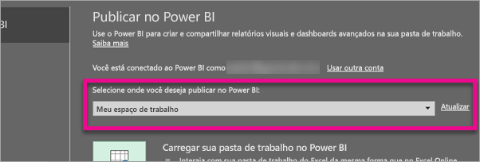
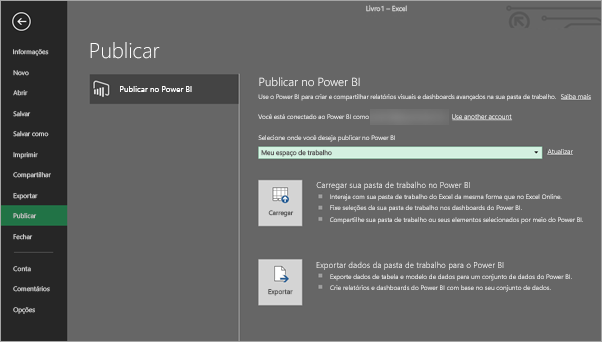
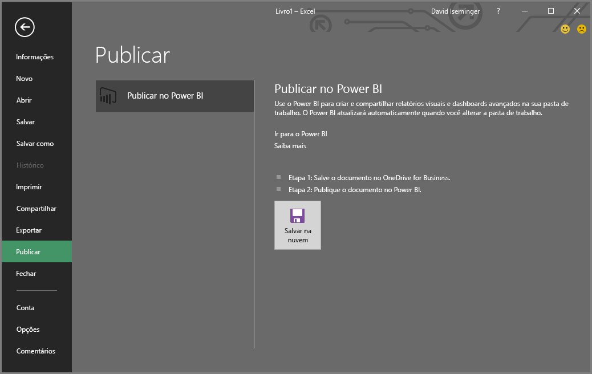

# Publicar no Power BI do Microsoft Excel
Com o Microsoft Excel 2016 e posteriores, é possível publicar suas pastas de trabalho do Excel diretamente no seu espaço de trabalho do [Power BI](https://powerbi.microsoft.com), em que é possível criar relatórios e painéis altamente interativos com base nos dados da sua pasta de trabalho. Em seguida, você pode compartilhar suas ideias com outras pessoas em sua organização.

Ao publicar uma pasta de trabalho no Power BI, há alguns pontos a considerar:

* Deve ser usada uma conta para entrar no Office, OneDrive for Business (se as pastas de trabalho estiverem lá) e Power BI.
* Não é possível publicar uma pasta de trabalho vazia nem uma pasta de trabalho que não tenha conteúdo para o qual há suporte do Power BI.
* Não é possível publicar pastas de trabalho criptografadas ou protegidas por senha nem pastas de trabalho com o Gerenciamento de Proteção de Informações.
* A publicação no Power BI exige a habilitação de uma autenticação moderna (padrão). Se estiver desabilitada, a opção Publicar não estará disponível no menu Arquivo.

## Publicar sua pasta de trabalho do Excel
Para publicar sua pasta de trabalho do Excel, no Excel, selecione **Arquivo** > **Publicar** e selecione **Carregar** ou **Exportar**.

Se você **Carregar** sua pasta de trabalho no Power BI, poderá interagir com a pasta de trabalho da mesma forma que faria usando o Excel Online. Você também pode fixar seleções de sua pasta de trabalho nos painéis do Power BI e compartilhar sua pasta de trabalho ou elementos selecionados por meio do Power BI.

Se você selecionar **Exportar**, poderá exportar dados de tabela e seus modelos de dados para um conjunto de dados do Power BI que poderá usar para criar relatórios e painéis do Power BI.

### Publicação de arquivo local
O Excel dá suporte à publicação de seus arquivos locais. Eles não precisam ser salvos no OneDrive for Business ou no SharePoint Online.

> [!IMPORTANT]
> Você só poderá publicar arquivos locais se estiver usando o Excel 2016 (ou mais recente) com uma assinatura do Microsoft 365. As instalações autônomas do Excel 2016 podem publicar no Power BI, mas somente quando a pasta de trabalho estiver salva no OneDrive for Business ou no SharePoint Online.
> 

Ao selecionar **Publicar**, você poderá selecionar o espaço de trabalho em que deseja publicar. Se o arquivo do Excel residir no OneDrive for Business, você só poderá publicar no seu *Meu Workspace*. Se o arquivo do Excel residir em uma unidade local, você poderá publicar em *Meu Workspace* ou em um workspace compartilhado ao qual você tenha acesso.

Há duas opções para colocar a pasta de trabalho no Power BI.

Assim que for publicado, o conteúdo da pasta de trabalho será importado para o Power BI separadamente do arquivo local. Se quiser atualizar o arquivo no Power BI, você deverá publicar novamente a versão atualizada ou pode atualizar os dados ao configurar uma atualização agendada, seja na pasta de trabalho ou no conjunto de dados no Power BI.

### Publicação de uma instalação autônoma do Excel
Ao publicar de uma instalação autônoma do Excel, a pasta de trabalho deverá estar salva no OneDrive for Business. Selecione **Salvar na Nuvem** e escolha um local no OneDrive for Business.

Depois que a pasta de trabalho for salva no OneDrive for Business, quando você seleciona **Publicar**, tem duas opções para colocar a pasta de trabalho no Power BI, **Carregar** ou **Exportar**:

#### Carregar sua pasta de trabalho no Power BI
Ao escolher a opção **Carregar**, a pasta de trabalho será exibida no Power BI exatamente como seria no Excel Online. Mas, ao contrário do Excel Online, você terá algumas opções que possibilitam fixar elementos de suas planilhas nos painéis.

Não é possível editar a pasta de trabalho no Power BI. Se precisar fazer alterações nos dados, você poderá selecionar **Editar** e escolher a opção para editar a pasta de trabalho no Excel Online ou abri-la no Excel em seu computador. Todas as alterações feitas são salvas na pasta de trabalho no OneDrive for Business.

Assim que você **Carregar**, nenhum conjunto de dados será criado no Power BI. A pasta de trabalho será exibida em Relatórios, no painel de navegação do workspace do Power BI. As pastas de trabalho carregadas no Power BI têm um ícone especial do Excel, que as identifica como pastas de trabalho do Excel carregadas.

Escolha a opção **Carregar** se tiver apenas dados em planilhas ou se desejar ver Tabelas Dinâmicas e Gráficos no Power BI.

No Excel, usar Carregar do recurso Publicar no Power BI é praticamente o mesmo que usar **Obter Dados > Arquivo > OneDrive for Business > Conectar, Gerenciar e Exibir o Excel no Power BI** no Power BI do navegador.

#### Exportar dados da pasta de trabalho para o Power BI
Ao escolher a opção **Exportar**, todos os dados com suporte em tabelas e/ou em um modelo de dados são exportados para um novo conjunto de dados no Power BI. As planilhas do Power View de sua pasta de trabalho serão recriadas no Power BI como relatórios.

É possível continuar editando a pasta de trabalho. Quando as alterações forem salvas, serão sincronizadas com o conjunto de dados no Power BI, geralmente, em menos de uma hora. Se precisar de mais atualizações imediatas, você poderá selecionar **Publicar** novamente no Excel e as alterações serão exportadas imediatamente. As visualizações em relatórios e painéis também são mantidas atualizadas.

Escolha a opção **Publicar** caso tenha usado os recursos Obter e Transformar dados ou do Power Pivot para carregar dados em um modelo de dados, ou se a pasta de trabalho tiver planilhas do Power View com visualizações que você deseja ver no Power BI.

Usar **Exportar** é praticamente o mesmo que usar **Obter Dados > Arquivo > OneDrive for Business > Exportar dados do Excel para o Power BI**, no Power BI no navegador.

## Publicando
Ao escolher uma dessas opções, o Excel entra no Power BI com sua conta atual e publica sua pasta de trabalho no espaço de trabalho do Power BI. Você pode monitorar a barra de status no Excel para ver como está o andamento do processo de publicação.

Ao concluir, será possível ir diretamente do Excel para o Power BI.

## Próximas etapas
[Dados do Excel no Power BI](service-excel-workbook-files.md)  
Mais perguntas? [Experimente a Comunidade do Power BI](https://community.powerbi.com/)

