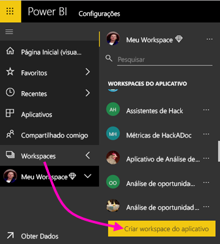
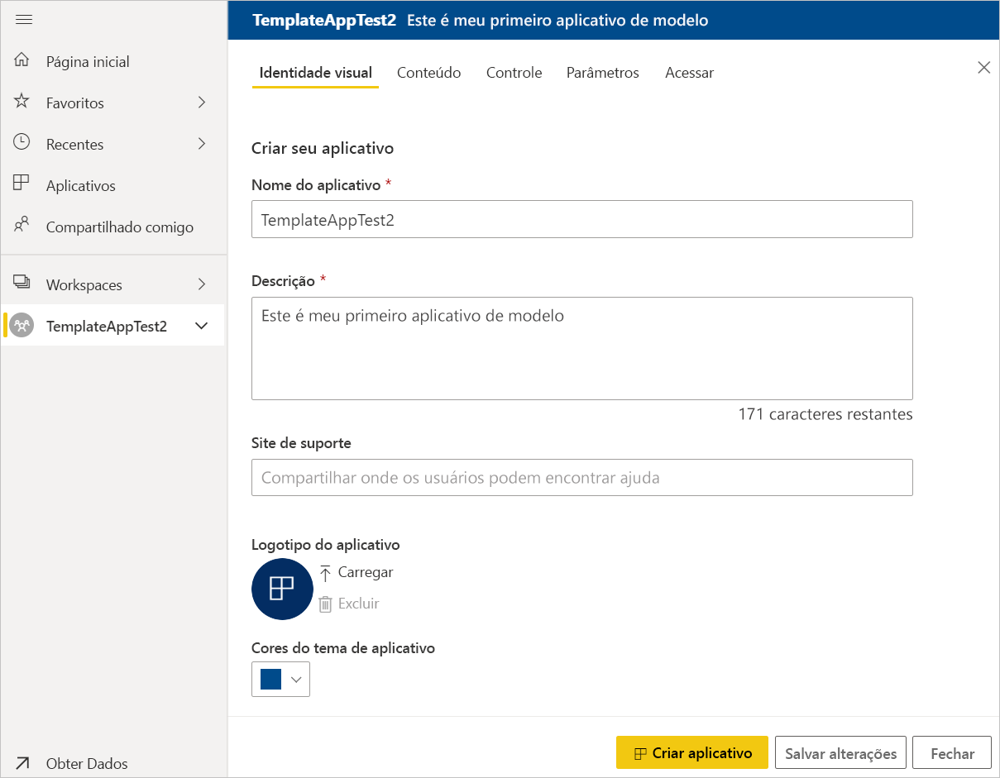
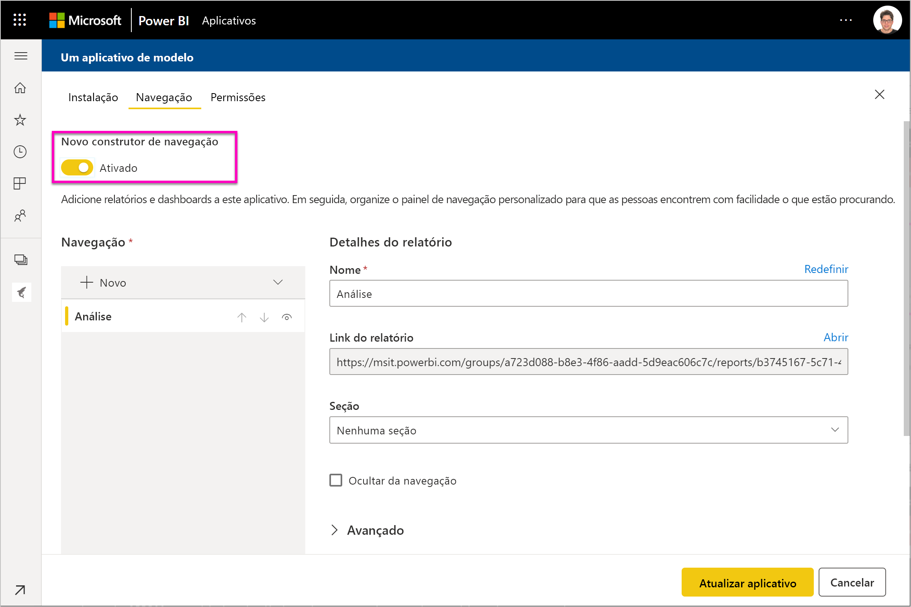
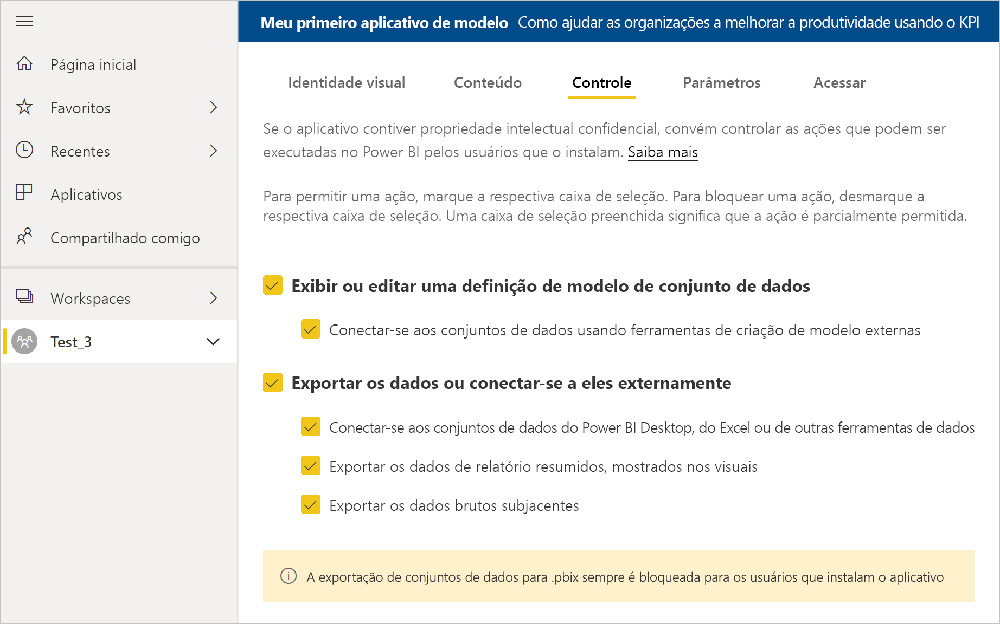

# Criar um aplicativo de modelo no Power BI

Os *aplicativos de modelo* do Power BI permitem que os parceiros do Power BI criem aplicativos com pouca ou nenhuma codificação e os implantem para qualquer cliente do Power BI.  Este artigo contém instruções passo a passo para a criação de um aplicativo de modelo do Power BI.

Se você conseguir criar relatórios e dashboards do Power BI, poderá se tornar um *construtor de aplicativos de modelo* e criar e empacotar o conteúdo analítico em um *aplicativo*. Você pode implantar o aplicativo em outros locatários do Power BI por meio de qualquer plataforma disponível, como o AppSource, ou usando-o em seu próprio serviço Web. Como construtor, você pode criar um pacote de análise protegido para distribuição.

Os administradores de locatários do Power BI controlam e administram quem, em suas organizações, pode criar aplicativos de modelo e quem pode instalá-los. Aqueles usuários que estão autorizados podem instalar o aplicativo de modelo e, em seguida, modificá-lo e distribuí-lo para os consumidores do Power BI em suas organizações.

## Pré-requisitos

Estes são os requisitos para a criação de um aplicativo de modelo:  

- Uma [licença do Power BI Pro](../fundamentals/service-self-service-signup-for-power-bi.md)
- Uma [instalação do Power BI Desktop](../fundamentals/desktop-get-the-desktop.md) (opcional)
- Familiaridade com os [conceitos básicos do Power BI](../fundamentals/service-basic-concepts.md)
- Permissões para compartilhar um aplicativo de modelo publicamente (para obter mais informações, confira [portal de administração, configurações do aplicativo de Modelo](../admin/service-admin-portal.md#template-apps-settings) do Power BI)

## Criar o workspace de modelo

Para criar um aplicativo de modelo que pode ser distribuído para outros locatários do Power BI, você precisa criá-lo em um dos novos workspaces.

1. No serviço do Power BI, selecione **Workspaces** > **Criar um workspace**.

    

2. Em **Criar um workspace**, insira um nome, uma descrição (opcional) e a imagem de logotipo (opcional) para o workspace.

    

4. Expanda a seção **Avançado** e selecione **Desenvolver um aplicativo de modelo**.

    

5. Clique em **Salvar**.
>[!NOTE]
>Você precisa de permissões de administrador do Power BI para promover aplicativos de modelo.

## Adicionar o conteúdo ao workspace do aplicativo de modelo

Assim como ocorre com um workspace comum do Power BI, a próxima etapa será adicionar conteúdo ao workspace.  

- [Crie o conteúdo do Power BI](index.yml) no workspace.

Caso esteja usando parâmetros no Power Query, verifique se eles têm tipos bem definidos (por exemplo, Texto). Não há suporte para os tipos Qualquer e Binário.

O artigo [Dicas para a criação de aplicativos de modelo no Power BI](service-template-apps-tips.md) traz sugestões a serem consideradas ao criar relatórios e painéis para o aplicativo de modelo.

## Definir as propriedades do aplicativo de modelo

Agora que há algum conteúdo no workspace, você está pronto para empacotá-lo em um aplicativo de modelo. A primeira etapa é criar um aplicativo de modelo de teste, acessível somente na organização do locatário.

1. No workspace do aplicativo de modelo, selecione **Criar aplicativo**.

    

    Aqui, você preencherá as opções de compilação adicionais para o aplicativo de modelo, em seis guias:

    **Identidade visual**

    
    - Nome do aplicativo
    - Descrição
    - Site de suporte (o link é apresentado nas informações do aplicativo após a redistribuição do aplicativo de modelo como aplicativo da organização)
    - Logotipo do aplicativo (limite de tamanho do arquivo 45K, taxa de proporção de 1:1, formatos .png, .jpg e .jpeg)
    - Cores do tema de aplicativo

    **Navegação**

    Ative o **Novo construtor de navegação**, no qual você poderá definir o painel de navegação do aplicativo (confira [Projetar a experiência de navegação](../collaborate-share/service-create-distribute-apps.md#design-the-navigation-experience) neste artigo para obter detalhes).

   
    
    **Página de aterrissagem do aplicativo:** Se decidir recusar o construtor de navegação, você terá a opção de selecionar a página de aterrissagem do aplicativo. Defina um relatório ou um dashboard para ser a página de aterrissagem do aplicativo. Use uma página de aterrissagem que dê a impressão certa.

    **Controle**

    Defina limitações e restrições que os usuários do aplicativo terão com o conteúdo do aplicativo. Você pode usar esse controle para proteger propriedade intelectual no seu aplicativo.

    

    >[!NOTE]
    >A exportação para o formato. pbix está sempre bloqueada para usuários que instalam o aplicativo.

    **Parâmetros**

    Os parâmetros são criados no arquivo pbix original (saiba mais sobre [como criar parâmetros de consulta](https://powerbi.microsoft.com/blog/deep-dive-into-query-parameters-and-power-bi-templates/)). Você usará as funcionalidades dessa guia para ajudar o instalador do aplicativo a configurar o aplicativo após a instalação quando os usuários se conectarem aos respectivos dados.

    Nessa guia, você também fornecerá um link para a documentação do aplicativo.

    

    Cada parâmetro tem um nome e uma descrição, que são provenientes da consulta e um campo de valor. Você tem três opções para obter um valor para o parâmetro durante a instalação.

    * Você pode exigir que o instalador insira um valor. Nesse caso, você fornecerá um exemplo que será substituído por eles. Para configurar um parâmetro dessa forma, marque a caixa de seleção **Obrigatório** e dê um exemplo na caixa de texto que mostre ao usuário que tipo de valor é esperado. Por exemplo:

       

    * Forneça um valor previamente preenchido que não poderá ser alterado pelo usuário que instalar o aplicativo. Um parâmetro configurado dessa maneira é ocultado da pessoa que instala o aplicativo. Use esse método somente se tiver certeza de que o valor previamente preenchido é válido para todos os usuários; caso contrário, use o primeiro método mencionado acima que exige a entrada do usuário.

       Para configurar um parâmetro dessa forma, insira o valor na caixa de texto **Valor** e clique no ícone de cadeado. Isso faz com que o valor não possa ser alterado. Por exemplo:

       

    * Forneça um valor padrão que poderá ser alterado pelo usuário durante a instalação. Para configurar um parâmetro dessa forma, insira o valor padrão desejado na caixa de texto **Valor** e mantenha o ícone de cadeado aberto. Por exemplo:

      

    **Autenticação**
    
    Nessa guia, selecione o método de autenticação que será usado. As opções disponíveis dependem dos tipos de fontes de dados que estão sendo usados.

    

    O nível de privacidade é configurado automaticamente:
   * Fonte de dados única: configurada automaticamente como particular.
   * Fonte de dados múltipla anônima: configurada automaticamente como pública.

    **Acesso**
    
    Na fase de teste, decida quais outras pessoas da sua organização podem instalar e testar o aplicativo. Não se preocupe, pois você sempre poderá voltar e alterar essas configurações posteriormente. A configuração não afeta o acesso do aplicativo de modelo distribuído.

    

2. Selecione **Criar aplicativo**.

    Você verá uma mensagem indicando que o aplicativo de teste está pronto, com um link para copiar e compartilhar com os testadores do aplicativo.

    

    Você também realizou a primeira etapa do processo de gerenciamento de versão, que é descrita a seguir.

## Gerenciar a versão do aplicativo de modelo

Antes de liberar esse aplicativo de modelo publicamente, é recomendável verificar se ele está pronto para liberação. O Power BI criou o painel de gerenciamento de versão, no qual você pode seguir e inspecionar o caminho completo da versão do aplicativo. Você também pode disparar a transição de um estágio a outro. Os estágios comuns são:

- Gerar um aplicativo de teste: para teste apenas na sua organização.
- Promover o pacote de teste ao estágio de pré-produção: teste fora de sua organização.
- Promover o pacote de pré-produção à produção: versão de produção.
- Exclua qualquer pacote ou comece novamente no estágio anterior.

O URL não muda quando você se move entre os estágios de lançamento. A promoção não afeta a URL em si.

Vamos percorrer os estágios:

1. No workspace de modelo, selecione **Gerenciamento de Versão**.

    

2. Selecione **Obter link** se você criou o aplicativo de teste na seção **Criar o aplicativo de modelo de teste** acima (como resultado, o ponto amarelo ao lado de **Testando** já está preenchido).

    Se você ainda não criou o aplicativo, selecione **Criar aplicativo**. Isso levará você novamente ao processo de criação do aplicativo de modelo.

    

4. Para testar a experiência de instalação do aplicativo, copie o link da janela de notificação e cole-o em uma nova janela do navegador.

    Nela, você seguirá o mesmo procedimento que os clientes seguirão. Confira [Instalar e distribuir aplicativos de modelo na sua organização](service-template-apps-install-distribute.md).

5. Na caixa de diálogo, selecione **Instalar**.

    Quando a instalação for bem-sucedida, você verá uma notificação indicando que o novo aplicativo está pronto.

6. Selecione **Ir para o aplicativo**.
7. Em **Introdução ao novo aplicativo**, você verá o aplicativo como ele será exibido para os clientes.

    
8. Selecione **Explorar Aplicativo** para verificar o aplicativo de teste com os dados de exemplo.
9. Para fazer alterações, volte ao aplicativo no workspace original. Atualize o aplicativo de teste até ficar satisfeito.
10. Quando estiver pronto para promover o aplicativo à pré-produção para testes adicionais fora do locatário, volte ao painel **Release Management** e selecione **Promover aplicativo**.

    
    >[!NOTE]
    > Quando o aplicativo é promovido, ele se torna disponível publicamente fora da sua organização.

    Se essa opção não for exibida, contate o administrador do Power BI para que ele conceda [permissões de desenvolvimento de aplicativos de modelo](../admin/service-admin-portal.md#template-apps-settings) no portal de administração.
11. Selecione **Promover** para confirmar sua escolha.
12. Copie essa nova URL para compartilhamento fora do locatário para teste. Esse link também é aquele que você enviará para iniciar o processo de distribuição do aplicativo no AppSource ao criar uma [oferta da Central de Parceiros](https://docs.microsoft.com/azure/marketplace/partner-center-portal/create-power-bi-app-offer). Envie somente links de pré-produção para a Central de Parceiros. Somente depois que o aplicativo for aprovado e você receber uma notificação de que ele foi publicado no AppSource é que esse pacote poderá ser promovido para produção no Power BI.
13. Quando o aplicativo estiver pronto para produção ou compartilhamento por meio do AppSource, volte ao painel **Gerenciamento de Versão** e selecione **Promover aplicativo** ao lado de **Pré-produção**.
14. Selecione **Promover** para confirmar sua escolha.

    Agora o aplicativo está em produção e pronto para distribuição.

    

Para disponibilizar o aplicativo amplamente para milhares de usuários do Power BI no mundo, recomendamos que você o envie ao AppSource. Confira a [oferta do Aplicativo do Power BI](https://docs.microsoft.com/azure/marketplace/partner-center-portal/create-power-bi-app-offer) para obter mais detalhes.

## Próximas etapas

Veja como os clientes interagem com o aplicativo de modelo em [Instalar, personalizar e distribuir aplicativos de modelo em sua organização](service-template-apps-install-distribute.md).

Confira a [oferta do Aplicativo do Power BI](https://docs.microsoft.com/azure/marketplace/partner-center-portal/create-power-bi-app-offer) para obter mais detalhes sobre como distribuir o aplicativo.
