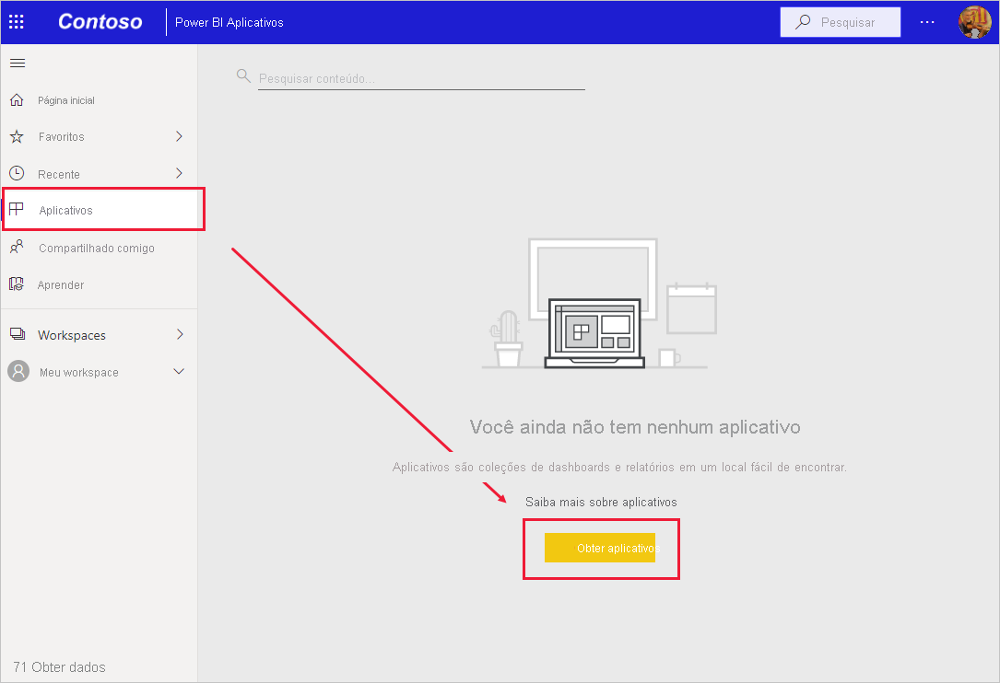
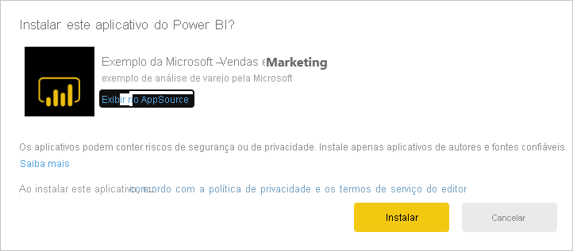
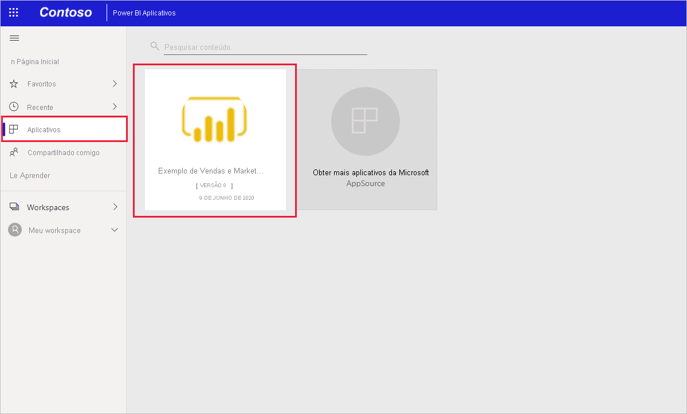
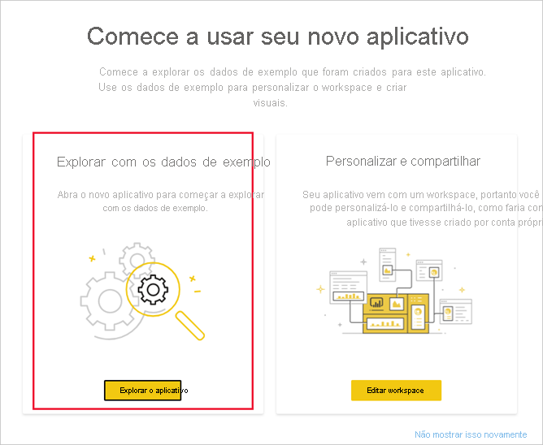

# Instalar e usar o aplicativo de Vendas e Marketing de exemplo no serviço do Power BI

[!INCLUDE[consumer-appliesto-yyny](../includes/consumer-appliesto-yyny.md)]

Agora que você tem uma [compreensão básica de como obter o conteúdo do Power BI](end-user-app-view.md), vamos obter o aplicativo de Vendas e Marketing do Microsoft AppSource (appsource.com). 

## Obter o aplicativo do marketplace de aplicativos do Power BI

1. [Entre no serviço do Power BI](./end-user-sign-in.md), se você ainda não tiver feito isso. 

1. Quando estiver no Power BI, selecione **Aplicativos > Obter aplicativos**. 

    

1. O marketplace de aplicativos do Power BI é aberto. Encontre o aplicativo de Vendas e Marketing. Se você não o encontrar, tente digitar "vendas" na caixa de pesquisa.

    

1. Clique no bloco do aplicativo. A oferta do aplicativo no AppSource será aberta. Clique em **OBTER AGORA**.

   

1. Confirme que deseja instalar o aplicativo.

   

5. O serviço do Power BI exibirá uma mensagem quando o aplicativo for instalado. Selecione **Ir para o aplicativo** para abri-lo. De acordo com o designer que criou o aplicativo, será exibido o dashboard ou o relatório.

    

    Também é possível abrir o aplicativo diretamente na lista de conteúdo do aplicativo selecionando **Aplicativos** e escolhendo **Vendas e Marketing**.

    

6. Escolha se deseja explorar ou personalizar e compartilhar seu novo aplicativo. Como selecionamos um aplicativo de exemplo da Microsoft, vamos começar explorando. 

    

7.  Seu novo aplicativo é aberto com um dashboard. O *designer* de aplicativo pode ter definido o aplicativo para ser aberto em um relatório.  

    

## Interagir com os dashboards e relatórios no aplicativo
Reserve algum tempo para explorar os dados nos dashboards e relatórios que compõem o aplicativo. Você tem acesso a todas as interações padrão do Power BI, como filtragem, realce, classificação e busca detalhada.  Ainda está um pouco confuso com a diferença entre dashboards e relatórios?  Leia o [artigo sobre dashboards](end-user-dashboards.md) e o [artigo sobre relatórios](end-user-reports.md).  

## Próximas etapas
* [Voltar para a visão geral de aplicativos](end-user-apps.md)
* [Exibir um relatório do Power BI](end-user-report-open.md)
* [Outras maneiras como o conteúdo é compartilhado com você](end-user-shared-with-me.md)
