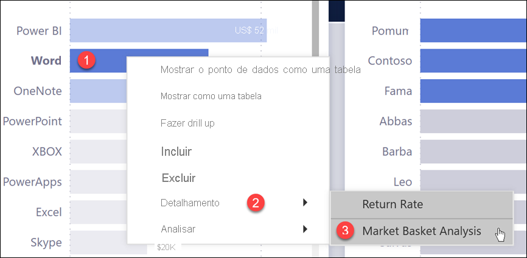
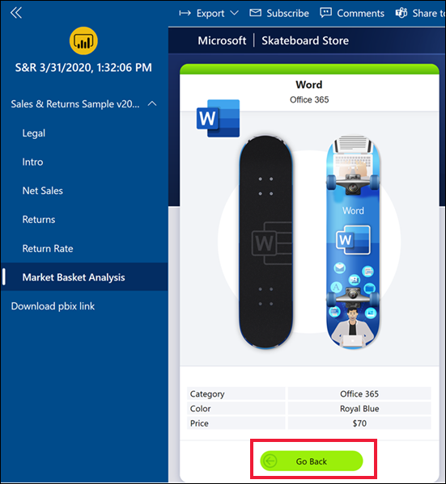
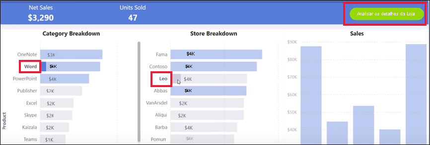
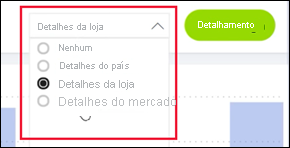
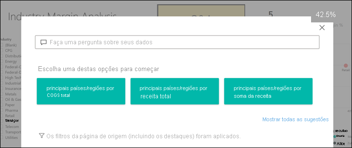

# Botões no serviço do Power BI
Nos relatórios recebidos de colegas, você pode ter notado botões e se perguntado como usá-los. Alguns têm palavras, alguns têm setas, outras têm elementos gráficos e outros ainda têm até mesmo menus suspensos. Este artigo ensinará você a reconhecer um botão e como descobrir o que fazer com ele.

## Como reconhecer um botão
Os botões podem se parecer muito como formas, imagens ou ícones em uma página de relatório. Porém, se ocorre uma ação quando você o seleciona (clica), provavelmente se trata de um botão.

## Tipos de botões
Os criadores de relatório adicionam botões a relatórios para ajudar na navegação e na exploração. Os tipos de botões são: **Voltar**, **Indicador**, **Detalhamento**, **Navegação na página**, **P e R** e **URL da Web**. 

### Botões Voltar 
Um botão Voltar pode ter um ícone de seta e, ao selecioná-lo, o Power BI leva você de volta à página anterior.  Os botões Voltar geralmente são usados com detalhamento. Aqui está um exemplo de um botão voltar usado com detalhamento.

1. Selecione **Word** no gráfico de barras.
1. Selecione **Detalhar** e escolha **Análise de cesta de mercado**.

    

    Ao escolher **Análise da cesta de mercado**, o Power BI abre a página *Análise da cesta de mercado* e usa as seleções feitas na página de origem para filtrar o que é mostrado na página destino.

    

    Agora você está na página de relatório **Análise da cesta de mercado**, que é filtrada para o Word. Para retornar à página anterior, selecione o botão Voltar. 

## Botões de indicador
Os designers de relatórios geralmente incluem indicadores com seus relatórios. Você pode exibir a lista de indicadores de relatório selecionando **Exibir** > **Indicadores** no canto superior direito. Quando um designer de relatórios adiciona um *botão* de indicador, essa é apenas um modo alternativo de navegar até a página de relatório específica que está associada a esse indicador. A página terá os filtros aplicados e as configurações que são capturadas pelo indicador. [Saiba mais sobre indicadores no Power BI](end-user-bookmarks.md). 

Neste exemplo, o botão tem um ícone de indicador e o nome do indicador, *Urbano*. 

Ao escolher o botão de indicador, o Power BI levará você para o local e as configurações conforme definido para esse indicador.  Nesse caso, o indicador está na página de relatório *Oportunidades de crescimento* e essa página é filtrada de maneira cruzada para **Urbano**.

## Botões de detalhamento
Há duas maneiras de detalhar no serviço do Power BI. O detalhamento leva você para uma página de relatório diferente e os dados nessa página de destino são apresentados de acordo com os filtros e as seleções feitas na página de origem.

Um modo de detalhar um relatório é clicar com o botão direito do mouse em um ponto de dados em um visual, selecionar **Detalhar** e escolher o destino. Esse método é descrito acima na seção intitulada **Botão Voltar**. Porém, às vezes, os designers de relatório usam um *botão* de detalhamento para tornar a ação mais óbvia e chamar a atenção para informações importantes.  

Os botões de detalhamento podem ter mais de um pré-requisito. A menos que você cumpra todos os pré-requisitos, o botão não funcionará. Vejamos um exemplo.

Aqui está um botão de detalhamento que nos levará para a página *Detalhes da loja*. Focalizar o botão revela uma dica de ferramenta que nos permite saber que precisamos selecionar tanto uma loja quanto um produto. Até selecionarmos um de cada, o botão permanecerá inativo.

Agora que selecionamos um produto (**Word**) e uma loja (**Leo**), o botão muda de cor para nos informar que ele agora está ativo.

A seleção do botão de detalhamento nos leva à página do relatório *Loja*. A página *Loja* é filtrada para nossas seleções de **Word** e **Leo**.

Os botões de detalhamento também podem ter menus suspensos que oferecem a você uma opção de destinos. Depois de fazer suas seleções na página do relatório de origem, selecione a página de relatório de destino para o detalhamento. No exemplo a seguir, estamos alterando nossa seleção para detalhar a página de relatório *Detalhes do mercado*. 

## Navegação na página

Os botões de navegação de página levam você a uma página diferente no mesmo relatório. Os designers de relatórios geralmente criam botões de navegação para contar uma história ou orientá-lo durante os insights do relatório. No exemplo a seguir, o designer de relatórios adicionou um botão em cada página de relatório que o leva para a primeira página, a página de resumo de nível superior, no relatório. Este botão de navegação de página é útil porque esse relatório tem muitas páginas.

## Botões de P e R 
A seleção de um botão de P e R abre a janela do Explorador de P e R do Power BI. A janela de P e R é exibida na parte superior da página do relatório e pode ser fechada selecionando o X. [Saiba mais sobre P e R](end-user-q-and-a.md)

## URL da Web
Botões de URL da Web abrem uma nova janela do navegador. Os designers de relatórios podem adicionar esse tipo de botão como uma fonte de referência para vincular ao site corporativo ou até mesmo como um link para um relatório ou dashboard diferente. No exemplo a seguir, o botão URL da Web permite que você baixe o arquivo de origem do relatório. 

Como a página é aberta em uma janela separada, feche a janela ou selecione a guia Power BI para retornar ao relatório do Power BI.

## Próximas etapas
[Indicadores](end-user-bookmarks.md)    
[Fazer drill up, fazer drill down](end-user-drill.md)
