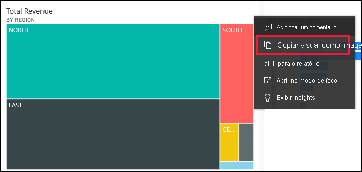
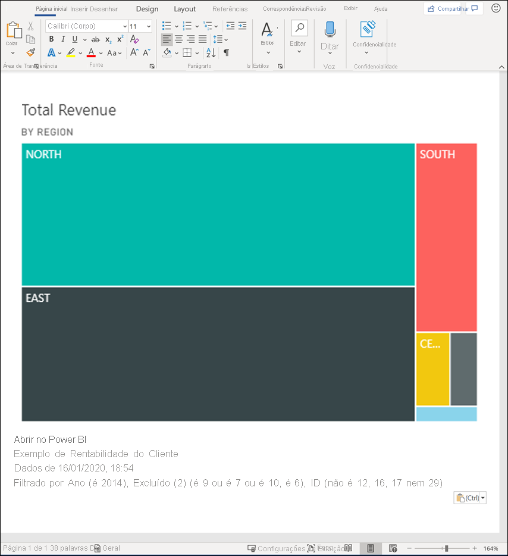
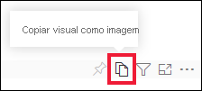
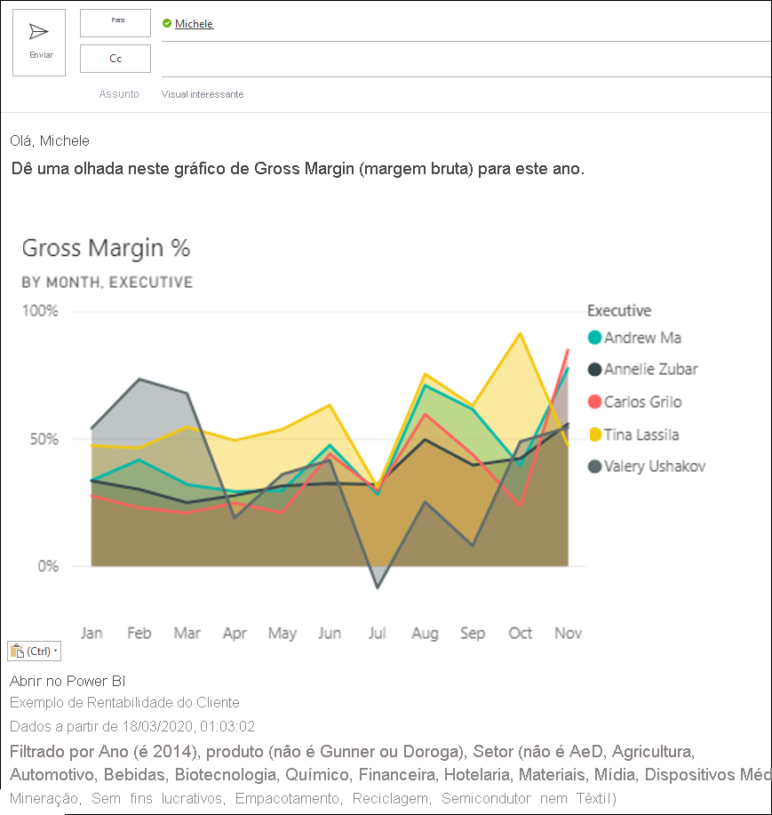
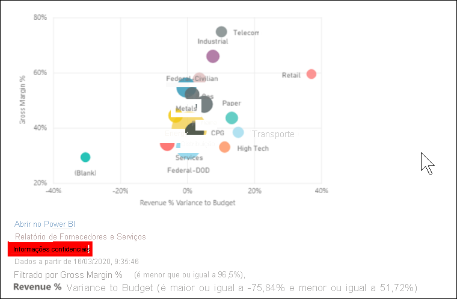
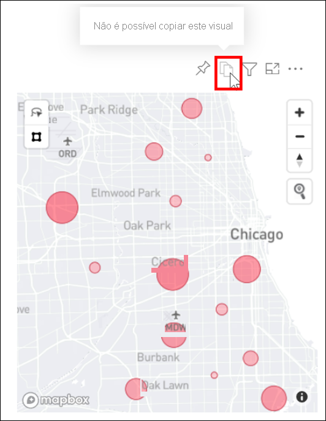

# Copiar um visual como uma imagem para a área de transferência

[!INCLUDE[consumer-appliesto-yyyn](../includes/consumer-appliesto-yyyn.md)]

Você já quis compartilhar uma imagem de um relatório ou dashboard do Power BI? Agora você pode copiar o visual e colá-lo em qualquer outro aplicativo compatível com colagem. 

Quando você copia uma imagem estática de um Visual, obtém uma cópia do visual, junto com os metadados. Isso inclui:
* link de volta para o relatório ou dashboard do Power BI
* título do relatório ou dashboard
* observe se a imagem contém informações confidenciais
* carimbo de data/hora da última atualização
* filtros aplicados ao visual

### Copiar de um bloco do dashboard

1. Navegue até o dashboard do qual você deseja copiar.

2. No canto superior direito do visual, selecione **Mais ações(...)** e escolha **Copiar visual como imagem**. 

    

3. Quando a caixa de diálogo **Seu visual está pronto para copiar** é exibida, selecione **Copiar para a área de transferência**.

    

4. Depois que o visual for copiado, cole-o em outro aplicativo usando **Ctrl+V** ou clique com o botão direito do mouse > Colar. Na captura de tela abaixo, colamos o visual no Microsoft Word. 

    

### Copiar de um visual de relatório 

1. Navegue até o relatório do qual você deseja copiar.

2. No canto superior direito do visual, selecione o ícone para **Copiar visual como imagem**. 

    

3. Quando a caixa de diálogo **Seu visual está pronto para copiar** é exibida, selecione **Copiar para a área de transferência**.

    

4. Depois que o visual for copiado, cole-o em outro aplicativo usando **Ctrl+V** ou clique com o botão direito do mouse > Colar. Na captura de tela abaixo, colamos o visual em um email.

    

5. Se houver um rótulo de confidencialidade de dados aplicado ao relatório, você receberá um aviso quando selecionar o ícone de cópia.  

    

    Além disso, um rótulo de confidencialidade será adicionado aos metadados abaixo do visual colado. 

    

## Considerações e solução de problemas

   

P: Por que o ícone de Cópia está desabilitado em um visual?    
R: Atualmente, damos suporte a visuais nativos do Power BI e visuais personalizados certificados. A compatibilidade é limitada com determinados elementos visuais, incluindo: 
- ESRI e outros visuais de mapa 
- Visuais de Python 
- Visuais do R 
- PowerApps    

R: A capacidade de copiar um visual pode ser desativada pelo seu departamento de TI ou pelo administrador do Power BI.

P: Por que meu visual não está sendo colado corretamente?    
R: Há limitações para visuais personalizados e animados. 

## Próximas etapas
Mais sobre [Visualizações nos relatórios do Power BI](end-user-visual-type.md)

Mais perguntas? [Experimente a Comunidade do Power BI](https://community.powerbi.com/)

