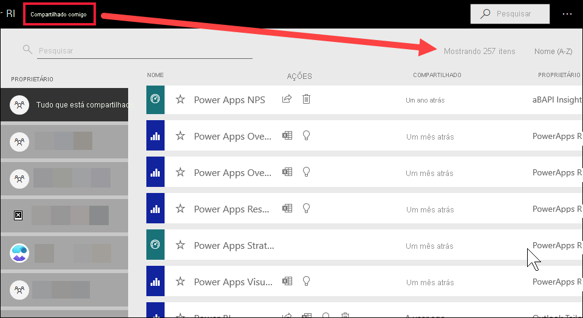

# Navegação para consumidores do Power BI: pesquisa global

[!INCLUDE[consumer-appliesto-yyny](../includes/consumer-appliesto-yyny.md)]

[!INCLUDE [power-bi-service-new-look-include](../includes/power-bi-service-new-look-include.md)]

Quando você é novo no serviço Power BI, tem pouco conteúdo (dashboards, relatórios, aplicativos). Porém, conforme os colegas começarem a compartilhar conteúdo com você e você começar a baixar aplicativos, será possível ter longas listas de conteúdo. É nesse momento que você descobrirá que a pesquisa e a classificação são extremamente úteis.

## Pesquisar por conteúdo
 A pesquisa está disponível em quase todas as partes do serviço do Power BI. Procure a caixa ou o ícone de pesquisa .

 No campo Pesquisar, digite todo ou parte do nome de um dashboard, relatório, pasta de trabalho, aplicativo ou proprietário. O Power BI pesquisa em todo o seu conteúdo. 

  

 Em algumas áreas do Power BI, como workspaces, você encontrará dois campos de pesquisa diferentes. O campo de pesquisa na barra de menus pesquisa todo o conteúdo, enquanto o campo de pesquisa na tela do workspace pesquisa apenas esse workspace.

  

## Classificar listas de conteúdo

Se você tiver pouco conteúdo, não será necessário classificar.  Porém, quando você tiver listas longas de dashboards e relatórios, a classificação o ajudará a encontrar o que você precisa. Por exemplo, esta lista de conteúdo **Compartilhado comigo** tem 257 itens. 

No momento, essa lista de conteúdo é classificada alfabeticamente por nome, de A a Z. Para alterar os critérios de classificação, selecione a seta à direita de **Nome (A-Z)** .

A classificação também está disponível em workspaces. Neste exemplo, o conteúdo está classificado por data de **Atualização**. Para definir critérios de classificação para workspaces, selecione cabeçalhos de coluna, clique uma vez para escolher o cabeçalho e selecione novamente para alterar a direção da classificação. 

Nem todas as colunas podem ser classificadas. Posicione o cursor sobre os títulos de coluna para descobrir quais deles podem ser classificados.

## Considerações e solução de problemas
* Para conjuntos de dados, a opção **Classificar por** não está disponível pelo proprietário.

## Próximas etapas
[Classificar visuais em relatórios](end-user-change-sort.md)

[Classificação de dados em visuais](end-user-change-sort.md)

Mais perguntas? [Experimente a Comunidade do Power BI](https://community.powerbi.com/)
