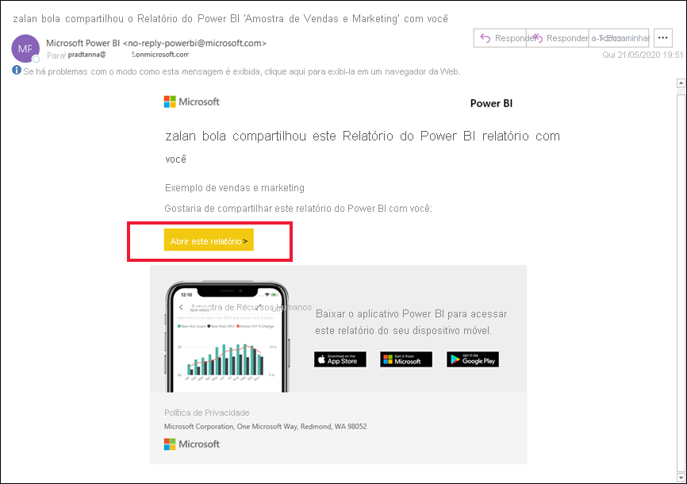
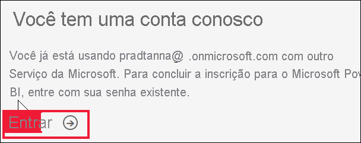
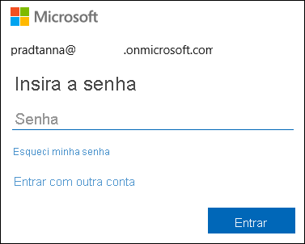
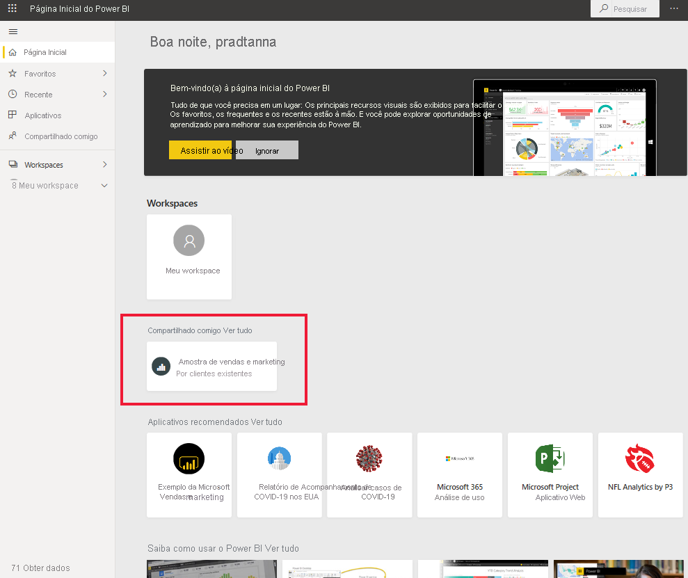

# Entrar no serviço do Power BI

[!INCLUDE[consumer-appliesto-yynn](../includes/consumer-appliesto-yynn.md)]

## Contas do Power BI
Antes de poder entrar no Power BI, você precisará de uma conta. Há duas maneiras de obter a conta do Power BI. A primeira é quando sua organização compra licenças do Power BI para seus funcionários. E a segunda é quando [indivíduos se inscrevem para licenças pessoais ou avaliações gratuitas](../fundamentals/service-self-service-signup-for-power-bi.md). Este artigo aborda o primeiro cenário.

## Entrar pela primeira vez

### Etapa 1: abra o serviço do Power BI
O serviço do Power BI é executado em um navegador. 

- Se você recebeu um email de um colega, com um link para um dashboard ou relatório, selecione o link para **Abrir este relatório** ou **Abrir este dashboard**.

        

- Caso contrário, abra seu navegador favorito e digite **app.powerbi.com**.

        

### Etapa 2: digite seu endereço de email
Na primeira vez que você entrar, a Microsoft verificará se você já tem uma conta do Microsoft 365. No exemplo a seguir, Marina já tem uma licença para outros serviços da Microsoft. 

Digite sua senha. Esta é sua senha da conta do Microsoft 365. É o mesmo email e senha que usa para outros produtos da Microsoft, como o Outlook e o Office.  Dependendo de como sua conta está configurada, você também pode ser solicitado a inserir um código enviado para seu email ou dispositivo móvel.   

Às vezes, seu administrador global atribuirá uma licença a você e enviará um email com essas informações. Procure um email de boas-vindas em sua Caixa de Entrada e siga as instruções para entrar pela primeira vez. Use essa conta de email para entrar. 
 
### Etapa 3: revise os termos e condições
Revise os termos e condições e, se concordar, marque a caixa de seleção e escolha **Iniciar**.

### Etapa 4: revise sua página inicial
Na sua primeira visita, o Power BI abre sua **Página Inicial**. Se a **Página Inicial** não abrir, selecione-a no painel de navegação. 

Na Página Inicial, você verá todo o conteúdo que tem permissão para usar. No início, pode não haver muito conteúdo, mas não se preocupe, isso mudará quando você começar a usar o Power BI com seus colegas. Lembra-se do relatório que seu colega compartilhou com você por email? Ele está em sua Página Inicial, no cabeçalho **Compartilhado comigo**.

Se não quiser que o Power BI abra a Página Inicial, você poderá [definir um relatório ou um painel **Em destaque**](end-user-featured.md) para ser aberto. 

## Interagir com o conteúdo de modo seguro
Como um ***consumidor***, outras pessoas compartilharão conteúdo com você e você poderá interagir com esse conteúdo para explorar os dados e tomar decisões de negócios.  Ao filtrar, segmentar, assinar, exportar e redimensionar conteúdo, não se preocupe – seu trabalho não está afetando o conjunto de dados subjacente nem o conteúdo compartilhado original (dashboards e relatórios). O Power BI é um espaço seguro para exploração e experimentação. Isso não significa que você não é possível salvar suas alterações – você pode fazê-lo. Mas essas alterações afetam apenas a **sua** exibição do conteúdo. E reverter para o modo de exibição padrão original é tão fácil quanto clicar em um botão.

## Sair do serviço do Power BI
Quando você fecha ou sai do Power BI, suas alterações são salvas para que você possa recomeçar bem do ponto em que parou.

Para fechar o Power BI, feche a guia do navegador em que você está trabalhando. 

 

Se você compartilha um computador, é recomendável sair sempre que fechar o Power BI.  Para sair, no canto superior direito, selecione sua imagem de perfil e escolha **Sair**.  

 

## Considerações e solução de problemas
- Se você se inscrever no Power BI como um indivíduo, entre com o endereço de email que usou para se inscrever.

- Algumas pessoas usam o Power BI com mais de uma conta. Nesse caso, ao entrar, você será solicitado a selecionar uma conta em uma lista. 

## Próximas etapas
[Exibir um aplicativo do Power BI](end-user-app-view.md)
