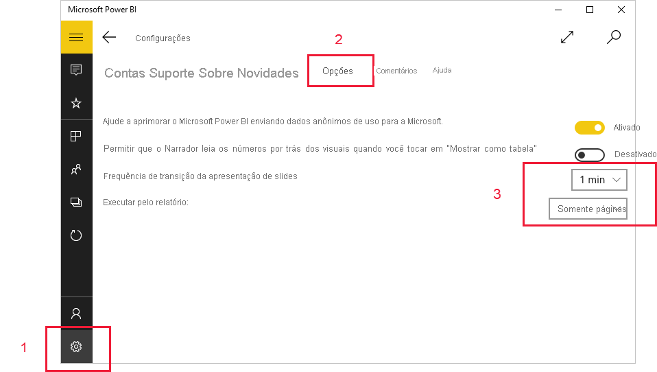

# Exibir relatórios e dashboards no modo de apresentação no Surface Hub e em dispositivos Windows 10
É possível usar o modo de apresentação para exibir relatórios e dashboards em tela inteira em dispositivos Windows 10 e no Surface Hub. O modo de apresentação é útil para a exibição do Power BI em reuniões ou conferências ou em um projetor dedicado no escritório ou até mesmo para maximizar o espaço em uma tela pequena.

No modo de apresentação:
* Todos os "cromados" (como as barras de navegação e de menu) desaparecem, facilitando o foco nos dados de seu relatório.
* Uma barra de ferramentas de ação fica disponível para permitir que você interaja com seus dados e controle a apresentação.
* Você pode reproduzir uma apresentação de slides que circule automaticamente entre páginas e indicadores ou ambos.

>[!NOTE]
>O suporte de aplicativo móvel Power BI para **telefones que usam o Windows 10 Mobile** será descontinuado em 16 de março de 2021. [Saiba mais](https://go.microsoft.com/fwlink/?linkid=2121400)

## Usar modo de apresentação
No aplicativo móvel do Power BI, toque no ícone **Tela inteira** para ir para o modo de tela inteira.
 O cromado do aplicativo desaparece, e uma barra de ferramentas de ação é exibida na parte inferior da tela ou nos lados esquerdo e direito (depende do tamanho da tela).

Na barra de ferramentas, você pode tocar para executar as seguintes ações:

|||
|-|-|
||**Voltar** à página anterior. Um toque longo no ícone exibirá as janelas de trilha, permitindo que você navegue até a pasta que contém seu relatório ou dashboard.|
||**Alternar páginas**, para ir a outra página do relatório na apresentação.|
||**Aplicar um indicador** para apresentar a exibição específica dos dados que o indicador captura. Você pode aplicar indicadores pessoais e de relatório.|
||**Escolher uma cor de tinta**, quando você usar a caneta do Surface para desenhar e fazer anotações em sua página de relatório.|
||**Apagar marcas de tinta** que você pode ter feito com a caneta do Surface ao desenhar e fazer anotações na página de relatório.          |
||**Redefinir para a exibição padrão** e desmarcar os filtros, as segmentações ou outras alterações na exibição de dados que você tenha feito durante a apresentação.|
||**Compartilhar** uma imagem do modo de exibição de apresentação com seus colegas. A imagem incluirá as anotações feitas com a caneta Surface durante a apresentação.|
||**Atualizar** o relatório.|
||**Reproduzir a apresentação de slides**, ocultando a barra de ação e iniciando a apresentação de slides. Um seletor permite que você opte por girar automaticamente entre páginas e indicadores ou ambos. Por padrão, a apresentação de slides gira automaticamente entre as páginas uma vez a cada 30 segundos. Você pode alterar essas configurações em [**Configurações > Opções**](#slideshow-settings). Confira [mais detalhes](#slideshows) sobre apresentações de slides|
||**Sair** do modo de apresentação.|
||**Pesquisar** outros artefatos no Power BI.|

É possível desencaixar a barra de ferramentas, arrastá-la e soltá-la em qualquer lugar da tela. Isso é útil para grandes telas, quando você desejar se concentrar em uma área específica em seu relatório e desejar ter as ferramentas disponíveis ao lado dela. Basta colocar o dedo na barra de ferramentas e passá-la para a tela de relatório.

## Apresentações de slides

É possível configurar a apresentação de slides para ser reproduzida automaticamente. Você pode defini-la para percorrer as páginas e os indicadores ou ambos.

Quando você seleciona o botão **Reproduzir** na barra de ferramentas de ação, a apresentação de slides é iniciada. É exibido um controle que permite pausar a apresentação de slides ou alterar o que está sendo reproduzido: páginas, indicadores ou ambos.

 O controlador mostra o nome da exibição mostrada no momento (página ou indicador e página). Na imagem acima, vemos que, no relatório chamado **Vendas**, estamos exibindo o indicador **Pacífico Asiático** na página **Desempenho de Vendas**.

### Configurações da apresentação de slides

Por padrão, uma apresentação de slides percorre páginas, à taxa de uma a cada 30 segundos. Você pode alterar essas configurações padrão acessando **Configurações > Opções**, conforme ilustrado abaixo.

## Próximas etapas
* [Exibir painéis e relatórios no modo de tela inteira do serviço do Power BI](../end-user-focus.md)
* Dúvidas? [Experimente perguntar à Comunidade do Power BI](https://community.powerbi.com/)
