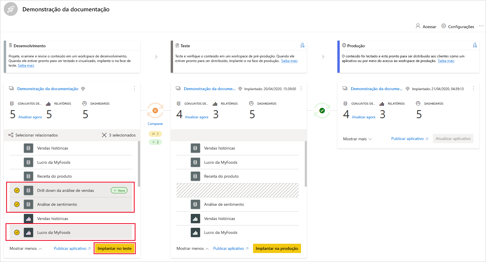
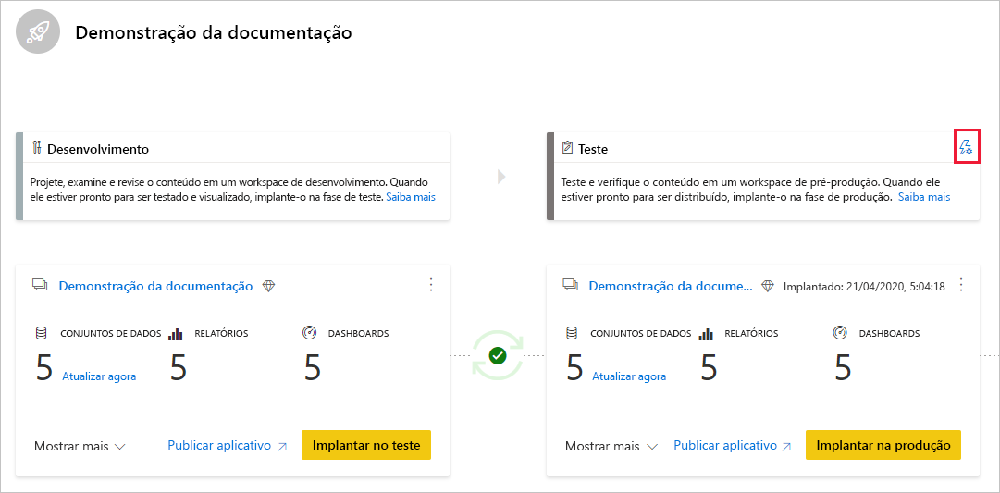
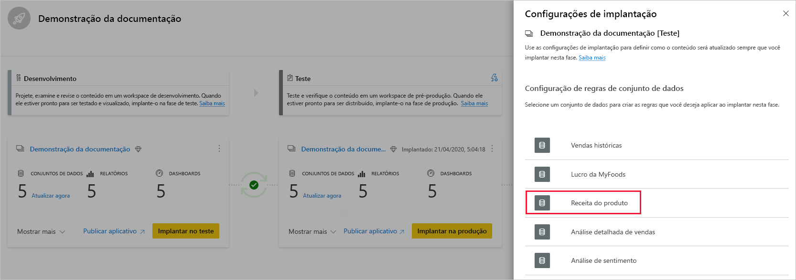
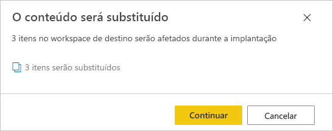

# Introdução aos pipelines de implantação (versão prévia)

Este artigo orienta você pelas configurações básicas necessárias para usar os pipelines de implantação.

## Como acessar os pipelines de implantação

Você poderá acessar o recurso de pipelines de implantação se as seguintes condições forem atendidas:

* Você é um [usuário do Power BI Pro](../admin/service-admin-purchasing-power-bi-pro.md)

* Você pertence a uma organização que tem capacidade Premium

* Você é administrador de uma [nova experiência de workspace](../collaborate-share/service-create-the-new-workspaces.md)

>[!NOTE]
> Você também poderá ver o botão de pipelines de implantação se tiver criado anteriormente um pipeline ou se um pipeline tiver sido compartilhado com você.

## Etapa 1 – criar um pipeline de implantação

Para criar um pipeline de implantação, faça o seguinte:

1. No serviço do Power BI, no painel de navegação, selecione **Pipelines de implantação** e clique em **Criar pipeline**.

2. Na caixa de diálogo *Criar um pipeline de implantação*, insira um nome e uma descrição para o pipeline e clique em **Criar**.

Depois que o pipeline for criado, você poderá compartilhá-lo com outros usuários ou excluí-lo. Quando você compartilha um pipeline com outras pessoas, os usuários com os quais você compartilhou recebem [acesso ao pipeline](deployment-pipelines-process.md#user-with-pipeline-access). O acesso ao pipeline permite que os usuários exibam, compartilhem, editem e excluam o pipeline.

## Etapa 2 – atribuir um workspace a um pipeline de implantação

Depois de criar um pipeline, você precisa adicionar a ele o conteúdo que deseja gerenciar. Adiciona conteúdo ao pipeline atribuindo um workspace ao estágio do pipeline. É possível atribuir um workspace a qualquer estágio. 

Você pode atribuir um workspace a um pipeline de implantação. Os pipelines de implantação criarão clones do conteúdo do workspace, para serem usados em diferentes estágios do pipeline.

Siga estas etapas para atribuir um workspace em um pipeline de implantação:

1. No pipeline de implantação criado recentemente, clique em **Atribuir um workspace**.

2. No menu suspenso *Escolha o workspace*, selecione o workspace que você deseja atribuir ao pipeline.

3. Selecione o estágio ao qual você deseja atribuir o workspace.

### Limitações de atribuição do workspace

* O workspace deve ser uma [nova experiência de workspace](../collaborate-share/service-create-the-new-workspaces.md).

* Você deve ser um administrador do workspace.

* O workspace não está atribuído a nenhum outro pipeline.

* O workspace deve residir em uma [capacidade premium](../admin/service-premium-what-is.md).

* Não é possível atribuir um workspace com [exemplos do Power BI](../create-reports/sample-datasets.md) a um estágio de pipeline.

>[!NOTE]
>Somente workspaces que podem ser usados com pipelines de implantação serão mostrados na lista de workspaces que você pode selecionar.

## Etapa 3 – implantar em um estágio vazio

Qualquer [usuário pro](../admin/service-admin-purchasing-power-bi-pro.md) que seja membro ou administrador no workspace de origem pode implantar conteúdo em um estágio vazio (um estágio que não possui conteúdo). O workspace deve residir em uma capacidade para a implantação ser concluída.

Ao implantar o conteúdo em um estágio vazio, as relações entre os itens são mantidas. Por exemplo, um relatório associado a um conjunto de dados no estágio de origem será clonado com seu conjunto de dados, e os clones serão vinculados da mesma forma no workspace de destino.

Depois que a implantação for concluída, atualize o conjunto de dados. Para obter mais informações, confira [implantar conteúdo em um estágio vazio](deployment-pipelines-process.md#deploying-content-to-an-empty-stage).

### Implantar todo o conteúdo

Selecione o estágio a ser implantado e clique no botão de implantação. O processo de implantação cria um workspace duplicado no estágio de destino. Esse workspace inclui todo o conteúdo existente no estágio atual.

### Implantação seletiva

Para implantar apenas itens específicos, clique no link **Mostrar mais** e selecione os itens que você deseja implantar. Ao clicar no botão implantar, somente os itens selecionados são implantados no próximo estágio.

Como os dashboards, relatórios e conjuntos de dados estão relacionados e têm dependências, você pode usar o botão de seleção para marcar todos os itens dos quais eles são dependentes. Por exemplo, se você quiser implantar um relatório no próximo estágio, clicar no botão de seleção relacionado marcará o conjunto de dados ao qual o relatório está conectado, para que ambos sejam implantados de uma só vez e o relatório não seja interrompido.

>[!NOTE]
> * Não será possível implantar um relatório ou dashboard no próximo estágio se os itens dos quais eles dependem não existirem no estágio em que você está implantando.
> * Você poderá obter resultados inesperados se optar por implantar um relatório ou dashboard o conjunto de dados correspondente. Isso pode acontecer quando o conjunto de dados no estágio de destino é alterado e não é mais idêntico ao do estágio no qual você está implantando.

### Implantação em estágios anteriores

Você pode optar por implantar em um estágio anterior, por exemplo, em um cenário em que você atribui um workspace existente a um estágio de produção e, em seguida, implanta-o em estágios anteriores, primeiro no estágio de teste e, em seguida, no de desenvolvimento.

A implantação em um estágio anterior funcionará somente se o estágio anterior estiver sem conteúdo. Ao implantar em um estágio anterior, não é possível selecionar itens específicos. Todo o conteúdo do estágio será implantado.

## Etapa 4 – criar regras de conjunto de dados

Ao trabalhar em um pipeline de implantação, diferentes estágios podem ter diferentes configurações. Por exemplo, cada estágio pode ter parâmetros de consulta ou bancos de dados variados. O estágio de desenvolvimento pode consultar dados de exemplo do banco de dados, enquanto os estágios de teste e de produção consultam todo o banco de dados.

Quando você implanta conteúdo entre os estágios de pipeline, a configuração de regras de conjunto de dados possibilita que você permita alterações no conteúdo, mantendo algumas configurações intactas.

As regras de conjunto de dados são definidas nas fontes de dados e nos parâmetros, em cada conjunto de dados. Eles determinam os valores das fontes de dados ou dos parâmetros para um conjunto de dados específico. Por exemplo, se você deseja que um conjunto de dados em um estágio de produção aponte para um banco de dados de produção, é possível definir uma regra para isso. A regra é definida no estágio de produção, no conjunto de dados apropriado. Depois que a regra é definida, o conteúdo implantado do teste para produção herdará o valor conforme definido nas regras de conjunto de dados e sempre será aplicado enquanto a regra estiver inalterada e válida.

>[!NOTE]
> As regras de conjunto de dados só funcionam quando as fonte de dados de origem e de destino são do mesmo tipo.

### Criar uma regra de conjunto de dados

1. Clique em **Configurações de implantação** no estágio de pipeline no qual você deseja criar uma regra de conjunto de dados.

    

2. No painel Configurações de implantação, selecione o conjunto de dados para o qual você deseja criar uma regra.

    

3. Selecione o tipo de regra que você deseja criar, expanda a lista e clique em **Adicionar regra**.

     

### Tipos de regras de conjunto de dados

Há dois tipos de regras que você pode criar:

* **Regras de fonte de dados**: a lista de fontes de dados é obtida do conjunto de dados do estágio de pipeline de origem. Na lista de fontes de dados, selecione uma fonte de dados a ser substituída. Use um dos seguintes métodos para selecionar um valor para substituir aquele do estágio de origem:

    1. Selecione na lista.

    2. Clique em **Outros** e adicione manualmente a nova fonte de dados. Você só pode alterar para uma fonte de dados do mesmo tipo.

* **Regras de parâmetro**: selecione um parâmetro na lista de parâmetros; o valor atual é exibido. Edite o valor para aquele que você deseja que tenha efeito após cada implantação.

### Limitações da regra de conjunto de dados

* Você deve ser o proprietário do conjunto de dados para criar uma regra de conjunto de dados.

* Não é possível criar regras de conjunto de dados no estágio de desenvolvimento.

* Quando um item é removido ou excluído, suas regras também são excluídas. Essas regras não podem ser restauradas.

* Se a fonte de dados ou os parâmetros definidos em uma regra são alterados ou removidos do conjunto de dados de origem, a regra não será válida, e ocorrerá uma falha na implantação.

* As regras de parâmetro não podem ser definidas para parâmetros do tipo *Qualquer* ou *Binário*. Para obter mais informações, confira [restrições de parâmetros de atualização de conjuntos de dados](https://docs.microsoft.com/rest/api/power-bi/datasets/updateparameters).

* As regras de fonte de dados só podem ser definidas para as seguintes fontes de dados:
    * Azure Analysis Services
    * SSAS (SQL Server Analysis Services)
    * Azure SQL Server
    * SQL Server
    * Feed OData
    * Oracle
    * SapHana (compatível apenas no modo de importação; não compatível no modo de consulta direta)
    * SharePoint
    * Teradata

    Para outras fontes de dados, recomendamos [usar parâmetros para configurar sua fonte de dados](deployment-pipelines-best-practices.md#use-parameters-in-your-model).

## Etapa 5 – implantar o conteúdo de um estágio para outro

Depois de ter conteúdo em um estágio de pipeline, você pode implantá-lo no próximo estágio. A implantação de conteúdo em outro estágio geralmente é feita após a execução de algumas ações no pipeline. Por exemplo, fazer alterações de desenvolvimento em seu conteúdo no estágio de desenvolvimento ou testar o conteúdo no estágio de teste. Um fluxo de trabalho típico para mover conteúdo entre os estágios é do desenvolvimento para teste e, em seguida, do teste para produção. Saiba mais sobre esse processo na seção [implantar conteúdo em um workspace existente](deployment-pipelines-process.md#deploy-content-to-an-existing-workspace).

Para implantar o conteúdo no próximo estágio no pipeline de implantação, clique no botão implantar na parte inferior do estágio.

Ao revisar os cartões de estágio de teste e produção, você pode ver a hora da última implantação. Isso indica a última vez que o conteúdo foi implantado no estágio.

O tempo de implantação é útil para estabelecer quando um estágio foi atualizado pela última vez. Ele também poderá ser útil se você quiser acompanhar o tempo entre as implantações de teste e produção.

## Comparar estágios

Quando dois estágios sequenciais têm conteúdo, o conteúdo é comparado com base nos metadados de itens de conteúdo. Essa comparação não inclui comparar dados ou atualizar o tempo entre os estágios.

 

Para permitir um insight visual rápido das diferenças entre dois estágios sequenciais, um indicador de ícone de comparação aparece entre eles. O indicador de comparação tem dois estados:

* **Indicador verde** – os metadados de cada item de conteúdo em ambos os estágios são os mesmos.

* **Indicador laranja** – aparecerá se uma destas condições for atendida:
    * Alguns dos itens de conteúdo em cada estágio foram alterados ou atualizados (têm metadados diferentes).
    * Há uma diferença no número de itens entre os estágios.

Quando dois estágios sequenciais não são os mesmos, um link **comparar** aparece abaixo do ícone de comparação laranja. Clicar no link abre a lista de item de conteúdo em ambos os estágios na Exibição de comparação. A Exibição de comparação ajuda a controlar alterações ou diferenças entre itens, em cada estágio do pipeline. Os itens alterados obtêm uma das seguintes etiquetas:

* **Novo** – um novo item no estágio de origem. Trata-se de um item que não existe no estágio de destino. Após a implantação, esse item será clonado para o estágio de destino.

* **Diferente** – um item que existe tanto no estágio de origem quanto no de destino, em que uma das versões foi alterada após a última implantação. Após a implantação, o item no estágio de origem substituirá o item no estágio de destino, independentemente de onde a alteração foi feita.

* **Ausente de** – este rótulo indica que um item aparece no estágio de destino, mas não no estágio de origem.

    >[!NOTE]
    >A implantação não afetará os itens com rótulo *Ausente de*.

 

## Substituir conteúdo

Quando você implanta após fazer alterações no conteúdo no estágio de origem, o conteúdo alterado no estágio de destino é substituído. Depois de clicar em *implantar*, você receberá um aviso indicando o número de itens que serão substituídos.

Saiba mais sobre [quais itens são copiados para o próximo estágio](deployment-pipelines-process.md#deployed-items) e [quais itens não são copiados](deployment-pipelines-process.md#unsupported-items) em [Entender o processo de implantação](deployment-pipelines-process.md).

## Próximas etapas

>[!div class="nextstepaction"]
>[Introdução aos pipelines de implantação](deployment-pipelines-overview.md)

>[!div class="nextstepaction"]
>[Compreender o processo de pipelines de implantação](deployment-pipelines-process.md)

>[!div class="nextstepaction"]
>[Solução de problemas de pipelines de implantação](deployment-pipelines-troubleshooting.md)

>[!div class="nextstepaction"]
>[Melhores práticas para pipelines de implantação](deployment-pipelines-best-practices.md)