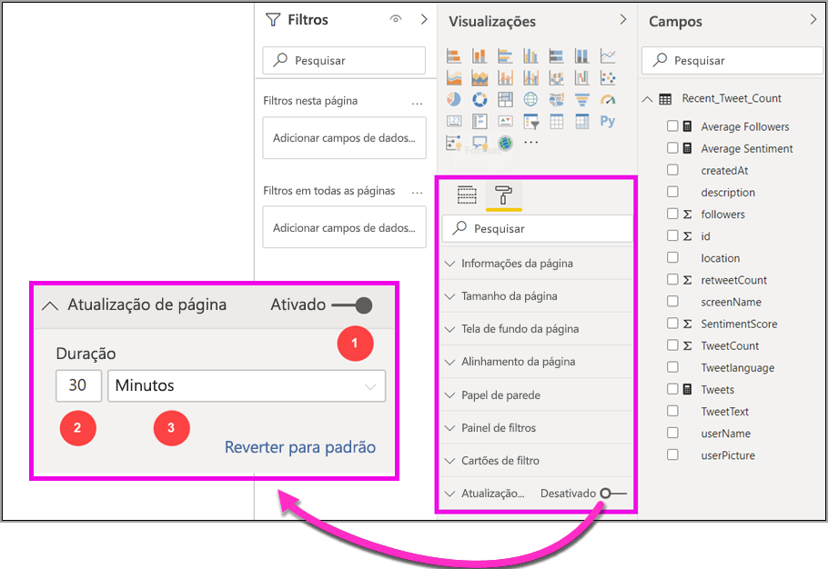
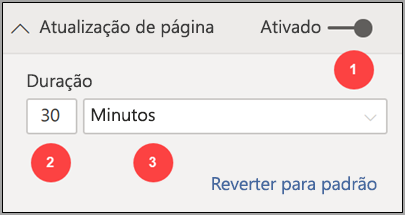
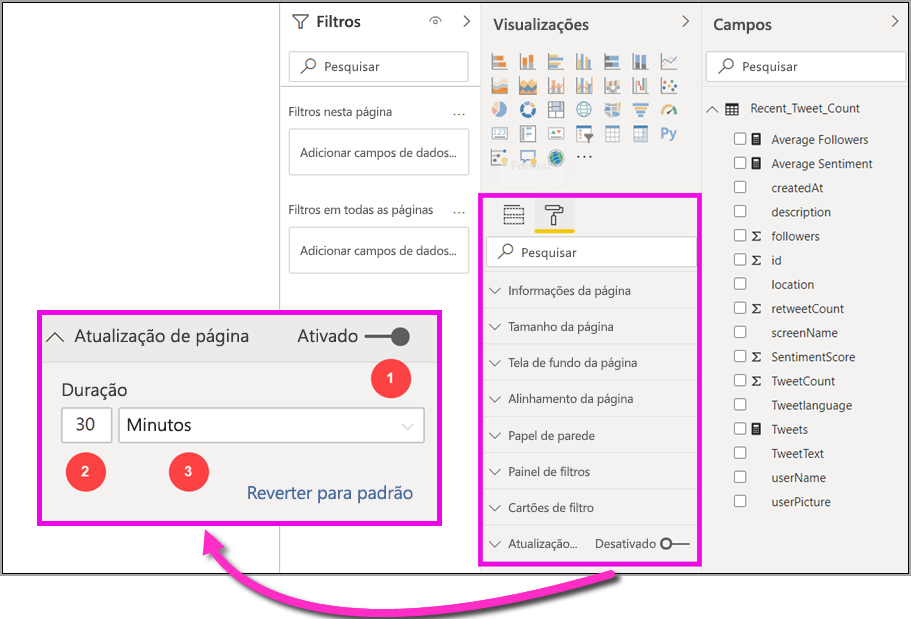

# Atualização automática de página no Power BI Desktop 

Ao monitorar eventos críticos, é importante que os dados sejam atualizados no mesmo momento que os dados de origem. Por exemplo, no setor de manufatura, é essencial saber quando um computador está com problemas de funcionamento ou prestes a ter esse tipo de problema.

O recurso de atualização automática de página do Power BI permite que a página de relatório ativa consulte novos dados, em uma frequência predefinida, em [fontes do DirectQuery](https://docs.microsoft.com/power-bi/desktop-directquery-about).

## Uso da atualização automática de página

A atualização automática de página está disponível somente para fontes de dados do DirectQuery.

Para usar a atualização automática de página, selecione a página de relatório cuja atualização você deseja habilitar. No painel **Visualizações**, selecione o botão **Formatação** (um rolo de pintura) e localize **Atualização de página** próximo à parte inferior do painel. 

A imagem a seguir mostra o cartão **Atualização de página**. Os elementos numerados são descritos após a imagem.

1.    Ativa ou desativa a atualização da página
2.    Valor numérico para o intervalo de atualização de página
3.    Unidade para o intervalo de atualização de página

Nesse cartão, você pode ativar a atualização de página e selecionar a duração da atualização. O valor padrão é de 30 minutos. (O intervalo de atualização mínimo é de um segundo). O relatório começará a ser atualizado no intervalo que você definir. 

## Como determinar o intervalo de atualização de página

Quando a atualização automática de página está habilitada, o Power BI Desktop envia constantemente consultas para sua fonte do DirectQuery. Depois que a consulta é enviada, há um atraso antes que os dados sejam retornados. Portanto, em intervalos de atualização curtos, você deve confirmar se as consultas retornam os dados consultados dentro do intervalo configurado. Se os dados não forem retornados dentro do intervalo, os visuais serão atualizados com menos frequência do que o configurado.

Como prática recomendada, o intervalo de atualização deve corresponder ao menos à sua nova taxa de chegada de dados esperada:

* Se os dados novos chegarem à fonte a cada 20 minutos, o intervalo de atualização não poderá ser inferior a 20 minutos. 

* Se novos dados chegarem a cada segundo, defina o intervalo para um segundo. 

Em intervalos de baixa atualização, como um segundo, considere os seguintes fatores:
- O tipo da fonte de dados do DirectQuery
- A carga que suas consultas criam nele
- A distância dos visualizadores de relatório do datacenter da capacidade 

Você pode estimar os tempos de retorno usando o Performance Analyzer no Power BI Desktop. O Performance Analyzer permite verificar se cada consulta de visual tem tempo suficiente para voltar com resultados da fonte. Ele também permite que você determine onde o tempo é gasto. Com base nos resultados do Performance Analyzer, você pode ajustar a fonte de dados ou experimentar outros visuais e medidas em seu relatório.

Esta imagem mostra os resultados de uma consulta do DirectQuery no Performance Analyzer:

Vamos considerar algumas outras características dessa fonte de dados: 

-    Os dados chegam a uma taxa de dois segundos. 
-    O Performance Analyzer mostra a consulta máxima + tempo de exibição de aproximadamente 4,9 segundos (4.688 milissegundos). 
-    A fonte de dados está configurada para lidar com aproximadamente 1.000 consultas simultâneas por segundo. 
-    Você espera que aproximadamente 10 usuários exibam simultaneamente o relatório.

Isso resulta na seguinte equação:

**5 visuais x 10 usuários = aproximadamente 50 consultas**

O resultado desse cálculo mostra muito mais carga do que a fonte de dados consegue suportar. Os dados chegam a uma taxa de dois segundos, de modo que essa deve ser a taxa de atualização. Porém, como a consulta leva cerca de cinco segundos para ser concluída, você deve defini-la como mais de cinco segundos. 

Observe também que esse resultado pode ser diferente quando você publica o relatório no serviço. Essa diferença ocorre porque o relatório usará a instância do Azure Analysis Services hospedada na nuvem. Talvez você queira ajustar suas taxas de atualização de acordo com isso. 

Para considerar as consultas e atualizar o tempo, o Power BI só executará a próxima consulta de atualização quando todas as consultas de atualização restantes forem concluídas. Portanto, mesmo que o intervalo de atualização seja menor do que o tempo que suas consultas levam para serem processadas, o Power BI só será atualizado novamente quando as consultas restantes forem concluídas. 

Agora, vamos examinar como é possível detectar e diagnosticar problemas de desempenho como um administrador de capacidade. Você também pode conferir a seção [Perguntas frequentes](#frequently-asked-questions), mais adiante neste artigo, para ver mais perguntas e respostas sobre desempenho e solução de problemas.

## Atualização automática de página no serviço do Power BI

Você também pode definir intervalos de atualização automática de página para relatórios criados no Power BI Desktop e publicados no serviço do Power BI. 

Para configurar a atualização automática de página para relatórios no serviço do Power BI, use etapas semelhantes às etapas que você usaria no Power BI Desktop. Quando configurada no serviço do Power BI, a atualização automática de página também é compatível com o conteúdo do [Power BI inserido](../developer/embedded/embedding.md). A seguinte imagem mostra a configuração de **Atualização de página** para o serviço do Power BI:

Essas descrições correspondem aos elementos numerados: 

1.    Ativa ou desativa a atualização da página.
2.    Valor numérico do intervalo de atualização de página. Deve ser um número inteiro.
3.    Unidade para o intervalo de atualização de página.

### Intervalos de atualização de página

Os intervalos de atualização de página permitidos no serviço do Power BI são afetados pelo tipo de workspace do relatório. Isso se aplica a estes relatórios:

* Publicar um relatório em um workspace com atualização automática de página habilitada
* Editar um intervalo de atualização de página que já esteja em um workspace
* Criar um relatório diretamente no serviço

O Power BI Desktop não tem restrições para intervalos de atualização. O intervalo de atualização pode ter a frequência de um segundo. Porém, quando os relatórios são publicados no serviço do Power BI, determinadas restrições se aplicam. Essas restrições são descritas nas seções a seguir.

### Restrições em intervalos de atualização

No serviço do Power BI, as restrições para a atualização automática de página se aplicam com base em fatores como o workspace e se você está usando os serviços Premium.

Para esclarecer como essas restrições funcionam, vamos começar com um pouco de contexto sobre capacidades e workspaces.

As *capacidades* são um conceito importante do Power BI. Elas representam um conjunto de recursos (armazenamento, processador e memória) que são usados para hospedar e fornecer conteúdo do Power BI. As capacidades são compartilhadas ou dedicadas. Uma *capacidade compartilhada* é dividida com outros clientes da Microsoft. Uma *capacidade dedicada* está totalmente comprometida com um único cliente. Para obter uma introdução sobre capacidades dedicadas, confira [Gerenciar capacidades Premium](../admin/service-premium-capacity-manage.md).

Na capacidade compartilhada, as cargas de trabalho são executadas em recursos computacionais compartilhados com outros clientes. Como a capacidade precisa compartilhar recursos, as limitações são impostas para garantir o *equilíbrio*, como definir o tamanho máximo do modelo (1 GB) e a frequência máxima de atualização diária (oito vezes por dia).

Os *workspaces* do Power BI residem em capacidades. Eles representam contêineres de segurança, de colaboração e de implantação. Cada usuário do Power BI tem um workspace pessoal, conhecido como **Meu workspace**. Workspaces adicionais podem ser criados para habilitar a colaboração e a implantação. Eles são conhecidos como *workspaces*. Por padrão, os workspaces, incluindo os pessoais, são criados na capacidade compartilhada.

Confira alguns detalhes dos dois cenários de workspaces:

**W compartilhados**. Em workspaces normais (que não fazem parte de uma capacidade Premium), a atualização automática de página tem um intervalo mínimo de 30 minutos (o menor intervalo permitido).

**Workspaces Premium**. A disponibilidade da atualização automática de página nos workspaces Premium depende das configurações de carga de trabalho que o administrador Premium configurou para a capacidade do Power BI Premium. Há duas variáveis que podem afetar a capacidade de configurar a atualização automática de página:

 - **Ativar/desativar recurso**. Se o administrador da capacidade tiver desabilitado o recurso, você não conseguirá configurar nenhum tipo de atualização de página em seu relatório publicado.

 - **Intervalo mínimo de atualização**. Ao habilitar o recurso, o administrador da capacidade precisará configurar um intervalo mínimo de atualização. Se o intervalo for menor do que o mínimo, o serviço do Power BI substituirá o intervalo para respeitar o intervalo mínimo definido pelo administrador de capacidade. Essa substituição é conhecida como "Substituição da capacidade pelo administrador" na tabela a seguir. 

Esta tabela descreve com mais detalhes onde esse recurso está disponível e os limites para cada tipo de capacidade e [modo de armazenamento](../connect-data/service-dataset-modes-understand.md):

| Modo de armazenamento | Capacidade dedicada | Capacidade compartilhada |
| --- | --- | --- |
| DirectQuery | **Com suporte**: Sim  **Intervalo mínimo de atualização**: Um segundo  **Substituição da capacidade pelo administrador**: Sim | **Com suporte**: Sim  **Intervalo mínimo de atualização**: 30 minutos  **Substituição da capacidade pelo administrador**: Não |
| Importar | **Com suporte**: Não  **Intervalo mínimo de atualização**: N/D  **Substituição da capacidade pelo administrador**: N/D | **Com suporte**: Não  **Intervalo mínimo de atualização**: N/D  **Substituição da capacidade pelo administrador**: N/D |
| Modo misto (DirectQuery + outras fontes de dados) | **Com suporte**: Sim  **Intervalo mínimo de atualização**: Um segundo  **Substituição da capacidade pelo administrador**: Sim | **Com suporte**: Sim  **Intervalo mínimo de atualização**: 30 minutos  **Substituição da capacidade pelo administrador**: Não |
| Live Connect | **Com suporte**: Não  **Intervalo mínimo de atualização**: N/D  **Substituição da capacidade pelo administrador**: N/D | **Com suporte**: Não  **Intervalo mínimo de atualização**: N/D  **Substituição da capacidade pelo administrador**: N/D |
| Live Connect PBI | **Com suporte**: Não  **Intervalo mínimo de atualização**: N/D  **Substituição da capacidade pelo administrador**: N/D | **Com suporte**: Não  **Intervalo mínimo de atualização**: N/D  **Substituição da capacidade pelo administrador**: N/D |

> [!NOTE]
> Ao publicar o relatório com a atualização automática de página habilitada do Power BI Desktop para o serviço, você precisará fornecer as credenciais para a fonte de dados do DirectQuery no menu de configurações do conjunto.

## Considerações e limitações

Há alguns lembretes importantes ao usar a atualização automática de página, seja no Power BI Desktop ou no serviço do Power BI:

* Os modos de armazenamento Importar, Live Connect e Push não dão suporte à atualização automática de página.  
* Há suporte para modelos compostos com pelo menos uma fonte de dados do DirectQuery.
* O Power BI Desktop não tem restrições para intervalos de atualização. O intervalo pode ter a frequência de um segundo. Quando os relatórios são publicados no serviço do Power BI, determinadas restrições se aplicam, conforme descrito [anteriormente](#restrictions-on-refresh-intervals) neste artigo.
* A integração do SharePoint Online, que não oferece suporte à atualização automática da página.

### Diagnósticos de desempenho

A atualização automática de página é útil para monitorar cenários e explorar dados de alteração rápida. Mas, às vezes, isso pode colocar uma carga indevida na capacidade ou na fonte de dados.

Para evitar a carga indevida em fontes de dados, o Power BI disponibiliza estas proteções:

- Todas as consultas de atualização automática de página são executadas em uma prioridade inferior para garantir que as consultas interativas (como carregamento de página e visuais de filtragem cruzada) tenham precedência.
- Se uma consulta não for concluída antes do próximo ciclo de atualização, o Power BI não emitirá novas consultas de atualização até que a consulta anterior seja concluída. Por exemplo, se você tiver um intervalo de atualização de um segundo e as consultas demorarem quatro segundos em média, o Power BI emitirá efetivamente apenas uma consulta a cada quatro segundos.

Há duas áreas nas quais você ainda pode encontrar gargalos de desempenho:

1. **A capacidade**. A consulta atinge primeiro a capacidade Premium, que dobrará e avaliará a consulta DAX gerada a partir das visualizações de relatório nas consultas de origem.
2. **A fonte de dados do DirectQuery**. as consultas traduzidas na etapa anterior são executadas em relação à origem. A fonte seria suas instâncias do SQL Server, fontes do SAP Hana e assim por diante.

Usando o [aplicativo de Métricas de Capacidade Premium](../admin/service-admin-premium-monitor-capacity.md), disponível para administradores, você pode visualizar quanto da capacidade está em uso por consultas de baixa prioridade.

Esse tipo de consulta inclui consultas de atualização automática de página e de atualização de modelo. Atualmente, não há como distinguir entre a carga de consultas de atualização automática de página e de atualização de modelo.

Se você observar que sua capacidade está ficando sobrecarregada com consultas de baixa prioridade, poderá executar as seguintes ações:

- Solicite um SKU premium maior.
- Peça ao proprietário do relatório para diminuir o intervalo de atualização.
- No portal de administração de capacidade, você pode:
   - Desative a atualização automática de página para essa capacidade.
   - Elevar o intervalo mínimo de atualização, o que afetará a todos os relatórios nessa capacidade.

### Perguntas frequentes

**Sou autor de relatório. Defini o intervalo de atualização do relatório como um segundo no Power BI Desktop, mas, depois da publicação, meu relatório não está sendo atualizado no serviço.**

* Verifique se a atualização automática está ativada para a página. Como essa configuração é definida por página, você precisa garantir que ela esteja ativada para cada página do relatório que deseja atualizar.
* Verifique se você carregou em um workspace com uma capacidade Premium anexada. Se você não tiver feito isso, seu intervalo de atualização será bloqueado aos 30 minutos.
* Se o relatório estiver em um workspace Premium, pergunte ao administrador se esse recurso está habilitado para a capacidade anexada. Além disso, verifique se o intervalo mínimo de atualização para a capacidade é menor ou igual ao do relatório.

**Sou administrador de uma capacidade. Alterei as configurações do meu intervalo de atualização de página automático, mas as alterações não são refletidas. Ou seja, os relatórios ainda são atualizados em uma taxa incorreta ou não são atualizados, mesmo que eu tenha ativado a atualização automática da página.**

* Demora até cinco minutos para a atualização automática de página feita na interface do usuário do administrador de capacidade ser propagada para os relatórios.
* Além de ativar a atualização automática de página para a capacidade, você também precisará ativá-la para as páginas de um relatório em que deseja habilitá-la.

**Meu relatório está operando no modo misto. (O modo misto significa que o relatório tem uma conexão DirectQuery e uma fonte de dados de importação). Alguns visuais não estão sendo atualizados.**

- Caso os elementos visuais façam referência a tabelas de Importar, esse comportamento é esperado. O modo Importar não dá suporte à atualização automática de página.
- Confira a primeira pergunta nesta seção.

**A atualização do meu relatório estava funcionando bem no serviço e, de repente, parou.**

* Tente atualizar a página para ver se o problema se resolve sozinho.
* Fale com seu administrador de capacidade. O administrador pode ter desativado o recurso ou gerado o intervalo mínimo de atualização. (Confira a segunda pergunta nesta seção).

**Sou autor de relatório. Meus visuais não estão sendo atualizados na frequência que especifiquei. A atualização está ocorrendo em uma taxa mais lenta.**

* Se as consultas estiverem demorando mais para serem executadas, seu intervalo de atualização será atrasado. A atualização automática de página aguarda a conclusão de todas as consultas antes de executar novas.
* Pode ser que seu administrador de capacidade tenha definido um intervalo de atualização mínimo maior do que aquele que você definiu em seu relatório. Peça ao administrador de capacidade para reduzir o intervalo mínimo de atualização.

**As consultas de atualização automática de página são atendidas pelo cache?**

* Não. Todas as consultas de atualização automática de página ignoram os dados armazenados em cache.

## Próximas etapas

Para obter mais informações, confira estes tópicos:

* [Usar o DirectQuery no Power BI](../connect-data/desktop-directquery-about.md)
* [Usar modelos compostos no Power BI Desktop](../transform-model/desktop-composite-models.md)
* [Usar o Performance Analyzer para examinar o desempenho do elemento de relatório](desktop-performance-analyzer.md)
* [Como implantar e gerenciar capacidades do Power BI Premium](../guidance/whitepaper-powerbi-premium-deployment.md)
* [Fontes de dados no Power BI Desktop](../connect-data/desktop-data-sources.md)
* [Formatar e combinar dados no Power BI Desktop](../connect-data/desktop-shape-and-combine-data.md)
* [Conectar-se a pastas de trabalho do Excel no Power BI Desktop](../connect-data/desktop-connect-excel.md)   
* [Inserir dados diretamente no Power BI Desktop](../connect-data/desktop-enter-data-directly-into-desktop.md)   
