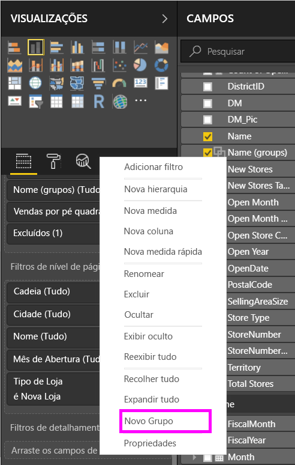
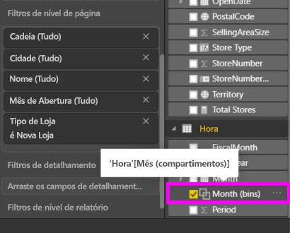

# Usar agrupamento e compartimentalização no Power BI Desktop
Quando o Power BI Desktop cria visuais, ele agrega os dados em partes (ou grupos) com base nos valores encontrados nos dados subjacentes. Geralmente isso fica bom, mas pode haver ocasiões nas quais você deseja refinar a maneira como essas partes são apresentadas. Por exemplo, você pode querer colocar três categorias de produtos em uma categoria maior (um *grupo*). Ou talvez você queira ver os valores de vendas colocados em tamanhos de compartimentos de 1.000.000 dólares, em vez de partes de tamanhos de 923.983 dólares.

No Power BI Desktop, você pode *agrupar* pontos de dados para ajudá-lo a exibir, analisar e explorar com mais clareza os dados e tendências nos seus elementos visuais. Você também pode definir o *tamanho do compartimento* para colocar valores em grupos de mesmo tamanho, que permitem uma melhor visualização dos dados de maneiras significativas. Essa ação geralmente é chamada de *compartimentalização*.

## Usando o agrupamento
Para usar o agrupamento, selecione dois ou mais elementos em um visual usando Ctrl + clique para selecionar vários elementos. Em seguida, clique com o botão direito do mouse em um dos elementos de seleção múltipla e escolha **Agrupar** no menu de contexto.

Depois de criado, o grupo é adicionado ao bucket **Legenda** do visual. O grupo também é exibido na lista **Campos**.

Quando você tiver um grupo, poderá editar com facilidade os membros desse grupo. Clique com o botão direito do mouse no bucket **Legenda** ou na lista **Campos** e, em seguida, escolha **Editar Grupos**.

Na caixa de diálogo **Grupos**, crie grupos ou modifique os grupos existentes. *Renomeie* também qualquer grupo. Basta clicar duas vezes no título do grupo na caixa **Grupos e membros** e, em seguida, inserir um novo nome.

Você pode executar todos os tipos de ações com grupos. É possível adicionar itens da lista **Valores não agrupados** em um novo grupo ou em um dos grupos existentes. Para criar um grupo, selecione dois ou mais itens (usando Ctrl + clique) na caixa **Valores não agrupados** e, em seguida, selecione o botão **Agrupar** abaixo dessa caixa.

É possível adicionar um valor não agrupado a um grupo existente: basta selecionar um dos **Valores não agrupados**, em seguida, selecionar o grupo existente ao qual deseja adicionar o valor e selecionar o botão **Agrupar**. Para remover um item de um grupo, selecione-o na caixa **Grupos e membros** e, em seguida, selecione **Desagrupar**. Você também pode mover categorias desagrupadas para o grupo **Outros** ou deixá-las desagrupadas.

> [!NOTE]
> É possível criar grupos para qualquer campo na lista **Campos**, sem a necessidade de fazer uma seleção múltipla de itens em um visual existente. É só clicar com o botão direito do mouse no campo e selecionar **Novo Grupo** no menu exibido.

## Usando a compartimentalização
Você pode definir o tamanho do compartimento para campos numéricos e de tempo no **Power BI Desktop.** Use a compartimentalização para dar o tamanho correto aos dados exibidos pelo Power BI Desktop.

Para aplicar um tamanho de compartimento, clique com o botão direito do mouse em um **Campo** e escolha **Novo Grupo**.

Na caixa de diálogo **Grupos**, defina o **Tamanho do compartimento** com o tamanho desejado.

Quando você seleciona **OK**, você observará que um novo campo aparecerá no painel **Campos** com **(compartimentos)** acrescentado. Você pode arrastar esse campo para a tela para usar o tamanho do compartimento em um elemento visual.

Para ver a *compartimentalização* em ação, dê uma olhada neste [vídeo](https://www.youtube.com/watch?v=BRvdZSfO0DY).

E isso é tudo sobre o uso de *agrupamento* e *compartimentalização* para garantir que os elementos visuais em seus relatórios mostrem seus dados exatamente na forma desejada.
