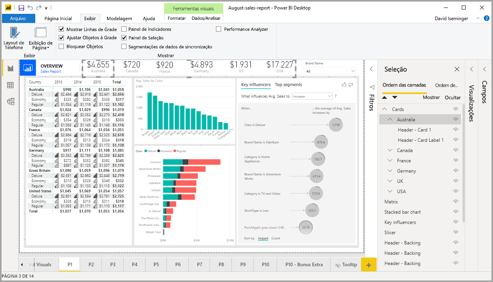
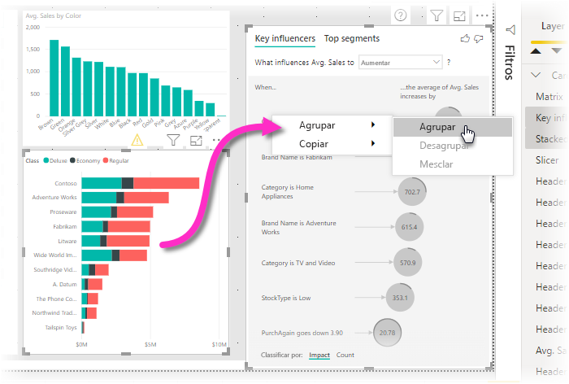
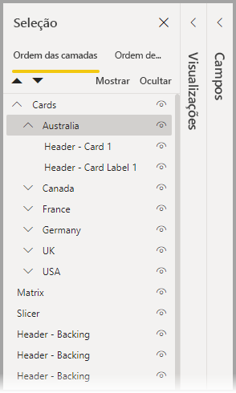
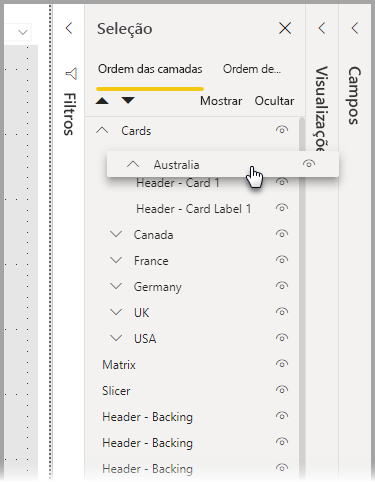
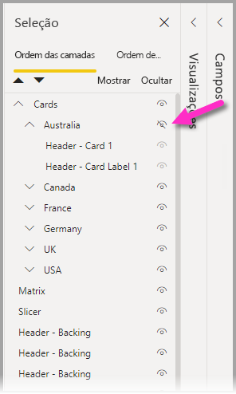
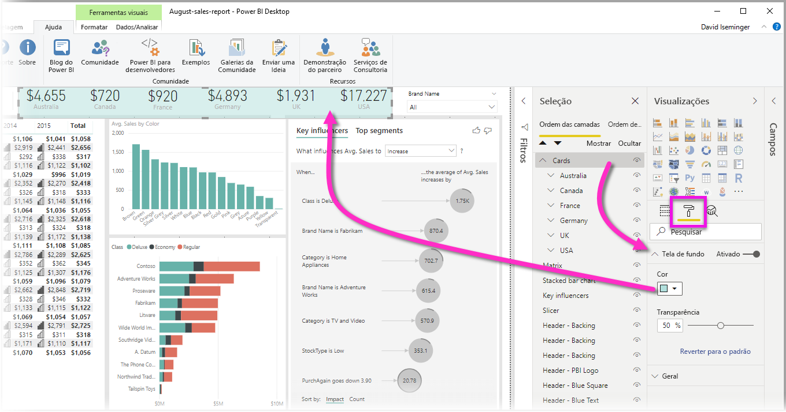

# Agrupar visuais nos relatórios do Power BI Desktop
Com o **agrupamento** no **Power BI Desktop**, você pode agrupar visuais em seu relatório, como botões, caixas de texto, imagens de forma e qualquer visual que você criar, assim como você agrupa itens no PowerPoint. O agrupamento de visuais em um relatório permite que você trate o grupo como um único objeto, de modo que mover, redimensionar e trabalhar com camadas em seu relatório se torna mais fácil, mais rápido e mais intuitivo.

## Criando grupos

Para criar um grupo de visuais no Power BI Desktop, selecione o primeiro visual na tela e, em seguida, mantenha o botão CTRL pressionado, clique em um ou mais visuais adicionais que você deseja ter no grupo, depois clique com o botão direito do mouse na coleção de visuais e selecione **Agrupar** no menu que aparece.

Os grupos são exibidos no painel **Seleção**. Você pode ter quantos grupos de visuais seu relatório precisar e também pode aninhar grupos de visuais. Na imagem a seguir, o grupo *Austrália* está aninhado sob o grupo *Cartões*. Você pode expandir um grupo selecionando o circunflexo ao lado do nome do grupo e pode recolhê-lo selecionando o circunflexo novamente. 

Dentro do painel **Seleção**, você também pode arrastar e soltar visuais individuais para incluí-los em um grupo, removê-los de um grupo, aninhar um grupo ou remover um grupo ou visual individual de um aninhamento. Basta arrastar o visual que você deseja ajustar e colocá-lo onde desejar. A disposição dos visuais em camada, se houver sobreposição, é determinada pela ordem na lista *Ordem das camadas*.

É fácil renomear um grupo: basta clicar duas vezes no nome do grupo no painel **Seleção** e, em seguida, digitar o novo nome do grupo.

Para desagrupar, basta selecionar o grupo, clicar com o botão direito do mouse e selecionar **desagrupar** no menu exibido.

## Ocultar e mostrar visuais ou grupos

Você pode facilmente ocultar ou mostrar grupos usando o painel **Seleção**. Para ocultar um grupo, selecione o botão de olho ao lado do nome do grupo (ou de qualquer visual individual) para alternar se o visual ou o grupo fica oculto ou é exibido. Na imagem a seguir, o grupo *Austrália* está oculto e o restante dos grupos aninhados no grupo *Cartões* é exibido.

Quando você oculta um grupo, todos os visuais dentro dele ficam ocultos, o que é indicado por um botão de olho esmaecido (indisponível para alternância ou, porque o grupo inteiro fica oculto). Para ocultar apenas determinados visuais dentro de um grupo, basta alternar o botão de olho ao lado do visual, de modo que apenas esse visual no grupo seja ocultado.

## Selecionando visuais dentro de um grupo

Há algumas maneiras de navegar e selecionar itens dentro de um grupo de visuais. A lista a seguir descreve o comportamento:

* Clicar em um espaço vazio dentro de um grupo (como um espaço em branco entre visuais) não seleciona nada
* Clicar em um visual dentro de um grupo seleciona o grupo inteiro, um segundo clique seleciona o visual individual
* Selecionar um grupo e, em seguida, outro objeto na tela de relatório, e depois selecionar **Agrupar** no menu de atalho cria um grupo aninhado
* Selecionar dois grupos e, em seguida, clicar com o botão direito do mouse exibe a opção de mesclar os grupos selecionados em vez de aninhá-los

## Aplicar cor da tela de fundo

Você também pode aplicar uma cor da tela de fundo a um grupo usando a seção **Formatação** do painel **Visualizações**, conforme mostrado na imagem a seguir. 

Após você aplicar uma cor da tela de fundo, clicar no espaço entre os visuais no grupo seleciona o grupo (compare isso a clicar no espaço em branco entre os visuais em um grupo, o que não seleciona o grupo). 

## Próximas etapas
Para obter mais informações sobre o agrupamento, confira o vídeo a seguir:

* [Agrupamento no Power BI Desktop – vídeo](https://youtu.be/sf4n7VXoQHY?t=10)

Você também pode estar interessado nos seguintes artigos:

* [Usar o detalhamento no Power BI Desktop](desktop-cross-report-drill-through.md)
* [Usando segmentações no Power BI Desktop](../visuals/power-bi-visualization-slicers.md)
