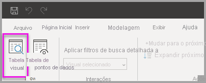
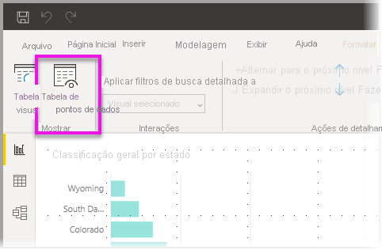

# Usar tabela visual e tabela de ponto de dados no Power BI Desktop
No **Power BI Desktop**, é possível analisar em detalhes qualquer visualização e ver as representações textuais dos dados subjacentes ou os registros de dados individuais para o visual selecionado. Esses recursos às vezes são chamados de *clickthrough*, *drill-through* ou *drill-through em detalhes*.

Você pode usar a **Tabela visual** para exibir os dados em um visual como uma tabela, ou usar a **Tabela de ponto de dados** para exibir uma tabela dos dados usados para calcular um único ponto de dados. 

>[!IMPORTANT]
>**A tabela visual** e a **Tabela de ponto de dados** dão suporte apenas aos seguintes tipos de visualização:
>  - Gráfico de barras
>  - Gráfico de colunas
>  - Gráfico de rosca
>  - Mapa coroplético
>  - Funil
>  - Mapeamento
>  - Gráfico de pizza
>  - Mapa de árvore

## Usar tabela visual no Power BI Desktop

A **Tabela visual** mostra os dados subjacentes a uma visualização. A **Tabela visual** aparece na guia **Dados/Analisar** na seção **Mostrar** da faixa de opções quando um visual está selecionado.

Também é possível ver os dados clicando com o botão direito do mouse em uma visualização e, em seguida, selecionando **Mostrar Dados** no menu que aparece. Outra alternativa é selecionar **Mais opções** (...) no canto superior direito de uma visualização e, em seguida, **Mostrar como uma tabela**.

&nbsp;&nbsp;

> [!NOTE]
> É necessário focalizar um ponto de dados no visual para que o menu de clique com o botão direito do mouse fique disponível.

Quando você seleciona **Tabela visual** ou **Tabela de ponto de dados**, a tela do Power BI Desktop exibe a representação visual e textual dos dados. Na *exibição horizontal*, o visual é exibido na metade superior da tela, e os dados são mostrados na metade inferior. 

Você pode alternar entre a exibição horizontal e a *exibição vertical* selecionando o ícone no canto superior direito da tela.

Para retornar ao relatório, selecione **< Voltar ao Relatório** no canto superior esquerdo da tela.

## Usar tabela de ponto de dados no Power BI Desktop

Também é possível enfocar um registro de dados em uma visualização e detalhar os dados atrás dele. Para usar a **Tabela de ponto de dados**, selecione uma visualização, em seguida **Tabela de ponto de dados** na guia **Dados/Analisar** na seção **Ferramentas Visuais** da faixa de opções e, em seguida, selecione um ponto de dados ou linha na visualização. 

> [!NOTE]
> Se o botão **Tabela de ponto de dados** na faixa de opções estiver desabilitado e esmaecido, isso significará que a visualização selecionada não dá suporte a **Tabela de ponto de dados**.

Você pode também clicar com o botão direito do mouse em um elemento de dados e selecionar **Tabela de ponto de dados** no menu que aparece.

Quando você seleciona **Tabela de ponto de dados** para um elemento de dados, a tela do Power BI Desktop exibe todos os dados associados ao elemento selecionado. 

Para retornar ao relatório, selecione **< Voltar ao Relatório** no canto superior esquerdo da tela.

> [!NOTE]
>A **Tabela de ponto de dados** tem as seguintes limitações:
> - Você não pode alterar os dados na exibição **Tabela de ponto de dados** e salvá-los novamente no relatório.
> - Você não poderá usar a **tabela Ponto de dados** quando seu visual usar uma medida calculada em um grupo de medidas (multidimensional).
> - Não é possível usar a **Tabela de ponto de dados** quando você está conectado a um modelo MD (multidimensional) dinâmico.

## Próximas etapas
Há todos os tipos de recursos para gerenciamento de dados e formatação do relatório no **Power BI Desktop**. Confira os seguintes recursos para alguns exemplos:

* [Usar agrupamento e compartimentalização no Power BI Desktop](desktop-grouping-and-binning.md)
* [Usar linhas de grade, ajustar à grade, ordem z, alinhamento e distribuição em relatórios do Power BI Desktop](desktop-gridlines-snap-to-grid.md)

