# <a name="design-filters-in-power-bi-reports"></a>Design dos filtros nos relatórios do Power BI

[!INCLUDE [applies-to](../includes/applies-to.md)] [!INCLUDE [yes-desktop](../includes/yes-desktop.md)] [!INCLUDE [yes-service](../includes/yes-service.md)]

Com a nova experiência de filtro, você controla ainda mais a funcionalidade e o design dos filtros de relatórios. Você pode formatar o painel Filtros para que fique como o restante do relatório. Você poderá bloquear e ocultar até mesmo filtros. Ao criar seu relatório, você não verá mais o painel Filtros antigo no painel Visualizações. É possível editar e formatar todos os filtros no painel Filtros. 


Como um designer de relatório, veja a seguir algumas das tarefas que você pode fazer no novo Painel de filtros:

- Adicionar e remover campos para filtrar. 
- Alterar o estado do filtro.
- Formatar e personalizar o painel Filtros para que ele se integre ao relatório.
- Definir se o painel Filtros fica aberto ou recolhido por padrão quando um consumidor abre o relatório.
- Ocultar todo o painel Filtros ou filtros específicos que você não deseja que os consumidores do relatório vejam.
- Controlar e até mesmo marcar o estado de visibilidade aberto e recolhido do painel Filtros.
- Bloquear filtros que você não deseja que os consumidores editem.

Ao ler um relatório, os usuários podem também passar o mouse sobre qualquer visual para ver uma lista somente leitura de todos os filtros ou segmentações que afetam esse visual.

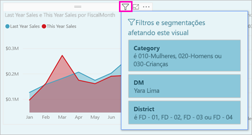

## <a name="turn-on-new-filters-in-existing-reports"></a>Ativar novos filtros em relatórios existentes 

A nova experiência de filtro está ativada por padrão para novos relatórios. Você pode habilitar a nova experiência para relatórios existentes no Power BI Desktop ou no serviço do Power BI.

### <a name="turn-on-new-filters-for-an-existing-report-in-power-bi-desktop"></a>Ativar novos filtros para um relatório existente no Power BI Desktop

1. No Power BI Desktop, em um relatório existente, selecione **Arquivo** > **Opções e Configurações** > **Opções**
2. No painel de navegação, em **Arquivo atual**, selecione **Configurações de relatório**.
3. Em **Experiência de filtragem**, selecione **Habilitar o painel Filtros atualizado e mostrar filtros no cabeçalho do visual para este relatório**.

### <a name="turn-on-new-filters-for-an-existing-report-in-the-service"></a>Ativar novos filtros para um relatório existente no serviço

Se você tiver ativado a **Nova aparência** no serviço do Power BI , a nova experiência de filtro será ativada automaticamente. Leia mais sobre a [nova aparência no serviço do Power BI.](../consumer/service-new-look.md)

Se você não tiver ativado a nova aparência, ainda poderá ver a nova experiência de filtro seguindo estas etapas.

1. No serviço do Power BI, abra a lista de conteúdo de um workspace.
2. Localize o relatório que você deseja habilitar, selecione **Mais opções (...)** e, em seguida, selecione **Configurações** para esse relatório.

    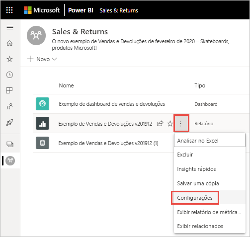

3. Em **Experiência de filtragem**, selecione **Habilitar o painel Filtros atualizado e mostrar filtros no cabeçalho do visual para este relatório**.

    

## <a name="view-filters-for-a-visual-in-reading-mode"></a>Ver filtros para um visual no modo Leitura

No modo de Leitura, você pode focalizar o ícone de filtro para um visual para ver uma lista de filtros em pop-up com todos os filtros, segmentações etc. que afetam esse visual. A formatação da lista de filtro em pop-up é igual à formatação do painel Filtros. 


Estes são os tipos de filtros mostrados por essa exibição: 
- Filtros básicos
- Segmentações
- Realce cruzado 
- Filtragem cruzada
- Filtros avançados
- Primeiros N filtros
- Filtros de Data Relativa
- Sincronizar segmentadores
- Incluir/Excluir filtros
- Filtros passados por uma URL

## <a name="build-the-filters-pane"></a>Criar o painel Filtros

Depois de habilitar o novo painel Filtros, você pode vê-lo à direita da página do relatório, formatado por padrão com base nas configurações de relatório atuais. No painel Filtros, configure os filtros incluídos e atualize os filtros existentes. O painel Filtros será o mesmo para os consumidores do relatório quando você publicar o relatório. 

1. Por padrão, os leitores do relatório podem ver o painel Filtros. Se não quiser que eles vejam, selecione o ícone de olho ao lado de **Filtros**.

    

2. Para começar a criar seu painel Filtros, arraste os campos de interesse para o painel Filtros, como filtros de nível visual, de página ou de relatório.

Quando você adiciona um visual a uma tela de relatório, o Power BI adiciona automaticamente um filtro ao painel Filtros para cada campo no visual. 

## <a name="hide-the-filters-pane-while-editing"></a>Ocultar o painel Filtros durante a edição

O Power BI Desktop tem uma nova faixa de opções em versão prévia. Na guia **Exibir**, o botão de alternância **Filtros** permite mostrar ou ocultar o painel Filtros. Esse recurso é útil quando você não está usando o painel Filtros e precisa de espaço adicional na tela. Essa adição alinha o painel Filtros aos outros painéis que você pode abrir e fechar, como os painéis Marcadores e Seleção. 

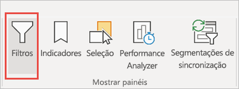

Essa configuração oculta apenas o painel Filtros no Power BI Desktop. Se desejar ocultar o painel Filtros dos seus usuários finais, selecione o ícone de **olho** ao lado de **Filtros**.

 

## <a name="lock-or-hide-filters"></a>Bloquear ou ocultar filtros

Você pode bloquear ou ocultar os cartões de filtro individuais. Se você bloquear um filtro, os consumidores do relatório poderão vê-lo, mas não alterá-lo. Se você ocultá-lo, eles não poderão nem vê-lo. Ocultar os cartões de filtro é útil se você precisar ocultar filtros de limpeza de dados que excluem valores nulos ou inesperados. 

- No painel Filtros, marque ou desmarque os ícones **Bloquear filtro** ou **Ocultar filtro** em um cartão de filtro.

   

À medida que você ativa ou desativa esse painel Filtros, pode ver as alterações refletidas no relatório. Os filtros ocultos não aparecem na lista de filtros em pop-up de um visual.

Você também pode configurar o estado do painel Filtros para fluir com os indicadores de relatório. Os estados de abertura, fechamento e visibilidade do painel podem ser marcados como indicadores.
 
## <a name="format-the-filters-pane"></a>Formatar o painel Filtros

Uma grande parte da experiência de filtro é que você pode formatar o painel Filtros para combiná-lo com a aparência do relatório. Além disso, pode formatar o painel Filtros de acordo com cada página no relatório. Estes são os elementos que você pode formatar: 

- Cor da tela de fundo
- Transparência da tela de fundo
- Borda ativada ou desativada
- Cor da borda
- Fonte, cor e tamanho do texto do cabeçalho e título

Você também pode formatar esses elementos para cartões de filtro, dependendo se eles forem aplicados (configurados para algo) ou disponíveis (desmarcados): 

- Cor da tela de fundo
- Transparência da tela de fundo
- Borda: ativada ou desativada
- Cor da borda
- Fonte, cor e tamanho do texto
- Cor da caixa de entrada

### <a name="format-the-filters-pane-and-cards"></a>Formatar o painel Filtros e cartões

1. No relatório, clique no próprio relatório ou na tela de fundo (*papel de parede*), em seguida, no painel **Visualizações**, selecione **Formato**. 
    Você verá as opções de formatação da página do relatório, o papel de parede e também o painel Filtros e Cartões de filtro.

1. Expanda o **painel Filtros** para definir a cor da tela de fundo, o ícone e a borda esquerda, a fim de complementar a página do relatório.

    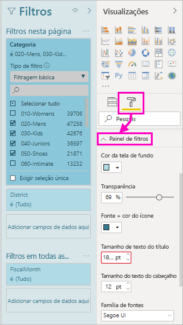

1. Expanda **Cartões de filtro** para definir a cor e a borda **Disponível** e **Aplicada**. Se você escolher cores diferentes para os cartões disponível e aplicado, ficará óbvio quais filtros serão aplicados. 
  
    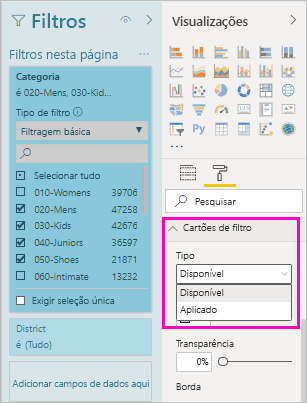

## <a name="theming-for-filters-pane"></a>Temas para o painel Filtros
Agora você pode modificar as configurações padrão do painel Filtros com o arquivo de tema. Veja um snippet do tema de exemplo para começar:

 
```
"outspacePane": [{ 

"backgroundColor": {"solid": {"color": "#0000ff"}}, 

"foregroundColor": {"solid": {"color": "#00ff00"}}, 

"transparency": 50, 

"titleSize": 35, 

"headerSize": 8, 

"fontFamily": "Georgia", 

"border": true, 

"borderColor": {"solid": {"color": "#ff0000"}} 

}], 

"filterCard": [ 

{ 

"$id": "Applied", 

"transparency": 0, 

"backgroundColor": {"solid": {"color": "#ff0000"}}, 

"foregroundColor": {"solid": {"color": "#45f442"}}, 

"textSize": 30, 

"fontFamily": "Arial", 

"border": true, 

"borderColor": {"solid": {"color": "#ffffff"}}, 

"inputBoxColor": {"solid": {"color": "#C8C8C8"}} 

}, 

{ 

"$id": "Available", 

"transparency": 40, 

"backgroundColor": {"solid": {"color": "#00ff00"}}, 

"foregroundColor": {"solid": {"color": "#ffffff"}}, 

"textSize": 10, 

"fontFamily": "Times New Roman", 

"border": true, 

"borderColor": {"solid": {"color": "#123456"}}, 

"inputBoxColor": {"solid": {"color": "#777777"}} 

}] 
```

## <a name="sort-the-filters-pane"></a>Classificar o painel Filtros

A funcionalidade de classificação personalizada está disponível no painel Filtros. Ao criar seu relatório, arraste e solte os filtros para reorganizá-los em qualquer ordem.


A ordem de classificação padrão é alfabética para filtros. Para iniciar o modo de classificação personalizada, basta arrastar qualquer filtro para uma nova posição. Você só pode classificar os filtros no nível ao qual eles se aplicam, por exemplo, um filtro no nível visual, no nível da página ou no nível do relatório.

## <a name="improved-filters-pane-accessibility"></a>Acessibilidade aprimorada do painel Filtros

Melhoramos a navegação de teclado para o painel Filtros. Você pode percorrer todas as partes do painel Filtros e usar a chave de contexto no teclado ou Shift+F10 para abrir o menu de contexto.

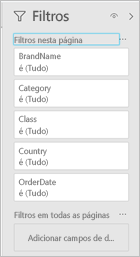

## <a name="rename-filters"></a>Renomear filtros
Quando você está editando o painel Filtros, pode dar um clique duplo no título para editá-lo. Renomear é útil se você quiser atualizar o cartão de filtro para fazer mais sentido para seus usuários finais. Lembre-se de que renomear o cartão de filtro faz *não* renomear o nome de exibição do campo na lista de campos. Apenas altera o nome de exibição usado no cartão de filtro.

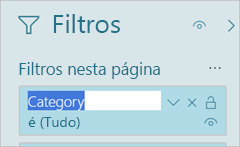

## <a name="filters-pane-search"></a>Pesquisa do painel Filtros

O recurso de pesquisa do painel Filtros permite pesquisar em seus cartões de filtro por título. Esse recurso será útil se você tiver vários cartões de filtro diferentes no painel Filtros e precisar de ajuda para encontrar os de interesse.

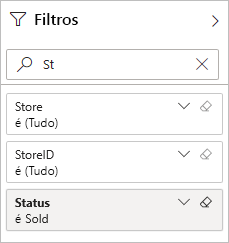

Também é possível formatar a caixa de pesquisa, assim como os outros elementos do painel Filtros.

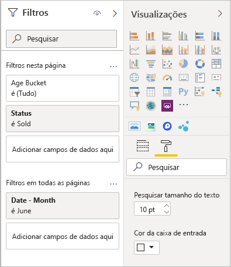

Embora esse recurso de pesquisa do painel Filtros esteja ativado por padrão, você também pode optar por ativá-lo ou desativá-lo selecionando **Habilitar pesquisa para o painel Filtros** nas configurações de relatório da caixa de diálogo Opções.

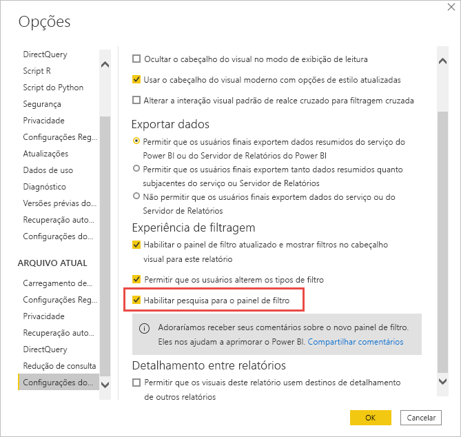

## <a name="restrict-changes-to-filter-type"></a>Restringir alterações para o tipo de filtro

Na seção **Experiência de filtragem** das configurações de relatório, há uma opção para controlar se os usuários podem alterar o tipo de filtro.

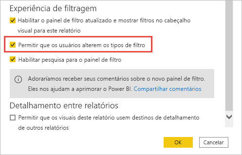

## <a name="apply-filters-button-preview"></a>Botão de Aplicar filtros (versão preliminar)

Você pode adicionar um único botão **Aplicar** ao painel Filtro, permitindo que você e seus usuários finais apliquem todas as modificações de filtro de uma só vez. Ter esse botão pode ser útil se você quiser adiar a aplicação de alterações de filtro. Você só precisa aguardar uma vez, depois de estar pronto para aplicar todas as alterações de filtro ao relatório ou aos visuais.

:::image type="content" source="media/power-bi-report-filter/apply-filter-button.png" alt-text="Botão de filtro Aplicar":::

### <a name="turn-on-apply"></a>Ativar Aplicar

Você pode definir esse recurso em nível de relatório. No entanto, o recurso está desativado por padrão.

1. Vá para **Arquivo** > **Opções e Configurações** > **Opções** > **Redução de consulta**.

1. Selecione **Adicionar um único botão Aplicar ao painel de filtros para aplicar as alterações de uma vez**.

    :::image type="content" source="media/power-bi-report-filter/turn-on-apply-filter-button.png" alt-text="Ativar o botão de filtro Aplicar":::

### <a name="format-the-apply-button"></a>Formatar o botão Aplicar

No momento, você pode controlar algumas das formatações para o texto do botão **Aplicar**. Na seção do **painel Filtro** do painel **Formatar**, defina estas opções:

- **A cor do ícone e da fonte** controla a cor do texto.
- **O tamanho do texto do cabeçalho** controla o tamanho do texto.
- **A família de fontes** controla a fonte.

    :::image type="content" source="media/power-bi-report-filter/format-apply-filter.gif" alt-text="Formatar o texto do botão de filtro Aplicar":::

## <a name="considerations-and-limitations"></a>Considerações e limitações

O recurso Publicar na Web não exibe o painel Filtros. Se você pretender publicar um relatório na Web, considere a possibilidade de adicionar segmentações à filtragem.

## <a name="next-steps"></a>Próximas etapas

- [Como usar filtros de relatório](../consumer/end-user-report-filter.md)
- [Filtros e realce em relatórios](power-bi-reports-filters-and-highlighting.md)
- [Diferentes tipos de filtros no Power BI](power-bi-report-filter-types.md)

Mais perguntas? [Experimente a Comunidade do Power BI](https://community.powerbi.com/)
