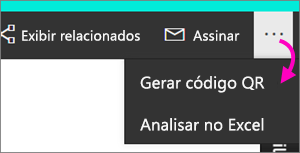
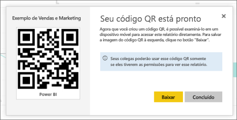

# Criar um código QR para um relatório no Power BI a ser usado nos aplicativos móveis
Os códigos QR no Power BI podem conectar qualquer coisa do mundo real diretamente às informações do BI relacionadas &#151; não é necessária navegação ou pesquisa.

Crie um código QR no serviço do Power BI para qualquer relatório, até mesmo para um relatório que você não pode editar. Em seguida, coloque o código QR em um local relevante. Por exemplo, você pode colá-lo em um email ou imprimir e colá-lo em um local específico. 

Os colegas com quem você compartilhou o relatório podem digitalizar o código QR para ter acesso ao relatório, diretamente em [seus dispositivos móveis](../consumer/mobile/mobile-apps-qr-code.md). Eles podem usar o scanner de código QR localizado no aplicativo do Power BI ou qualquer outro scanner QR instalado em seu dispositivo. Eles também podem [digitalizar um código QR de relatório com o aplicativo Power BI para Realidade Misturada](../consumer/mobile/mobile-mixed-reality-app.md#scan-a-report-qr-code-in-holographic-view).

## Criar um código QR para um relatório
1. Abra um relatório no serviço do Power BI.
2. Selecione **Mais opções** (...) no canto superior direito e selecione **Gerar código QR**. 
   
    
3. Será exibida uma caixa de diálogo com o código QR. 
   
    
4. Aqui, você pode escanear o código QR ou baixe e salvá-lo para: 
   
   * Adicioná-lo a um email ou a outro documento ou 
   * Imprimi-lo e colocá-lo em um local específico. 

## Imprimir o código QR
Power BI gera o código QR como um arquivo JPG, pronto para imprimir. 

1. Selecione **Baixar** e abra o arquivo JPG em um computador conectado a uma impressora.  
   
   O arquivo JPG tem o mesmo nome que o bloco. Por exemplo, “Amostra de Vendas e Marketing.jpg”.
   
1. Imprima o arquivo em 100% ou “tamanho real”.  
2. Recorte o código QR ao longo da borda e associe-o em um local relevante para o relatório. 

## Próximas etapas
* [Conectar-se a dados do Power BI do mundo real](../consumer/mobile/mobile-apps-data-in-real-world-context.md) com os aplicativos móveis
* [Digitalizar um código QR do Power BI em seu dispositivo móvel](../consumer/mobile/mobile-apps-qr-code.md)
* [Criar um código QR para um bloco](service-create-qr-code-for-tile.md)
* Perguntas? [Experimente perguntar para a Comunidade do Power BI](https://community.powerbi.com/)
