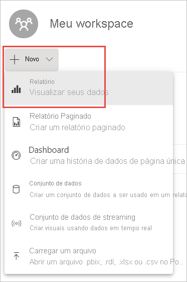
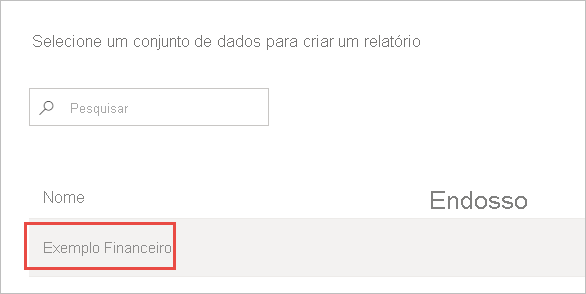
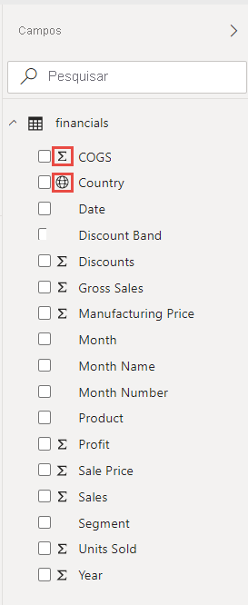
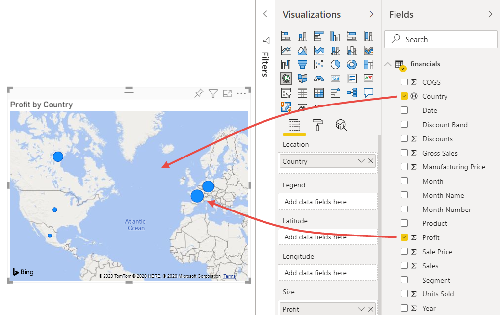
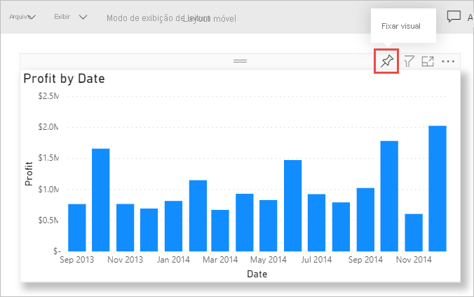
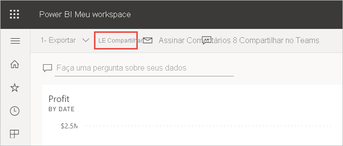
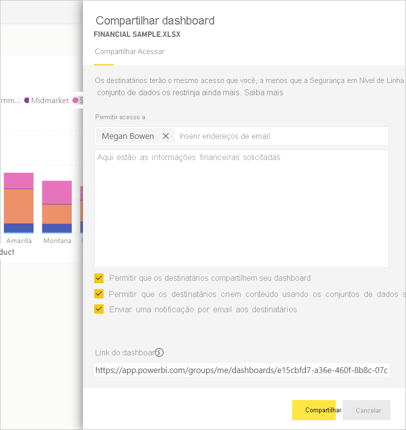
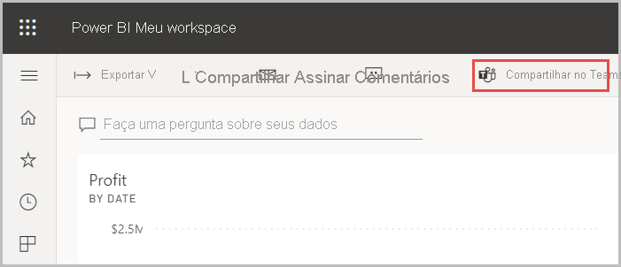

# Tutorial: Da pasta de trabalho do Excel para um relatório no serviço do Power BI e para o Microsoft Teams
Sua gerente deseja ver um relatório sobre suas últimas vendas e valores de lucro no final do dia. Porém, os dados mais recentes estão em vários sistemas e arquivos de terceiros no seu laptop. No passado, levava várias horas para criar visuais e formatar um relatório e você começava a se sentir ansioso.

Não se preocupe. Com o Power BI, você pode criar um relatório incrível e compartilhá-lo no Microsoft Teams em alguns instantes.

:::image type="content" source="media/service-from-excel-to-stunning-report/power-bi-financial-report-service.png" alt-text="Captura de tela do relatório concluído de Exemplo Financeiro":::

Neste tutorial, carregamos um arquivo do Excel, criamos um relatório e compartilhamos o relatório com nossos colegas no Microsoft Teams, tudo isso no Power BI. Você aprenderá a:

> [!div class="checklist"]
> * Preparar seus dados no Excel.
> * Baixar dados de exemplo.
> * Criar um relatório no serviço do Power BI.
> * Fixar os visuais do relatório em um dashboard.
> * Compartilhar um link no dashboard.
> * Compartilhar o dashboard no Microsoft Teams

## Preparar dados no Excel
Vamos tomar um arquivo simples do Excel como exemplo. 

1. Antes de carregar o arquivo do Excel no Power BI, você deve organizar seus dados em uma tabela simples. Em uma tabela simples, cada coluna contém o mesmo tipo de dados, por exemplo, texto, data, número ou moeda. Sua tabela deve ter uma linha de cabeçalho, mas não colunas ou linhas que exibam totais.

   

2. Em seguida, formate os dados como uma tabela. No Excel, na guia **Página Inicial**, no grupo **Estilos**, selecione **Formatar como tabela**. 

3. Selecione um estilo de tabela para aplicar à sua planilha. 

   Sua planilha do Excel agora está pronta para ser carregada no Power BI.

   

## Carregar arquivo do Excel para o serviço do Power BI
O serviço do Power BI se conecta a várias fontes de dados, incluindo arquivos do Excel que residem em seu computador. 

 > [!NOTE] 
 > Para acompanhar o restante deste tutorial, baixe a [pasta de trabalho de Exemplo Financeiro](https://go.microsoft.com/fwlink/?LinkID=521962).

1. Para começar, entre no serviço do Power BI. Se você ainda não se inscreveu, [poderá fazê-lo gratuitamente](https://powerbi.com).
1. Em **Meu workspace**, selecione **Novo** > **Carregar um arquivo**.

    :::image type="content" source="media/service-from-excel-to-stunning-report/power-bi-new-upload.png" alt-text="Captura de tela da opção Carregar um arquivo.":::

1. Selecione **Arquivo Local**, procure a localização em que você salvou o arquivo de Exemplo Financeiro do Excel e selecione **Abrir**.
7. Na página **Arquivo Local**, selecione **Importar**.

    Agora você tem um conjunto de dados de Exemplo Financeiro. O Power BI também criou automaticamente um dashboard em branco. Se você não vir o dashboard, atualize o navegador.

    :::image type="content" source="media/service-from-excel-to-stunning-report/power-bi-financial-dataset.png" alt-text="Captura de tela de Meu Workspace com o conjunto de dados de Exemplo Financeiro.":::

2. Você deseja criar um relatório. Ainda em **Meu workspace**, selecione **Novo** > **Relatório**.

   

3. Na caixa de diálogo **Selecione um conjunto de dados para criar um relatório**, escolha o conjunto de dados **Exemplo Financeiro** > **Criar**.

   

## Criar seu relatório
 
O relatório será aberto no Modo de exibição de edição e mostrará a tela do relatório em branco. À direita, estão os painéis **Visualizações**, **Filtros** e **Campos**. Os dados de tabela da pasta de trabalho do Excel são exibidos no painel **Campos**. Na parte superior está o nome da tabela, **finanças**. Abaixo dele, o Power BI lista os cabeçalhos de coluna como campos individuais.

Você consegue ver os símbolos de Sigma na lista Campos? O Power BI detectou que esses campos são numéricos. Ele também indica um campo geográfico com um símbolo de globo.

1. Para ter mais espaço na tela de relatório, selecione **Ocultar o painel de navegação** e minimize o painel **Filtros**.

    :::image type="content" source="media/service-from-excel-to-stunning-report/power-bi-hide-nav-pane.png" alt-text="Captura de tela da minimização do painel de navegação."::: 

1. Agora você pode começar a criar visualizações. Digamos que seu gerente quer ver o lucro ao longo do tempo. No painel **Campos**, arraste **Lucro** para a tela do relatório. 

   Por padrão, o Power BI exibe um gráfico de colunas com uma coluna. 

    :::image type="content" source="media/service-from-excel-to-stunning-report/power-bi-profit-column.png" alt-text="Captura de tela do gráfico de colunas com uma coluna.":::

3. Arraste **Data** à tela de relatório. 

   O Power BI atualizará o gráfico de colunas para mostrar o lucro por data.

   

    Dezembro de 2014 foi o mês mais lucrativo.
   
    > [!TIP]
    > Se os valores do gráfico não tiverem a aparência que você espera, verifique as agregações. Por exemplo, na caixa **Valores**, selecione o campo **Lucro** recém-adicionado e verifique se os dados estão sendo agregados da maneira desejada. Neste exemplo, estamos usando **Soma**.
    > 

### Criar um mapa

Sua gerente deseja saber quais países são os mais lucrativos. Impressione sua gerente com uma visualização de mapa. 

1. Selecione uma área em branco na tela do seu relatório. 

2. No painel **Campos**, arraste o campo **País** para a tela do relatório e arraste o campo **Lucro** para o mapa.

   O Power BI cria um visual de mapa com bolhas que representam o lucro relativo de cada local.

   

    Parece que os países da Europa estão tendo um desempenho melhor do que o dos países da América do Norte.

### Criar um visual mostrando as vendas

Que tal exibir um visual mostrando as vendas por produto e segmento de mercado? Isso é fácil. 

1. Selecione a tela em branco.

1. No painel **Campos**, selecione os campos **Vendas**, **Produto** e **Segmento**. 
   
   O Power BI cria um gráfico de colunas clusterizado. 

2. Altere o tipo de gráfico escolhendo um dos ícones no menu **Visualizações**. Por exemplo, altere-o para um **Gráfico de colunas empilhadas**. 

   

3. Para classificar o gráfico, selecione **Mais opções** (...) > **Classificar por**.

### Sofisticar os visuais

Faça as alterações a seguir na guia **Formatar** no painel Visualizações.

:::image type="content" source="media/desktop-excel-stunning-report/power-bi-format-tab-visualizations.png" alt-text="Captura de tela da guia Formato no painel Visualizações.":::

1. Selecione o gráfico de colunas **Lucro por Data**. Na seção **Título**, altere o **Tamanho do texto** para **16 pt**. Alterne **Sombra** para **Ativado**. 

1. Selecione o gráfico de coluna empilhadas **Vendas por Produto e Segmento**. Na seção **Título**, altere o **Tamanho do texto** do título para **16 pt**. Alterne **Sombra** para **Ativado**.

1. Selecione o mapa **Lucro por País**. Na seção **Estilos de mapa**, altere **Tema** para **Escala de cinza**. Na seção **Título**, altere o **Tamanho do texto** do título para **16 pt**. Alterne **Sombra** para **Ativado**.

## Fixar os visuais em um dashboard

Agora você pode fixar todos os visuais no dashboard em branco que o Power BI criou por padrão. 

1. Posicione o cursor em um visual e selecione **Fixar visual**.

   

1. Salve seu relatório para fixar um visual no dashboard. Dê um nome ao relatório e selecione **Salvar**.
1. Fixe cada visual no dashboard criado pelo Power BI, **Exemplo Financeiro.xlsx**.
1. Ao fixar o último visual, selecione **Ir para o dashboard**.
1. O Power BI adicionou automaticamente um bloco de espaço reservado de Exemplo Financeiro.xlsx ao dashboard. Selecione **Mais opções (...)**  > **Excluir bloco**.

    :::image type="content" source="media/service-from-excel-to-stunning-report/power-bi-tile-more-options.png" alt-text="Captura de tela de Mais opções em um bloco.":::

1. Reorganize e redimensione os blocos como desejar.

O dashboard e o relatório estão prontos.

## Compartilhar um link no dashboard

Agora é hora de compartilhar o dashboard com a sua gerente. Você pode compartilhar seu painel e o relatório subjacente com colegas que têm uma conta do Power BI. Eles podem interagir com seu relatório, mas não podem salvar alterações. Se você permitir, eles poderão compartilhá-lo novamente com outras pessoas ou criar um relatório com base no conjunto de dados subjacente.

1. Para compartilhar seu relatório, na parte superior do painel, selecione **Compartilhar**.

   

2. Na página **Compartilhar dashboard**, insira os endereços de email dos destinatários na caixa **Inserir endereços de email** e adicione uma mensagem na caixa abaixo dela. 

3. Escolha as opções desejadas abaixo, se houver:

    - **Permitir que os destinatários compartilhem seu dashboard**. 
    - **Permitir que os destinatários criem um conteúdo usando os conjuntos de dados subjacentes**.
    - **Enviar uma notificação por email aos destinatários.**

   

1. Selecione **Compartilhar**.

## Compartilhamento no Microsoft Teams

Você também pode compartilhar relatórios e dashboards diretamente com seus colegas no Microsoft Teams.

1. Para compartilhá-los no Teams, na parte superior do dashboard, selecione **Compartilhar no Teams**.

   

2. O Power BI exibirá a caixa de diálogo **Compartilhar no Teams**. Insira o nome de uma pessoa, um grupo ou um canal e selecione **Compartilhar**. 
   
    :::image type="content" source="media/service-from-excel-to-stunning-report/power-bi-share-teams-dialog.png" alt-text="Captura de tela da caixa de diálogo Compartilhar no Teams":::

3. O link será exibido nas **Postagens** da pessoa, do grupo ou do canal em questão.

   

## Próximas etapas

* Agora que você criou um relatório básico no serviço do Power BI, que tal criar um relatório no Power BI Desktop? Experimente o tutorial [Da pasta de trabalho do Excel para um relatório incrível no Power BI Desktop](desktop-excel-stunning-report.md).

Mais perguntas? [Experimente a Comunidade do Power BI](https://community.powerbi.com/).
