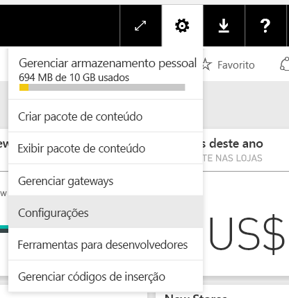
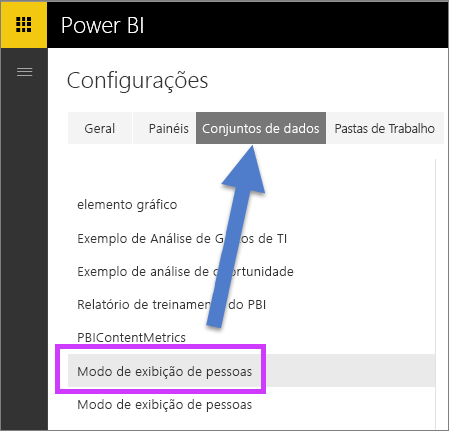
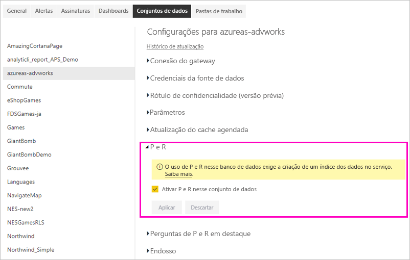

# Habilitar P e R para conexões dinâmicas no Power BI

Você pode importar os conjuntos de dados no Power BI ou criar uma *conexão dinâmica* para eles. Os conjuntos de dados de conexão dinâmica geralmente são locais. Nesse caso, você gerencia conexões dinâmicas usando um [gateway](../connect-data/service-gateway-onprem.md). Os dados e as consultas são enviados e recebidos usando consultas dinâmicas.

> [!NOTE]
> As conexões dinâmicas também dão suporte a conjuntos de dados do Azure Analysis Services, que não exigem um gateway.

## P e R para conjuntos de dados do gateway de dados local
Se você quiser usar a P e R com conjuntos de dados que você acessa por meio de um gateway, será necessário habilitá-los primeiro.

Depois de habilitados, o Power BI criará um índice da fonte de dados e carregará um subconjunto desses dados no Power BI para habilitar a troca de perguntas. Pode demorar vários minutos para a criação do índice inicial, e o Power BI mantém e atualiza o índice automaticamente conforme os dados são alterados. O uso da P e R com esses conjuntos de dados tem o mesmo comportamento observado com os dados publicados no Power BI. Em ambos os casos, há suporte para o conjunto completo de recursos disponíveis na experiência de P e R.

À medida que você faz perguntas no Power BI, a P e R determina o melhor visual a ser construído ou a folha de relatório a ser usada para responder à sua pergunta usando um índice do conjunto de dados. Depois de determinar a melhor resposta possível, o P e R usa o DirectQuery para buscar dados dinâmicos da fonte de dados por meio do gateway para popular gráficos e grafos. Em decorrência disso, a P e R do Power BI sempre mostra os dados mais atualizados diretamente da fonte de dados subjacente.

Como a P e R do Power BI usa os valores de texto e de esquema da fonte de dados para determinar como consultar o modelo subjacente em busca de respostas, as pesquisas por valores de texto específicos novos ou excluídos (por exemplo, perguntar um nome de cliente relacionado a um registro de texto recém-adicionado) dependem de o índice estar atualizado com os últimos valores. O Power BI mantém automaticamente o índice de texto e de esquema atualizado em uma janela de 60 minutos de alterações.

Para obter mais informações, veja:

* O que é o [gateway de dados local](../connect-data/service-gateway-onprem.md)?
* [P e R sobre o Power BI para consumidores](../consumer/end-user-q-and-a.md)

## Habilitar a P e R
Depois que o gateway de dados estiver configurado, conecte-se aos seus dados por meio do Power BI.  Crie um dashboard usando seus dados locais ou carregue um arquivo .pbix que usa dados locais.  Talvez você também já tenha dados locais em dashboards, relatórios e conjuntos de dados que foram compartilhados com você.

1. No canto superior direito do Power BI, selecione o ícone de engrenagem  e escolha **Configurações**.
   
   
2. Selecione **conjuntos de dados** e escolha o conjunto de dados que será habilitado para a P e R.
   
   
3. Expanda **P e R**, marque a caixa de seleção **Ativar P e R neste conjunto de dados** e escolha **Aplicar**.
   
    

## Quais dados são armazenados em cache e como a privacidade é protegida?
Quando você habilita a P e R para seus dados locais, um subconjunto dos dados é armazenado em cache no serviço. Esse cache verifica se a P e R funciona com um desempenho razoável. O Power BI exclui valores com mais de 24 caracteres do cache. O cache é excluído em algumas horas quando você desabilita a P e R desmarcando **Ativar P e R neste conjunto de dados** ou quando você exclui o conjunto de dados.

## Considerações e solução de problemas
O recurso tem algumas limitações:

* Inicialmente, o recurso só está disponível para fontes de dados tabulares do SQL Server 2016 Analysis Services. O recurso é otimizado para funcionar com dados de tabela. A experiência de P e R ainda não é compatível com multidimensionais. Fontes de dados adicionais compatíveis com o gateway de dados local serão distribuídas ao longo do tempo.
* O suporte completo para segurança em nível de linha definido no SQL Server Analysis Services não está disponível inicialmente. Ao fazer perguntas na P e R, o “preenchimento automático” de perguntas durante a digitação pode mostrar valores de cadeia de caracteres aos quais um usuário não tem acesso. No entanto, a RLS definida no modelo é respeitada em relação a visuais de relatório e de gráfico e, portanto, nenhum dado numérico subjacente pode ser exposto. Opções para controlar esse comportamento serão lançadas em atualizações futuras.
* A OLS (segurança em nível do objeto) não é compatível. As P e R não respeitam a segurança em nível de objeto e podem revelar nomes de tabela ou coluna para os usuários que não têm acesso a eles. Você deve habilitar a RLS para garantir que os valores de dados também estejam protegidos adequadamente. 
* As conexões dinâmicas são compatíveis somente com o gateway de dados local. Sendo assim, esse recurso não pode ser usado com o gateway pessoal.

## Próximas etapas

- [On-premises data gateway (Gateway de dados local)](../connect-data/service-gateway-onprem.md)  
- [Gerenciar sua fonte de dados – Analysis Services](../connect-data/service-gateway-enterprise-manage-ssas.md)  
- [Conceitos básicos para designers no serviço do Power BI](../fundamentals/service-basic-concepts.md)  
- [Visão geral de P e R do Power BI](../consumer/end-user-q-and-a.md)  

Mais perguntas? [Experimente perguntar à Comunidade do Power BI](https://community.powerbi.com/)
