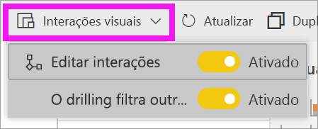
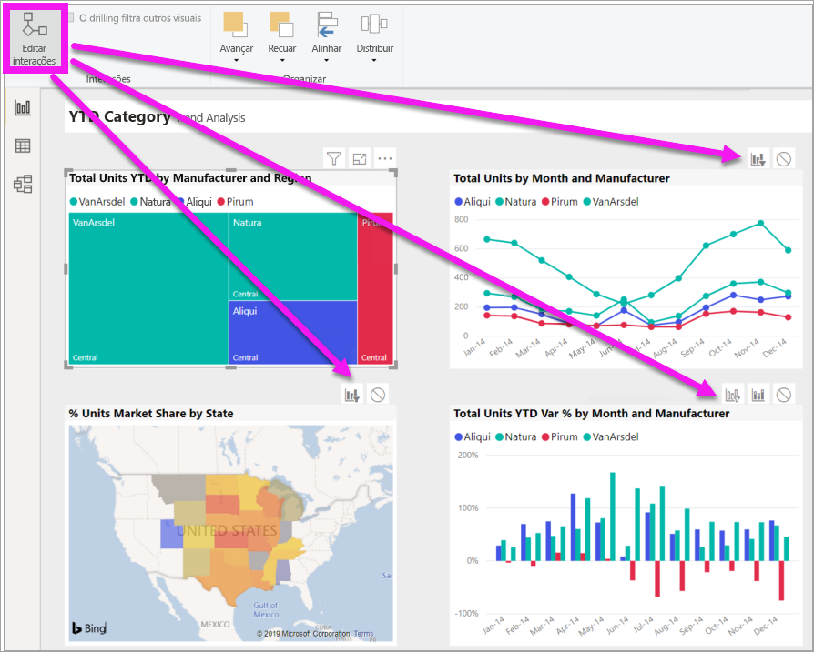
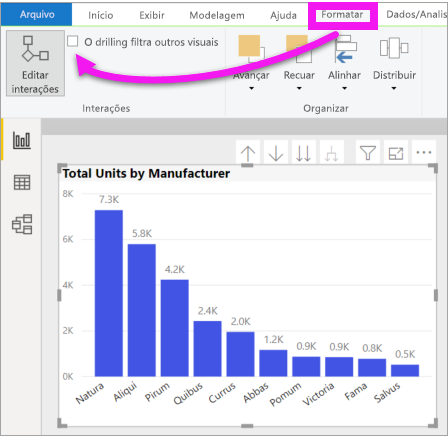

# Alterar como os visuais interagem em um relatório do Power BI
Se você tiver permissões de edição para um relatório, poderá usar as **interações visuais** para alterar como as visualizações em uma página de relatório afetam umas às outras. 

## Introdução às interações visuais
Por padrão, as visualizações em uma página de relatório podem ser usadas para filtro cruzado e realce cruzado de outras visualizações na página.
Por exemplo, selecionar um estado em uma visualização de mapa realça o gráfico de colunas e filtra o gráfico de linhas para exibir apenas os dados que se aplicam a um estado.
Consulte [Sobre filtragem e realce](power-bi-reports-filters-and-highlighting.md). E se você tiver uma visualização que é compatível com [drill down](../consumer/end-user-drill.md), por padrão, fazer drill down em uma visualização não afeta as outras visualizações na página do relatório. Mas ambos os comportamentos padrão podem ser substituídos e as interações definidas por visualização.

Este artigo mostra como usar as **interações visuais** no Power BI Desktop. O processo é o mesmo no serviço do Power BI [Modo de Exibição de Edição](service-interact-with-a-report-in-editing-view.md). Se você só tiver acesso ao modo de exibição de Leitura ou se o relatório tiver sido compartilhado com você, não será possível alterar as configurações de interações visuais.

Os termos *filtro cruzado* e *realce cruzado* são usados para distinguir o comportamento descrito aqui do que acontece quando você usa o painel **Filtros** para *filtrar* e *realçar* visualizações.  

> [!NOTE]
> Este vídeo usa versões mais antigas do Power BI Desktop e do serviço do Power BI. 
>
>

<iframe width="560" height="315" src="https://www.youtube.com/embed/N_xYsCbyHPw?list=PL1N57mwBHtN0JFoKSR0n-tBkUJHeMP2cP" frameborder="0" allowfullscreen></iframe>

## Habilitar os controles de interação visual
Se você tiver permissões de edição em um relatório, poderá ativar os controles de interação visual e, em seguida, personalizar como as visualizações na página do seu relatório filtram e realçam umas às outras. 

1. Selecione a visualização para ativá-la.  
2. Exiba as opções de **Interações Visuais**.
    

    - Na Área de trabalho, selecione **Formato > Interações**.

        

    - No serviço do Power BI, abra o relatório no modo de exibição de Edição e selecione o menu suspenso na barra de menus do relatório.

        

3. Para exibir os controles de interação de visualização, selecione **Editar interações**. O Power BI adiciona os ícones de filtro e realce a todas as outras visualizações na página do relatório. Podemos ver que o mapa de árvore está aplicando filtragem cruzada ao gráfico de linha e ao mapa e realce cruzado ao gráfico de coluna. Agora você pode alterar como a visualização selecionada interage com as outras visualizações na página do relatório.
   
    

## Alterar o comportamento da interação
Familiarize-se com a forma como suas visualizações interagem, selecionando cada visualização na página do seu relatório, uma de cada vez.  Selecione um ponto de dados, uma barra ou uma forma e observe o impacto nas outras visualizações. Se o comportamento observado não for o que você prefere, será possível alterar as interações. Essas alterações são salvas com o relatório, para que você e seus clientes tenham a mesma experiência de interação visual.

Comece selecionando uma visualização para torná-la ativa.  Observe que todas as outras visualizações na página agora exibem ícones de interação. O ícone em negrito é aquele que está sendo aplicado. Em seguida, determine o impacto que você deseja que a **visualização selecionada** tenha nas outras visualizações.  E, como opção, repita para todas as outras visualizações na página do relatório.

Para a visualização selecionada:
   
   * aplicar filtragem cruzada em uma das outras visualizações na página, selecione o ícone de **filtro** no canto superior direito do  dessa visualização.
   * aplicar realce cruzado em uma das outras visualizações na página, selecione o ícone de **realce** .
   * não ter nenhum impacto em uma das outras visualizações na página, selecione o ícone **sem impacto** .

## Alterar as interações de visualizações analisáveis
[Algumas visualizações do Power BI podem ser analisadas](../consumer/end-user-drill.md). Por padrão, quando você analisa em detalhes uma visualização, ela não afeta as outras visualizações na página do relatório. Mas esse comportamento pode ser alterado. 

> [!TIP]
> Experimente você mesmo usando o arquivo [PBIX de amostra de Recursos Humanos](https://download.microsoft.com/download/6/9/5/69503155-05A5-483E-829A-F7B5F3DD5D27/Human%20Resources%20Sample%20PBIX.pbix). Há um gráfico de colunas com detalhamento na guia **Novas contratações**.
>

1. Selecione o visual analisável para ativá-lo. 

2. Selecione o ícone de drill down para ativar esse recurso.

    

2. Na barra de menus, selecione **Formato** > **Filtros detalhados de outros elementos visuais**.  Agora, quando você fizer drill down (e up) em uma visualização, as outras visualizações na página do relatório serão alteradas para refletir sua seleção atual de detalhamento. 

    

3. Se o comportamento observado não refletir a sua preferência, você poderá alterar as interações [conforme descrito acima](#change-the-interaction-behavior).

## Considerações e solução de problemas
Se você criar uma matriz com campos de tabelas diferentes e tentar realçar de maneira cruzada selecionando vários itens em diferentes níveis da hierarquia, receberá erros nos outros visuais. 

    
## Próximas etapas
[Filtragem e realce nos relatórios do Power BI](power-bi-reports-filters-and-highlighting.md)