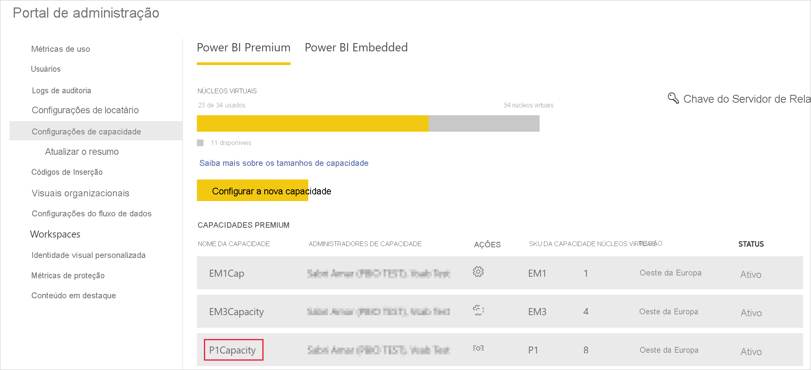
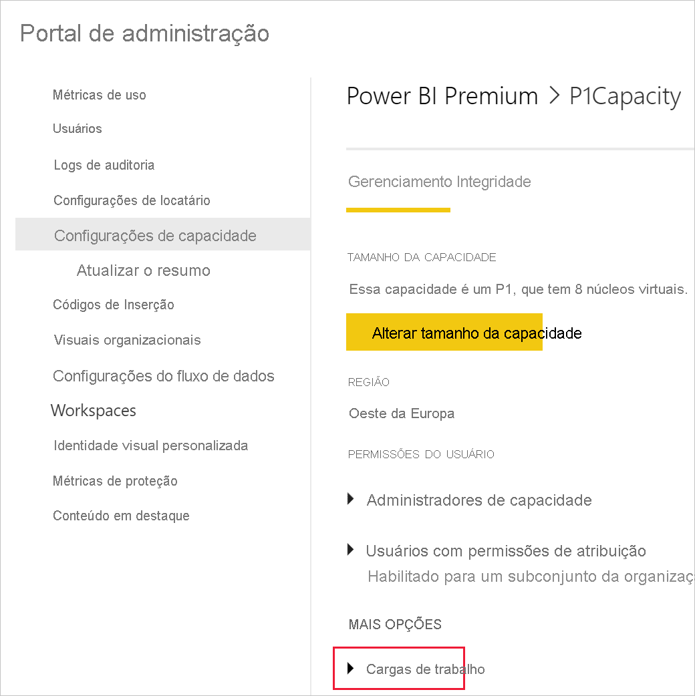
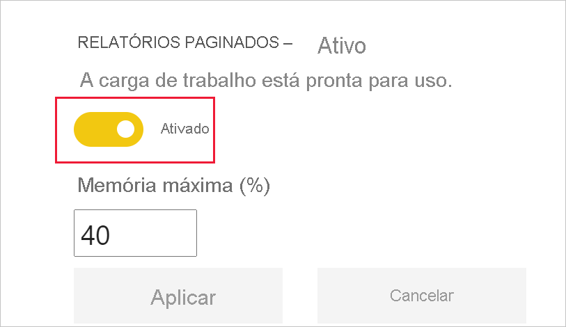
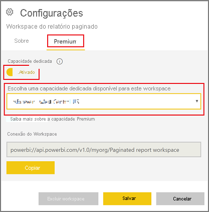
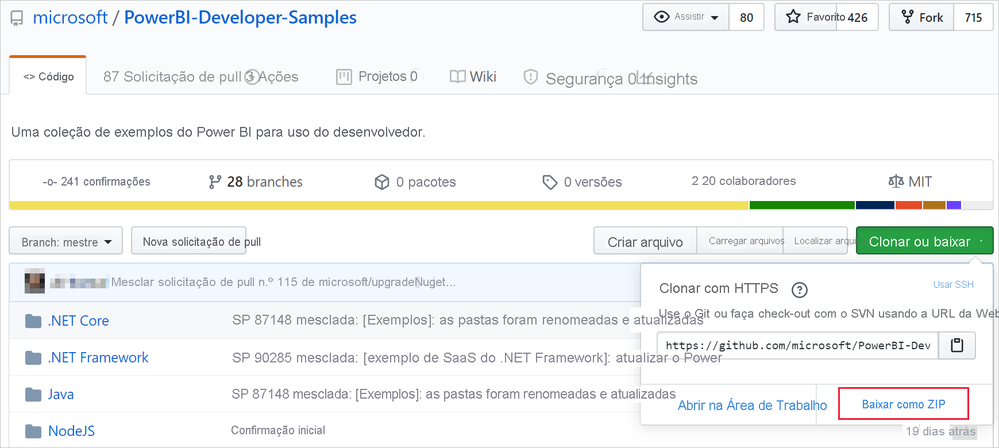

# <a name="tutorial-embed-power-bi-paginated-reports-into-an-application-for-your-organization"></a>Tutorial: Inserir relatórios paginados do Power BI em um aplicativo para sua organização

No **Power BI**, você pode inserir relatórios paginados em um aplicativo para sua organização usando o cenário *o usuário possui dados*.

Os relatórios paginados são projetados para impressão de alta qualidade. Normalmente, esses relatórios contêm muitos dados, renderizados de uma forma que os fazem caber em páginas impressas.
Para entender como Power BI dá suporte a relatórios paginados, confira [O que são os relatórios paginados no Power BI Premium?](https://docs.microsoft.com/power-bi/paginated-reports-report-builder-power-bi)

O **user owns data** permite que o aplicativo estenda o serviço do Power BI para que ele possa usar análise integrada. Este tutorial demonstra como integrar um relatório paginado a um aplicativo.

Você pode usar o SDK do .NET do Power BI juntamente com a API do JavaScript do Power BI para inserir o Power BI em um aplicativo para sua organização.


Neste tutorial, você aprenderá as seguintes tarefas:
> [!div class="checklist"]
> * Registrar um aplicativo no Azure.
> * Insira um relatório paginado do Power BI em um aplicativo usando seu locatário do Power BI.

## <a name="prerequisites"></a>Pré-requisitos
Para começar, você precisa ter:

* Uma [conta do Power BI Pro](../../admin/service-admin-purchasing-power-bi-pro.md).

* Você precisa ter seu próprio [locatário do Azure Active Directory](create-an-azure-active-directory-tenant.md) configurado.

* Pelo menos uma capacidade P1. Confira [Qual o tamanho da capacidade Premium que preciso para relatórios paginados?](../../paginated-reports/paginated-reports-faq.md#what-size-premium-capacity-do-i-need-for-paginated-reports)

Se não estiver inscrito no **Power BI Pro**, [inscreva-se para uma avaliação gratuita](https://powerbi.microsoft.com/pricing/) antes de começar.

## <a name="set-up-your-power-bi-environment"></a>Configurar seu ambiente do Power BI

Siga as instruções nesta seção e configure o Power BI para inserir seus relatórios paginados.

### <a name="register-a-server-side-web-application-app"></a>Registrar um aplicativo Web do lado do servidor

Siga as instruções em [Registrar um aplicativo do Azure AD para usar com o Power BI](register-app.md) para registrar um aplicativo Web do lado do servidor.

>[!NOTE]
>Ao registrar o aplicativo, faça o seguinte:
>* Obtenha o segredo do aplicativo
>* Aplique as permissões **Report.ReadAll** (escopo) ao seu aplicativo.

### <a name="create-a-dedicated-capacity"></a>Criar uma capacidade dedicada

Ao criar uma capacidade dedicada, você pode usufruir de um recurso dedicado ao conteúdo no workspace do aplicativo. Para relatórios paginados, você precisa dar suporte ao workspace do aplicativo com, pelo menos, uma capacidade P1. Você pode criar uma capacidade dedicada usando o [Power BI Premium](../../admin/service-premium-what-is.md).

A seguinte tabela lista os SKUs do Power BI Premium que podem ser usados na criação de uma capacidade dedicada para relatórios paginados no [Microsoft Office 365](../../admin/service-admin-premium-purchase.md):

| Nó de capacidade | Total de vCores<br/>(back-end + front-end) | vCores de back-end | vCores de front-end | Limites de conexão dinâmica/DirectQuery |
| --- | --- | --- | --- | --- | --- |
| P1 |8 vCores |4 vCores, 25 GB de RAM |4 vCores |30 por segundo |
| P2 |16 vCores |8 vCores, 50 GB de RAM |8 vCores |60 por segundo |
| P3 |32 vCores |16 vCores, 100 GB de RAM |16 vCores |120 por segundo |
| P4 |64 vCores |32 vCores, 200 GB de RAM |32 vCores |240 por segundo |
| P5 |128 vCores |64 vCores, 400 GB de RAM |64 vCores |480 por segundo |
|||||

### <a name="enable-paginated-reports-workload"></a>Habilitar a carga de trabalho de relatórios paginados

Você precisa habilitar a carga de trabalho de relatório paginado em sua capacidade dedicada.

1. Entre em [Power BI > Portal de administração > Configurações de capacidade](https://app.powerbi.com/admin-portal/capacities).

2. Selecione a capacidade com o workspace no qual você deseja carregar o relatório paginado.

    

3. Expanda **Cargas de Trabalho**.

    

4. Ative a carga de trabalho de relatórios paginados.

    

### <a name="assign-an-app-workspace-to-a-dedicated-capacity"></a>Atribua um workspace de aplicativo a uma capacidade dedicada

Depois de criar uma capacidade dedicada, você pode atribuir o workspace do aplicativo a uma capacidade dedicada. Para concluir este processo, siga estas etapas:

1. No serviço do Power BI, expanda os workspaces e selecione **Mais** no workspace que você está usando para inserir seu conteúdo. Em seguida, selecione **Configurações do workspace**.

    

2. Selecione **Premium** e habilite **Capacidade dedicada**. Selecione a capacidade dedicada que você criou. Depois, selecione **Salvar**.

    

3. Depois de selecionar **Salvar**, você verá um losango ao lado do nome do workspace do aplicativo.

    

### <a name="create-and-publish-your-power-bi-paginated-reports"></a>Criar e publicar relatórios paginados do Power BI

Você pode criar seus relatórios paginados usando o [Power BI Report Builder](../../paginated-reports/paginated-reports-report-builder-power-bi.md#create-reports-in-power-bi-report-builder). Em seguida, você pode [carregar o relatório](../../paginated-reports/paginated-reports-quickstart-aw.md#upload-the-report-to-the-service) em um workspace de aplicativo atribuído a pelo menos uma capacidade P1 e ativar a [carga de trabalho de relatórios paginados](#enable-paginated-reports-workload). O usuário final que carrega o relatório precisa ter uma licença do Power BI Pro para publicar em um workspace de aplicativo.
   
## <a name="embed-your-content-by-using-the-sample-application"></a>Insira o conteúdo usando o aplicativo de exemplo

Este exemplo é deliberadamente mantido simples para fins de demonstração.

Siga as etapas abaixo para começar a inserir seu conteúdo usando o aplicativo de exemplo.

1. Baixe o [Visual Studio](https://www.visualstudio.com/) (versão 2013 ou posterior). Baixe a versão mais recente do [pacote do NuGet](https://www.nuget.org/profiles/powerbi).

2. Baixe [PowerBI-Developer-Samples](https://github.com/Microsoft/PowerBI-Developer-Samples) e abra .NET Framework > Inserir para sua organização > integrate-web-app > **PBIWebApp**.

    

3. Abra o arquivo **Cloud.config** no aplicativo de exemplo e preencha os seguintes campos para executar seu aplicativo:
    * [ID do Aplicativo](#application-id)
    * [ID do Workspace](#workspace-id)
    * [ID do Relatório](#report-id)
    * [AADAuthorityUrl](#aadauthorityurl)

    

### <a name="application-id"></a>ID do aplicativo

Preencha as informações de **applicationId** com a **ID do Aplicativo** do **Azure**. A **applicationId** é usada pelo aplicativo para identificar-se aos usuários para os quais você está solicitando permissões.

Para obter a **applicationId**, siga estas etapas:

1. Entre no [Portal do Azure](https://portal.azure.com).

2. No painel de navegação esquerdo, escolha **Todos os serviços** e selecione **Registros de aplicativo**.

3. Selecione o aplicativo que precisa usar a **applicationId**.

    

4. Há uma **ID do Aplicativo** listada como GUID. Use essa **ID do aplicativo** como a **applicationId** do aplicativo.

    

### <a name="workspace-id"></a>ID do workspace

Preencha as informações de **workspaceId** com o GUID do workspace (grupo) do aplicativo do Power BI. Você pode obter essas informações da URL, quando estiver conectado ao serviço do Power BI ou quando estiver usando o PowerShell.

URL <br>


PowerShell <br>

```powershell
Get-PowerBIworkspace -name "User Owns Embed Test"
```

   

### <a name="report-id"></a>ID do Relatório

Preencha as informações de **reportId** com o GUID de relatório do Power BI. Você pode obter essas informações da URL, quando estiver conectado ao serviço do Power BI ou quando estiver usando o PowerShell.


PowerShell <br>

```powershell
Get-PowerBIworkspace -name "User Owns Embed Test" | Get-PowerBIReport -Name "Sales Paginated Report"
```


### <a name="aadauthorityurl"></a>AADAuthorityUrl

Preencha a informação **AADAuthorityUrl** com a URL que permite a você inserir no locatário organizacional ou inserir com um usuário convidado.

Para inserir com seu locatário organizacional, use a URL: *https://login.microsoftonline.com/common/oauth2/authorize* .

Para inserir com um convidado, use a URL *https://login.microsoftonline.com/report-owner-tenant-id* , em que você adiciona a ID de locatário do proprietário do relatório substituindo *relatório-proprietário-locatário-id*.

### <a name="run-the-application"></a>Execute o aplicativo

1. Selecione **Executar** no **Visual Studio**.

    

2. Selecione **Inserir Relatório**. Dependendo do conteúdo que você optar por testar – relatórios, painéis ou blocos –, selecione essa opção no aplicativo.

    

3. Agora, você pode exibir o relatório no aplicativo de exemplo.

    

## <a name="next-steps"></a>Próximas etapas

Neste tutorial, você aprendeu a inserir relatórios paginados do Power BI em um aplicativo usando sua conta corporativa do Power BI. 

> [!div class="nextstepaction"]
> [Inserir de aplicativos](embed-from-apps.md)

> [!div class="nextstepaction"]
>[Inserir conteúdo do Power BI para seus clientes](embed-sample-for-customers.md)

> [!div class="nextstepaction"]
>[Inserir relatórios paginados do Power BI para seus clientes](embed-paginated-reports-customers.md)

Se você tiver outras dúvidas, [experimente perguntar à Comunidade do Power BI](http://community.powerbi.com/).