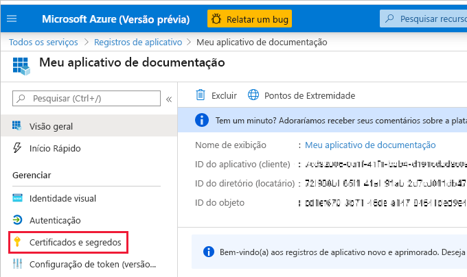
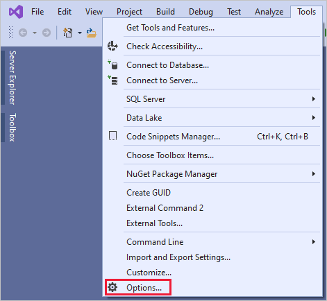

# <a name="embed-power-bi-content-with-service-principal-and-a-certificate"></a>Conteúdo inserido do Power BI com a entidade de serviço e um certificado

[!INCLUDE[service principal overview](../../includes/service-principal-overview.md)]

>[!NOTE]
>Recomendamos que você proteja os seus serviços de back-end usando certificados, em vez de chaves secretas. [Saiba mais sobre como obter tokens de acesso do Azure AD usando chaves secretas ou certificados](https://docs.microsoft.com/azure/architecture/multitenant-identity/client-assertion).

## <a name="certificate-based-authentication"></a>Autenticação baseada em certificado

A autenticação baseada em certificado permite que você seja autenticado pelo Azure AD (Azure Active Directory) com um certificado de cliente em um dispositivo Windows, Android ou iOS ou seja mantido em um [Azure Key Vault](https://docs.microsoft.com/azure/key-vault/basic-concepts).

O uso desse método de autenticação permite gerenciar certificados de um local central, usando a AC para rotação ou revogação.

Você pode saber mais sobre certificados no Azure AD na página [Fluxos de credencial do cliente](https://github.com/AzureAD/microsoft-authentication-library-for-dotnet/wiki/Client-credential-flows) do GitHub.

## <a name="method"></a>Método

Para usar a entidade de serviço e um certificado com análise integrada, siga estas etapas:

1. Criar um certificado.

2. Crie um Aplicativo do Azure AD.

3. Configure uma autenticação de certificado.

4. Obtenha um certificado do Azure Key Vault.

5. Autentique usando a entidade de serviço e um certificado.

## <a name="step-1---create-a-certificate"></a>Etapa 1 – Criar um certificado

Você pode adquirir um certificado de uma *Autoridade de Certificação* confiável ou gerar um certificado por conta própria.

Esta seção descreve como criar um certificado usando o [Azure Key Vault](https://docs.microsoft.com/azure/key-vault/create-certificate) e como baixar o arquivo *.cer* que contém a chave pública.

1. Entre no [Microsoft Azure](https://ms.portal.azure.com/#allservices).

2. Pesquise **Cofres de Chaves** e clique no link **Cofres de Chaves**.

    

3. Clique no cofre de chaves ao qual você deseja adicionar um certificado.

    

4. Clique em **Certificados**.

    

5. Clique em **Gerar/Importar**.

    

6. Configure os campos para **Criar um certificado** da seguinte maneira:

    * **Método de Criação de Certificado** – Geral

    * **Nome do Certificado** – Insira um nome para o seu certificado

    * **Tipo de AC (Autoridade de Certificação)** – Certificado autoassinado

    * **Entidade** – Um nome diferenciado [X.500](https://wikipedia.org/wiki/X.500)

    * **Nomes DNS** – 0 nome DNS

    * **Período de Validade (em meses)** – Insira a duração da validade do certificado

    * **Tipo de Conteúdo** – PKCS nº 12

    * **Tipo de Ação de Tempo de Vida** – Renovar automaticamente com um determinado percentual de tempo de vida

    * **Percentual de Tempo de Vida** – 80

    * **Configuração de Política Avançada** – Não configurado

7. Clique em **Criar**. O certificado recém-criado está desabilitado por padrão. Pode levar até cinco minutos para ele ser habilitado.

8. Selecione o certificado que você criou.

9. Clique em **Baixar no formato CER**. O arquivo baixado contém a chave pública.

    

## <a name="step-2---create-an-azure-ad-application"></a>Etapa 2 – Criar um Aplicativo do Azure AD

[!INCLUDE[service principal create app](../../includes/service-principal-create-app.md)]

## <a name="step-3---set-up-certificate-authentication"></a>Etapa 3 – Configurar uma autenticação de certificado

1. No aplicativo do Azure AD, clique na guia **Certificados e segredos**.

     

2. Clique em **Carregar o certificado** e carregue o arquivo *.cer* que você criou e baixou na [primeira etapa](#step-1---create-a-certificate) deste tutorial. O arquivo *.cer* contém a chave pública.

## <a name="step-4---get-the-certificate-from-azure-key-vault"></a>Etapa 4 – Obter um certificado do Azure Key Vault

Use as identidades gerenciadas para recursos do Azure para obter o certificado do Azure Key Vault. Esse processo envolve obter o certificado *.pfx* que contém as chaves pública e privada.

Consulte o exemplo de código para ler o certificado no Azure Key Vault. Se você deseja usar o Visual Studio, consulte [Configurar o Visual Studio para usar as identidades gerenciadas para recursos do Azure](#configure-visual-studio-to-use-msi).

```csharp
private X509Certificate2 ReadCertificateFromVault(string certName)
{
    var serviceTokenProvider = new AzureServiceTokenProvider();
    var keyVaultClient = new KeyVaultClient(new KeyVaultClient.AuthenticationCallback(serviceTokenProvider.KeyVaultTokenCallback));
    CertificateBundle certificate = null;
    SecretBundle secret = null;
    try
    {
        certificate = keyVaultClient.GetCertificateAsync($"https://{KeyVaultName}.vault.azure.net/", certName).Result;
        secret = keyVaultClient.GetSecretAsync(certificate.SecretIdentifier.Identifier).Result;
    }
    catch (Exception)
    {
        return null;
    }

    return new X509Certificate2(Convert.FromBase64String(secret.Value));
}
```

## <a name="step-5---authenticate-using-service-principal-and-a-certificate"></a>Etapa 5 – Autenticar usando a entidade de serviço e um certificado

Você pode autenticar o seu aplicativo usando a entidade de serviço e um certificado que é armazenado no Azure Key Vault, conectando-se ao Azure Key Vault.

Para se conectar e ler o certificado no Azure Key Vault, consulte o código abaixo.

>[!NOTE]
>Se você já tiver um certificado criado pela sua organização, carregue o arquivo *.pfx* no Azure Key Vault.

```csharp
// Preparing needed variables
var Scope = "https://analysis.windows.net/powerbi/api/.default"
var ApplicationId = "{YourApplicationId}"
var tenantSpecificURL = "https://login.microsoftonline.com/{YourTenantId}/"
X509Certificate2 certificate = ReadCertificateFromVault(CertificateName);

// Authenticating with a SP and a certificate
public async Task<AuthenticationResult> DoAuthentication(){
    IConfidentialClientApplication clientApp = null;
    clientApp = ConfidentialClientApplicationBuilder.Create(ApplicationId)
                                                    .WithCertificate(certificate)
                                                    .WithAuthority(tenantSpecificURL)
                                                    .Build();
    try
    {
        authenticationResult = await clientApp.AcquireTokenForClient(Scope).ExecuteAsync();
    }
    catch (MsalException)
    {
        throw;
    }
    return authenticationResult
}
```

## <a name="configure-visual-studio-to-use-msi"></a>Configurar o Visual Studio para usar as identidades gerenciadas para recursos do Azure

Ao criar a sua solução inserida, pode ser útil configurar o Visual Studio para usar as identidades gerenciadas para recursos do Azure. As [identidades gerenciadas para recursos do Azure](https://docs.microsoft.com/azure/active-directory/managed-identities-azure-resources/overview) são um recurso que você pode gerenciar a sua identidade do Azure AD. Uma vez configurada, ela permitirá que o Visual Studio se autentique no seu Azure Key Vault.

1. Abra o projeto no Visual Studio.

2. Clique em **Ferramentas** > **Opções**.

     

3. Pesquise **Seleção de Conta** e clique em **Seleção de Conta**.

    

4. Adicione a conta que tem acesso ao seu Azure Key Vault.

[!INCLUDE[service principal limitations](../../includes/service-principal-limitations.md)]

## <a name="next-steps"></a>Próximas etapas

>[!div class="nextstepaction"]
>[Registrar um aplicativo](register-app.md)

>[!div class="nextstepaction"]
>[Power BI Embedded para seus clientes](embed-sample-for-customers.md)

>[!div class="nextstepaction"]
>[Aplicativo e objetos de entidade de serviço no Azure Active Directory](https://docs.microsoft.com/azure/active-directory/develop/app-objects-and-service-principals)

>[!div class="nextstepaction"]
>[Segurança em nível de linha usando o gateway de dados local com a entidade de serviço](embedded-row-level-security.md#on-premises-data-gateway-with-service-principal)

>[!div class="nextstepaction"]
>[Conteúdo inserido do Power BI com a entidade de serviço e um segredo do aplicativo](embed-service-principal.md)