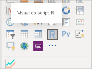
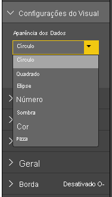

# <a name="tutorial-create-an-r-powered-power-bi-visual"></a>Tutorial: Criar um visual do Power BI da plataforma R

Este tutorial descreve como criar um visual da plataforma R para o Power BI.

Neste tutorial, você aprenderá a:

> [!div class="checklist"]
>
> * Criar um visual da plataforma R
> * Editar o script R no Power BI Desktop
> * Adicionar bibliotecas ao visual
> * Adicionar uma propriedade estática

## <a name="prerequisites"></a>Pré-requisitos

* Uma conta do **Power BI Pro**. Antes de começar, [inscreva-se para uma avaliação gratuita](https://powerbi.microsoft.com/pricing/).
* O mecanismo do R. É possível baixá-lo gratuitamente de vários locais, incluindo a [página de download do Revolution Open](https://mran.revolutionanalytics.com/download/) e o [Repositório CRAN](https://cran.r-project.org/bin/windows/base/). Para saber mais, confira [Criar visuais do Power BI usando R](../../desktop-r-visuals.md).
* [Power BI Desktop](../../fundamentals/desktop-get-the-desktop.md).
* [Windows PowerShell](https://docs.microsoft.com/powershell/scripting/install/installing-windows-powershell?view=powershell-6) versão 4 ou posterior para usuários do Windows OU o [Terminal](https://macpaw.com/how-to/use-terminal-on-mac) para usuários do OSX.

## <a name="getting-started"></a>Introdução

1. Preparar dados de exemplo para o visual. Você pode salvar esses valores em um banco de dados ou arquivo *.csv* do Excel e importá-lo para o Power BI Desktop.

    | MonthNo | Total de unidades |
    |-----|-----|
    | 1 | 2303 |
    | 2 | 2319 |
    | 3 | 1732 |
    | 4 | 1615 |
    | 5 | 1427 |
    | 6 | 2253 |
    | 7 | 1147 |
    | 8 | 1515 |
    | 9 | 2516 |
    | 10 | 3131 |
    | 11 | 3170 |
    | 12 | 2762 |

1. Para criar um visual, abra o PowerShell ou o Terminal e execute o seguinte comando:

   ```cmd
   pbiviz new rVisualSample -t rvisual
   ```

   Esse comando cria uma nova estrutura de pastas com base no modelo `rvisual`. Esse modelo inclui um visual básico da plataforma R pronto para ser executado e que executa o seguinte script R:

   ```r
   plot(Values)
   ```

   O quadro de dados `Values` conterá colunas na função de dados `Values`.

1. Atribua dados ao visual do desenvolvedor ao adicionar **MonthNo** e **Total units** a **Values** ao visual.

   

## <a name="editing-the-r-script"></a>Edição do script R

Quando você usar `pbiviz` para criar o visual da plataforma R com base no modelo de `rvisual`, ele criará um arquivo chamado *script.r* na pasta raiz do visual. Esse arquivo contém o script R executado para gerar a imagem para um usuário. Você pode criar seu script R no Power BI Desktop.

1. No Power BI Desktop, selecione **visual do script R**:

   

1. Cole este código do R no **editor de script R**:

    ```r
    x <- dataset[,1] # get the first column from dataset
    y <- dataset[,2] # get the second column from dataset

    columnNames = colnames(dataset) # get column names

    plot(x, y, type="n", xlab=columnNames[1], ylab=columnNames[2]) # draw empty plot with axis and labels only
    lines(x, y, col="green") # draw line plot
    ```

1. Selecione o ícone de **Executar script** para ver o resultado.

    

1. Quando o script R estiver pronto, copie-o para o arquivo `script.r` em seu projeto de visual criado em uma das etapas anteriores.

1. Altere `name` de `dataRoles` em *capabilities.json* para `dataRoles`. O Power BI passa dados como o objeto de quadro de dados `dataset` para o visual do R, mas o visual do R obtém o nome do quadro de dados de acordo com os nomes de `dataRoles`.

    ```json
    {
      "dataRoles": [
        {
          "displayName": "Values",
          "kind": "GroupingOrMeasure",
          "name": "dataRoles"
        }
      ],
      "dataViewMappings": [
        {
          "scriptResult": {
            "dataInput": {
              "table": {
                "rows": {
                  "select": [
                    {
                      "for": {
                        "in": "dataset"
                      }
                    }
                  ],
                  "dataReductionAlgorithm": {
                    "top": {}
                  }
                }
              }
            },
            ...
          }
        }
      ],
    }
    ```

1. Adicione o código a seguir para dar suporte ao redimensionamento da imagem no arquivo *src/visual.ts*.

    ```typescript
      public onResizing(finalViewport: IViewport): void {
          this.imageDiv.style.height = finalViewport.height + "px";
          this.imageDiv.style.width = finalViewport.width + "px";
          this.imageElement.style.height = finalViewport.height + "px";
          this.imageElement.style.width = finalViewport.width + "px";
      }
    ```

## <a name="add-libraries-to-visual-package"></a>Adicionar bibliotecas ao pacote visual

Este procedimento permite que seu visual use o pacote `corrplot`.

1. Adicione a dependência da biblioteca do seu visual a `dependencies.json`. Aqui está um exemplo do conteúdo do arquivo:

    ```json
    {
      "cranPackages": [
        {
          "name": "corrplot",
          "displayName": "corrplot",
          "url": "https://cran.r-project.org/web/packages/corrplot/"
        }
      ]
    }
    ```

    O pacote `corrplot` é uma exibição gráfica de uma matriz de correlação. Para saber mais sobre `corrplot`, confira [Uma introdução ao pacote corrplot](https://cran.r-project.org/web/packages/corrplot/vignettes/corrplot-intro.html).

1. Depois de fazer essas alterações, comece a usar o pacote em seu arquivo `script.r`.

    ```r
    library(corrplot)
    corr <- cor(dataset)
    corrplot(corr, method="circle", order = "hclust")
    ```

O resultado do uso do pacote `corrplot` é semelhante a este exemplo:


## <a name="adding-a-static-property-to-the-property-pane"></a>Adição de uma propriedade estática ao painel de propriedades

Permite que os usuários alterem as configurações da interface do usuário. Para isso, adicione propriedades ao painel de propriedades que alteram o comportamento baseado em entrada do usuário do script R.

Você pode configurar `corrplot` usando o argumento `method` para a função `corrplot`. O script padrão usa um círculo. Modifique o visual para permitir que o usuário escolha entre várias opções.

1. Defina o objeto e a propriedade no arquivo *capabilities.json*. Em seguida, use esse nome de objeto no método de enumeração para obter esses valores do painel de propriedades.

    ```json
    {
      "settings": {
      "displayName": "Visual Settings",
      "description": "Settings to control the look and feel of the visual",
      "properties": {
        "method": {
          "displayName": "Data Look",
          "description": "Control the look and feel of the data points in the visual",
          "type": {
            "enumeration": [
              {
                "displayName": "Circle",
                "value": "circle"
              },
              {
                "displayName": "Square",
                "value": "square"
              },
              {
                "displayName": "Ellipse",
                "value": "ellipse"
              },
              {
                "displayName": "Number",
                "value": "number"
              },
              {
                "displayName": "Shade",
                "value": "shade"
              },
              {
                "displayName": "Color",
                "value": "color"
              },
              {
                "displayName": "Pie",
                "value": "pie"
              }
            ]
          }
        }
      }
    }
    ```

1. Abra o arquivo *src/settings.ts*. Crie uma classe `CorrPlotSettings` com a propriedade pública `method`. O tipo é `string` e o valor padrão é `circle`. Adicione a propriedade `settings` à classe `VisualSettings` com o valor padrão:

    ```typescript
    "use strict";

    import { dataViewObjectsParser } from "powerbi-visuals-utils-dataviewutils";
    import DataViewObjectsParser = dataViewObjectsParser.DataViewObjectsParser;

    export class VisualSettings extends DataViewObjectsParser {
      public rcv_script: rcv_scriptSettings = new rcv_scriptSettings();
      public settings: CorrPlotSettings = new CorrPlotSettings();
    }

    export class CorrPlotSettings {
      public method: string = "circle";
    }

    export class rcv_scriptSettings {
      public provider;
      public source;
    }
    ```

    Depois destas etapas, você poderá alterar a propriedade do visual.

   

    Por fim, o script R deve começar com uma propriedade. Se o usuário não alterar a propriedade, o visual não obterá nenhum valor para essa propriedade.

    Para variáveis de tempo de execução do R para as propriedades, a convenção de nomenclatura é `<objectname>_<propertyname>`, neste caso, `settings_method`.

1. Altere o script R em seu visual para corresponder ao seguinte código:

    ```r
    library(corrplot)
    corr <- cor(dataset)

    if (!exists("settings_method"))
    {
        settings_method = "circle";
    }

    corrplot(corr, method=settings_method, order = "hclust")
    ```

Seu visual final é semelhante ao exemplo abaixo:


## <a name="next-steps"></a>Próximas etapas

Para saber mais sobre os elementos visuais baseados no R, confira [Usar visuais do Power BI da plataforma R no Power BI](../../desktop-r-powered-custom-visuals.md).

Para saber mais sobre visuais da plataforma R no Power BI Desktop, confira [Criar visuais do Power BI usando o R](../../desktop-r-visuals.md).
