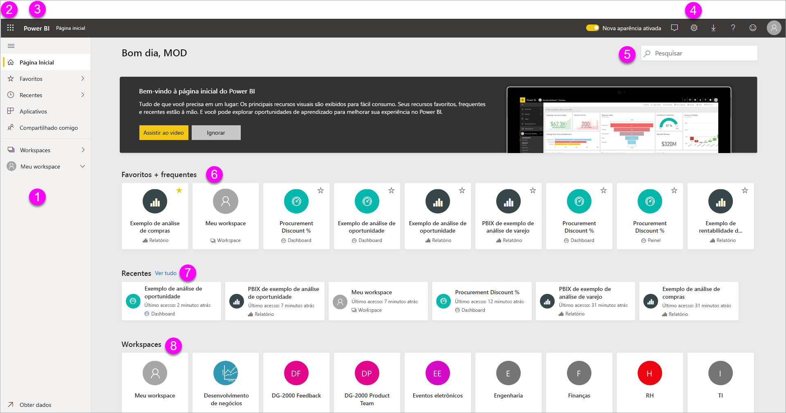
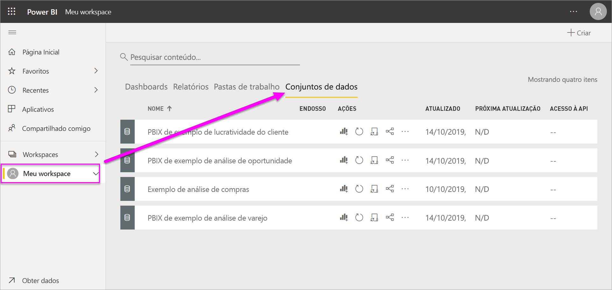
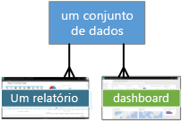
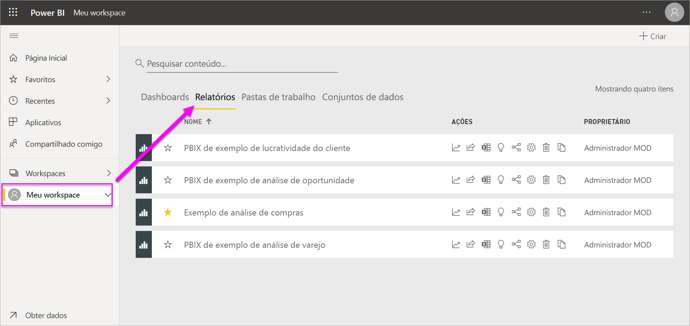
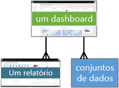
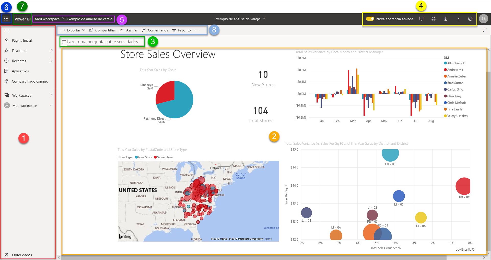
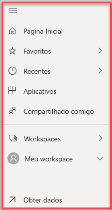

# Conceitos básicos para designers no serviço do Power BI

O objetivo deste artigo é orientá-lo sobre o serviço do Power BI: quais são os diferentes elementos, como eles funcionam juntos e como você pode trabalhar com eles. Você pode aproveitá-lo ao máximo, se já [se inscreveu no serviço do Power BI](service-self-service-signup-for-power-bi.md) e [adicionou alguns dados](../connect-data/service-get-data.md). Como designer, o fluxo de trabalho típico geralmente é começar criando relatórios no Power BI Desktop. Em seguida, você os publica no serviço do Power BI, onde pode continuar a modificá-los. Além disso, você cria os painéis baseados em relatórios no serviço do Power BI. 

Para este artigo, se você ainda não possui seus próprios relatórios, tente instalar uma das [amostras do Power BI](../create-reports/sample-datasets.md).

Quando abre o serviço do Power BI no navegador, você começa a trabalhar na Tela Inicial. Aqui estão os elementos que podem ser exibidos:

1. Painel de navegação
2. Inicializador de aplicativos do Microsoft 365
3. Botão Página inicial do Power BI
4. Botões de ícone, incluindo configurações, ajuda e comentários
5. Caixa de pesquisa
6. Painéis, relatórios, workspaces favoritos e frequentes
7. Painéis, relatórios e workspaces recentes
8. Seus workspaces

Você e os usuários finais dos seus relatórios e painéis têm a mesma experiência inicial no serviço do Power BI em um navegador.

Nos aprofundaremos nesses recursos mais tarde, mas primeiro vamos examinar alguns conceitos do Power BI. Mas se preferir, assista primeiro a este vídeo.  Nele, Will examina os conceitos básicos e oferece um tour pelo serviço do Power BI.

<iframe width="560" height="315" src="https://www.youtube.com/embed/B2vd4MQrz4M" frameborder="0" allowfullscreen></iframe>

## Conceitos do Power BI
Os cinco maiores blocos de construção do Power BI são: *dashboards*, *relatórios*, *pastas de trabalho*, *conjuntos de dados* e *fluxos de dados*. Eles estão todos organizados em *workspaces* e são criados em *capacidades*.  É importante entender as capacidades e os workspaces antes de nos aprofundarmos nos cinco blocos de construção, então vamos começar com essa parte.

## Capacities
As capacidades são um conceito fundamental do Power BI que representa um conjunto de recursos (armazenamento, processador e memória) usado para hospedar e entregar seu conteúdo do Power BI. As capacidades são _compartilhadas_ ou _dedicadas_. Uma capacidade compartilhada é aquela compartilhada com outros clientes da Microsoft, enquanto uma capacidade dedicada está totalmente comprometida com um único cliente. As capacidades dedicadas exigem uma [assinatura](../admin/service-premium-what-is.md) e são totalmente descritas no artigo [Gerenciar capacidades Premium](../admin/service-premium-capacity-manage.md).

Por padrão, os workspaces são criados em uma capacidade compartilhada. Na capacidade compartilhada, as cargas de trabalho são executadas em recursos computacionais compartilhados com outros clientes. Como a capacidade deve compartilhar recursos, limitações são impostas para garantir "equilíbrio", assim como o tamanho máximo do modelo (1 GB) e a frequência máxima de atualização diária (oito vezes por dia).

## Workspaces
Os workspaces são criados em capacidades. Eles são, essencialmente, contêineres para dashboards, relatórios, pastas de trabalho, conjuntos de dados e fluxos de dados no Power BI.

Há dois tipos de workspaces: *Meu workspace* e *workspaces*.

- *Meu Workspace* é o workspace pessoal para qualquer cliente do Power BI trabalhar com seu próprio conteúdo. Apenas você tem acesso ao Meu Workspace pertencente a você. Você pode compartilhar painéis e relatórios de Meu Workspace. Se você quer colaborar em dashboards e relatórios ou criar um aplicativo, convém trabalhar em um workspace.

-  Os *workspaces* são usados para colaborar e compartilhar conteúdo com colegas. Você pode adicionar colegas aos seus workspaces e colaborar em dashboards, relatórios, pastas de trabalho e conjunto de dados. Com uma exceção, todos os membros do workspace precisam de licenças do Power BI Pro. Leia mais sobre os [novos espaços de trabalho](../collaborate-share/service-create-the-new-workspaces.md). 

    Os workspaces também são os locais nos quais você cria, publica e gerencia *aplicativos* para sua organização. Imagine os workspaces como áreas de preparo e contêineres para o conteúdo que vai formar um aplicativo do Power BI. Então, o que é um *aplicativo*? É uma coleção de dashboards e relatórios projetados para fornecer métricas-chave aos consumidores do Power BI em sua organização. Os aplicativos são interativos, mas os consumidores não podem editá-los. Consumidores do aplicativo, os colegas que têm acesso aos aplicativos, não precisam necessariamente de licenças Pro.  

Para saber mais sobre compartilhamento em geral, confira primeiro [Maneiras de compartilhar os painéis](../collaborate-share/service-how-to-collaborate-distribute-dashboards-reports.md).

Agora, vamos falar sobre os cinco blocos de construção do Power BI.

## Fluxos de dados
Um *fluxo de dados* ajuda as organizações a unificar dados de fontes diferentes. Fluxos de dados são opcionais e geralmente são usados em projetos complexos ou maiores. Eles representam os dados preparados para uso por conjuntos de dados. No entanto, eles não podem ser usados diretamente como uma fonte para relatórios. Eles aproveitam a ampla coleção de conectores de dados da Microsoft, permitindo a ingestão de dados de fontes locais e baseadas em nuvem.

Os fluxos de dados são criados e gerenciados somente em workspaces (mas não no *Meu Workspace*) e são armazenados como entidades no CDM (Common Data Model) no Azure Data Lake Storage Gen2. Normalmente, eles são agendados para serem atualizados de forma recorrente a fim de armazenar dados atualizados. Eles são ótimos para preparar dados para uso – e possível reutilização – por seus conjuntos de dados. Para obter mais informações, consulte o artigo [Preparação de dados de autoatendimento no Power BI](../transform-model/service-dataflows-overview.md).

Você não pode ter dashboards ou relatórios sem dados (bem, você até pode ter dashboards vazios e relatórios vazios, mas eles não são úteis até que tenham dados), então vamos apresentar agora os **conjuntos de dados**.

## Conjunto de dados
Um *conjunto de dados* é uma coleção de dados que você *importa* ou a que *se conecta*. O Power BI permite que você se conecte a todos os tipos de conjuntos de dados, os importe e os reúna em um único lugar. Os conjuntos de dados também podem obter dados de fluxos de dados.

Conjuntos de dados estão associados aos *workspaces*, e um conjunto de dados exclusivo pode ser parte de muitos workspaces. Ao abrir um workspace, os conjuntos de dados associados estarão listados na guia **Conjuntos de Dados**. Cada conjunto de dados listado representa uma fonte de dados única, por exemplo, uma planilha do Excel no OneDrive, um conjunto de dados de tabela SSAS local ou um conjunto de dados do Salesforce. Há muitas fontes de dados diferentes com suporte, e sempre estamos adicionando novas. Veja a lista de [tipos de conjuntos de dados que podem ser usados com o Power BI](../connect-data/service-get-data.md).

No exemplo abaixo, selecionamos o workspace “Vendas e marketing” e clicamos na guia para **Conjuntos de dados**.

**UM** conjunto de dados...

* pode ser usado repetidamente em um ou mais workspaces.
* pode ser usado em vários relatórios diferentes.
* Visualizações desse único conjunto de dados podem ser exibidas em vários painéis diferentes.

  

Para [se conectar a um conjunto de dados ou importá-lo](../connect-data/service-get-data.md), selecione **Obter Dados**, na parte inferior do painel de navegação. Siga as instruções para se conectar à fonte específica ou importá-la e depois adicionar o conjunto de dados ao workspace ativo. Novos conjuntos de dados ficam marcados com um asterisco amarelo. O trabalho que você realiza no Power BI não altera o conjunto de dados subjacente.

Os conjuntos de dados adicionados por um membro do espaço de trabalho ficam disponíveis para outros membros do espaço de trabalho com uma função de *administrador*, *membro* ou *colaborador*.

Conjuntos de dados podem ser atualizados, renomeados, explorados e removidos. Use um conjunto de dados para criar um relatório do zero ou executando [insights rápidos](../create-reports/service-insights.md).  Para ver quais relatórios e painéis já estão usando um conjunto de dados, selecione **Exibição relacionada**. Para explorar um conjunto de dados, selecione-o. O que você está fazendo é abrir o conjunto de dados no editor de relatórios, em que você pode de fato começar a explorar os dados criando visualizações.

Agora, vamos passar para o próximo tópico – relatórios.

### Mergulhe mais fundo
* [Conjuntos de dados no serviço do Power BI](../connect-data/service-datasets-understand.md)
* [Modos de conjunto de dados no serviço Power BI](../connect-data/service-dataset-modes-understand.md)
* [O que é o Power BI Premium?](../admin/service-premium-what-is.md)
* [Obter dados para o Power BI](../connect-data/service-get-data.md)
* [Conjuntos de dados de amostra para o Power BI](../create-reports/sample-datasets.md)

## Relatórios
Um relatório do Power BI é uma ou mais páginas de visualizações como gráficos de linhas, mapas e mapas de árvore. As visualizações também são chamadas de **_visuais_**. Todas as visualizações em um relatório vêm de um único conjunto de dados. É possível criar relatórios do zero dentro do Power BI, importá-los com painéis que os colegas compartilharam com você, ou o Power BI pode criá-los quando você se conectar a conjuntos de dados do Excel, Power BI Desktop, banco de dados ou aplicativos SaaS.  Por exemplo, quando você se conecta a uma pasta de trabalho do Excel que contém planilhas do Power View, o Power BI cria um relatório baseado nessas planilhas. E quando você se conecta a um aplicativo SaaS, o Power BI importa um relatório pré-criado.

Há dois modos para exibir e interagir com relatórios: *Exibição de leitura* e *Exibição de edição*. Ao abrir um relatório, ele é exibido na Exibição de leitura. Se você tem permissões de edição, vê **Editar relatório** no canto superior esquerdo e pode exibir o relatório na Exibição de edição.  Se um relatório está em um espaço de trabalho, todos com uma função de *administrador*, *membro* ou *colaborador* podem editá-lo. Eles têm acesso a todos os recursos de exploração, design, criação e compartilhamento da Exibição de edição para esse relatório. As pessoas com as quais eles compartilham o relatório podem explorar e interagir com o relatório na Exibição de leitura.

Ao abrir um workspace, os relatórios associados ficam listados na guia **Relatórios**. Cada relatório listado representa uma ou mais páginas de visualizações baseadas em apenas um conjunto de dados subjacente. Para abrir um relatório, selecione-o.

Ao abrir um aplicativo, você verá um painel.  Para acessar um relatório subjacente, selecione um bloco do painel (falaremos mais sobre isso depois) que foi fixado em um relatório. Lembre-se de que nem todos os blocos são fixados em relatórios, então, talvez seja preciso clicar em alguns blocos para encontrar um relatório.

Por padrão, o relatório abre em Modo de Exibição de Leitura.  Basta selecionar **Editar relatório** para abri-lo no Modo de Exibição de Edição (caso tenha as permissões necessárias).

No exemplo abaixo, selecionamos o workspace "Vendas e marketing" e clicamos na guia **Relatórios**.

**UM** relatório...

* está contido em um único workspace.
* pode ser associado a vários painéis dentro desse workspace. Blocos fixados a partir desse relatório podem aparecer em vários painéis.
* pode ser criado usando os dados de um conjunto de dados. O Power BI Desktop pode combinar mais de uma fonte de dados em um único conjunto de dados em um relatório, e esse relatório pode ser importado no Power BI.

  

### Mergulhe mais fundo
- [Criar um novo relatório no serviço do Power BI importando um conjunto de dados](../create-reports/service-report-create-new.md)
- [Otimizar relatórios para os aplicativos móveis do Power BI](../create-reports/desktop-create-phone-report.md)

## Painéis
Um *painel* é algo que você cria **no serviço do Power BI** ou algo que um colega cria **no serviço do Power BI** e compartilha com você. Trata-se de uma única tela, que contém nenhum ou mais blocos e widgets. Cada bloco fixado em um relatório ou uma [P e R](../consumer/end-user-q-and-a.md) exibe uma única [visualização](../visuals/power-bi-report-visualizations.md) que foi criada a partir de um conjunto de dados e fixado ao painel. Páginas inteiras do relatório também podem ser fixadas a um painel como um bloco único. Há várias maneiras de adicionar blocos ao seu painel; muitas maneiras para serem abordadas neste tópico de visão geral. Para saber mais, veja [Blocos do painel no Power BI](../create-reports/service-dashboard-tiles.md).

Por que as pessoas criam painéis?  Aqui estão apenas alguns dos motivos:

* para ver rapidamente todas as informações necessárias para tomar decisões.
* para monitorar as informações mais importantes sobre seus negócios.
* para garantir que todos os colegas estejam na mesma página, exibindo e usando as mesmas informações.
* para monitorar a integridade uma empresa, produto, unidade de negócios, campanha de marketing, etc.
* para criar uma exibição personalizada de um dashboard maior – todas as métricas importantes para você.

Ao abrir um workspace, os painéis associados ficam listados na guia **Painéis**. Para abrir um dashboard, selecione-o. Ao abrir um aplicativo, você verá um painel.  Cada painel representa uma exibição personalizada de algum subconjunto dos conjuntos de dados subjacentes.  Se você possui seu próprio painel, também será preciso editar o acesso aos conjuntos de dados e relatórios subjacentes.  Caso o painel tenha sido compartilhado com você, será possível interagir com ele e quaisquer relatórios subjacentes, mas não será possível salvar quaisquer alterações.

Há muitas maneiras diferentes para você ou um colega [compartilhar um painel](../collaborate-share/service-share-dashboards.md). É preciso ter o Power BI Pro para compartilhar um painel e pode ser necessário para exibir um painel compartilhado.

**UM** painel...

* está associado a um único workspace
* pode exibir visualizações de vários conjuntos de dados diferentes
* pode exibir visualizações de vários relatórios diferentes
* pode exibir visualizações fixadas de outras ferramentas (por exemplo, Excel)

  

### Mergulhe mais fundo
* [Criar um painel em branco e obter alguns dados](../create-reports/service-dashboard-create.md).
* [Duplicar um painel](../create-reports/service-dashboard-copy.md)
* [Criar um modo de exibição de telefone de um painel](../create-reports/service-create-dashboard-mobile-phone-view.md)

## Pastas de trabalho
Pastas de Trabalho são um tipo especial de conjunto de dados. Se você leu a seção **Conjuntos de dados** anterior, já deve saber praticamente tudo de que precisa sobre pastas de trabalho. Mas você deve estar se perguntando porque algumas vezes o Power BI classifica uma pasta de trabalho do Excel como um **Conjunto de dados** e outras vezes como uma **Pasta de trabalho**.

Ao usar o **Obter dados** com arquivos de Excel, você tem a opção de *Importar* ou *Conectar-se* ao arquivo. Ao escolher Conectar-se, sua pasta de trabalho vai aparecer no Power BI assim como apareceria no Excel Online. Mas, ao contrário do Excel Online, você terá a sua disposição recursos ótimos para fixar elementos de suas planilhas diretamente de seus painéis.

Não é possível editar a pasta de trabalho no Power BI. No entanto, se precisar fazer alterações, clique em Editar e escolha a opção para editar a pasta de trabalho no Excel Online ou abri-la no Excel em seu computador. Todas as alterações feitas são salvas na pasta de trabalho no OneDrive.

### Mergulhe mais fundo
* [Obter dados de arquivos de pasta de trabalho do Excel](../connect-data/service-excel-workbook-files.md)
* [Publicar no Power BI com o Excel](../connect-data/service-publish-from-excel.md)

## Um dashboard em meu workspace
Nós falamos sobre workspaces e blocos de construção. Vamos reuni-los e examinar as partes que compõem a experiência do dashboard no serviço do Power BI.

### 1. **Painel de navegação**
Use o painel de navegação para localizar e se mover entre os workspaces e os blocos de construção do Power BI: dashboards, relatórios, pastas de trabalho e conjuntos de dados.  

  

* Selecione **Obter Dados** para [adicionar conjuntos de dados, relatórios e dashboards ao Power BI](../connect-data/service-get-data.md).
* Expanda e recolha o painel de navegação com este ícone .
* Abra ou gerencie seu conteúdo favorito selecionando **Favoritos**.
* Exiba e abra o conteúdo visitado mais recentemente selecionando **Recente**.
* Exiba, abra ou exclua um aplicativo selecionando **Aplicativos**.
* Algum colega compartilhou um conteúdo com você? Selecione **Compartilhado comigo** para pesquisar e classificar esse conteúdo para encontrar aquilo de que precisa.
* Exiba e abra seus workspaces selecionando **Workspaces**.

Clique uma vez em nesses elementos:

* um ícone ou cabeçalho para abrir a exibição de conteúdo
* uma seta à direita (>) para abrir um menu do submenu para Favoritos, Recentes e Workspaces.
* um ícone de divisa para exibir a lista rolável de dashboards, relatórios, pastas de trabalho e conjuntos de dados do **Meu Workspace**.

### 2. **Tela**
Como abrimos um painel, a área de telas exibe blocos de visualização. Se, por exemplo, nós tivéssemos aberto o editor de relatório, a área de telas exibiria uma página de relatório.

Os painéis são compostos por [blocos](../create-reports/service-dashboard-tiles.md).  Blocos são criados no Modo de Exibição de Edição de relatório, P e R e outros painéis e podem ser fixados no Excel, SSRS e outros. Um tipo especial de bloco chamado de [widget](../create-reports/service-dashboard-add-widget.md) é adicionado diretamente ao painel. Os blocos que aparecem em um painel foram especificamente inseridos ali pelo criador/proprietário de um relatório.  O ato de adicionar um bloco em um painel é chamado *fixação*.

Para obter mais informações, consulte [Dashboards](#dashboards) (acima).

### 3. **Caixa de perguntas de P e R**
Uma maneira de explorar seus dados é fazer uma pergunta e deixar que o P e R do Power BI lhe forneça uma resposta, na forma de uma visualização. O P e R pode ser usado para adicionar conteúdo a um painel ou relatório.

O P e R procura uma resposta no conjunto(s) de dados conectado ao painel.  Um conjunto de dados conectado é aquele que tem pelo menos um bloco anexado a esse painel.

Assim que você começa a digitar sua pergunta, o P e R leva você até a página de P e R. Conforme você digita, o P e R ajuda você a fazer a pergunta certa e encontrar a melhor resposta com reformulações, preenchimento automático, sugestões e muito mais. Quando você encontrar uma visualização (resposta) de que gosta, fixe-a em seu painel. Para obter mais informações, veja [P e R no Power BI](../consumer/end-user-q-and-a.md).

### 4. **Ícones na barra de cabeçalho preta**
Os ícones no canto superior direito são seus recursos para configurações, notificações, downloads, obter ajuda, ativar ou desativar a **Nova aparência** e fornecer comentários à equipe do Power BI.  

### 5. **Bloco do painel** (caminho ou trilha de navegação)
Nem sempre é fácil descobrir quais workspaces e painéis estão ativos, por isso, o Power BI cria um caminho de navegação para você.  Neste exemplo, veremos o workspace (Meu workspace) e o título do dashboard (Exemplo de Análise de Varejo).  Se abrimos um relatório, o nome dele seria acrescentado ao final do caminho de navegação.  Cada seção do caminho é um hiperlink ativo.  

Observe o ícone “C” após o bloco do painel. Esse painel tem uma [marca de classificação de dados](../create-reports/service-data-classification.md) do tipo “confidencial”. A marca identifica o nível de confidencialidade e segurança dos dados. Se o Administrador ativou a classificação de dados, todo painel terá uma definição de marca padrão. Os proprietários de painéis devem mudar a marca para corresponder com o nível de segurança adequado do painel.

### 6. **Inicializador de aplicativos do Microsoft 365**
Com o iniciador de aplicativos, todos os aplicativos do Microsoft 365 ficam facilmente disponíveis a um clique. Daqui em diante, você pode inicializar rapidamente seus emails, documentos, calendários e muito mais.

### 7. **Página inicial do Power BI**
Selecionar **Power BI** leva você de volta à sua página inicial do Power BI.

   

### 8. **Ícones rotulados na barra de menus cinza**
Essa área da tela contém opções adicionais para interagir com o conteúdo (neste caso, com o painel).  Além dos ícones rotulados que você pode ver, selecionar **Mais opções (…)** revela opções para duplicar, imprimir, atualizar o painel e muito mais.

   

## Próximas etapas
- [O que é o Power BI?](power-bi-overview.md)  
- [Vídeos do Power BI](videos.md)  
- [Editor de relatório - faça um tour](../create-reports/service-the-report-editor-take-a-tour.md)
- Mais perguntas? [Experimente perguntar à Comunidade do Power BI](https://community.powerbi.com/)
