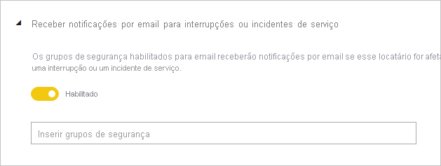
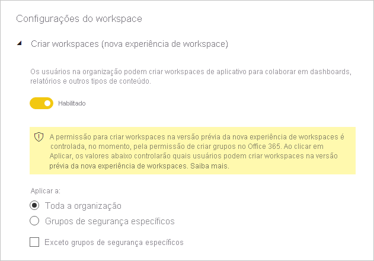
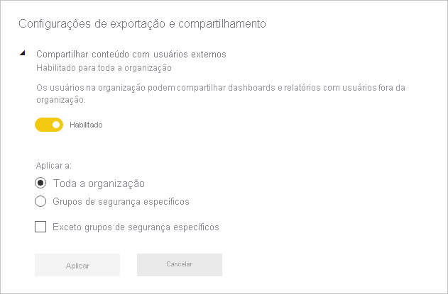
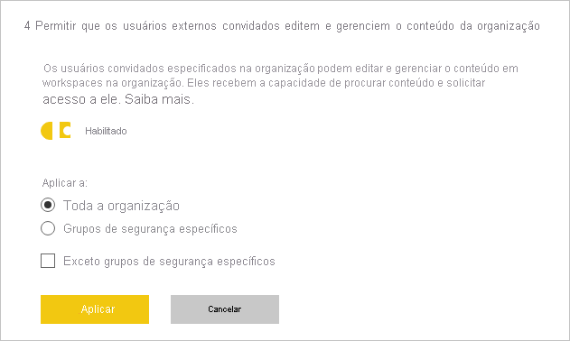

# Diretrizes de configuração do administrador de locatários

Este artigo se destina a administradores do Power BI responsáveis por instalar e configurar o ambiente do Power BI nas organizações deles.

Fornecemos diretrizes relacionadas a configurações específicas do locatário que ajudam a aprimorar a experiência do Power BI ou que poderiam expor a organização a riscos. Recomendamos que você sempre configure o locatário de maneira alinhada às políticas e aos processos da organização.

As [configurações de locatário](../admin/service-admin-portal.md#tenant-settings) são gerenciadas no [Portal de administração](https://app.powerbi.com/admin-portal/tenantSettings) e podem ser definidas por um [Administrador de serviços do Power BI](../admin/service-admin-administering-power-bi-in-your-organization.md#administrator-roles-related-to-power-bi). Muitas configurações de locatário podem restringir as funcionalidades e os recursos a um conjunto limitado de usuários. Sendo assim, recomendamos que primeiro você se familiarize com as configurações para planejar os grupos de segurança de que precisará. Você poderá descobrir que pode aplicar o mesmo grupo de segurança a várias configurações.

## Aprimorar a experiência do Power BI

### Publicar as informações de "Obter Ajuda"

Incentivamos você a configurar os sites internos relacionados ao Power BI usando o [Microsoft Teams](/microsoftteams) ou outra plataforma de colaboração. Esses sites podem ser usados para armazenar a documentação de treinamento e as discussões do host, para fazer solicitações de licenças ou para responder à ajuda.

Se você fizer isso, recomendamos que habilite a configuração **Publicar as informações "Obter ajuda"** _para toda a organização_. Ela é encontrada no grupo **Configurações de ajuda e suporte**. Você pode definir URLs para:

- A documentação de treinamento
- O fórum de discussão
- Solicitações de licenciamento
- Suporte técnico

Essas URLs ficarão disponíveis como links no menu de ajuda do Power BI.

> [!NOTE]
> Fornecer a URL de **Solicitações de licenciamento** impedirá que usuários individuais se inscrevam para a avaliação gratuita de 60 dias do Power BI Pro. Em vez disso, eles serão direcionados para seu site interno com informações sobre como adquirir uma licença Gratuita ou Pro.

## gerenciar riscos
As configurações para gerenciar riscos podem ajudar você a estabelecer políticas de governança no seu locatário do Power BI. No entanto, tenha em mente que as configurações de governança não são uma medida de segurança. Por exemplo, desabilitar a configuração **Exportar dados** remove o recurso da interface do usuário do Power BI e ajuda, dessa forma, os usuários do Power BI a trabalharem em conformidade com as políticas de governança da sua organização, mas não impede que determinados usuários exportem dados usando outras opções. Do ponto de vista de segurança, um usuário do Power BI com acesso de leitura a um conjunto de dados tem a permissão para consultar esse conjunto de dados e pode persistir os resultados, independentemente dos recursos disponíveis na interface do usuário do Power BI.
### Receber notificações por email sobre incidentes ou interrupções de serviço

Você poderá receber notificações por email se seu locatário for afetado por um incidente ou uma interrupção de serviço. Dessa forma, você pode responder a incidentes de forma proativa.

Recomendamos habilitar a configuração **Receber notificações por email sobre incidentes ou interrupções de serviço**. Ela é encontrada no grupo **Configurações de ajuda e suporte**. Atribua um ou mais grupos de segurança _habilitados para email_.

### Proteção das informações

A proteção de informações permite impor configurações de proteção, como criptografia ou marcas d'água, ao exportar dados do serviço do Power BI.

Há duas configurações de locatário relacionadas à proteção de informações. Por padrão, as duas ficam desabilitadas para toda a organização.

Recomendamos que você habilite essas configurações quando precisar manipular e proteger dados confidenciais. Para obter mais informações, veja [Proteção de dados no Power BI](../admin/service-security-data-protection-overview.md).

### Criar workspaces

Você pode restringir a criação de workspaces pelos usuários. Dessa forma, você pode controlar o que é criado na organização.

> [!NOTE]
> Atualmente, há um período de transição entre a experiência de workspace antiga e a nova. Essa configuração de locatário aplica-se somente à nova experiência.

A configuração **Criar workspaces** fica habilitada por padrão para toda a organização. Ela é encontrada no grupo **Configurações de workspace**.

Recomendamos atribuir um ou mais grupos de segurança. A esses grupos pode ser concedida _ou negada_ a permissão para criar workspaces.

Não deixe de incluir instruções na documentação informando aos usuários (que não têm direitos para criação de workspaces) como eles podem solicitar um novo workspace.

### Compartilhar conteúdo com usuários externos

Os usuários podem compartilhar relatórios e dashboards com pessoas de fora da organização.

A configuração **Compartilhar conteúdo com usuários externos** fica habilitada por padrão para toda a organização. Ela é encontrada no grupo **Configurações de exportação e compartilhamento**.

Recomendamos atribuir um ou mais grupos de segurança. A esses grupos pode ser concedida _ou negada_ a permissão para compartilhar conteúdo com usuários externos.

### Publicar na Web

O recurso [publicar na Web](../collaborate-share/service-publish-to-web.md) permite publicar relatórios públicos na Web. Se usado de modo inadequado, há um risco de divulgação das informações confidenciais na Web.

A configuração **Publicar na Web** fica habilitada por padrão para toda a organização, mas restringe a capacidade de usuários não administradores criarem códigos de inserção. Ela é encontrada no grupo **Configurações de exportação e compartilhamento**.

Se habilitada, recomendamos atribuir um ou mais grupos de segurança. A esses grupos pode ser concedida _ou negada_ a permissão para publicar relatórios.

Além disso, há uma opção para escolher como os códigos de inserção funcionam. Por padrão, ela fica configurada para **Permitir somente códigos existentes**. Isso significa que, para criar um código de inserção, os usuários precisarão entrar em contato com um administrador do Power BI.

Também recomendamos que você analise os [códigos de inserção para publicação na Web](https://app.powerbi.com/admin-portal/embedCodes) regularmente. Remova códigos que causem a publicação de informações particulares ou confidenciais.

### Exportar dados

Você pode restringir a exportação de dados de blocos de dashboards ou de visuais de relatórios pelos usuários.

A configuração **Exportar dados** fica habilitada por padrão para toda a organização. Ela é encontrada no grupo **Configurações de exportação e compartilhamento**.

Recomendamos atribuir um ou mais grupos de segurança. A esses grupos pode ser concedida _ou negada_ a permissão para publicar relatórios.

> [!IMPORTANT]
> Desabilitar essa configuração também restringe o uso dos recursos [Analisar no Excel](../collaborate-share/service-analyze-in-excel.md) e [conexão dinâmica](../connect-data/desktop-report-lifecycle-datasets.md#using-a-power-bi-service-live-connection-for-report-lifecycle-management) do serviço do Power BI.

> [!NOTE]
> Se os usuários permitirem que os usuários exportem dados, você poderá adicionar uma camada de proteção impondo a [proteção de dados](../admin/service-security-data-protection-overview.md). Quando ela é configurada, usuários não autorizados são impedidos de exportar conteúdo com rótulos de confidencialidade.

### Permitir que os usuários externos convidados editem e gerenciem o conteúdo da organização

É possível que usuários convidados externos editem e gerenciem conteúdo do Power BI. Para obter mais informações, veja [Distribuição do conteúdo do Power BI para usuários convidados externos com o Azure AD B2B](../admin/service-admin-azure-ad-b2b.md).

A configuração **Permitir que os usuários convidados externos editem e gerenciem o conteúdo da organização** fica desabilitada por padrão para toda a organização. Ela é encontrada no grupo **Configurações de exportação e compartilhamento**.

Se você precisa autorizar usuários externos a editar e gerenciar conteúdo, recomendamos que atribua um ou mais grupos de segurança. A esses grupos pode ser concedida _ou negada_ a permissão para publicar relatórios.

### Configurações de desenvolvedor

Há duas configurações de locatário relacionadas a [inserir conteúdo do Power BI](../developer/embedded/embedding.md). Eles são:

- Inserir conteúdo em aplicativos (habilitada por padrão)
- Permitir que entidades de serviço usem APIs do Power BI (desabilitada por padrão)

Se você não tem intenção de usar as APIs de desenvolvedor para inserir conteúdo, recomendamos desabilitá-las. Ou, pelo menos, configure grupos de segurança específicos que fariam esse trabalho.

## Próximas etapas

Para obter mais informações relacionadas a este artigo, confira os seguintes recursos:

- [O que é administração do Power BI?](../admin/service-admin-administering-power-bi-in-your-organization.md)
- [Como administrar o Power BI no portal de administração](../admin/service-admin-portal.md)
- Dúvidas? [Experimente perguntar à Comunidade do Power BI](https://community.powerbi.com/)
- Sugestões? [Contribuir com ideias para aprimorar o Power BI](https://ideas.powerbi.com)

